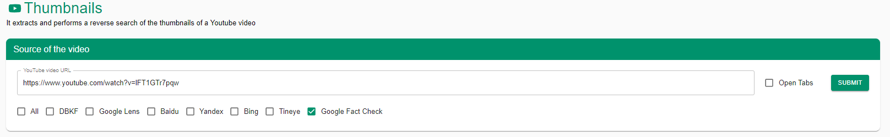
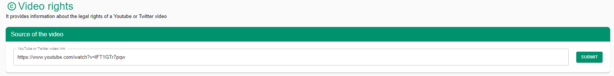
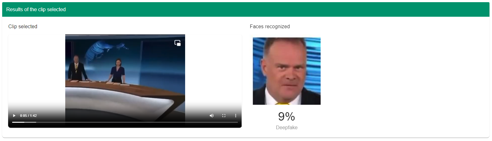

# InVID Verification Plugin

## URL

[https://weverify.eu/verification-plugin/](https://weverify.eu/verification-plugin/)

(v. 0.87 - July 2025; last checked: Oct 31 st 2025)

### Description

The InVID Verification Plugin is a comprehensive toolkit designed to assist journalists in verifying content on social networks. It offers a suite of tools to analyze and verify videos and images, including contextual information retrieval, several engines (Google, Lens, Bing, TinEye, Yandex, Baidu, Karma Decay, DBKF), video fragmentation, and metadata extraction. The plugin supports multiple platforms, such as YouTube, Facebook, Twitter, and Instagram, making it a versatile tool for fact-checking and debunking tasks on social networks. (Some Twitter-related features may not work anymore due to the API policy change.) Since v0.85 the plug-in has gained a [WACZ](https://specs.webrecorder.net/wacz/1.1.1/) disinformation-archiving tool, a [Hiya-powered voice-clone detector](https://www.hiya.com/products/deepfake-voice-detector), and full [Hungarian localisation](https://www.hdmo.eu/hungarian-version-of-invid-weverify-verification-plug-in-released-by-afp-media-lab/) (joining EN, FR, ES, EL, AR, IT & DE).


If you're a journalist, fact-checker, or researcher, take a minute to apply and register to use the advanced tools. To do this, click "Advanced Tools" and then "Register". Register with your **professional email address.** Once you’re confirmed as registered, enter your email and then copy & paste the code emailed to you.


## Features

### **Video**

**Video Analysis**

Provides contextual information and metadata for YouTube and public Facebook videos, helping users understand the video's background and related comments.



<figure><figcaption></figcaption></figure>



<figure><figcaption></figcaption></figure>



<figure><figcaption></figcaption></figure>



**Keyframes**

Segments YouTube or Facebook videos into keyframes for detailed analysis and reverse image search, enhancing verification processes.



<figure><figcaption>
Here you can provide a source URL or upload a video and the tool will create keyframes for you for further analysis.
</figcaption></figure>



<figure><figcaption>
If you click "Show Detailed View" the number of keyframes will increase.
</figcaption></figure>



**Thumbnails**

Extracts and performs a reverse search of thumbnails from YouTube videos to check for prior usage or manipulation.



<figure><figcaption>
Provide a YouTube URL and place a checkmark for the reverse image search mechanism you want to use (you can select multiple). Note that if you check "Open Tabs," all result thumbnails will automatically be opened on all services, which might be a lot of tabs.
</figcaption></figure>



<figure><figcaption>
This will result in a list of clickable thumbnails, which will lead you to the previously selected reverse image search service.
</figcaption></figure>



<figure><figcaption>
In this case, no fact checks were found. But who knows, if you had selected another service previously, you might have found out more about our Python expert.
</figcaption></figure>



**Video Rights**

Retrieves and displays information on legal rights for YouTube and Twitter videos, helping users understand reuse conditions and copyright issues.



<figure><figcaption>
Provide a URL to the video which you want to analyze.
</figcaption></figure>



<figure><figcaption>
The results section shows you Reuse Policy, License Summary, Contact information, as well as guide you how to give attribution to the video according to the available information.
</figcaption></figure>



**Metadata**

Extracts metadata from JPEG images and videos in MP4 or M4V formats, providing details such as creation date, camera settings, and location data.



<figure><figcaption>
You can upload an image/video or provide a URL
</figcaption></figure>



<figure><figcaption>
Which will give you matadata included in the image. This may include the original data, as well as the brand and model of the camera, and can also include names and geographical locations.
</figcaption></figure>



**Deepfake (Restricted Feature)**

Uses a machine learning classifier to determine the probability that a video contains AI-manipulated faces, such as face swapping or face reenactment. Access is restricted to registered users.



<figure><figcaption></figcaption></figure>



<figure><figcaption></figcaption></figure>



<figure><figcaption></figcaption></figure>



<figure><figcaption>
This is a deepfake of German news anchor Christian Sievers, used in September 2023 for a Crypto Scam. As you can see, the deepfake video barely scores higher than an unedited video, illustrating that detection algorithms are never perfect. Results have to be manually validated through other sources. <em>KI-Fake klaut ZDF-Moderator die Stimme—Das steckt dahinter</em>. (2023, September 22). ZDFheute. <a href="https://www.zdf.de/nachrichten/panorama/kriminalitaet/ki-fake-sievers-heute-journal-100.html">https://www.zdf.de/nachrichten/panorama/kriminalitaet/ki-fake-sievers-heute-journal-100.html</a>
</figcaption></figure>



### **Image**

#### **Magnifier**

In a nutshell, **Magnifier** is the “digital loupe” inside the InVID-WeVerify plug-in: you load any still image (URL or local file) and the module lets you zoom, sharpen and flip it at pixel level, then push the same frame to reverse-image search or the forensic filters.

* **Deep zoom & live lens** – Hover anywhere on the picture and a resizable loupe shows the native pixels at up to ×20, perfect for reading licence plates, shoulder patches or tiny timestamps.
* **Enhancement tools** – One-click buttons apply bicubic up-scaling, edge-sharpen, mirror-flip or 90° rotation so faint characters or mirrored selfies become legible.



<figure><figcaption></figcaption></figure>



<figure><figcaption>
The results tab allows you to use a magnifier by hovering over the image, edit the image, download the source, and do a reverse image search on DBFK, Google Lens, Baidu, Yandex, Bing, Tineye, and Google Factcheck.
</figcaption></figure>



<figure><figcaption></figcaption></figure>



<figure><figcaption>
The edit function allows you to perform some basic photo editing quickly. Most of the functions are tailored to focus on a particular part of the image or to obscure sensitive information; others are there to increase contrast, which in some cases is helpful to help identify hidden elements or alterations in the image, such as the boundaries of a patch added in post-processing. Applying a tint can help spot certain materials (like vegetation or blood), while blending can overlay various effects.
</figcaption></figure>



#### **Metadata**

Extracts metadata from JPEG images and videos in MP4 or M4V formats, providing important information for verification.



<figure><figcaption></figcaption></figure>







#### **Forensic**

Provides an enhanced toolkit to detect image forgeries, enabling detailed forensic analysis to identify manipulations.



<figure><figcaption>
"This enhanced forensic toolkit aims to help you detect alterations in manipulated images." This example is taken from a report of Bellingcat Researcher Annique Mossou. Mossou, A. (2023, May 2). <em>Testing for Manipulation: A Case Study from Colombia</em>. Bellingcat. <a href="https://www.bellingcat.com/resources/2023/05/02/testing-for-manipulation-a-case-study-from-colombia/">https://www.bellingcat.com/resources/2023/05/02/testing-for-manipulation-a-case-study-from-colombia/</a>
</figcaption></figure>



<figure><figcaption>
While a comprehensive review of the alteration detection algorithms is outside of the scope of this article, it's possible to recreate the clues that match the outcome of the investigation, which concluded that specific parts of the image had been altered. Here, using the GHOST filter.
</figcaption></figure>



<figure><figcaption>
And here, corroberating the first result, using Error Level Analysis.
</figcaption></figure>



#### **OCR (Optical Character Recognition)**

Extracts text from images, making it easier to analyze and verify textual content within images.



<figure><figcaption>
Using the same source from above.
</figcaption></figure>



<figure><figcaption>
We get what appears to be a (mostly) correctly identified set of words.
</figcaption></figure>



<figure><figcaption>
We further can do a reverse image search, as well as copy the text to clipboard, as well as translate it using google translate. "Paloma Valencia @PalomaValenciaL This is how the Pan-American Highway looks at the entrance to Totoró Cauca ELN"
</figcaption></figure>



**CheckGIF (Restricted Feature)**

Compares an original image with a tampered one, including cropped images, and generates a GIF highlighting differences. Access is restricted to registered users.


This plugin will not be able to solve the question of the correct pronunciation of GIF.




<figure><figcaption>
Here, we take images from an article surrounding the World’s First Rooftop Solar Panel. Postma, F. (2023, August 16). <em>Untangling the Mystery of the World’s First Rooftop Solar Panel</em>. Bellingcat. <a href="https://www.bellingcat.com/news/2023/08/16/untangling-the-mystery-of-the-worlds-first-rooftop-solar-panel/">https://www.bellingcat.com/news/2023/08/16/untangling-the-mystery-of-the-worlds-first-rooftop-solar-panel/</a>
</figcaption></figure>



<figure><figcaption></figcaption></figure>



<figure><figcaption>
In our case, no match has been found and no GIF was created, readers are welcome to suggest a more suitable example.
</figcaption></figure>



**Synthetic Image (Restricted Feature)** - Determines the probability that an image is AI-generated, using machine learning to assess potential manipulations. Access is restricted to registered users.



<figure><figcaption>
We're making detection really easy. Midjourney prompt used was "photograph --ar 4:3".
</figcaption></figure>


{% tab title="First attempt: 88%" %}
<figure><figcaption>
If Midjourney doesn't get a subject, it will make women
</figcaption></figure>



<figure><figcaption>
"photograph of woman's face, pores, vellus hairs::1 freckles::-0.4 --s 700 --ar 3:4" Thanks to @InfoGuru from the Midjourney Discord. I'll see myself out.
</figcaption></figure>



#### **Deepfake (Restricted Feature)**

The **Deepfake tab** in the InVID-WeVerify verification plug-in is an experimental video-forensics tool built by **ITI CERTH** under the EU-funded **vera.ai** project. You paste a video URL (or upload a local clip) and the service breaks the file into frames, detects every visible face, and runs an [**ensemble of five CNN-based detectors**](https://ar5iv.labs.arxiv.org/html/2204.12816) (Xception, EfficientNet-B4, Capsule-Forensics ++ & two proprietary lightweight models). The ensemble outputs a **0–1 probability score** that the footage contains AI-manipulated faces (face-swap / reenactment). Results are colour-coded (green < 0.30, amber 0.30-0.60, red > 0.60) and accompanied by per-frame thumbnails so you can jump straight to suspicious segments. All processing happens on CERTH’s servers; only hash-anonymised frames are stored for 30 days to improve the model.



<figure><figcaption>
<strong>Why the “experimental” warning matters</strong>: <a href="https://www.cjr.org/tow_center/what-journalists-should-know-about-deepfake-detection-technology-in-2025-a-non-technical-guide.php">Independent benchmarks</a> find that even strong academic detectors reach <strong>70-90 %</strong> accuracy—but performance drops when they meet brand-new generation techniques or heavily compressed social-media video. False positives rise on fast-moving crowds or blurred backgrounds, so the plug-in warns users to cross-check with source video searches, key-frame reverse-image queries, or manual forensic review.
</figcaption></figure>



<figure><figcaption>
I used a "real" video from the <a href="https://www.kaggle.com/datasets/reubensuju/celeb-df-v2">Celeb DF (v2) dataset</a> on Kaggle as an example. As expected, correctly classified as a real video.
</figcaption></figure>



<figure><figcaption>
Another deepfake video from the same dataset (same person) showed strong evidence suggesting that this video contains AI manipulated faces.
</figcaption></figure>



#### **Geolocalizer (Locked Feature)**

The _Geolocalizer_ (locked / beta) lets you upload or paste any still-image link; the plug-in then calls an experimental CERTH service that estimates **where on Earth the picture was taken**. It does this entirely by visual analysis—no EXIF GPS is required. You get a latitude/longitude guess, a rough confidence band, and a set of visually similar reference pictures you can open in a map viewer for manual comparison. Accuracy is usually “city-level” (±25 km) for landmarks and distinctive skylines, but drops on rural or indoor scenes. The module is being developed under the EU **vera.ai** programme and is still labelled _experimental_, so double-check every hit with classic open-source techniques.

All[ heavy lifting happens on ITI CERTH servers](https://tech.ebu.ch/events/2025/veraai-training-workshop-series); the plug-in strips EXIF and hashes the file name before upload. Hash-anonymised embeddings are kept for 30 days to retrain the model, then purged.

* Treat results as leads—cross-check with Street View, SunCalc and local news imagery.



<figure><figcaption>
The service should return <strong>48.858 N, 2.293 E (Champ-de-Mars, Paris)</strong> with a green confidence bar.
</figcaption></figure>



<figure><figcaption>
Why this works: the Eiffel Tower is heavily represented in the training corpus, so the index finds dozens of close neighbours within 500 m.
</figcaption></figure>



**Provenance (C2PA)**

It reads an image or video's [C2pa ](https://c2pa.org/)data. **C2PA** stands for the _Coalition for Content Provenance and Authenticity_, an open standard backed by Adobe, Microsoft, Google, the BBC and others. It embeds a tamper-evident “manifest” (hashed, then signed) in JPEG, PNG, MP4, WebP and AVIF files. If someone alters pixels or edits the manifest, the signature breaks.

The plug-in parses the manifest with the same open-source library used by Adobe’s and Digimarc’s browser extensions, then renders a human-readable report. If the signature chain resolves to a trusted root certificate, you’ll see a green “verified” badge; otherwise you get a warning.



<figure><figcaption>
<a href="https://c2pa.org/public-testfiles/image/">Real photo</a>, Invalid credentials: Claim signature mismatch
</figcaption></figure>



<figure><figcaption></figcaption></figure>



### **Audio**

#### Hiya Voice-Clone Detector _(Locked Feature)_

Uses Hiya.ai’s classifier to spot AI text-to-speech or cloned voices in WAV/MP3 uploads, flagging likely synthetic segments. Requires registration; processing happens server-side, and no audio is stored after analysis (see privacy notice in the plug-in).\\



<figure><figcaption></figcaption></figure>



<figure><figcaption>
While the average score indicates that most of the conversation comprises actual speech, it also shows a high likelihood of detection for some parts of the two-minute recording. More often than not, altering just a few words to change a conversation's meaning completely is sufficient. Mai, K. T., Bray, S., Davies, T., &#x26; Griffin, L. D. (2023). Warning: Humans cannot reliably detect speech deepfakes. <em>PLOS ONE</em>, <em>18</em>(8), e0285333. <a href="https://doi.org/10.1371/journal.pone.0285333">https://doi.org/10.1371/journal.pone.0285333</a> 
</figcaption></figure>



<figure><figcaption>
A deepfake crated by text-to-speech and voice clone provider <a href="https://elevenlabs.io/voice-library">elevenlabs </a>was detected reliably.
</figcaption></figure>



<figure><figcaption>
An example from Google's Language modeling Approach <a href="https://google-research.github.io/seanet/audiolm/examples/">AudioLM</a> also was detected reliably.
</figcaption></figure>



### **Search**

**X Search**

Performs advanced search queries on X (formerly Twitter), including precise time intervals, enhancing the ability to find relevant content.



<figure><figcaption></figcaption></figure>



.png>)



**Fact Check Semantic Search (Locked Feature)**

Paste a sentence, paragraph or whole social-media post and the tool looks for **semantically similar fact-checks** in a [multilingual database of ≈ 300 000 verified debunks](https://cedmohub.eu/ai-solutions/tools/) from more than [160 IFCN-signatory](https://edmo.eu/edmo-news/ai-and-disinformation-edmo-hubs-initiatives/) organisations. It therefore answers the question _“Has anyone already debunked this claim?”_ even when the input language differs from the fact-check language. Claims are pulled hourly from the [**Database of Known Fakes** (DBKF)](https://arxiv.org/pdf/2504.20668) back-end, which aggregates RSS, ClaimReview, and custom scrapers.



<figure><figcaption>
Input box – drop in one or more sentences; longer context usually returns stronger matches. Show Advanced Settings lets you filter by language, publisher or publication date; raise/lower the similarity threshold; switch between “exact-match keywords” and “full semantic” modes (the latter is default). Results open in a new tab with the claim, verdict, publisher, date and a direct link to the full article for manual review.
</figcaption></figure>



<figure><figcaption>
For testing, I used the Spanish phrase for: “A Facebook post claims that the mRNA COVID-19 vaccines can make women sterile and that couples should wait at least a year after vaccination before trying to have a baby. Is that true?”
</figcaption></figure>



<figure><figcaption>
The wealth of over 100 results also contained direct debunks in Spanish, translated into English.
</figcaption></figure>



**XNetwork**

Provides a customized search engine (CSE) for cross-network queries, simultaneously allowing searches across multiple social media platforms (Twitter, Reddit, 4chan, YouTube, Facebook, 8kun, LinkedIn, VK, Instagram, and TikTok).



<figure><figcaption></figcaption></figure>



**Factchecks**

This module is a **Google Programmable Search Engine (CSE)** wired to \~240 trusted fact-checking outlets – chiefly [IFCN signatories](https://github.com/IFCN/verified-signatories) plus long-standing projects such as Snopes, Full Fact and Africa Check. A single query lets you ask **“Has someone published a debunk on this?”** and brings back only results that already carry a ClaimReview-style verdict.



<figure><figcaption>
I didn't get any results for any example prompts this time, but I'll update you if this changes.
</figcaption></figure>



<figure><figcaption>
With this prompts, almost a classic at this point, we get results.
</figcaption></figure>



### **Data Analysis**

**Twitter SNA (Locked Feature)**

Performs social network analysis on Twitter, analyzing interactions, trends, and relationships to understand information spread and impact. Deprecated since July 1st, 2023, due to X/Twitter code changes. It is on registration, so it might work again at some point, and this article will reflect that. Access is restricted to registered users.



<figure><figcaption></figcaption></figure>



**CSV Analysis**

Allows the import and analysis of social network data from CrowdTangle exports, using Social Network Analysis (SNA) to provide in-depth insights into social media activity and trends.


CrowdTangle is permanently gone. We hope that this feature will not disappear but be adapted to perform other ways of SNA instead.




<figure><figcaption></figcaption></figure>



#### WACZ Export _(Locked Feature)_

Packages selected URLs, keyframes, or images into a forensically sound **WACZ** bundle for long-term preservation and evidence sharing. Accessible to registered fact-checkers under the IFCN DisinfoArchiving project (2024-25). The feature description appears in the [extension overview](https://chromewebstore.google.com/detail/fake-news-debunker-by-inv/mhccpoafgdgbhnjfhkcmgknndkeenfhe?hl=en), but didn't appear to work at the time of testing.

## Cost

* [x] Free

## Level of difficulty

<table><thead><tr><th data-type="rating" data-max="5"></th></tr></thead><tbody><tr><td>2</td></tr></tbody></table>

## Requirements

Chromium-based browsers and Firefox (via manual `.xpi` install) are supported; Safari is not.\
Firefox install instructions remain on the project’s [GitHub mirror.](https://github.com/AFP-Medialab/invid-weverify-firefox)

## Limitations

* **External Services**: Some tools within the plugin rely on external services that are not open-sourced, which may affect transparency and long-term accessibility.
* **API Restrictions**: Certain features, such as Twitter analysis, have been deprecated due to changes in platform APIs.
* **Locked Features**: Several advanced features are restricted to registered users, such as journalists and researchers, which may limit access for general users.
* **Processing Time**: Analyzing videos with a large number of comments or metadata can be slow, affecting efficiency.
* **Browser Compatibility**: The plugin is primarily designed for Chrome and Opera browsers, with limited support for other browsers, such as Firefox.
* **Geolocation Accuracy**: The Geolocalizer's accuracy depends on the availability and quality of metadata, which may not always be reliable.
* **AI Detection Limitations**: The accuracy of synthetic image and deepfake detection tools can vary, and false positives or negatives may occur.

## Ethical Considerations

The InVID Verification Plugin helps researchers and journalists verify online media, but it also raises ethical concerns when used. First, the plugin relies on metadata extraction and reverse searches, which may access personal or private data embedded in media. This raises significant privacy concerns, particularly if personal information is unintentionally disclosed or used without consent.

Tools like deepfake- and AI-generated image detectors may produce false positives or negatives, potentially leading to incorrect conclusions or accusations. It is essential to verify results through multiple sources before making claims. Users should also be mindful of the ethical responsibility of using the tool only for legitimate verification purposes, not for harmful surveillance or invasive investigations.


When using InVID for content verification, there is a risk of misinterpreting results, which could lead to erroneous conclusions. InVID provides tools for analyzing video authenticity by examining metadata, reverse image searching, and extracting keyframes, but the results do not automatically confirm authenticity. Researchers might misinterpret partial metadata or falsely correlate visual matches from reverse image searches, leading to an incorrect verification of content. Without a cautious and critical approach, users could mistake automated analysis for definitive proof, potentially spreading misinformation if content is improperly validated. It's essential to use InVID's findings as part of a broader verification process and corroborate with additional sources before drawing conclusions.


## Guide

[Guide To Using Reverse Image Search For Investigations](https://www.bellingcat.com/resources/how-tos/2019/12/26/guide-to-using-reverse-image-search-for-investigations/)

## Tool provider

InVID is organized by a consortium of European research groups and businesses, coordinated by The Centre for Research and Technology Hellas (CERTH) in Northern Greece.

The InVID project has received funding from the European Union’s Horizon 2020 research and innovation program.

| Page Maintainer |
| --------------- |
| Martin Sona     |
