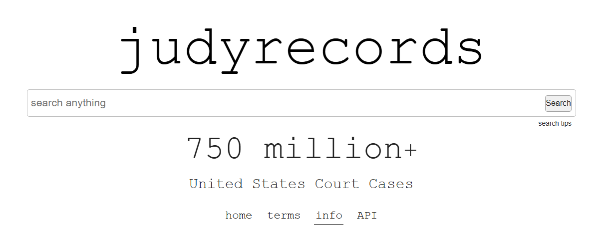

# judyrecords

## URL

[https://www.judyrecords.com](https://www.judyrecords.com)

## Description

Requiring no sign up and only a small learning curve, judyrecords offers quick and efficient access to massive amounts of open source legal information for the United States.&#x20;

<figure><figcaption>
judyrecords.com as accessed on July 29, 2025.
</figcaption></figure>

While anyone can immediately start searching the database of information, the site specific search operators narrow down options considerably and quickly.&#x20;

For example, the search term `jeffrey epstein,, florida` means, "search for the name Jeffrey Epstein with moderate strictness, with the word Florida in the results". To increase or decrease the strictness, one merely needs to add or remove a comma.&#x20;

If the results aren't what was expected, try using the exact phrase proximity operator, which is a tilde \~ with a number immediately after it. As an example, the search term `"jeffrey e epstein" ~3` would read as, "search for Jeffrey E Epstein, and also search for variations of those words and letter, with up to three of those words out of order".

The minus sign, or -, also signals to database "do not search this term", and requires no space between the word and the minus sign. Therefore, `jeffrey e epstein,,, -arrest`  would signal to the database, "search strictly for Jeffrey E Epstein, but exclude any results with the word arrest in them".

`AND`, `OR` and `NOT` work the same as most search engines, in that they designate to search both, either or none of the words immediately after the term. The only difference with judyrecords is that any words that need to stay together require brackets ( ) around them. For example, `(jeffrey epstein,,,) AND (palm beach county)` will serve as a search to find, "strictly find the name Jeffrey Epstein as well as Palm Beach County".&#x20;

If there's an error in the search terms, a popup will instruct you to try again, or try a different search.

## Cost

* [x] Free
* [ ] Partially Free
* [ ] Paid

There is no cost to use any of judyrecord's search features, nor to access the search results.&#x20;

## Level of difficulty

<table><thead><tr><th data-type="rating" data-max="5"></th></tr></thead><tbody><tr><td>1</td></tr></tbody></table>

## Requirements

Other than a browser and internet access, there are no requirements to access, search or use judyrecords.&#x20;

## Limitations

There's little know-how required to use the site, although the site-specific search operators help narrow down one's focus.&#x20;

Not all open source legal or patent documents in the US are housed at judyrecords.&#x20;

## Ethical Considerations

Thought provoking and nuanced discussions about the ethical considerations of a tool usually involve real-world applications. With that in mind, in 2022, Californian closed access legal records were found in the judyrecords database. The person who runs judyrecords shared a comprehensive play-by-play after the issue was resolved in a post titled, "[What Happened With Tyler Technologies](https://www.judyrecords.com/what-happened-with-tyler-technologies)". (Note: strong language used throughout).

All information found at judyrecords needs to be validated; there's no guarantee that the information is 100% accurate.

## Guides and articles

The best guide on how to use judyrecords comes from the site itself, in an aside on their Info page, called [Search Tips](https://www.judyrecords.com/info#searchTipsHeader).&#x20;

## Tool provider

The tool provider has chosen to remain anonymous, however the website states anyone can them at judyrecordssite AT gmail.com.&#x20;

## Similar tools

[CourtListener](https://www.courtlistener.com/) offers open source legal information on the US court system, including millions of federal documents and PACER data, more than "nine million decisions in over 2000 courts", judges financial disclosures, as well as oral argument recordings. Data found here could complement, flesh out, or support judyrecords findings.&#x20;

The [Case Law Access Project](https://case.law/) is Harvard Law School's compilation of 360 years of American case law in an online, open source, searchable database. While some or much of this data can also be found at CourtListener or judyrecords, the Case Law Access Project offers it it in a visually appealing, map-like format.&#x20;

[Google Scholar Courts](https://scholar.google.com/scholar_courts) also provides US case law searches, where you can break down the court and location prior to searching, if needed. You'll only find court data at Google Scholar, but the same search operators that work with Google's internet search, also work here.&#x20;

## Advertising Trackers

* [x] This tool has not been checked for advertising trackers yet.
* [ ] This tool uses tracking cookies. Use with caution.
* [ ] This tool does not appear to use tracking cookies.

| Page maintainer |
| --------------- |
| Bonny           |
|                 |
