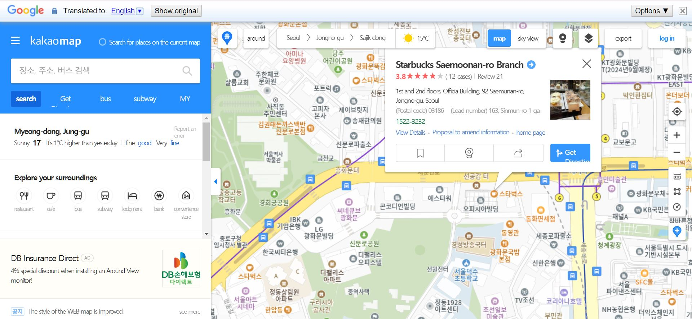
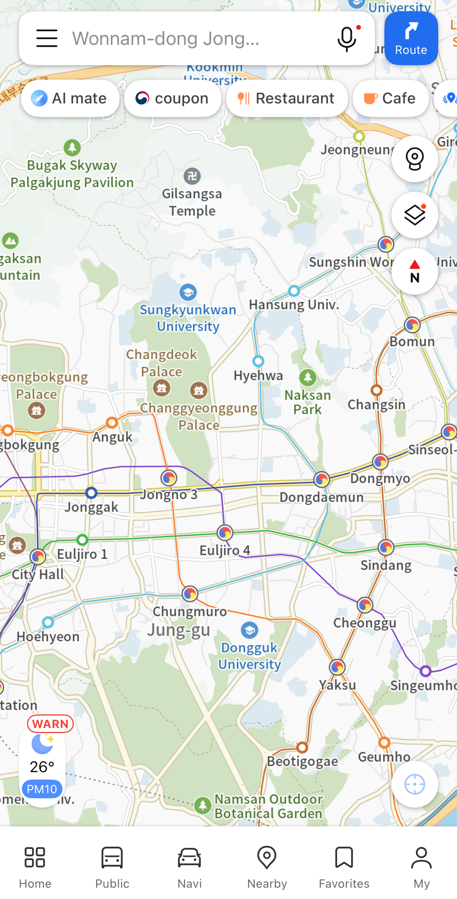

# Kakao Map

## URL

Site: [https://map.kakao.com](https://map.kakao.com)

API Documentation: [https://apis.map.kakao.com/](https://apis.map.kakao.com/)

## Description

Kakao Maps offer route planning for public transportations, car, walk, and bike, live navigation, push notificaiton for transits, location sharing with contacts, and recommendations for local hot spots. The service is available in web version and as an app on mobile devices.

#### The Basics

In web version, you can select with the top centre switch between regular map view or satellite view (translated as "sky view"), which also contains past data dated back to 2008.&#x20;

The button to the right of the view switch works like the yellow man in Google Maps. Click on the button, and the streets with street view available will be marked in light blue. Then click the location you want street view for.

<figure><figcaption>
KAKOA MAP RUNNING WITH GOOGLE TRANSLATE CHROME BROWSER EXTENTION FOR ENGLISH VERSION.
</figcaption></figure>

<figure><figcaption>
Kakao Map running on the iOS system without additional translation extension
</figcaption></figure>

A mapping tool in Korean focusing on the region.

Includes traffic information, weather, pollutants, cadastral information, CCTV locations, places of interest, and the facility to export data.

## Cost

* [x] Free
* [ ] Partially Free
* [ ] Paid

## Level of difficulty

<table><thead><tr><th data-type="rating" data-max="5"></th></tr></thead><tbody><tr><td>2</td></tr></tbody></table>

## Requirements

Korean Language skills or run a translator extension on the webpage version whilst using the tool (only partially successful).

When using iOS app, translation is automatically applied (UK-based).

## Limitations

Korean language requirement when viewed on webpage

Detailed information provided is limited to South Korea.

## Ethical Considerations

**Accidental Public Disclosure**\
[https://www.koreatimes.co.kr/business/tech-science/20210119/kakao-hit-for-mishandling-customer-data](https://www.koreatimes.co.kr/business/tech-science/20210119/kakao-hit-for-mishandling-customer-data)

**Unclear Consent Mechanisms**\
[https://www.koreaherald.com/article/2539309#:\~:text=Jan.,layout%2C%20making%20it%20hardly%20recognizable.](https://www.koreaherald.com/article/2539309)

**Misclassification of Data**\
[https://journals.sagepub.com/doi/full/10.1177/20570473231224818](https://journals.sagepub.com/doi/full/10.1177/20570473231224818)

## Guides and articles

Guides on [Kakao Map Official Blog](https://kakaomap.tistory.com/category/%EC%B9%B4%EC%B9%B4%EC%98%A4%EB%A7%B5%20%EC%9D%B4%EC%9A%A9%EA%B0%80%EC%9D%B4%EB%93%9C)

## Tool provider

[Kakao Corporation](https://www.kakaocorp.com/page/)

## Advertising Trackers

* [ ] This tool has not been checked for advertising trackers yet.
* [x] This tool uses tracking cookies. Use with caution.
* [ ] This tool does not appear to use tracking cookies.

| Page maintainer |
| --------------- |
| Renn            |
|                 |
