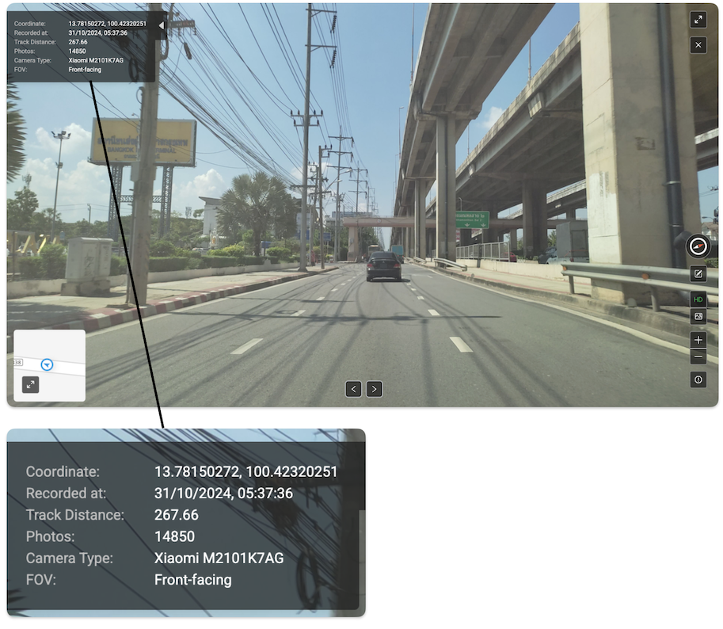

# KartaView

## URL

[https://kartaview.org/map](https://kartaview.org/map)

## Description

KartaView is a crowdsourced street view imagery platform with a particular focus on providing extensive coverage in Southeast Asia. Contributors from anywhere in the world can upload imagery including 360° photos, vehicle dashcam photos, or series of photos captured by users traveling along a route in a vehicle, bicycle, or on foot.

For open-source researchers, KartaView can serve as an additional or alternative reference point to Google's street view. KartaView also provides a JOSM (Java OpenStreetMap Editor) extension where users can update [OpenStreetMap](https://www.openstreetmap.org/) data as they upload imagery.&#x20;

KartaView's imagery is [licensed](https://kartaview.org/terms) under [CC-BY-SA](https://creativecommons.org/licenses/by-sa/4.0/deed.en), which means that users can share or adapt the imagery with attribution and under the same or compatible license.

KartaView is owned by GrabMaps, a mapping technology arm of Grab Holdings. Leveraging Grab's operations in Southeast Asia (in ride-sharing, food and grocery delivery, and digital payment), GrabMaps regularly commissions Grab drivers and [provides equipment](https://www.gizguide.com/2025/04/grab-hardware-innovations.html) and training for drivers to contribute to mapping.&#x20;

### Finding available street view imagery

Search by keyword, address, or coordinates. If you see an empty map, make sure to zoom in to see the purple lines.&#x20;

<figure><figcaption>
Purple lines indicate available street view imagery in KartaView. This is an example from searching Nakhon Ratchasima, Thailand.
</figcaption></figure>

Zoom in even more and click on the purple line to reveal the available tracks. Green dots indicate that images are available, and the larger bubbles correspond to the thumbnails shown at the bottom.&#x20;

<figure><figcaption>
Location in Bandung, Indonesia. Note that some street view images (green dots) are between buildings or inside buildings, indicating that these were captured by pedestrians or motorcycles. 
</figcaption></figure>

Appearing at the bottom of the screen, the Tracks are series of images available for that location. Shown under the thumbnails are the distance traveled, the number of photos, and the date of image capture (note: not the date of upload).

<figure><figcaption></figcaption></figure>

### Metadata

Each uploaded image contains metadata including coordinates, date and time of recording, and the device used for image capture. The metadata is generated in the uploading process, either directly from the camera's EXIF info or from a custom GeoJSON file ([KartaView GitHub documentation](https://github.com/kartaview/upload-scripts) - scroll down to "2. Generate Exif info").&#x20;

<figure><figcaption>
Most of the images uploaded by KartaView users are sequences of still photos, and do not support 360° panning. 
</figcaption></figure>

### 3D mapping

KartaView offers the functionality of uploading and visualizing 3D point cloud data — although this function appears to be still in beta and not widely adopted. Contributors can upload 3D scans of architecture or geographical features in LiDAR or 3D mesh files (see [documentation](https://3d.kartaview.org/explore#10/1.3521/103.8198) for file formats), and KartaView's [3D viewer](https://kartaview.org/doc/uploads-3d) will visualize and map the data as point cloud data.&#x20;

LiDAR — Light Detection and Ranging

LiDAR ([Light Detection and Ranging](https://oceanservice.noaa.gov/facts/lidar.html)) is a remote sensing method that uses infrared light pulses to determine the distance from the sensor to the surface of an object. \
\
Users of iPhone Pro and Pro Max already have a LiDAR scanner available (since the iPhone 12 Pro and Pro Max, launched 2020), which works to improve photos taken in low-light conditions and requiring depth sensing.&#x20;

KartaView has [developed 3D cameras and dashcams](https://www.gizguide.com/2025/04/grab-hardware-innovations.html) for both the [in-house use of Grab](https://www.grab.com/sg/inside-grab/stories/kartacam-2-grab-new-map-making-camera-launch/) and as a hardware business. The latest models of these cameras are compatible with LiDAR technology and are also sold on the [KartaView website](https://store.kartaview.org/).

### Advantage in Southeast Asia

**Contribution to OpenStreetMap**: GrabMaps claims to have added (since 2017) [900,000km of roads and 50 million points of interest](https://www.gizguide.com/2025/04/grab-hardware-innovations.html) to OpenStreetMap that were not previously available. These contributions have been made by Grab drivers, merchants and customers. (We are unable to independently verify the claimed numbers.)

**Hyperlocal mapping**: In GrabMaps' statements, roads in Southeast Asia that are added to KartaView include [alleyways](https://www.grab.com/sg/inside-grab/stories/mapping-hidden-roads-alleys-southeast-asia-driver-partners/) that cannot be navigated using four-wheeled vehicles. The intention is to facilitate more efficient delivery routing for Grab drivers.&#x20;

**Available 360° imagery**: [KartaView provides 360° imagery in urban areas in Southeast Asia](https://kartaview.org/landing/open-imagery) — particularly in Thailand, Indonesia, the Philippines, Malaysia, and Vietnam. The full dataset is available via KartaView in the web browser and also for download (subject to user registration and provision of full name, work email, and company).&#x20;

### Available formats

KartaView is available in the following formats:

* Web browser
* Mobile app, which can be used to record geodata and street view imagery.
* API, [https://kartaview.org/doc/](https://kartaview.org/doc/)
* JOSM (Java OpenStreetMap Editor) extension ([link](https://wiki.openstreetmap.org/wiki/JOSM/Plugins/KartaView)). This is an offline desktop application (Mac, PC, Linux) that allows the user to edit and enrich OpenStreetMap data by leveraging 360° images from KartaView. For instance, upon uploading new images, users can manually pinpoint the exact location on OpenStreetMap and tag any traffic signs appearing on the image.&#x20;

## Similar tools

[**Mapillary**](https://www.mapillary.com/app/) ([Bellingcat toolkit description](https://bellingcat.gitbook.io/toolkit/more/all-tools/mapillary)), which is owned by Meta, also offers street view imagery uploaded by users. Mapillary [positions itself](https://blog.mapillary.com/update/2024/01/12/Mapillary-10-Years-2-Billion-Images.html) as having a large user base and an active community, and it was an early mover in using artificial intelligence in feature detection (as reported in [2019](https://geospatialworld.net/news/mapillary-puts-186-million-ai-generated-map-features-on-global-map/)). In practice, researchers are encouraged to access street view imagery in both Mapillary and KartaView as these can be complementary resources.&#x20;

Note a key difference in user experience design: Whereas KartaView's global or country-level map could appear empty unless the user zooms in further, Mapillary takes the opposite design approach. Mapillary's global map gives the impression of ample imagery available in very dense distribution. Upon zooming in to a city or neighborhood, there are thin green lines that indicate the actual availability of imagery.&#x20;

**KartaView's licensing is more open than Google Maps:** KartaView's street view imagery and API are under the CC-BY-SA license, enabling anyone to use the images and data with proper attribution and an equivalent license, including for commercial or non-commercial purposes. In comparison, Google Maps' licensing is more restrictive: non-commercial use is allowed with proper attribution, and commercial use is subject to copyright and requires authorization.&#x20;

A related tool is **ZenSVI** ([GitHub](https://github.com/koito19960406/ZenSVI); [documentation](https://zensvi.readthedocs.io/en/latest/)), a Python package for analyzing street view imagery, developed by a lab at the National University of Singapore. Using this package, researchers can download street view imagery from Mapillary and KartaView, analyze the metadata, and extract features using computer vision models. The package also supports transforming the imagery into different formats (e.g., depth map, point cloud) and visualizing the output.&#x20;

## Cost

* [x] Free
* [ ] Partially Free
* [ ] Paid

## Level of difficulty

<table><thead><tr><th data-type="rating" data-max="5"></th></tr></thead><tbody><tr><td>1</td></tr></tbody></table>

## Requirements

* **Web:** any modern web browser.&#x20;
* **Mobile**: iOS and Android.
* **API:** Public endpoints do not require authentication. To access authenticated endpoints, API users provide an email for a user account and an access key.&#x20;
* JOSM: Any major operating system.

## Limitations

* **Limited availability of 360° imagery**: In most regions globally, imagery uploaded to KartaView are series of still images rather than 360° images that allow panning in different directions.
* **Uneven coverage or updating frequency**: User-generated imagery may not be updated frequently, and may not reflect the current state of the location.&#x20;
* **Inconsistent image quality**: Image quality can differ, depending on the recording conditions, recording device, or file compression techniques. (Some imagery on KartaView may have been recorded in low-light settings or in low resolution.) Compared to tech companies (such as Google Maps) that operate a standardized fleet of vehicles with professional recording equipment, KartaView has less control over image quality or recording conditions.&#x20;
* **Accuracy of metadata**: Researchers using KartaView's imagery should be aware that the metadata (e.g., coordinates or times) provided may not always be accurate. Additional verification is advisable.&#x20;
* **API Rate limits**: The rate limits are 1,000 requests per hour with authentication, and 100 requests per hour with the public API.
* **Requiring zoom-in to check for available imagery:** From the web browser, Kartaview is designed such that the global or country-level view appear relatively empty, giving the impression that street view imagery is not available. Only when zoomed in to a city or neighborhood, more purple lines will appear.&#x20;

## Ethical Considerations

* **Privacy and Anonymity**: KartaView applies machine learning algorithms to blur faces, license plates, and house numbers when users upload new images. However, these algorithms can still be inadequate, as illustrated in [KartaView's discussion of past issues](https://www.grab.com/sg/inside-grab/stories/blurring-faces-and-licence-plates-in-street-level-images-to-protect-privacy/) (e.g., not blurring details shown in mirror reflections). If encountering images that contain identifying details of individuals or private properties, researchers should exercise prudence and consider the implications of using such images.&#x20;
* **Accuracy and Representation**: Like any crowdsourced platform, Kartaview's street view imagery tends to disproportionately represent [developed countries and urban areas](https://www.sciencedirect.com/science/article/pii/S1569843222002825). In comparison, [developing countries](https://www.nature.com/articles/d44148-023-00204-1), rural areas or sparsely populated regions are underrepresented, or may show outdated street view images.\
  Researchers focusing on developing regions should take extra steps to seek out local or alternative providers of maps or street view imagery to ensure accuracy and comprehensiveness. Please see [this Wikipedia article](https://en.wikipedia.org/wiki/List_of_street_view_services) for a list of local providers of street view imagery.

## Tool provider

KartaView is owned by GrabMaps, [https://grabmaps.grab.com/](https://grabmaps.grab.com/) - Singapore. GrabMaps is part of [Grab Holdings](https://www.grab.com/sg/).&#x20;

## Advertising Trackers

* [ ] This tool has not been checked for advertising trackers yet.
* [x] This tool uses tracking cookies. Use with caution.
* [ ] This tool does not appear to use tracking cookies.

| Page maintainer |
| --------------- |
| river\_n        |
|                 |
