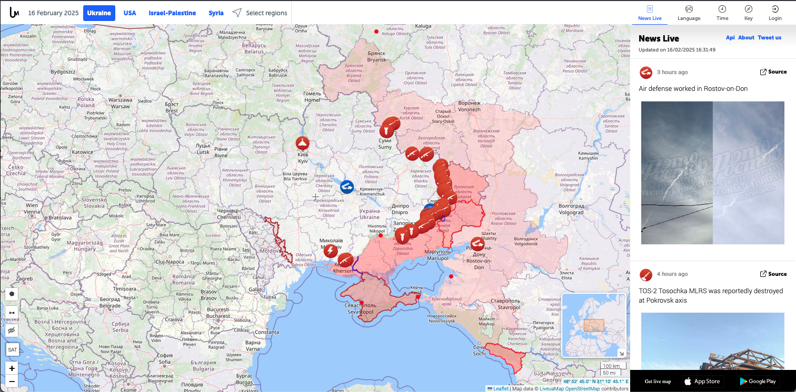

# LiveUAMap

## URL

[https://liveuamap.com/](https://liveuamap.com/)

## Description

LiveUAMap is a tool that provides real-time updates on global geopolitical events, conflicts, and crises. Using an interactive map interface, the platform allows users to gain insights into various incidents happening worldwide. It aggregates data from multiple sources, including news outlets, social media, and direct reports from affected areas.

One of the key features of LiveUAMap is its ability to display a wide range of events, including but not limited to military actions, protests, government decisions, and natural disasters. Users can filter events based on their type, location, and time frame, which makes it easier to track developments of particular interest or concern.

### Features:

* **Coverage:** covers multiple countries and regions including Ukraine, USA, Israel/Palestine, Yemen.
* **Language:** supports multiple languages including English, Spanish, Ukrainian, Russian and Arabic.
* **Polygons**: allows to draw shareable polygon shapes to select specific areas.
* **Measure distance:** measure distance between points in feet and metres.
* **History:** partial history.
* **News feed:** allows you to jump to locations on the map or to see news events for locations on the map (all news items include sources).
* **Time:** filter by date.
* **Filter:** Incidents include road accidents, drones/robots, explosions/blasts, police, animals, etc.
* **Coverage:** covers multiple countries and regions including Ukraine, USA, Israel/Palestine, Yemen.
* **Language:** supports multiple languages including English, Spanish, Ukrainian, Russian and Arabic.
* **Polygons**: allows to draw shareable polygon shapes to select specific areas.
* **Measure distance:** measure distance between points in feet and metres.
* **History:** partial history.
* **News feed:** allows you to jump to locations on the map or to see news events for locations on the map (all news items include sources).
* **Time:** filter by date.
* **Filter:** Incidents include road accidents, drones/robots, explosions/blasts, police, animals, etc.

### Pro-version features:

* **Satellite imagery:** access to satellite maps from multiple providers, offering a higher level of detail and visual clarity.
* **Remove advertising:** no ads.
* **Location search:** search by location name.
* **History:** complete history of events, covering all available previous years for in-depth research and analysis.

Liveuamap is available in the following formats:

* Web: accessible through any web browser, providing full access to the map and all features.
* Mobile: available as a mobile app for both iOS and Android.&#x20;

The screenshot below shows events including shelling, armed conflict, anti-air surface-to-air missile launches for the current day (in this case 16 February 2025):

<figure><figcaption>
LiveUAMap screenshot showing real-time updates of military incidents and air defense activity in Ukraine and surrounding regions on February 16, 2025.
</figcaption></figure>

### Use Cases

Open source researchers can find LiveUAMap to be a helpful resource for their investigations and analyses. Here are some specific ways in which they might use the tool:

1. **Conflict Analysis and Monitoring**: By tracking the progression of conflicts, researchers can document changes, analyze the dynamics of conflicts, and understand geopolitical implications.
2. **Historical Data Compilation**: Leveraging the historical data and satellite maps features (available in the paid version), researchers can compare current events with past data to identify patterns or shifts in regional dynamics.
3. **Verification of Reports and Incidents**: Using LiveUAMap, researchers can cross-reference reported events with updates to verify the authenticity and accuracy of information circulating in other media or reports.
4. **Mapping Influence and Control**: The tool allows for tracking territorial control shifts, which can be crucial for understanding the extent of influence and operational capacities of different actors in a conflict zone.
5. **Geopolitical Research**: For studies focusing on geopolitical implications, LiveUAMap offers a visual and interactive means to monitor and analyze the influence of different global and regional powers in specific areas.
6. **Educational Purposes**: Open source researchers can use LiveUAMap as a teaching tool to illustrate the dynamics of global events, conflict zones, or geopolitical changes to students or other audiences.

By utilizing the comprehensive features of LiveUAMap, such as timely updates, interactive maps, and access to both current and historical data, open source researchers can enhance their understanding of global events.

## Cost

* [ ] Free
* [x] Partially Free
* [ ] Paid

- Paid: removes advertising, provides location search, history and satellite maps.
- API use is charged [https://liveuamap.com/promo/api](https://liveuamap.com/promo/api)

## Level of difficulty

<table><thead><tr><th data-type="rating" data-max="5"></th></tr></thead><tbody><tr><td>1</td></tr></tbody></table>

## Requirements

* **Web:** any modern web browser (Chrome, Firefox, Safari, Edge, etc.).
* **Pro Version**: an email address is required to access the Pro features.

## Limitations

LiveUAMap.com, while a valuable resource for real-time geopolitical and conflict-related events, has several limitations, including:

* **Data Reliability**: The information is compiled from various sources, which can vary in reliability and perspective, making it essential to cross-reference facts.
* **Limited Historical Data**: Access to historical data might be limited or require a subscription, restricting comprehensive historical analysis.
* **Geographical Coverage**: Although extensive, coverage might be uneven, with more focus on active conflict zones, potentially overlooking lesser-reported areas.
* **Language Limitations**: Primarily English-based content may limit access or understanding for non-English speakers without translation tools.
* **Subscription for Full Features**: Full access to certain features and in-depth analyses may require a subscription, limiting access to all content for non-subscribers.

## Ethical Considerations

When using LiveUAMap.com, users and providers should be mindful of several ethical considerations:

* **Source Transparency**: It is essential to clearly cite sources and understand their reliability and potential biases. This ensures the credibility of the information being presented.
* **Privacy and Security**: In conflict zones, the dissemination of certain information could pose risks to individuals' safety and security. It's crucial to balance the public's right to know with the potential harm that information could cause.
* **Information Accuracy**: Given the fast-paced nature of updates and the reliance on a variety of sources, there's a responsibility to verify information before disseminating it to prevent the spread of misinformation.
* **Bias and Perspective**: Highlighting the importance of presenting information as impartially as possible.

Understanding and addressing these considerations are crucial in maintaining the ethical integrity of using and providing information on platforms like [LiveUAMap.com](https://liveuamap.com/).

## Guide

To effectively use Liveuamap, especially for beginners or those looking to refine their skills, the following resources are highly recommended:

**Official Wiki**

* [https://liveuamap.com/about](https://liveuamap.com/about)

**Tutorials and Articles**

* ‘Mapping Territorial Control and Contestation in Syria’ (no date) _ACLED_. Available at: [https://acleddata.com/knowledge-base/mapping-territorial-control-contestation-and-activity-in-syria/](https://acleddata.com/knowledge-base/mapping-territorial-control-contestation-and-activity-in-syria/) (Accessed: 16 February 2025).
* Team, B.I. (2017) _Tanks of Buhaivka: A training facility in Eastern Ukraine_, B\_ellingcat\_. Available at: [https://www.bellingcat.com/news/uk-and-europe/2017/03/17/tanks-buhaivka-training-facility-eastern-ukraine/](https://www.bellingcat.com/news/uk-and-europe/2017/03/17/tanks-buhaivka-training-facility-eastern-ukraine/) (Accessed: 16 February 2025).
* Zwijnenburg, W. (2020) _Yemen’s Disappearing Date Palms: Applied Environmental OSINT_, B\_ellingcat\_. Available at: [https://www.bellingcat.com/news/mena/2020/07/24/yemens-disappearing-date-palms-applied-environmental-osint/](https://www.bellingcat.com/news/mena/2020/07/24/yemens-disappearing-date-palms-applied-environmental-osint/) (Accessed: 16 February 2025).

**Video Tutorials**

* [https://www.youtube.com/@LiveMap](https://www.youtube.com/@LiveMap)
* _Liveuamap - Creating own map_ (2018). Available at: [https://www.youtube.com/watch?v=SDZS1-yysx8](https://www.youtube.com/watch?v=SDZS1-yysx8) (Accessed: 16 February 2025).
* _Liveuamap API and KML (GeoJSON) export_ (2018). Available at: [https://www.youtube.com/watch?v=Ee4TkyHpMIk](https://www.youtube.com/watch?v=Ee4TkyHpMIk) (Accessed: 16 February 2025).
* _Liveuamap HOW TO: selecting optional categories at website_ (2017). Available at: [https://www.youtube.com/watch?v=oTlHyS4gxPQ](https://www.youtube.com/watch?v=oTlHyS4gxPQ) (Accessed: 16 February 2025).

#### Developer Resources

* [https://liveuamap.com/promo/api](https://liveuamap.com/promo/api)

**Community and Support**

* [https://www.facebook.com/liveuamap](https://www.facebook.com/liveuamap) (see: [https://liveuamap.com/about#socmedia](https://liveuamap.com/about#socmedia) for full list)

## Tool provider

Liveuamap LLC [https://liveuamap.com/about#team](https://liveuamap.com/about#team) - United States

## Advertising Trackers

* [x] This tool has not been checked for advertising trackers yet.
* [ ] This tool uses tracking cookies. Use with caution.
* [ ] This tool does not appear to use tracking cookies.

| Page maintainer                      |
| ------------------------------------ |
| Bellingcat Volunteer Team/Unassigned |
|                                      |
