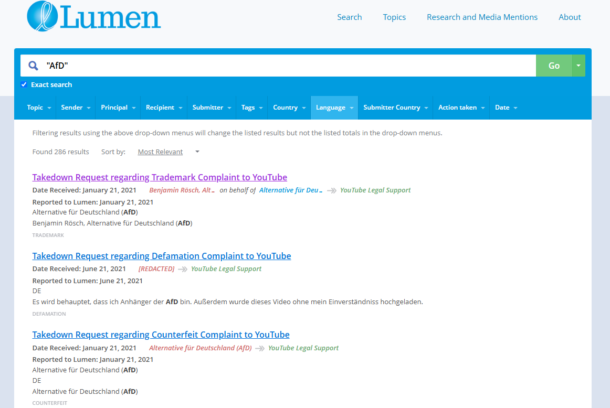

# Lumen

## URL

[https://lumendatabase.org](https://lumendatabase.org/)

## Description

Lumen is a Harvard‑affiliated research database of **legal complaints and content‑removal requests** (e.g., DMCA, defamation, court orders) submitted to online services. As of mid‑2025 it hosts **≈43 million** notices that reference **almost 10 billion URLs**. Investigators can search notices by keywords, entities (sender/recipient/principal), topics, and jurisdictions; exact‑phrase searching is available by quoting terms. A researcher login adds a per‑notice **“watch”** feature that emails updates when new documents (e.g., follow‑up court orders) are added.

### Key use cases and features:

* **Notices Repository:** Lumen keeps a collection of important notices, like DMCA claims, defamation issues, privacy concerns, trademark matters, and court orders. Each notice shares details about the sender and recipient, such as who requested the content removal and which hosting or search service was involved. It also provides a brief overview of the reasons for the request and includes the URLs of the content being questioned.
* **Search and Filtering:** full‑text query plus facets (notice type, sender, recipient, date, language, etc.). [Since Jun 2024 ](https://lumendatabase.org/blog_entries/new-features-for-researchers)users can run exact‑match searches by quoting a phrase and, if logged‑in as researchers, add individual notices to a personal “watch” list to be alerted of updates.
* **API for Advanced Research**\
  Researchers and investigative journalists[ can obtain API credentials ](https://github.com/berkmancenter/lumendatabase/wiki/Lumen-API-Documentation)to automate queries for large-scale data analysis. The API supports:
  * Searching by keywords, date ranges, parties involved, etc.
  * Retrieving entire notices as JSON for customized analytics.
  * Programmatic data collection over time to identify trends in takedown requests.

Lumen’s overarching goal is to bring **transparency** to the ecosystem of online content removal requests. It aims to be an independent, research-driven clearinghouse of takedown notices, allowing journalists, researchers, and the public to see who is requesting that specific web content or links be taken down and why. Lumen does not validate or endorse these requests; rather, it archives them to facilitate academic study, watchdog journalism, and informed civic debate.

### **When/Why a Researcher or Journalist Might Use Lumen**

1. **Investigating Patterns of Censorship or Overreach:**
   * _Example:_ A politician repeatedly using DMCA notices to remove critical blog posts.
   * _Outcome:_ You can uncover if the same entity has filed multiple notices across different platforms to silence certain views.
2. **Checking the Legitimacy of a Takedown Claim:**
   * _Example:_ You receive a tip that content on YouTube was flagged for copyright infringement, but you suspect it’s fair use.
   * _Outcome:_ A search of Lumen might reveal a DMCA notice that either lacks a credible claim or is suspiciously similar to notices flagged as fraudulent.
3. **Examining Geopolitical or Government Interventions:**
   * _Example:_ A ministry in Country X demands the removal of “defamatory” content from Google or a social network.
   * _Outcome:_ Lumen’s archive can reveal the scope of government requests, including how often and for what reasons they are made.
4. **Researching Corporate Takedown Practices:**
   * _Example:_ You want to see if a major film studio issues an unusually high number of DMCA requests for minor social-media posts.
   * _Outcome:_ By aggregating data in Lumen, patterns may emerge, helping you question potentially excessive takedowns.

### **What Lumen Shows**

<figure><figcaption><p>A Lumen Database search query for “AfD” displaying multiple takedown notices, each labeled by complaint type (e.g., trademark, defamation) and showing key fields like sender, recipient, and date received. (Filtered by language DE.)</p></figcaption></figure>

*   **Full or partially redacted copies of notices:**

    * Sender (often a rights-holder, law firm, or government agency)
    * Recipient (Google, Vimeo, Medium, or others)
    * Target URLs and reason (e.g. copyright, defamation, trademark)

    <figure><figcaption></figcaption></figure>
* **Contextual metadata:**
  * Date sent/received
  * Claimed legal grounds (DMCA, local law, court order)
  * Whether the recipient took action (partial or none)
* **Research Tools:**
  * Searchable indexes and filtering (dates, keywords, notice type)
  * API access for data mining and in-depth analysis

### Example of a Basic API Query

Below is a **short sample** of how a journalist or researcher might retrieve data via Lumen’s API (assuming they have an API token and some familiarity with command-line tools like `curl`). This example queries for notices that contain the term **“fraud”** in their text or metadata, from a date range, and returns the first page of JSON results.

```bash
# 1. Replace YOUR_API_TOKEN with the token you received from Lumen
# 2. Adjust the date range (in Unix time) and term as needed.

curl -H "User-Agent: MyResearchBot/1.0" \
     -H "Accept: application/json" \
     -H "X-Authentication-Token: YOUR_API_TOKEN" \
"https://lumendatabase.org/notices/search.json?term=fraud&date_received_facet=1672531200000..1704067200000&page=1"
```

**Explanation:**

* **`term=fraud`**: Searches for notices containing the word “fraud” in their text.
* **`date_received_facet=1672531200000..1704067200000`**: Limits results to notices received between two Unix timestamps (e.g., 01 Jan 2023 to 01 Jan 2024).
* **`page=1`**: Retrieves the first set of results.
* **`-H "X-Authentication-Token: YOUR_API_TOKEN"`**: Authenticates you as a recognized researcher.
* **`Accept: application/json`**: Ensures responses return in JSON, which is easily parsed by scripts or data-analysis tools.

You will receive a JSON object listing all matching takedown notices, each with fields like `id`, `title`, `date_received`, `sender_name`, and more. By iterating through `page` values, or narrowing your date range, you can gather larger sets of notices over time.

<details>

<summary>Advanced API examples</summary>

#### 1. Searching for a Keyword with Date Range

**Scenario:** You want to see all takedown notices referring to “piracy” from January 1, 2023 through January 1, 2024.

```bash
     -H "User-Agent: MyResearchBot/1.0" \
     -H "X-Authentication-Token: YOUR_API_TOKEN" \
     -H "Accept: application/json" \
"https://lumendatabase.org/notices/search.json?term=piracy&date_received_facet=1672531200000..1704067200000&sort_by=date_received%20asc"
```

* **`term=piracy`**: Looks for “piracy” in any notice field.
* **`date_received_facet=1672531200000..1704067200000`**: Restricts notices to those received between the two timestamps (Jan 1, 2023 and Jan 1, 2024).
* **`sort_by=date_received asc`**: Sorts results by oldest first (ascending).
* This returns JSON with an array of notices that match your criteria, including fields like `id`, `title`, `body`, `sender_name`, `recipient_name`, etc.

***

#### 2. Exact Phrase Searches

**Scenario:** You suspect certain notices mention an exact phrase—e.g. “copyright troll”—and want only those that contain that _entire_ phrase, not just the words separately.

```bash
     -H "User-Agent: MyResearchBot/1.0" \
     -H "X-Authentication-Token: YOUR_API_TOKEN" \
     -H "Accept: application/json" \
"https://lumendatabase.org/notices/search.json?term=%22copyright%20troll%22"
```

* **`term="%22copyright%20troll%22"`** (URL-encoded quotes) searches for the exact phrase “copyright troll.”
* By default, Lumen’s search is flexible with spacing and partial matches; quoting your query forces exact matching of the entire phrase.

***

#### 3. Filtering by Sender Name and Topic

**Scenario:** You want to find all notices **sent by** a specific party (the _sender\_name_) who has repeatedly filed DMCA takedowns about “videos.” Also, you only want notices classified under **Copyright** topics.

```bash
     -H "User-Agent: MyResearchBot/1.0" \
     -H "X-Authentication-Token: YOUR_API_TOKEN" \
     -H "Accept: application/json" \
"https://lumendatabase.org/notices/search.json?term=video&sender_name_facet=Company%20XYZ&topic_facet=Copyright"
```

* **`term=video`**: Broad text search for “video.”
* **`sender_name_facet=Company%20XYZ`**: Limits results to those where “Company XYZ” was the stated sender.
* **`topic_facet=Copyright`**: Restricts results to notices tagged under the Copyright topic.

***

#### 4. Looking Up Notices by Principal (Rightsholder)

**Scenario:** You suspect a major law firm is filing notices on behalf of a big music label. You want to see everything posted _on behalf of_ that label.

```bash
     -H "User-Agent: MyResearchBot/1.0" \
     -H "X-Authentication-Token: YOUR_API_TOKEN" \
     -H "Accept: application/json" \
"https://lumendatabase.org/notices/search.json?principal_name=Big%20Music%20Label"
```

* **`principal_name=Big%20Music%20Label`**: Finds all notices where the “principal” (the actual rightsholder or client) is “Big Music Label.”
* The response includes details like `date_sent`, `body` (if not redacted), and any URLs claimed to be infringing.

***

#### 5. Searching by Tag, Action Taken, and Language

**Scenario:** You want takedown notices about “fake news” specifically tagged with “misinformation,” and you only want to see those that had “Partial” action taken, in Spanish.

```bash
     -H "User-Agent: MyResearchBot/1.0" \
     -H "X-Authentication-Token: YOUR_API_TOKEN" \
     -H "Accept: application/json" \
"https://lumendatabase.org/notices/search.json?term=%22fake%20news%22&tags=misinformation&action_taken_facet=Partial&language_facet=es"
```

* **`term="%22fake%20news%22"`**: The exact phrase “fake news.”
* **`tags=misinformation`**: Only those notices with “misinformation” as a tag.
* **`action_taken_facet=Partial`**: The platform partially complied with the request.
* **`language_facet=es`**: The notice text is recorded as Spanish.

***

#### 6. Combining Multiple Queries (Sender & Keyword & Date Range)

**Scenario:** You suspect the same actor used different angles—defamation, copyright, trademark—to remove social media criticism. Combine a keyword (`“criticism”`), a date range, and the **sender's name**.

```bash
     -H "User-Agent: MyResearchBot/1.0" \
     -H "X-Authentication-Token: YOUR_API_TOKEN" \
     -H "Accept: application/json" \
"https://lumendatabase.org/notices/search.json?term=criticism&sender_name=Some%20Law%20Office&date_received_facet=1669852800000..1693612800000"
```

* **`term=criticism`**: The word “criticism” anywhere in notice text or fields.
* **`sender_name=Some%20Law%20Office`**: The name of the firm sending the notices.
* **`date_received_facet=1669852800000..1693612800000`**: Restricts results to notices received between Dec 1, 2022 and Sep 2, 2023 (example date range).

***

#### 7. Retrieving a Specific Notice by ID

**Scenario:** You want the full record of a known notice with ID `123456` to see original or supporting documents.

```bash
     -H "User-Agent: MyResearchBot/1.0" \
     -H "X-Authentication-Token: YOUR_API_TOKEN" \
     -H "Accept: application/json" \
"https://lumendatabase.org/notices/123456.json"
```

* **`https://lumendatabase.org/notices/123456.json`**: Fetches the entire notice #123456 in JSON format, including structured attributes (e.g., `works`, `infringing_urls`, etc.).

***

#### 8. Filtering by “Safe Harbor” or “Court Order”

**Scenario:** You want all the **Court Orders** posted this year, focusing on possibly sealed or partially redacted legal documents.

```bash
     -H "User-Agent: MyResearchBot/1.0" \
     -H "X-Authentication-Token: YOUR_API_TOKEN" \
     -H "Accept: application/json" \
"https://lumendatabase.org/notices/search.json?topic_facet=Court%20Order&date_received_facet=1672531200000..1704067200000"
```

* **`topic_facet=Court%20Order`**: Show notices labeled “Court Order.”
* **`date_received_facet=1672531200000..1704067200000`**: From Jan 1, 2023, to Jan 1, 2024.

***

**A Note on Parsing Results**

All responses return JSON with a structure like:

```json
jsonKopieren{
  "notices": [
    {
      "id": "123456",
      "type": "DMCA",
      "title": "Takedown Request regarding ...",
      "date_received": "2023-05-10T14:20:30Z",
      ...
      "works": [ ... ],
      "sender_name": "...",
      "recipient_name": "...",
      "score": 1.2345
    },
    ...
  ],
  "meta": {
    "query": { "term": "..." },
    "current_page": 1,
    "total_entries": 15,
    "total_pages": 2
  }
}
```

You can iterate through pages by appending **`&page=2`**, **`&page=3`**, and so on to gather additional matches. If you plan to store or display the results, consider normalizing them in a spreadsheet or database for further analysis.

</details>

## Cost

* [x] Free
* [ ] Partially Free
* [ ] Paid

API access is free for **research purposes**; tokens are issued on request to the Lumen team and use is governed by the API Terms of Use.

## Level of difficulty

<table><thead><tr><th data-type="rating" data-max="5"></th></tr></thead><tbody><tr><td>2</td></tr></tbody></table>

**Beginner-Friendly (Web Search) to Moderate (API Research)**

* Basic searching requires only a web browser and minimal familiarity with search filters.
* **API usage** or large-scale analysis requires intermediate data-handling or scripting skills (JSON, command line, etc.).

## Requirements

* **Website Usage**: No registration to browse truncated info; an email-based request is needed to view unredacted URLs or attachments.
* **API Usage**: Researchers must apply for an **API key** by emailing Lumen’s team with a brief description of intended usage.

## Limitations

* **Coverage depends on participating platforms.** Notable gaps/changes: **YouTube does not currently share** copies of notices; **Twitter/X paused** data‑sharing on **2023‑04‑15**; **Automattic/WordPress** is “not currently sending”; **GitHub (paused)**; **Stack Exchange stopped in 2017**
* **Redacted Fields:** Personally identifying information and entire text explanations may be redacted. For unregistered visitors, full URLs are truncated.
* **No Bulk Export via Website**: For large-scale or automated retrieval, you **must** use the API.
* **Date & Result Limits**: Extremely large or unfiltered searches might be capped or require date-slicing. Large, unfiltered queries can hit the 10 000‑result cap; slice by date when pulling data. Database growth now **> 200 k notices/week**.
* **No Guarantee of Accuracy**: Lumen does not confirm or endorse the validity of a notice; some notices may be fraudulent or contain misinformation.
* Coverage gaps: Twitter/X paused data-sharing on 15 Apr 2023; some other services (e.g. Stack Exchange) stopped years earlier.
* Google omits sender names from **defamation** notices for privacy reasons, so those fields will read “Redacted”.
* Although the software is GPL-2.0, individual notice texts remain under the terms set by the submitter; bulk redistribution of raw data may require permission.

## Ethical Considerations

* **Potential Privacy Risks**: Notices sometimes include sensitive info (names, allegations, etc.). Even though Lumen redacts personal data, some details may still appear in the body or attachments. Handle carefully.
* **Possibility of Misuse**: Some takedown requests are abusive or ‘fake DMCA’ attempts, aiming to silence speech or censor legitimate content.
* **Caution with Publication**: If you cite Lumen notices, consider verifying with additional sources. A notice alone is not proof of wrongdoing or infringement.

## Guides and articles

**Official API Docs (GitBook, Jan 2025)** – [berkman-klein-center.gitbook.io/lumen-database](https://berkman-klein-center.gitbook.io/lumen-database)

Steve Vondran: [How to track Trump Twitter Takedowns on the lumen database](https://www.youtube.com/watch?v=tY5sOxznvEU)\*, Youtube.

\*Certain elements of the user interface may have been altered since publishing

Dan Morrill: [DMCA notice BPI Part 2 Empty Claims](https://www.youtube.com/watch?v=C6N8y0i7440), Youtube.

## Tool provider

[The Berkman Klein Centre for Internet & Society at Harvard University](https://github.com/berkmancenter)\
A research-focused center studying the intersection of law, technology, and society.

Current major contributors (2025): Google Search, YouTube, Meta (Facebook & Instagram), GitHub, Reddit, Wikipedia, Medium, Vimeo, DuckDuckGo, Wordpress, University of California systems. _Twitter/X not currently contributing._

## Advertising Trackers

* [ ] This tool has not been checked for advertising trackers yet.
* [ ] This tool uses tracking cookies. Use with caution.
* [x] This tool does not appear to use tracking cookies.

| Page maintainer |
| --------------- |
| Martin Sona     |
|                 |
