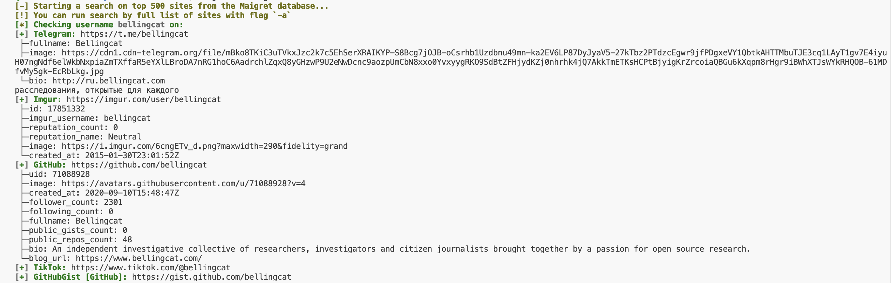
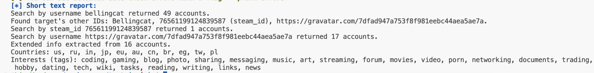
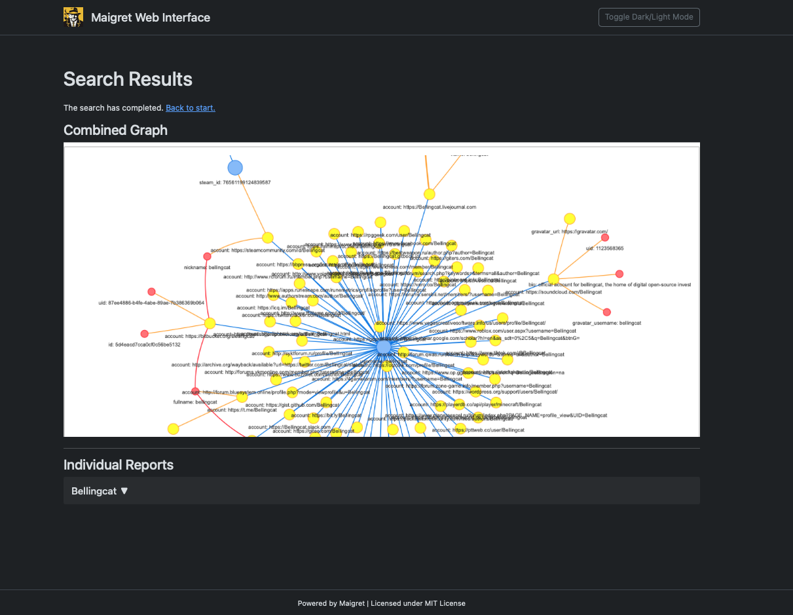

# Maigret

## URL

[https://github.com/soxoj/maigret](https://github.com/soxoj/maigret)

## Description

Maigret is a command-line tool that collects information about a person using their username. It checks for accounts across over [3000](https://github.com/soxoj/maigret/blob/main/sites.md) sites, gathering available information directly from web pages, without the need for API keys. The tool itself is a fork of the[ Sherlock project.](https://github.com/sherlock-project/sherlock)

If not explicitly specified with a tag, Maigret will start its search with the top 500 sites from its database, including many popular social platforms. Users have the option to expand the search by including different options, ranging from specific sites to countries and identifiers.

Identifiers refer to unique markers associated with user accounts on specific platforms, such as a **gaia\_id** (Google's internal numeric user identifier, previously found in Google Plus accounts) or other similar unique attributes. These allow Maigret to conduct more targeted and precise searches beyond ordinary usernames.

<figure><figcaption><p>Search for the username "bellingcat" on Maigret</p></figcaption></figure>

To start a simple search on Maigret, all you need to do is provide one or more usernames for the individual you want to investigate. For example, searching for "bellingcat" will check if that username exists across the platforms supported by the tool (like social networks, forums, blogs and more). If an account is found, a report detailing where the username appears will be generated. This includes links to profile pages or relevant content on those platforms (e.g., Facebook, Instagram etc) and any available additional metadata like account creation dates or follower counts, if retrievable. In this case of "bellingcat," we discovered accounts on Telegram, Instagram, Github, TikTok and GithubGist.

In addition, Maigret scans account webpages (username bellingcat on X will return -[https://x.com/bellingcat](https://x.com/bellingcat)) to extract personal details and links to other profiles, displaying this information in the command line output and including it in reports. It also uses found IDs and usernames to start new searches automatically.

The tool supports generating reports in various formats, including HTML, PDF, TXT, [XMind 8 mindmap](https://xmind.app/user-guide/xmind/), and JSON. HTML and PDF reports include profile photos, all gathered personal information, and additional data like full name, gender, and location based on the statistics of all found accounts.

A short text report is also shown in the command line after the search phase.

<figure><figcaption><p>A short report for a username "bellingcat".</p></figcaption></figure>

## Cost

* [x] Free
* [ ] Partially Free
* [ ] Paid

## Level of difficulty

<table><thead><tr><th data-type="rating" data-max="5"></th></tr></thead><tbody><tr><td>3</td></tr></tbody></table>

## Requirements


* Python3 (for installation).
* Telegram account (required to use the bot).

## Installation and usage

For those using Windows, standalone EXE binaries are available in the [Releases section](https://github.com/soxoj/maigret/releases) of the GitHub repository. This provides an easy way to run the tool without needing Python installed.

Additionally, Maigret is available through an official [Telegram bot](https://t.me/osint_maigret_bot), which provides a great alternative if you prefer not to install anything on your system.

If you wish to use the tool without installation, it can also be launched from cloud shells and Jupyter notebooks. This allows you to run it directly in your browser. You can follow the provided instructions to launch Maigret in your browser, with options to open it in [Google Cloud Shell,](https://shell.cloud.google.com/) run it on [Replit](https://replit.com), open it in Colab, or launch it via [Binder](https://mybinder.org).

For local installation, you can use pip3, Docker, or clone the GitHub repository.

**To install from PyPl:**

```python
// pip3 install maigret
```

**Cloning the repository:**

```python
// git clone https://github.com/soxoj/maigret && cd maigret
pip3 install .
```

To search for accounts with specific username, use:

```python
// maigret <username>
```

For more detailed searches, you can add options like '-a' to search all sites, or '-o' to save the output to a specific file format, such as HTML or PDF. Maigret also supports multiple usernames in a single search by listing them together: maigret \<username1> \<username2> .

You can also create advanced queries using built-in categories, boolean operators, and substring matches for source names.

For example, you can search for all accounts that have the username 'bellingcat' on websites categorized as 'social':"

```python
// maigret --filter "cat=social" --username bellingcat
```

**Web Interface:**

Maigret also offers a web interface that makes it easier to interact with search results. To use the web interface, you need to use the --web flag and specify a port number.

For example, to run the web interface on port 5000, use:

```
// maigret --web 5000
```

Once Maigret is running with the web interface, open your browser and go to http://127.0.0.1:5000.

Here, you can enter one or more usernames to initiate a search. After the search is complete, the web interface will display a graphical representation of the results, a table with all the accounts found, and provide options to download the reports in multiple formats (HTML, PDF, etc.).

<figure><figcaption><p>Maigret Web Interface displays search results for the username “Bellingcat,” with a combined graph of linked accounts and individual report options.</p></figcaption></figure>

## Limitations and Ethical Consideration

Maigret may miss valid results from various sources. Additionally, it may encounter issues with bot protection and CAPTCHAs, leading to errors in the search results. There is also a possibility of false positives, where the tool might incorrectly identify accounts belonging to the searched username.

## Guides and articles

* Information regarding the tool and documentation: [https://maigret.readthedocs.io/en/latest/index.html](https://maigret.readthedocs.io/en/latest/index.html)
* GitHub repo and instruction for installation: [https://github.com/soxoj/maigret](https://github.com/soxoj/maigret)
* Youtube video for Windows installation and usage: [https://www.youtube.com/watch?v=qIgwTZOmMmM](https://www.youtube.com/watch?v=qIgwTZOmMmM)

## Tool provider

The tool provider of Maigret is [Dmitry Danilov](https://www.linkedin.com/in/danilov-d/), Netherlands.

## Advertising Trackers

* [x] This tool has not been checked for advertising trackers yet.
* [ ] This tool uses tracking cookies. Use with caution.
* [ ] This tool does not appear to use tracking cookies.

| Page maintainer |
| --------------- |
| tsvetelina      |
|                 |
