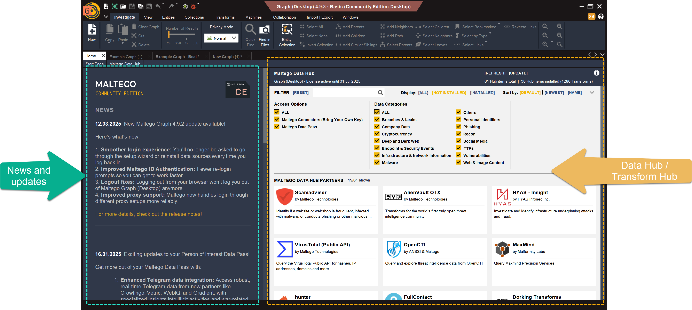
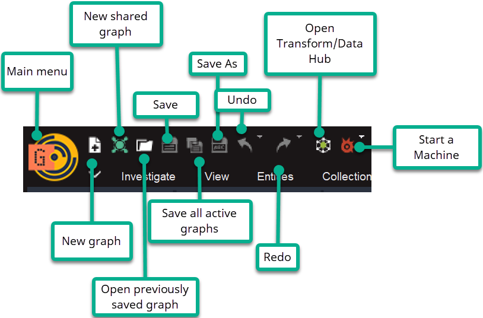

# Maltego Graph

## URL

[https://www.maltego.com/](https://www.maltego.com/)

## Description

Maltego Graph is both a search tool and a visualization tool. It can search for information using integrated data sources and connect the pieces to show you how they are related. It's like a data map that helps you see the bigger picture of your investigation. This software allows a researcher to start with a particular item of information, such as an alias, an email address, phone number, company name, or IP address, and use this information as the basis to collect additional information. Maltego Graph links all these individual data points and [“emphasizes their relationships and connections.” ](https://medium.com/@whart842/understanding-maltego-an-overview-e32205326512)


We tested Maltego Graph CE (Community Edition) version for this toolkit description.


### Getting Started&#x20;

<figure><figcaption>
 Seen here is the start page of Maltego Graph, which loads after sign-in/authentication. To the left are recent updates to the software. To the right is the Data/Transform Hub where users can transform as many data sources as their account allows. 
</figcaption></figure>

#### What are Entities and Attributes?&#x20;

[Maltego uses specialized terms. ](https://docs.maltego.com/en/support/solutions/articles/15000008829-glossary-for-maltego-graph-desktop-#collaboration-0-0)However, as a beginner, users may want to familiarize themselves with what Maltego calls ”Entities” and “Attributes” before starting investigations. A solid understanding of this distinction is key to organizing information in any investigation.&#x20;

All investigations in Maltego begin with researching an Entity.&#x20;

**Entity** - [represents the core thing or subject being investigated. It can be a piece of information or a node in your analysis.](https://docs.maltego.com/en/support/solutions/articles/15000008829-glossary-for-maltego-graph-desktop-#entity-entities-0-3) It is the building block of your investigation. An entity usually goes on top of the graph (however, Maltego provides a variety of ways to organize your graph). &#x20;

_Example:_ NGO, a person, a company, a DNS name

**Attributes** - (It is [also called a “property”.)   ](https://docs.maltego.com/en/support/solutions/articles/15000010462-create-new-entity#main-property-0-1)This is a piece of information that can help identify or describe an entity. They are additional details associated with an entity and provide more context about the entity.&#x20;

_**Example 1: Person vs. Email Address**_&#x20;

Entity:  John Smith          → Attribute: johnsmith@example.com

_**Example 2: Domain vs. WHOIS Organization**_&#x20;

Entity: [gaproject.com](http://gaproject.com) → Attribute: Organization Stichting Bellingcat


&#x20;As a rule of thumb, if you want to pivot on an information later, make it an entity. In essence, if an Entity is “who” or “what” you’re investigating, an Attribute is “what you know about” that “who” or “what”.&#x20;


Maltego comes with Standard entities. Read more about this [here.](https://docs.maltego.com/en/support/solutions/articles/15000034102-standard-entities) [However, users can also create their own Custom Entity/Entities to tailor them to their needs. ](https://www.maltego.com/blog/create-your-own-custom-entities-in-maltego/)The steps for creating custom entities can also be found [here.](https://m.youtube.com/watch?v=FHzsegaqlIo) \

<figure><figcaption>
Here is a sample list of pre-loaded Entities in Maltego. Users can find it in the “Investigate” tab. Users can drag and drop an entity as the starting point for their investigation. 
</figcaption></figure>

#### What do the Buttons Mean in Maltego Graph?&#x20;

_**Main Buttons**_

The interface for Maltego requires familiarization. Below are the most commonly used features of the tool.&#x20;

<figure><figcaption>
These are the main menu features found on the topmost portion of the application.
</figcaption></figure>

**The "Investigate" Tab**

While there are several other tabs, the main tab that beginner users may want to familiarize themselves with is the “Investigate” Tab.&#x20;

The “Investigate” Tab is key as this is where users can organize their data. It is also where users manage the scale and scope of the investigation; select and manipulate entities and how their relationships are represented in the visual link. This is also where investigators:&#x20;

* Run and control Transforms
* Search quickly within graphs
* Select privacy preferences when running queries

<figure><figcaption>
This shows a quick primer of the Investigate tab, which shows options on how to efficiently organize your data points. 
</figcaption></figure>

**Graph Layout**

Beginner users will need to orient themselves with the layout of the graph. Below are the different sections. &#x20;

(CLICK IMAGE BELOW TO ENLARGE)

<figure><figcaption>
(CLICK TO ENLARGE) This is a example graph and the different sections that users will get to familiarize when working with the tool. 
</figcaption></figure>

For a detailed step on starting your first graph, look at the documentation [here](https://docs.maltego.com/en/support/solutions/articles/15000008832-your-first-graph), as well as an explanation of [several other icons i](https://docs.maltego.com/en/support/solutions/articles/15000009615-maltego-graph-sidebar)n the interface, for more intermediate users. \

### **How does it work?**

#### **USING MALTEGO GRAPH WITH TRANSFORMS**

**1. It is a centralized search tool**

In theory, Maltego Graph gathers information about a research subject without the researcher having to leave the software or go to another platform. It already integrates into the tool free publicly available sources or data from commercial vendors. These are what Maltego calls “data sources” which are like pre-packaged information catalogs. For instance, you can have data sources from FlightAware, which comprises digital aviation data. Or a data package from Pipl, which comprises personal details, social media, and contact info. These “data sources” are available to install in what it calls “Transform Hub.” This Transform Hub is a universe of data you can search in.

To perform searches, Maltego Graph needs a comprehensive list of data sources in the hub to mine information from. The more data sources you have in your software, the better your search results are. More importantly, you need to have the right category of data sources to get good results. For example, if you are doing social media research, it is recommended that you install or have access to data sources from the Transform Hub that can mine Facebook, Instagram, TikTok, VK, OK, Twitter, Telegram, etc. Other examples of pre-packaged data sources are Bing, Google, TinEye, and OpenCorporates.


Download as many free data sources as you can from the hub. Note that you may need to sign up and obtain an API key from these data sources.&#x20;


Begin with a piece of information you know (called “Entity” – which can be a name, email address, or phone number). Then, right-click to “run a transform” based on that information. This process uses a code, turns this Entity as if it were a search term, and finds it in multiple sources simultaneously.For example, if you want to know about an individual whose alias is “Mr.A” , you will begin by entering that known Entity (in this case, the alias “Mr.A” ) -> right-click on it and request Maltego to “run a Transform”. -> You can ask the tool to look for that search term in one or more data sources. More importantly, you can specify what kind of information you are looking for. Running a transform on an alias can produce a name, a phone number, an address, or other known aliases.

The researcher can hover over each search result returned. This will produce an “overview” window with detailed information about that search result.

<figure><figcaption>
RUNNING A TRANSFORM: Here is an example of running a transform on a website of interest. In this example, an investigator may be interested in knowing what is behind this website and confirming that the domain exists. He/she runs a transform by right-clicking on this entity. A Transform Menu shows up, and the user clicks on a Transform (DNSNames). This then runs a piece of code that takes a piece of information (www.paterva.com website) as input and returns related information as output (DNS Name). This new icon at the bottom is data confirming that the website name exists. 
</figcaption></figure>

_**Understanding Transform Results**_

Sometimes, if the transforms have many results, it is advisable to use the “Block Layout”. This is helpful for new users as Maltego usually organizes the results according to relevance. It gives it a higher “weight” according to the most relevance and a low score for the least relevance. The top most line is the result with the highest weight, and the lowest line has the lowest “weight” or relevance.&#x20;

<figure><figcaption>
This diagram showcases the Block Layout view in Maltego, used to organize transform results based on relevance. In this example, the location Pretoria, South Africa, runs using the OCCRP Aleph Transforms to search for Court Archives. The root node (Pretoria, South Africa) shows results that connect to various entities such as WikiLeaks cables, NPOs, and documents. Entities higher up (e.g., 07PRETORIA3077.html) are high-weight / high-relevance results. Entities lower down (e.g., SourceAfrica.net docs) are low-weight / low-relevance results. Use the Block Layout button (highlighted on the left toolbar) to visually group results by importance or similarity. This view helps analysts prioritize entities based on their connection strength to the main subject.
</figcaption></figure>

For a detailed explanation of the layouts, see [here.](https://docs.maltego.com/en/support/solutions/articles/15000009615-maltego-graph-sidebar#layouts-4-8--0-1) &#x20;

**2. It is a lead generator and data pivot tool**

In Maltego Graph, the search results produced by a transform act as a new lead or linking evidence. A researcher can use this new information to collect other information. If, for instance, a transform on the alias “Mr.A” shows it is associated with an email address. The researcher can use that email address, run a transform specifically looking for a name, and use that name to find a location.

3. **It is a visualization and linkage tool**

When running a series of transforms in Maltego, the relationship between the newly discovered data and the starting data is automatically plotted in a graph for link analysis.

#### **USING MALTEGO GRAPH AS METHODOLOGY**

Maltego Graph can also be used beyond the Transforms Hub. Without using transforms, Maltego Graph can be used as a methodology to help map investigations using data that researchers themselves collected.&#x20;

To use Maltego Graph for this purpose, the user will go through the discovery,  archiving, and other necessary steps needed for an open-source investigation. After collecting the data, the user can then map those links manually in a graph by organizing the entities and making links to attributes to other data points.&#x20;

<figure><figcaption>
This is a brief example of using Maltego Graph to establish connections with data we have gathered ourselves. In this simple example, we examine the different information that can be gathered about the <a href="http://bellingcat.com">Bellingcat.com</a> website. After finding different social media accounts, we map that information on Maltego. Prior to this step, we created our <a href="https://m.youtube.com/watch?v=FHzsegaqlIo">custom</a> Mastodon entity. We drag that Mastodon Entity from the Entity Palette to the left, and then input the attribute, in this case, the Mastodon username “@<a href="mailto:bellingcat@mstdn.social">bellingcat@mstdn.social</a>”. 
</figcaption></figure>


TIP: We learned that putting a link to your source under “label” can be effective at easily showing the source of the data. In this example, our source is the [bellingcat.com](http://bellingcat.com) website. &#x20;


### _**What problem does it solve?**_

1\. By utilizing integrated data sources within the software itself, Maltego Graph addresses a time management issue. It reduces the number of steps an investigation takes from discovery to link analysis. Instead of going to each individual website to search, the researcher can hypothetically search for information all in one spot. It gathers information and plots the data in real-time.

2\. Maltego Graph also solves an efficiency problem. A beginner researcher usually searches for one piece of information at a time. On the Maltego Graph, a beginner researcher can select two or more pieces of information (or "Entities") and search for both simultaneously.

3\. Whether using data from Maltego’s Transforms Hub or importing your own, the platform visually maps relationships between entities. When done right, every data point can be carefully linked through defensible relationships, ensuring a clear, traceable investigative process.

## Cost

* [ ] Free
* [x] Partially Free
* [ ] Paid

Maltego has both free and paid editions. They all include [Maltego Graph](https://www.maltego.com/graph/):

_**Maltego CE**_ (Community Edition):

* This is a partially free version, meaning that some data sources come for free while others require access through external APIs, which are paid. Find a list of available data sources for Maltego CE [here](https://www.maltego.com/transform-hub/?q=available-for-licenses-maltego-community). The free data sources have a limit of transform requests per month, and may require individual subscriptions to those data providers
* Limitation: Maximum of 10,000 entities per graph and maximum amount of results per single transform is 12.
* Learn more about this plan [here.](https://www.maltego.com/maltego-community/#maltegoEssentials)

_**Maltego Professional**_

* See the available data sources for this plan [here](https://www.maltego.com/transform-hub/?q=available-for-licenses-maltego-pro).
* Learn more about this plan [here](https://get.maltego.com/maltego-professional).

_**Maltego Organization**_

* Cost: Requirement to contact Maltego to learn more
* Learn more about this plan [here](https://get.maltego.com/maltego-organization).

## Level of difficulty

<table><thead><tr><th data-type="rating" data-max="5"></th></tr></thead><tbody><tr><td>4</td></tr></tbody></table>

## Requirements

Depending on the product, users can either sign up on the Maltego website (for Maltego CE) or they need to purchase a license via their web shop (Maltego Professional) or by contacting Maltego directly (Maltego Organization), see [here](https://www.maltego.com/pricing-plans/).

Maltego CE can be downloaded from the website. Operating system , software /hardware requirements, and network requirements  are found [here](https://docs.maltego.com/en/support/solutions/articles/15000008703-maltego-graph-desktop-application-requirements).&#x20;

To activate Maltego Graph after download, users can use their Maltego ID or their license key. Steps can be found [here](https://docs.maltego.com/en/support/solutions/articles/15000058622-initial-activation-of-maltego-graph-desktop-using-your-maltego-id#overview-0-0) and [here.](https://www.maltego.com/blog/beginners-guide-to-maltego-setting-up-maltego-community-edition-ce/)&#x20;

## Limitations

Maltego's limitations for open source researchers, regardless of which edition, are:

1. **Steep learning curve:** Maltego is designed for people with some technical background. This background helps the user understand how to manipulate its features and take full advantage of them. It also has jargon and specific terminology that requires prior familiarization. However, Maltego's documentation does a good job of defining most of these terminologies. In addition, transform requests sometimes produce error codes that may be a challenge to understand without a background in Java. Understanding terminology and features requires time and perhaps a live or in-person training. Note: As of May 2024, Maltego launched their "Maltego Academy" which has a series of short training videos for beginners ([https://www.maltego.com/blog/maltego-academy-learn-how-to-be-a-top-investigator/](https://www.maltego.com/blog/maltego-academy-learn-how-to-be-a-top-investigator/)). They also now offer a monthly recurring training on on-demand topics, where participants can ask questions live ([https://academy.maltego.com/live-sessions](https://academy.maltego.com/live-sessions.)).
2. **CE version’s lack of collaboration and auto-save features:** The free version lacks the ability to collaborate with other users simultaneously, especially when a large group is working on a single investigation together. CE users will also need to constantly save their work due to the lack of auto-save features.
3. **Requires understanding of data sources:** To get the full benefit of Maltego, the user needs to understand what data he is looking for and which data sources will give him the best results. In this case, it requires some familiarity with the data sources from which users place their queries. A valuable list of research leads are only as good as your data source. For instance, if the user has access to some social media accounts, but not to some others, then results can be limited.
4. **Using Maltego Transforms requires significant setup and preparation.** It is not an “out-of-the-box” instant solution. Based on our tests, users must install the data sources (both free and commercial) they intend to use, many of which require API keys — even for free tiers. This means users need to manually request and manage credentials for each provider. To some researchers, this may not be a preferable option. [Additionally, users who need higher query limits or access to premium datasets may need to subscribe to Maltego Data Pass or acquire separate licenses for individual data sources.](https://docs.maltego.com/en/support/solutions/articles/15000058711-data-pass-and-connectors-for-maltego-community-edition-version-4-8-0-?utm_source=chatgpt.com#overview-0-0)&#x20;
5. **Maltego CE users might need to supplement their investigations with alternative methods:** Community Edition users have a cap on how many times they can request a transform from a data provider. Most providers put the limit on 15 to 20 requests per month. This limits the capability to data pivot within the software unless you upgrade your subscription to various data sources. In this case, one may want to revert to other means, like Google dorking, using web scrapers, and researching on individual social media platforms.
6. **Parsing search results can be tricky:** Maltego transforms sometimes return very generalized results. If you are searching for a name, i.e., Graham Wilson, it will produce results containing either both "Graham Wilson" or results with just "Graham" or just "Wilson."
7. **Price:** Maltego can be pricey, especially for individual, beginner open-source researchers, freelancers, or non-profit organizations. Users may need to purchase additional subscriptions to data sources to equip investigations with the right set of data. Some Maltego users may find that a maximum of 12 transform results per request is too limited to get a workable investigative lead. This means the researcher must wait for a month to get a new quota on transform requests. A cap on transform results plus a cap on data sources may not always provide the desired results. And may, for some, be time-consuming.

Overall, Maltego allows investigators to visualize connections between different pieces of information, making it easier to identify patterns and relationships. Unlike other tools, it automatically maps links between data points if the information is available. While transforms help gather data, they require manual effort to ensure sources are accurately recorded. However, keep these limitations in mind when using the tool.&#x20;

## Ethical Considerations

1. **Misuse of sensitive information:** Maltego vets all its buyers and webinar attendees to make sure they don’t have access to sensitive information liable for misuse. They also do not sell “to individuals or organizations in high-risk countries.” In addition, they evaluate the motivations of Enterprise buyers and use cases prior to approval.
2. **Use of breached data:** Users must check with company policy or laws and regulations to see if they are allowed or are comfortable working with information available as a result of a security breach.
3. **Data privacy:** Users should be mindful of confidential personal information, consent, and risks of doxxing.
4. **Minimization of harm:** Users should be mindful about minimizing harm to people or groups affected by investigations done by Maltego.

## Guide

Maltego Essentials (offered by Maltego): [https://www.youtube.com/watch?v=ceQhIBKFp2A\&list=PLfRX-xJAc2yz6CjQVQuogJeCBoy8HbCOR](https://www.youtube.com/watch?v=ceQhIBKFp2A\&list=PLfRX-xJAc2yz6CjQVQuogJeCBoy8HbCOR)

Maltego offers an online learning platform called [Maltego Academy ](https://academy.maltego.com/home)(only accessible with a Maltego ID).

## Tool provider

Maltego Technologies, Germany

## Advertising Trackers

* [x] This tool has not been checked for advertising trackers yet.
* [ ] This tool uses tracking cookies. Use with caution.
* [ ] This tool does not appear to use tracking cookies.

| Page maintainer |
| --------------- |
| Afton           |
|                 |
