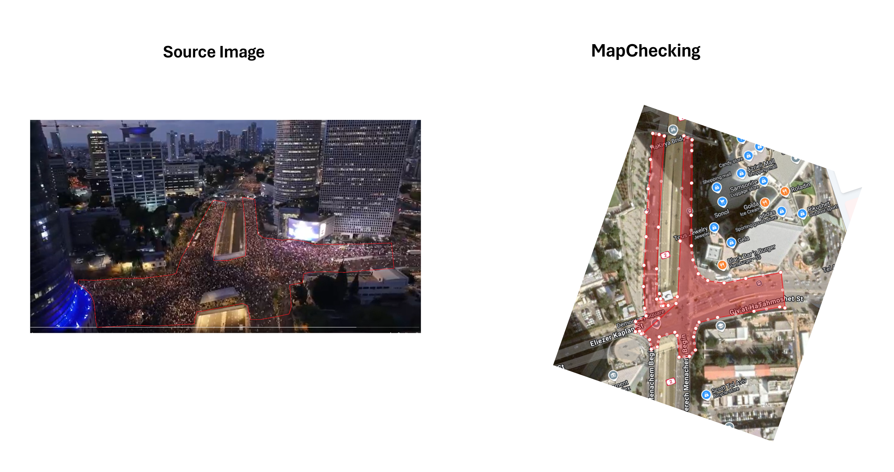

# MapChecking

## URL

[https://www.mapchecking.com/](https://www.mapchecking.com/)

## Description

This tool helps users estimate the maximum number of people standing in a particular area. MapChecking is a crowd-counting tool designed to assist in visualizing and analyzing the area covered by a specific event or situation, typically protests, demonstrations, or other gatherings, whether ongoing or planned. The tool allows users to input parameters such as the area being analyzed, the shape of the area (by drawing a polygon), and the estimated density of the crowd.

Based on the steps below, MapChecking can calculate the estimated density of participants in the overall space they cover on a map. The tool allows users to do all the steps on one webpage.&#x20;

1. Input Location
2. Draw a Polygon and Map Visualization
3. Matching and Double-Checking
4. Determine Crowd Density Per Square Meter
5. Calculate Total Estimated Crowd Size

<figure><figcaption>
(Image source: Mapchecking.com) This shows a sample location using the tool. Users can delineate the area of interest using a polygon (shown here with a yellow shaded area). Users can view the area on the regular Google map overlay or satellite view. To the right of the map is a slider that users can drag to estimate the crowd density from "Light" to "Crowded" to "Packed". The total estimated number in black font changes as the slider moves. 
</figcaption></figure>

### Why is crowd counting important?&#x20;

The number of crowds can often be a [point of dispute ](https://apnews.com/general-news-f445adb3d0cf468ba0eb9caeab549577)between [participants and official statements](https://www.salon.com/2003/01/24/crowds/). Crowd sizes can also serve as evidence of how many people participated in a demonstration and [can be indicative of the significance](https://nixintel.info/osint/counting-crowds-in-public-spaces/) or reach of the event. Crowd counting is not only relevant for open source researchers. According to [this article](https://pmc.ncbi.nlm.nih.gov/articles/PMC10116033/), “\[e]stimation of crowd size for large gatherings is an indispensable metric for \[...] local authorities, and emergency management.”&#x20;

Traditional crowd counting methods are either[ less publicly available](https://pmc.ncbi.nlm.nih.gov/articles/PMC10116033/), such as entrance censors/turnstiles and ticket sales, or are a [tedious and time-consuming procedure](https://pmc.ncbi.nlm.nih.gov/articles/PMC10116033/) that includes cumbersome manual processes, such as using people counters.

For this reason, open-source investigators may find MapChecking a valuable tool for verification.&#x20;

### Here's how the tool generally works

For this tool description, we take the [protest in Tel Aviv on 1 September 2024](https://www.nytimes.com/2024/09/01/world/middleeast/israel-protests-hostages.html) as an example.

Our source image is a clip from a [video uploaded to X](https://x.com/BarakRavid/status/1830292233922482540). The post mentions "tens of thousands" of protesters in Tel Aviv.&#x20;

<figure><figcaption>
Image Source: <a href="https://x.com/BarakRavid/status/1830292233922482540">X</a>. The post mentions that tens of thousands of protesters came to the protest in Tel Aviv
</figcaption></figure>

### **STEP 1: Input Location**


It is helpful if the location you put in the tool is **already geolocated/verified.**&#x20;


Input the address of an already verified location into the map interface. For simplicity, we will use only the image above of the event to demonstrate the tool’s features. However, you must conduct due diligence by reviewing multiple images of the event you are investigating.&#x20;

We geolocated this area and found it in Democracy Square in Tel Aviv, at the intersection of Eli'ezer Kaplan Street and Giv'at HaTah̠moshet Street. The coordinates are 32.073368, 34.790295.&#x20;


NOTE: Placing the coordinates on the map does not seem to work during testing in both Firefox and Chrome. Use the street address instead to find the location in question.



**TIP: Why is it important to look at multiple images?**

When analyzing images, especially those depicting large crowds, combining multiple source images taken from different angles is often beneficial. This helps capture the full scope of the event and avoid blind spots caused by obstructions.

_Remember:_ Even with combined images, obstructions like buildings or bridges can limit visibility. Always be mindful of these factors and consider the potential limitations of the visual data.


### **STEP 2: Draw A Polygon and Map Visualization**

The next step is to delineate the area of interest by drawing a polygon. The defined area is automatically overlaid on a map.

<figure><figcaption>
This is the location of the protests. The red-shaded area shows where crowds have gathered based on our source image. For accuracy, we exclude areas within our blind spots or those for which we don’t have complete visibility.
</figcaption></figure>

### **STEP 3: Matching and Double-checking**

Double-check whether your area of interest in the source image matches the polygon drawn within the MapChecking tool. To do so, you can draw a polygon on the source image in a separate program and put both pictures next to each other (as shown in the picture below).

<figure><figcaption>
On the left is the<a href="https://x.com/BarakRavid/status/1830292233922482540"> source image</a> overlaid with a polygon using Paint, and to the right is the polygon drawn utilizing MapChecking. The right image is rotated to approximate the perspective as shown in the source image. 
</figcaption></figure>

### STEP 4: Determine Crowd Density Per Square Meter

The next step consists of estimating crowd density per square meter, which helps determine the total estimated number of people in a specific area. Does the crowd appear light, crowded or packed?

First, it can help to gather reference images. Find close-up crowd photos. If possible, look for high-resolution images or verified footage from the event that show the crowd density up close. This helps assess how packed each section is.

Second, compare that same close-up reference image to the visual guides the tool provides. This step may sound complicated at first, but fortunately, users can utilize resources like the research by Keith Still (linked below). These guides show what different crowd densities may look like (e.g., 1 person per square meter, 2 people per square meter).

<figure><figcaption>
To find the reference guides on what the crowd density may look like, click on either link to have an idea of how packed the event in question is. Use these guides to make comparisons with the image from your protest. 
</figcaption></figure>


Note: [This link](https://www.gkstill.com/Support/crowd-density/625sm/Density6.html) can be used if you have a **"static" crowd** (mostly stationary). For **moving crowds** ("crowd flow"), users may use the reference on this link:[ https://www.gkstill.com/Support/crowd-flow/4People.html](https://www.gkstill.com/Support/crowd-flow/4People.html)&#x20;


Have a look at this [reference guide](https://www.gkstill.com/Support/crowd-density/CrowdDensity-1.html). Compare this to a clear photo of the reference image if possible from the event in question. Looking at both images can assist users in making estimations on crowd density.&#x20;

In this example, we used [drone footage from AP](https://youtu.be/KAOQ9MevvRU?feature=shared) (at 0:14 seconds), to find a clip that shows the density in the area we are interested in. By comparing Keith Still’s image reference, we concluded that the protest crowd maybe somewhere between 4 people per square meter and 4.5 people per square meter.&#x20;

Remember: Even with reference images, obstructions like buildings or bridges can limit your ability to see the entire crowd. Be mindful of these limitations when making your estimations.

### STEP 5: Calculate the Total Estimated Crowd Size&#x20;

The final step is to drag the "Crowd density" slider until it matches the estimated density as defined in the previous step. In this case, we drag the slider to around 4.25 people per square meter since the estimated crowd density is somewhere between 4 and 4.5 square meter.&#x20;

The estimated total crowd count for the area of interest is 57,917 (shown in bold letters on the tool).


NOTE: The total estimate changes, as the crowd density slides from light to crowded to packed. Keep in mind that an ultra-precise count will not be possible with this tool.&#x20;


<figure><figcaption>
The final step is dragging the slider (shown in the orange circle) between the different crowd density options. When dragging the slider to "Packed", users can see that the density per square meter is 4.25 (shown in the yellow rectangle) which matches our STEP 4 estimate. 
</figcaption></figure>

You can also read through Nixintel's article [Counting crowds in public spaces ](https://nixintel.info/osint/counting-crowds-in-public-spaces/)to see how MapChecking was used to estimate the crowds of the same protest independently from (and before) our own test.&#x20;

## Cost

* [x] Free
* [ ] Partially Free
* [ ] Paid

## Level of difficulty

<table><thead><tr><th data-type="rating" data-max="5"></th></tr></thead><tbody><tr><td>1</td></tr></tbody></table>

## Requirements

1. Internet Connection
2. Modern browser

## Limitations

_Field of View Restrictions_

The tool works better if you can clearly delineate the area visible in the image. There could be more people outside the camera's view or areas where the camera did not pan. Any such exclusions should be clearly mentioned.

_Snapshot in Time_

The estimate is only valid for the specific point in time when the image was captured. Any changes in crowd size or movement before or after that moment are not reflected.

_Static vs. Dynamic Crowds_

&#x20;The tool is less effective for[ dynamic or moving crowds ](https://www.aware-online.com/en/calculate-the-number-of-people-during-a-demonstration/)since crowd locations can shift rapidly. It works best when counting static crowds at a given moment.  \
&#x20;                                                                                                                                                                                    _Uneven Crowd Density_

Crowd density [is not uniform](https://www.aware-online.com/en/calculate-the-number-of-people-during-a-demonstration/) across all areas of an image. Some patches may have fewer people, while others may be densely packed. As seen in the source image above, there are patches in the protest area that are loosely packed and there are patches that are fully packed. For greater accuracy, it may be beneficial to draw separate polygons for areas with lower and higher crowd densities.

## Ethical Considerations

Exclusions for Low Visibility Areas: Certain areas of the source image may have low visibility or fewer people, which can affect the overall count. Highlighting these areas can improve the transparency of the estimate.

Transparency in Methodology: It is essential to be transparent about the limitations of the tool, especially regarding its reliance on clear images and fixed points in time. Users must communicate that the estimate provided is based on specific conditions and may not reflect the total count, particularly if areas are outside the camera's view or are affected by poor visibility.

Accuracy and Validation: Ethical use of MapChecking requires combining it with multiple methods and sources to arrive at a more accurate estimate. Relying solely on one tool without cross-referencing other data (e.g., additional images, videos, or on-the-ground reports) may lead to underestimating or overestimating crowd sizes.

Dynamic Nature of Crowds: Since crowds are dynamic and people move around, counting static points may not capture the real-time fluctuations of the crowd size. Ethical considerations require informing users and stakeholders that the count is a snapshot in time and may not fully reflect the dynamic nature of demonstrations or events.

Density Variability: Since crowd density is not uniform ethical practice encourages users to analyze density variations carefully and to provide separate estimates for different areas where appropriate.

Possibility of Misrepresentation: In the context of politically sensitive events, such as demonstrations, overestimating or underestimating crowd sizes can have significant implications. Ethical use of Mapchecking is encouraged.&#x20;

## Guides and articles

Nixintel: [Counting crowds in public spaces](https://nixintel.info/osint/counting-crowds-in-public-spaces/).

Aware Online: [Calculate the number of people during a demonstration](https://www.aware-online.com/en/calculate-the-number-of-people-during-a-demonstration/).

## Tool provider

[Anthony Catel](https://github.com/paraboul), France&#x20;

## Advertising Trackers

* [x] This tool has not been checked for advertising trackers yet.
* [ ] This tool uses tracking cookies. Use with caution.
* [ ] This tool does not appear to use tracking cookies.

| Page maintainer |
| --------------- |
| Afton           |
