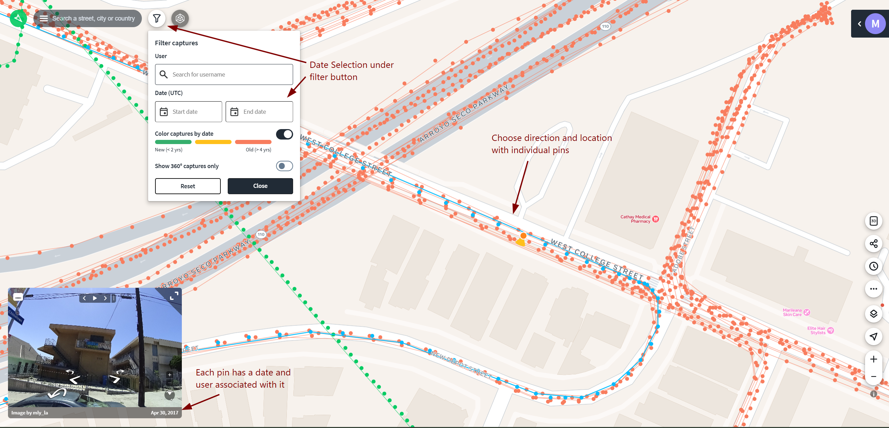
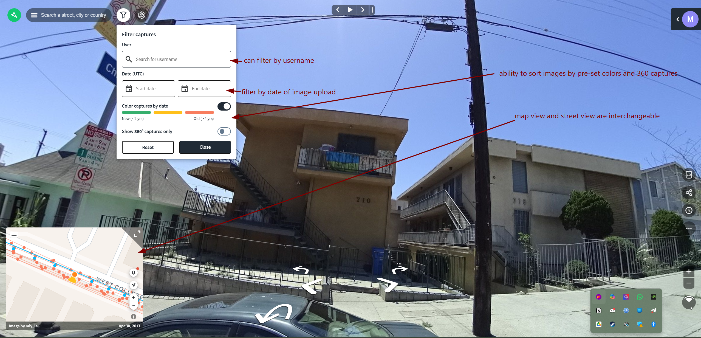

# Mapillary

## URL

[https://www.mapillary.com/](https://www.mapillary.com/)

## Description

Mapillary is a crowdsourced street-level imagery platform where users upload photos and videos from around the world to build a global visual map. It’s especially useful in places where traditional services like Google Street View don’t have good coverage.

The platform uses computer vision to process and organize the imagery, detecting things like road signs, infrastructure, and other objects. You can explore images by location, filter by date, and search for specific features, which makes it a useful tool for geolocation and verification work.\
\
The primary use for Mapillary is geolocation, where users identify the location of an image by matching visible features (buildings, road signs, terrain) with known locations. For a detailed explanation of this method, see [this](https://www.bellingcat.com/resources/how-tos/2014/07/09/a-beginners-guide-to-geolocation/) guide from Bellingcat.

Mapillary allows users to filter imagery by date and detected features (streetlights, traffic signs, CCTV cameras). When selecting an image, metadata such as the capture date is displayed, allowing users to understand when the imagery was taken.

Users can also navigate through image sequences or switch between nearby captures from different dates to compare how a location has changed over time. This is especially useful for identifying when certain features appeared or were modified.

<figure><figcaption></figcaption></figure>

<figure><figcaption></figcaption></figure>

Available in the following formats:

* Web
* Mobile
*   Mapillary also provides command-line tools and desktop uploaders for users who want to upload larger image datasets or automate the process.

    The command-line interface (CLI) allows users to upload images in bulk, manage sequences, and integrate uploads into automated workflows. This is particularly useful for processing footage from dashcams or action cameras.

    The desktop uploader offers a more user-friendly interface for uploading and reviewing images before submission.\
    [https://github.com/mapillary/mapillary\_tools](https://github.com/mapillary/mapillary_tools)\
    [https://www.mapillary.com/desktop-uploader](https://www.mapillary.com/desktop-uploader)

<figure><figcaption>
Mapillary interface showing dense coverage of user-contributed street-level imagery in Amsterdam. The green lines represent image sequences captured along roads, while the individual points indicate specific image locations. Colored icons highlight automatically detected features (e.g. traffic signs, infrastructure), demonstrating how Mapillary uses computer vision to extract searchable objects from imagery. The preview window (bottom left) shows a selected image from the dataset.
</figcaption></figure>

### **Example Use Cases**

Online Open Source Investigators can leverage Mapilliary in numerous ways:

*   **Geolocation: Geolocation:** The primary use for Mapillary is geolocation, where users identify and confirm the location of an image or video by comparing visible details (buildings, road signs, street layout, infrastructure) with Mapillary imagery.

    Users can match features from a photo they have to what appears in Mapillary, such as the shape of intersections, placement of signs, or nearby landmarks, to narrow down and confirm the exact location.
* **Fact-Checking:** Mapillary can also serve as a tool for fact-checking statements or claims about specific locations. Open source researchers can verify the existence of certain buildings, street signs, or other landmarks to authenticate claims.

## Cost

* [x] Free
* [ ] Partially Free
* [ ] Paid

Mapillary is completely free for all users, including commercial use. After Meta's acquisition in 2020, the platform eliminated its paid tier and made all imagery available for both non-commercial and commercial purposes at no cost. API access is also free but subject to rate limits\
[https://blog.mapillary.com/news/2020/06/18/Mapillary-joins-Facebook.html](https://blog.mapillary.com/news/2020/06/18/Mapillary-joins-Facebook.html)

## Level of difficulty

<table><thead><tr><th data-type="rating" data-max="5"></th></tr></thead><tbody><tr><td>1</td></tr></tbody></table>

## Requirements

* **Web**: Any modern web browser can be used to access Mapillary. While the map can be explored without an account, creating an account (requires an email address) allows users to upload imagery, save contributions, and access additional features such as managing image sequences and using developer tools.
* **Mobile**: Android and iOS

## Limitations

Mapillary, while providing an extensive database of street-level imagery, Mapillary carries certain limitations that researchers and users must be aware of:

* **Coverage Gaps**: Not all locations are equally covered. Remote or less-traveled areas may have sparse or outdated imagery. For instance, [The State of Mapillary: An Exploratory Analysis](https://www.mdpi.com/2220-9964/9/1/10) found data coverage showing less contributor inequality than in OpenStreetMap but significant seasonal variation.
* **Data Accuracy**: Like other crowdsourced platforms, Mapillary may contain inaccuracies that researchers should be aware of. In some cases, images can be incorrectly geotagged or placed slightly off their true location, which can affect geolocation if not verified with additional sources (for instance, [Cleaning up Mapillary Coverage](https://forum.mapillary.com/t/cleaning-up-mapillary-coverage/5487)).
* **Image Quality**: The quality of the images can vary significantly depending on the equipment used and the conditions at the time of capture.
* **Data Freshness**: The platform may not have up-to-date imagery for all locations, which can impact the relevance of the data for certain applications (see Coverage Gaps).
* **Processing Delays**: Due to the need for privacy filtering and data processing, there is a delay between when images are uploaded and when they are visible on the platform, see [Troubleshoot image processing delays and failed sequences](https://help.mapillary.com/hc/en-us/articles/4408023385874-Troubleshoot-image-processing-delays-and-failed-sequences).
* **API Rate Limits**: The use of Mapillary's API is subject to rate limits, which can affect how quickly and extensively data can be accessed for projects (see: [https://www.mapillary.com/developer/api-documentation#rate-limits](https://www.mapillary.com/developer/api-documentation#rate-limits)).

## Ethical Considerations

When embedding or using data from Mapillary, several ethical considerations should be taken into account:

* **Privacy Concerns**: Images on Mapillary may include individuals or property inadvertently, despite efforts to blur faces and license plates. Consider the impact of sharing such images especially in sensitive or private areas.
* **Data Usage**: Understand and respect the terms of use set by Mapillary regarding how their data can be used, especially for commercial purposes. Misusing the data could have legal and ethical implications, see [Mapillary Vistas Dataset](https://www.mapillary.com/dataset/vistas) and the [Attribution-NonCommercial-ShareAlike 4.0 International License](https://creativecommons.org/licenses/by-nc-sa/4.0/).
* **Bias in Data**: Acknowledge any potential bias in the geographic coverage and content of the images. Some areas may be over-represented while others are under-represented, which could affect the fairness and inclusivity of projects using Mapillary data. For a general overview of bias in crowd sourced applications like Mapillary see [Crowdsourced geospatial data quality: challenges and future directions](https://www.tandfonline.com/doi/full/10.1080/13658816.2019.1593422).

It's important to weigh these considerations carefully and engage in best practices to mitigate any potential harm.

## Guide

To effectively use Mapillary, especially for beginners or those looking to refine their skills, the following resources are highly recommended:

#### Official Wiki

* [Mapillary Help Centre](https://help.mapillary.com/)

#### Articles

* Team, B.I. (2022) _Unravelling the Killing of Shireen Abu Akleh_, _bellingcat_. Available at: [https://www.bellingcat.com/news/mena/2022/05/14/unravelling-the-killing-of-shireen-abu-akleh/](https://www.bellingcat.com/news/mena/2022/05/14/unravelling-the-killing-of-shireen-abu-akleh/) (Accessed: 6 April 2024).
* Fiorella, G. (2020) _Geolocating Venezuelan Lawmakers In Europe_, _bellingcat_. Available at: [https://www.bellingcat.com/news/2020/01/21/geolocating-venezuelan-lawmakers-in-europe/](https://www.bellingcat.com/news/2020/01/21/geolocating-venezuelan-lawmakers-in-europe/) (Accessed: 6 April 2024).

#### Video Tutorials

* [_Mapillary YouTube channel_](https://www.youtube.com/@Mapillary)

#### Community and Support

* [Mapillary Community](https://forum.mapillary.com/)

## Tool provider

Meta [https://about.meta.com/](https://about.meta.com/) - United States (Mapillary AB, based in Malmö, Sweden acquired by Meta Platforms in 2020)

## Advertising Trackers

* [ ] This tool has not been checked for advertising trackers yet.
* [x] This tool uses tracking cookies. Use with caution.
* [ ] This tool does not appear to use tracking cookies.

| Page maintainer |
| --------------- |
| Arsen Drobakha  |
