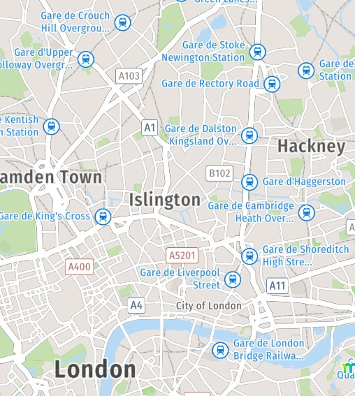

# Mappy

## URL

[https://fr.mappy.com/](https://fr.mappy.com/) - French (and main) version.

[http://en.mappy.com/](http://en.mappy.com/) - English version.

## Description

Mappy is a mapping and route-planning service for locations in Europe, including the UK. Mappy is available in French, English and Dutch, with versions tailored for France, the UK, and Belgium. The French version of the app is significantly more detailed than the others.

Mappy augments route planning for car journeys with real-time traffic information. Users can also view [control zones](#user-content-fn-1)[^1], tolls and speed camera locations. Mappy allows users to view the fastest, shortest, and usual (for regular users) itinerary to their destination.

Mappy has a detailed inventory of roads across rural France, coined by some users as more accurate than Google maps, particularly for remote areas.

Mappy is available on desktop and as an app for Android and iOS devices.

Mappy has an [online blog](https://blog.mappy.com/) with resources and tips available for users. It includes tutorials on using some of the app's features, tourism resources, and news related to traffic regulation in France. The blog is currently only available in French.

## App features

#### Route planning and directions

Mappy's route planning option (accessible through the "directions" tab) allows the user to select destination, mode of transport, transport details (e.g. vehicle type and fuel usage, walking pace, bicycle speed, etc.). Users can also select the date and time of travel, to ensure accuracy of traffic predictions, public transport timings, or opening of certain roads.

<figure><figcaption></figcaption></figure>

For the selected route, Mappy rovides several options of different itineraries, with options to avoid tolls or prioritise certain types of roads (regional or local roads, toll-free, cycling lanes, etc.).&#x20;

#### Mapping and street view

Through the "maps" tab at the bottom right of the app, users can select from different map views, including classic, simple, nature, satellite, and night view. This allows users to access the different layers of mapping that Mappy offers.

Users can also view real-time traffic information, location of cycling lanes, and public transport links. This feature is more extensively developed for France, than for other locations in Europe.

<figure><figcaption></figcaption></figure>

Mappy also has a street view option in some larger cities in France, including Paris, Lyon, Bordeaux, Marseille, etc. This option is available through the "immersive view" icon at the bottom right.&#x20;

However, the street view option is not available for many of the locations in which Mappy operates. Most locations in France do not have a street view option on Mappy, and no location outside of France does.

<figure><figcaption></figcaption></figure>

#### Sights and services

The app developers have recently introduced a feature to look up sights and services on a map. It allows users to look for hotels, restaurants, leisure spots, shops and other services, using the French version of the app only.

<figure><figcaption></figcaption></figure>

## Cost

* [x] Free
* [ ] Partially Free
* [ ] Paid

## Level of difficulty

<table><thead><tr><th data-type="rating" data-max="5"></th></tr></thead><tbody><tr><td>1</td></tr></tbody></table>

## Requirements

None. The Mappy app is available for Android and iOS devices, and on desktop. While Mappy is available in French, English and Dutch, the full capacities of the app require French language skills.

## Limitations

#### Geographic coverage

Mappy is only available in Europe - for example, addresses in the US resulted in the city but not the location, and addresses in Mexico did not produce any result. While Mappy has a strong inventory of roads in France, particularly in rural areas, its capacity is weaker in other areas, including other European countries it operates in.&#x20;

Some features of the app, including selecting the "Crit'air" sticker of the vehicle, are only relevant for France, although they appear in other European locations covered by Mappy.

<figure><figcaption></figcaption></figure>

#### Language

Some of Mappy's features appear in French, even in the English language version of the app. This makes full usage of Mappy more challenging for non-French speakers.

<figure><figcaption></figcaption></figure>

#### Street view availability

On Mappy, street view remains quite limited. It is only available for selected main cities in France and not across the country, or in other locations that Mappy operates in. In addition and contrary to other mapping services such as Google maps, the street view function does not allow the user to see the date when the imagery was taken.

#### Services availability

Mappy's recently introduced feature to look for sights and services, including shops, restaurants, hotels, or leisure spots, is not as comprehensive or extensive as that of other tools, including Google Maps. In addition, this feature is only available in the French version of the app, and only covers France, not the rest of Europe.

## Ethical Considerations

Mappy describes itself as "100% made in France which respects privacy." Mappy has a [data protection policy](https://blog.mappy.com/entreprise/conditions-dutilisations/vie-privee/), detailed on its website.

## Guide

[https://blog.mappy.com/](https://blog.mappy.com/)&#x20;

[https://faq.mappy.com/#at\_medium=self\_promotion\&at\_campaign=faq\_web](https://faq.mappy.com/#at_medium=self_promotion\&at_campaign=faq_web)

## Tool provider

Mappy's parent company is Mappy S.A., a technological services company based in France.

## Advertising Trackers

* [ ] This tool has not been checked for advertising trackers yet.
* [x] This tool uses tracking cookies. Use with caution.
* [ ] This tool does not appear to use tracking cookies.

| Page maintainer           |
| ------------------------- |
| Justine Van Bloeme.       |
| Last updated August 2026. |

[^1]: A control zone is a regulated section of a road, where drivers are alerted that speed radars or police checks may be present.
