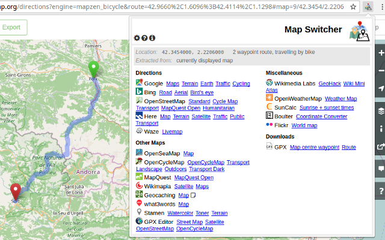
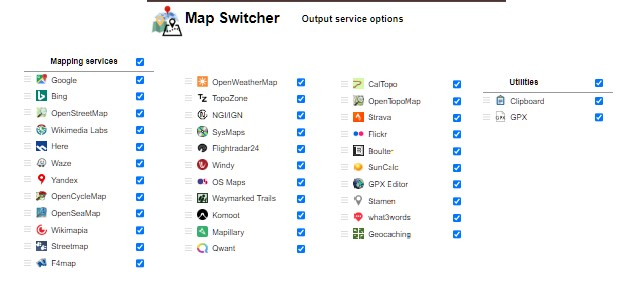
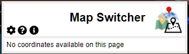

# MapSwitcher

## URL

Read details here: [**https://github.com/david-r-edgar/MapSwitcher**](https://github.com/david-r-edgar/MapSwitcher)

or download the extension from the [Chrome Store here](https://chrome.google.com/webstore/detail/map-switcher/fanpjcbgdinjeknjikpfnldfpnnpkelb)

## Description


This article describes the MapSwitcher extension for the Google Chrome browser and should not be confused with another tool of the same name for Firefox browser, developed by [František Nesveda](https://addons.mozilla.org/mk/firefox/user/15224571/) which can be found here [https://addons.mozilla.org/mk/firefox/addon/map-switcher/](https://addons.mozilla.org/mk/firefox/addon/map-switcher/)


<figure><figcaption>
<strong>THE MAPSWITCHER EXTENSION MENU OVER A GOOGLE CHROME BROWSER PAGE</strong>
</figcaption></figure>

MapSwitcher is an extension for the Google Chrome browser, which can be downloaded from the [Google Chrome Store](https://app.gitbook.com/o/WQpOq5ZFue4N6m65QCJq/s/wj16aeUeCQ32BThaGKHz/). It aids Open Source research by assisting users to switch their focus of study from one geographical data app to another, whilst migrating the same location co-ordinates between apps. General aspect is also preserved as far as possible, i.e. zoom, direction, etc.

This benefits of MapSwitcher for Open Source research are mainly:

* **Accuracy:** Human error when handling copy and paste of system co-ordinates between apps is largely eliminated by using MapSwitcher.
* **Efficiency:** Research work can be performed more quickly when transfer between apps is automated using MapSwitcher.
* **Quality:** Where MapSwitcher makes it easy for researchers to switch quickly and accurately between apps, they are more likely to check their work using more than one system, which generally leads to more accurate results.


The list of different geographical data platforms which can be used with MapSwitcher is growing all the time. You can check the current status of any app you're interested in, either from the extension itself if you have it installed, or here on the [Github page for MapSwitcher](https://github.com/david-r-edgar/MapSwitcher). The list as of May 2024 is show below as an example, but this will not remain definitive:


<figure><figcaption>
<strong>MAPSWITCHER OUTPUT SERVICE OPTIONS AS AT MAY 2024 - CHECK THE LINK ABOVE FOR CURRENT STATUS</strong>
</figcaption></figure>


Currently MapSwitcher is only available for Chrome Browser, but its author, [David R Edgar](https://david-r-edgar.uk/projects.php), planned future versions for Firefox and Microsoft Edge. It is, however, possible to install Chrome Browser extensions on Microsoft Edge, although they may not be thoroughly tested on Edge, for instructions, see explanatory article ["How To Install Chrome Extensions in Microsoft Edge Browsers"](https://medium.com/@mariusbongarts/how-to-install-chrome-extensions-in-microsoft-edge-browsers-65914eb61d6)


## Cost

* [x] Free
* [ ] Partially Free
* [ ] Paid

## Level of difficulty

<table><thead><tr><th data-type="rating" data-max="5"></th></tr></thead><tbody><tr><td>2</td></tr></tbody></table>

The most difficult part of using MapSwitcher is its installation as a Chrome Browser Extension, if you have not done this kind of installation before.

## Requirements

The Google Chrome browser must already be installed to allow the user to add MapSwitcher as an extension. There is no account necessary to use MapSwitcher over and above what is necessary to use Google Chrome browser.

## Limitations

MapSwitcher is limited to the Chrome Browser, and to the list of apps provided for each, which is a good spread of commonly-used Open Source research mapping tools, but by no means exhaustive.

If you try to use MapSwitcher on an app for which is not on its input/output list you will see the following message:

<figure><figcaption>
MAP SWITCHER MESSAGE WHEN SWITCHING IS NOT POSSIBLE
</figcaption></figure>

**Technical Limitations on Switching Performance:**

* Where directions are specified by address (not coordinates), different services can geocode these in radically different ways. So the routes may not start or finish where they did on the input mapping service.
* Zoom / scale may not always be exact, depending on the limitations of the input & output map services
* Directions handle multi-segment routes (with intermediate specified locations) where possible. Only some services (Google, Microsoft) support this. In these cases, output services which only support single segments will show maps from the first location to the last location.
* The Waze app may fail to handle zoom.

## Ethical Considerations

MapSwitcher use involves the ethical considerations surrounding the constituent mapping tools between which it interfaces.

## Guides and articles

GitHub user and developer details: [https://github.com/david-r-edgar/MapSwitcher](https://github.com/david-r-edgar/MapSwitcher)

## Tool provider

[David R Edgar](https://david-r-edgar.uk/projects.php) 's source code for Map\_Switcher can be found on GitHub - see above.

## Advertising Trackers

* [x] This tool has not been checked for advertising trackers yet.
* [ ] This tool uses tracking cookies. Use with caution.
* [ ] This tool does not appear to use tracking cookies.

| Page maintainer: |
| ---------------- |
| Sophie Tedling;  |
|                  |
