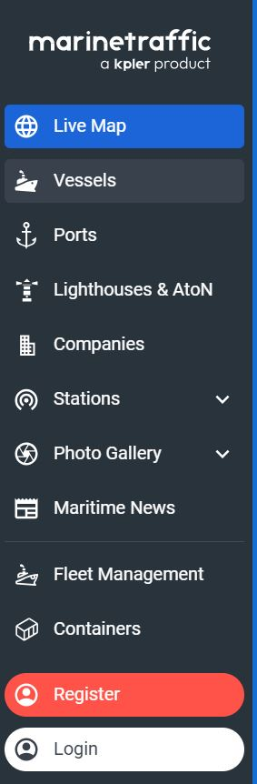

# MarineTraffic

## URL

[https://marinetraffic.com/](https://marinetraffic.com/)

## Description

<figure><figcaption></figcaption></figure>

&#x20;The app is accessible both on mobile devices and desktop platforms, ensuring that users can monitor marine traffic on the go or from the comfort of their home or office. The map-based interface  allows users to zoom in and out seamlessly to view vessel movements in specific areas or globally. The search function is robust, enabling users to find ships, ports, and maritime locations quickly.

**Features**

1. **Real-Time Tracking**: The app provides live tracking of vessels, showing their current positions, course, speed, and other relevant data. This is particularly useful for maritime professionals who need to keep tabs on fleet movements.
2. **Comprehensive Database**: With information on millions of ships, ports, and maritime structures, Marine Traffic boasts one of the most extensive maritime databases available. Each vessel's profile includes detailed specifications, voyage history, and even photos.
3. **Alerts and Notifications**: Users can set up customized alerts for specific ships, ports, or regions. This feature ensures that users are notified about significant movements or events, such as a vessel arriving at a port or deviating from its course.
4. **Historical Data and Playback**: For those needing to analyze past movements, Marine Traffic offers access to historical data and playback functionality. This is valuable for logistics planning, incident investigation, and maritime research.
5. **Weather Overlay**: The app integrates weather data, providing insights into sea conditions that could affect maritime operations. This feature helps users anticipate and mitigate potential risks related to adverse weather conditions.
6. **User Community and Contributions**: Marine Traffic has a strong user community that contributes to the accuracy and richness of the data. Users can upload photos, update vessel information, and share insights, enhancing the app's collaborative value.

The app sources data from a network of AIS (Automatic Identification System) receivers, satellite AIS, and dynamic data from its user community. While the free version of the app provides substantial information, the premium subscription offers additional features like advanced filtering, detailed reports, and enhanced tracking capabilities, which are particularly beneficial for commercial users.

**Areas for Improvement**

Despite its strengths, there are a few areas where Marine Traffic could improve:

*

## Cost

* [ ] Free
* [x] Partially Free
* [ ] Paid

\[\[Pricing or subscription information, if relevant.]]

## Level of difficulty

<table><thead><tr><th data-type="rating" data-max="5"></th></tr></thead><tbody><tr><td>1</td></tr></tbody></table>

## Requirements

\[\[Information on the requirement for using a tool, for instance, API key, e-mail address etc.]]

## Limitations

MarineTraffic's data is AIS signals. Since AIS transponders can be, and are, switched off by vessels which want to avoid tracking, the user needs to become familiar with this trait and work around it where necessary.

* **Pricing**: Some users may find the premium subscription plans expensive. Offering more flexible pricing tiers or additional features in the free version could make the app more accessible.
* **Offline Access**: While the app requires an internet connection for real-time updates, providing more robust offline capabilities could benefit users operating in areas with limited connectivity.

## Ethical Considerations

*

\[\[The ethical considerations of each tool should be described.]]

## Guides and articles

\[\[Link to guides on this tool and to articles on research that was done with the help of this tool]]

## Tool provider

\[\[Name the tool provider (and potentially info on them)]]

## Advertising Trackers

* [x] This tool has not been checked for advertising trackers yet.
* [ ] This tool uses tracking cookies. Use with caution.
* [ ] This tool does not appear to use tracking cookies.

| Page maintainer                                                |
| -------------------------------------------------------------- |
| \[\[Your name here (optional) or "Bellingcat volunteer team"]] |
|                                                                |
