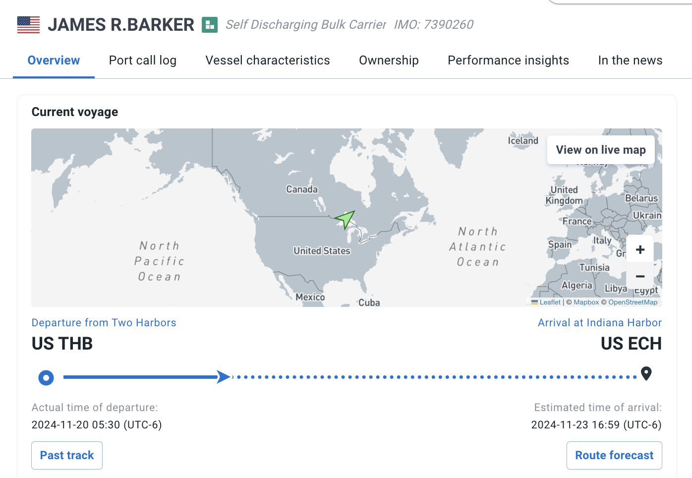
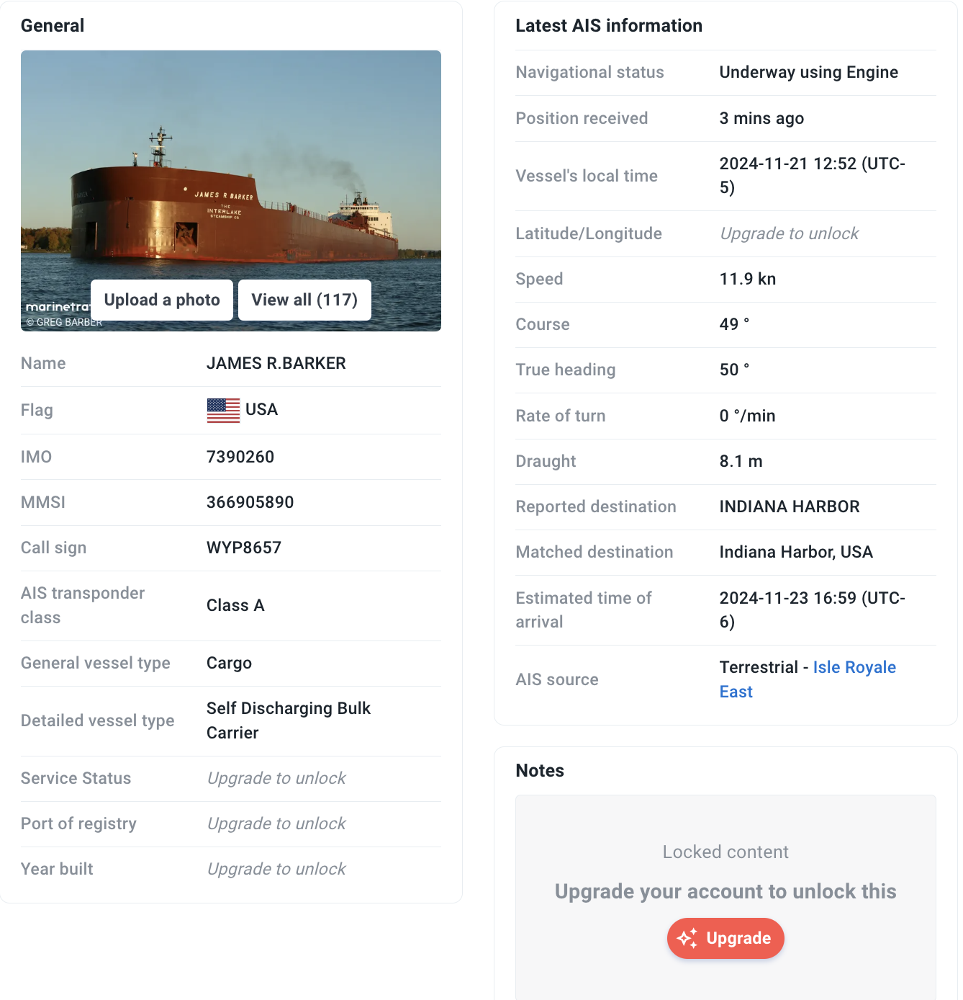
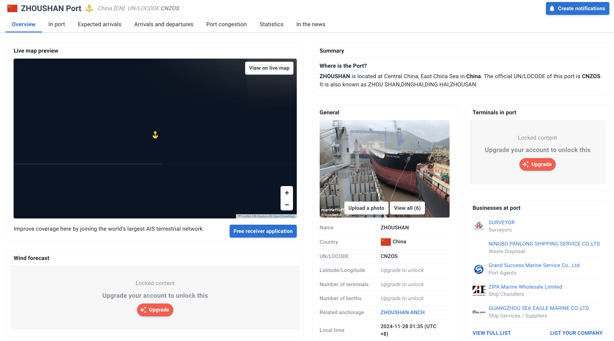
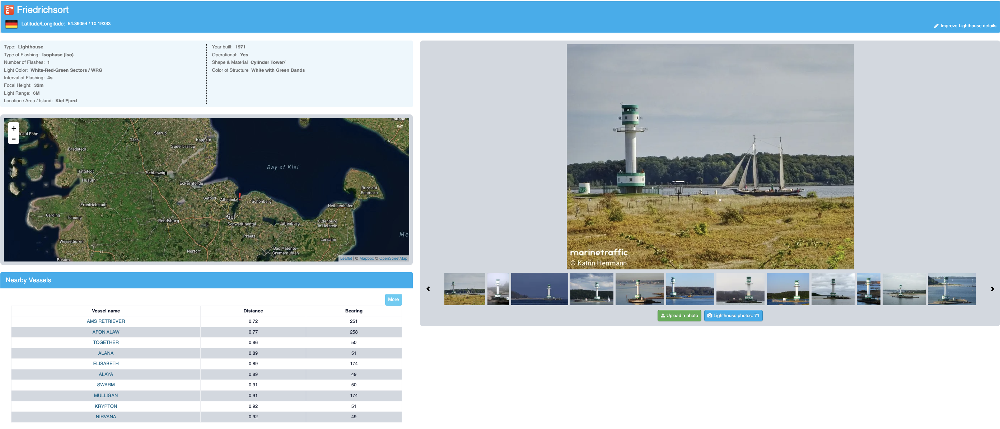

# MarineTraffic

## URL

[https://marinetraffic.com/](https://www.marinetraffic.com/en/ais/home/centerx:25.0/centery:-34.5/zoom:8)

## Description

The MarineTraffic website and mobile app offer near real-time tracking of vessels and can be used to monitor marine traffic in general or of a particular vessel of a custom fleet. It has a map-based interface with search, filtering and map layers functions for vessels, ports and traffic.

It can be used without an account to just monitor general vessel movements and point and click a specific vessel, but creating a free account will unlock some additional useful features.

After creating an account, users can access a search portal to search for vessels by name, IMO or MMSI number, tonnage, flag, dimensions, etc., which can help to identify a vessel for which only some identifying information is known.


IMO numbers are unique, seven-digit tracking numbers assigned to ships and shipping companies by S\&P Global Market Intelligence on behalf of the International Maritime Organization. Unlike ship names and company names which can change, IMO numbers remain constant. More information about IMO numbers can be found on the [International Maritime Organization's website](https://www.imo.org/en/OurWork/IIIS/Pages/IMO-Identification-Number-Schemes.aspx).

MMSI (Maritime Mobile Service Identities) numbers are nine-digit numbers used to uniquely identify ships in radio and AIS (Automatic Identification System) broadcasts. MMSI numbers are issued by the country a ship is flagged to and managed by the International Telecommunications Union. More information about MMSI numbers can be found on the [International Telecommunications Union's website](https://www.itu.int/en/ITU-R/terrestrial/Pages/by-categories-faq.aspx?categorizedby=17).


**Main desktop & in-app menus**


NOTE: The below menus are only accessible after creating an account and logging in.


[Live Map](https://www.marinetraffic.com/en/ais/home/centerx:-18.6/centery:28.9/zoom:6): The world map with roughly [550,000 vessels that MarineTraffic monitors](https://www.marinetraffic.com/en/ais/index/ships/nearby/shipid:188058/mmsi:235007275/%D8%9E) and has in its database shown on the map. Just point and click on a vessel to see basic information. Be aware that if a vessel is outside of coastal AIS range, the only information shown with a free plan account is its type (i.e. cargo, passenger, tanker vessel) and its name.


Click anywhere on the map to view the exact coordinates,


[Vessels](https://www.marinetraffic.com/en/data/?asset_type=vessels\&columns=flag%2Cshipname%2Cphoto%2Crecognized_next_port%2Creported_eta%2Creported_destination%2Ccurrent_port%2Cimo%2Cship_type%2Cshow_on_live_map%2Ctime_of_latest_position%2Clat_of_latest_position%2Clon_of_latest_position%2Cnotes): This menu moves away from the map to show a list of all vessels in MarineTraffic's database and a search bar that allows searching by vessel name, MMSI, IMO or callsign. Once a vessel is selected, you can access some basic information. More useful data like its port call logs, characteristics and ownership are only available through a paid plan.

<figure><figcaption>
A detailed view for the vessel James R. Barker - its current voyage as of November 20, 2024 with place of departure and its final destination for this trip
</figcaption></figure> <figure><figcaption>
A detailed view for the vessel James R. Barker - IMO and MMSI numbers, its call sign, the type of vessel, speed and draught (the determined depth of the vessel below the waterline, measured vertically to its hull's lowest)
</figcaption></figure>

This vessel view also has two shortcuts to follow a ship's past track (selecting this will return to the map and show this exact vessel's recent movements) for the past \~4 days. Custom past track dates are available through a paid subscription. Another shortcut that also returns the user to the main map is the route forecast, but free predictive routes are only shown for a 24-hour future period and again custom past track dates are available through a paid subscription.

In the main menu, you can select for free up to five vessels and add them to a custom fleet that you can track over time.

[Ports](https://www.marinetraffic.com/en/data/?asset_type=ports\&columns=flag,portname,unlocode,photo,vessels_in_port,vessels_departures,vessels_arrivals,vessels_expected_arrivals,local_time,anchorage,geographical_area_one,geographical_area_two,coverage): A list of over 20,887 ports, anchorages, offshore terminals, marinas, canals, shelters, fishing harbors and shelters including description of the port, its location, information on the number of arrivals and departures in the past 24 hours, as well as the number of vessels currently anchored there, the number of expected arrivals and the local time of the port. Use the search bar to locate a specific port using a name or a United Nations Code for Trade and Transport Locations - LOCODE (a geographic coding scheme developed and maintained by the UN Economic Commission for Europe, the code consists of five letters with the first two designating the country, e.g. ESADR is the LOCODE for Port of Adra in Spain).

Full list of LOCODEs by country

The full list can be found on the [United Nations Economic Commission for Europe (UNECE) website](https://unece.org/trade/cefact/unlocode-code-list-country-and-territory). By selecting a country, the system displays the entire UN/LOCODE list of subdivisions, i.e. the country, the port names and their coordinates.

The list allows obtaining the UN/LOCODE Code List 2024-1 for each country or territory. The latest version was published in July 2024.

This menu also allows to search expected arrivals, arrivals and departures by a ship's name IMO or MMSI. A paid subscription also features looking up data on berth calls and port congestion.


Berth calls are events taking place in a port's berth, such as docking and undocking of vessels in them. There are various areas within the port, where vessels can dock.

Berths in ports are designated locations where a vessel can dock to load and unload cargo or passengers. Berths are designated by the management of a facility (e.g., port authority, harbor master). Vessels are assigned to berths by these authorities.


If you have a paid subscription, the Ports menu also offers information on port congestion, and the exact names of the ships expected to arrive or depart.

When you have selected a specific port, a new page opens with more details like photos and businesses located at the port. A paid subscription unlocks further details like number of terminals and berths, maximum deadweight, draught and length.

<figure><figcaption>
Detailed view on Zhoushan Port: its LOCODE, number of terminals and berths user-contributed photos.
</figcaption></figure>

[Lighthouses & AtoN](https://www.marinetraffic.com/en/data/?asset_type=lights\&columns=flag,light_name,photo,location,light_type,characteristic,year_of_build,operational): A list of 16,170 lighthouses and Aids to Navigation (AtoN or also known as NAVAID) with their key details. The list can be searched by name, and additional filters can be applied to list lights and AtoNs by area, country, type of light or flashing, whether it is operational, number of flashes and interval of flashing, light color and range, focal height, admiralty code and The Amateur Radio Lighthouse Society (ARLHS) code.


In an effort to be able to readily identify lights for amateur radio contact purposes, The Amateur Radio Lighthouse Society (ARLHS) created the [World List of Lights](http://wlol.arlhs.com/). WLOL contains information on 15,529 Lighthouses in 234 amateur radio call areas.

You can read more on AtoN [here](https://en.wikipedia.org/wiki/Navigational_aid) for basic understanding of the concept and why aids of navigation are important for ships [here](https://www.marineinsight.com/marine-navigation/virtual-aids-of-navigation-are-important-for-ships/).


<figure><figcaption>
Detailed view of the Friedrichsort lighthouse, including photos and details on the color, shape and material of the construction.
</figcaption></figure>

[Companies](https://www.marinetraffic.com/en/maritime-companies/search): a list of 53,827 companies that are related in some way to doing business in ports, or provide maritime-related services. The companies are searchable by name and are categorized based in the sector they operate in. The business directory aims to give suppliers exposure to maritime professionals using MarineTraffic. This menu appears to be more B2B oriented and adds a pin for each listed business on the live map, as well as shows the business whenever a user is looking at port details or for a vessel that is nearby. It also appears participation in this is voluntary and anyone can list their business on the website.

A profile for a company gives contact information and address, years in business and the nature of business.

[Stations](https://www.marinetraffic.com/en/data/?asset_type=stations\&columns=country,station_name,status,last_signal,availability,max_distance,avg_distance,area_covered): A list of 5,644 AIS stations with details for each one, including status, last signal time, average and maximum reception distance in nautical miles, area covered, station elevation, who operates it, equipment description, statistics about the AIS message types and records received about vessels in the past hour. Youn can read additional details on this functionality [here](https://support.marinetraffic.com/en/articles/9552984-station-detail-page).

This menu also offers the opportunity to apply for free AIS-receiving equipment by filling out [this form](https://www.marinetraffic.com/en/join-us/free-receiver-application). Some conditions apply and it appears MarineTraffic may not approve an application if your specific area is already covered by at least one AIS receiver.

Photo gallery and Maritime News: This photo gallery is useful when you want to check the exterior of a ship, its main features, and equipment mounted on the deck. Photos can also be a good guide for approximating the size of a ship, if such information is not readily available. The news section's most handy use is to look up any current information on vessels and maritime accidents. Often the news piece might include additional information about a vessel, a location or a port that may not be available anywhere else on the website. It is also a one-stop shop for maritime news if you are doing some media monitoring on the topic.

**Main Map Features and Filters (located in the Live Map view)**

1. **Map Type**: A dark, light or a satellite view mode to suit preferences. Nautical charts are also available, but are paid.
2. **Vessel Filters**: Ship Type (filter by the function each vessels serves), Current Status (en route or anchored), Last Position Received (this requires a search for AIS stations), Voyage (paid feature for port of origin and port of destination), Capacity (paid feature for tonnage, deadweight), Smart Filters (paid feature for current operation and special conditions).
3. **My Fleets**: Filters out all the other vessels and shows only the ones added to a custom fleet.
4. **Layers**: This filter which is available with a paid subscription has meteorological, rescue, military, and piracy layers, areas of interest such as trade of offshore wind farm areas, as well as SafetyNET areas address in meteorological warnings.
5. **Weather**: Almost all of the filters are behind a paywall, but they include wind gusts, wind wave heights and directions, currents, swell periods, temperatures, precipitation and visibility among others.
6. **Density Maps**: A visual representation of the distribution and intensity of the vessels across a geographic area. The free access shows data for the past year. The paid version allows for sub-layers to display specific vessel types. Can be used to monitor whether an area is characterized by high or low shipping traffic.
7. **Historical Data & Playback**: Good for analyzing past movements, investigating ship accidents or illicit maritime activities, exploring port visits, the efficiency of port operations or planning optimal maritime routes. MarineTraffic offers access to historical data of about two years for paid subscribers and of three days for free accounts, plus a playback functionality. [Marine Traffic's API documentation](https://servicedocs.marinetraffic.com/tag/Vessel-Historical-Track) lists all the parameters available in the historical data feature.
8. **Voyage Planner**: Used to visualize and review sea routes information based on density maps of vessel movements. This is useful for professionals in the field that want to plan an optimal route, departure/arrival time and speed, or review waypoint to waypoint routing details.

## Cost

* [ ] Free
* [x] Partially Free
* [ ] Paid

Full pricing information can be found [here](https://www.marinetraffic.com/en/online-services/plans). MarineTraffic offers three plans - Basic (USD 10/month or USD 100/year), Essential (USD 100/month or USD 1,000/year) and an Enterprise one that requires contacting sales for pricing details.

As of January 2025, MarineTraffic have stopped offering other options like their add-ons and the pay per usage credits.

## Level of difficulty

<table><thead><tr><th data-type="rating" data-max="5"></th></tr></thead><tbody><tr><td>3</td></tr></tbody></table>

## Requirements

A free registration via email to access at least some of the menus and capabilities.

## Limitations

MarineTraffic's data is AIS signals. Since AIS transponders can be, and are, switched off by vessels which want to avoid tracking, the user needs to become familiar with this trait and work around it where necessary.


Turning off AIS transponders is sometimes known as "dark shipping." This practice is oftentimes used to evade vessel tracking, sanctions, conceal illegal trade, human trafficking, and other actions that do not comply with maritime law. The Dark Shipping website provides this [brief guide](https://www.darkshipping.com/post/ais-off-dark-shipping) on the topic.


Some features like a vessel's dimensions, ownership and port call log are only available through a paid subscription. See the Cost section of this page for pricing information.

Satellite data on movements is only available through a paid subscription, which is not the fact with some similar tools such as [Global Fishing Watch](https://globalfishingwatch.org/our-technology/).

## Ethical Considerations

Almost all vessels are privately-owned, so there should be considerations if this information is used as part of research meant for the wider public. Additional research in vessel ownership is advisable.

Some of the vessels are government-owned and a small part of those are intended for military use. This can pose hurdles if in-depth research is needed as it may require obtaining additional information from official sources to present a balanced picture, especially if the research or parts of it are meant to be read by a wide audience.

## Guides and articles

A [comparison](https://themarineking.com/blogs/news/marinetraffic-vs-vesselfinder) between MarineTraffic and [VesselFinder](https://bellingcat.gitbook.io/toolkit/more/all-tools/vesselfinder) based on functionalities, price and usability from The Marine King blog.

Guides provided by MarineTraffic:

[Using MarineTraffic](https://support.marinetraffic.com/en/collections/9740537-using-marinetraffic)

[Port Details](https://support.marinetraffic.com/en/articles/9552786-port-details-page) article with basic usage and [Ports Database](https://support.marinetraffic.com/en/articles/9552788-ports-database).

[Vessels Database](https://support.marinetraffic.com/en/articles/9552760-vessels-database) and [Vessels](https://support.marinetraffic.com/en/articles/9552656-vessels) article with basic functions.

[Live Map](https://support.marinetraffic.com/en/articles/9552654-live-map) article with basic usage and functionalities.

[Playback - Past Track](https://support.marinetraffic.com/en/articles/9552736-playback-past-track)

[Resources & Methodology](https://support.marinetraffic.com/en/collections/9740541-resources-methodology)

[How to videos](https://www.youtube.com/playlist?list=PLTqilBXexpdyWDIRudAfPgs40LVm_Abmx) on YouTube

[Online Services videos](https://www.youtube.com/playlist?list=PLTqilBXexpdxNM7TtaMyxBG9wIbeu9wJC) on YouTube

## Tool provider

[Kpler Holding SA](https://www.kpler.com/company/about-us), based in Belgium.

## Advertising Trackers

* [ ] This tool has not been checked for advertising trackers yet.
* [x] This tool uses tracking cookies. Use with caution.
* [ ] This tool does not appear to use tracking cookies.

| Page maintainer:-            |
| ---------------------------- |
| LPetrova and Sophie Tedling: |
|                              |
