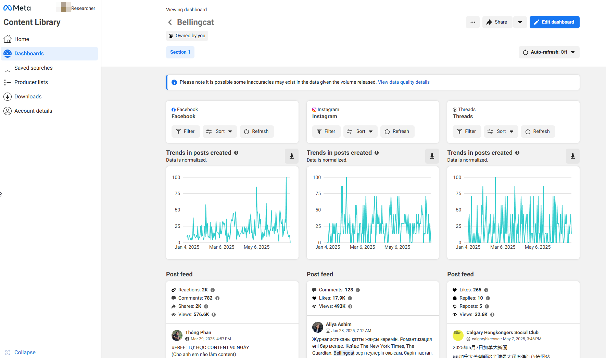

# Meta Content Library

## URL

[https://transparency.meta.com/researchtools/meta-content-library](https://transparency.meta.com/researchtools/meta-content-library)


While this is a free tool, access is strictly limited. However, _any_ researcher affiliated with an academic institution or another not‑for‑profit organisation whose core activity is scientific or public‑interest research can apply. Individuals can [apply for access](https://icpsr.atlassian.net/servicedesk/customer/portal/53) to these tools at the[ Inter-university Consortium for Political and Social Research (ICPSR)](https://en.wikipedia.org/wiki/Inter-university_Consortium_for_Political_and_Social_Research) at the University of Michigan. If you intend to use it for research purposes, make sure to keep in mind the application time: The review process typically takes between [2-6 weeks](https://socialmediaarchive.org/pages/?page=FAQs\&ln=en).



**UPDATE: Researcher access fees (Meta Content Library API via SOMAR VDE)**

Free compute on SOMAR’s Virtual Data Enclave ends on **2025‑12‑31**. Starting **January 2026**, SOMAR will charge **$371 USD per research team per month** of VDE access; **new VDE teams** created in 2026 or later will also incur a **one‑time $1,000 USD** project‑start fee. Meta’s Secure Research Environment (SRE) continues to offer **free compute**. See [SOMAR’s FAQ for details](https://somar.atlassian.net/wiki/spaces/somardocs/pages/395149314/FAQ+New+secure+computing+options+for+Meta+Content+Library+API) published Sept. 15th 2025.


(as of Oct 31st, 2025) 

<figure><figcaption></figcaption></figure>

## Description

**Meta Content Library (MCL)** is Meta’s controlled‑access research interface for exploring the **full public content archive** of Facebook and Instagram, with Threads content available in the **web UI**. It supports near-real-time search, powerful filters, and dashboards. The companion Content Library API (used within a secure environment) enables programmatic queries across more than 100 data fields. CSV export is available for a subset of **widely‑known** accounts (see thresholds below).

The platform features:

* [**User Interface**](https://en.wikipedia.org/wiki/User_interface) **(UI):** A web-based dashboard for content search and filtering.
* [**API** ](https://en.wikipedia.org/wiki/API)**Access:** Programmatic access for large-scale queries (Python or R via ICPSR's secure Virtual Data Enclave).
  * [**Asynchronous search**](https://transparency.meta.com/researchtools/meta-content-library)**:** the API supports background queries, letting users run large queries and monitor progress separately
* [Since Feb 2025](https://transparency.meta.com/researchtools/meta-content-library), the Library includes **all public Threads posts** that meet the 1 k-follower rule; engagement metrics and OCR text-in-image search work for Threads too. Meta’s [June 2025](https://developers.facebook.com/docs/content-library-and-api/changelog/) update shows the library now covers more surfaces, including Facebook Marketplace listings, Facebook and Instagram fundraisers, story highlights and gaming videos.
* [**Real‑time dashboards and collaboration tools**](https://transparency.meta.com/MCL-API-update-supporting-independent-research) – the web UI lets users build dashboards based on keywords and producer lists and allows team collaboration and auto‑refresh
* **Search‐in‑images:** text‑in‑image search covers approximately the last 180 days (previously \~90) and supports story highlights
* **Advanced Filtering:** Keyword searches, engagement metrics, date ranges, and language filters.
  * A **verified‑filter** allows users to restrict searches to verified, unverified or all accounts across Facebook, Instagram and Threads
  * **Comment‑text search and sorting** – researchers can search within the comments of a Facebook/Instagram post or Threads reply and filter by date
* **Engagement Insights:** View counts, reactions, shares, and comments with hashed user IDs.
* **Historical Data:** Access dating back to Facebook's launch (2004), with updates in near real-time.
* [**CSV** ](https://en.wikipedia.org/wiki/Comma-separated_values)**Downloads:** Available for accounts meeting the "widely known" criteria
  * **Facebook Pages**: eligible for “widely‑known” if they have **15,000+ likes or followers**.
  * **Public profiles (Facebook & Instagram)**: eligible if **verified** or have **25,000+ followers**.
  * **Threads**: included in the UI for **public profiles with 1,000+ followers**, but **not downloadable** as CSV.
* **Privacy Protection:** Content is subject to deletion/privacy settings, ensuring ethical use.

Details on Features and Limits

**Features and Functionality**

* **Search Capabilities:** The Meta Content Library allows researchers to search across public Facebook and Instagram content with advanced filters. This includes keyword [queries with support for exact phrase matching](https://about.fb.com/news/2023/11/new-tools-to-support-independent-research/). Notably, the platform can even search for **text contained within images**, thanks to Meta’s OCR integration – searches now include[ text found in images posted on Facebook or Instagram](https://developers.facebook.com/docs/content-library-and-api/content-library-api/changelog)​.
* **UI and API Access:** The tool is accessible via a [web-based **graphical User Interface (UI)**](https://about.fb.com/news/2023/11/new-tools-to-support-independent-research/) as well as a [**programmatic API**](https://www.icpsr.umich.edu/web/about/cms/5231), both backed by the same near-real-time database of public content​​. This dual access means researchers can either interact with the data through a visual interface or query it using code, according to their needs.
* **Content Coverage:** Meta Content Library provides comprehensive access to public posts from [**Pages, Groups, and Events on Facebook**,](https://about.fb.com/news/2023/11/new-tools-to-support-independent-research/) plus public content from [**Instagram creator and business accounts**](https://www.icpsr.umich.edu/web/about/cms/5231)**.** As of [September 2024](https://about.fb.com/news/2023/11/new-tools-to-support-independent-research/), it was expanded to include **Threads** posts as well, further broadening the cross-platform scope of publicly accessible content​. All data is updated in near real-time, ensuring timely analysis.

**Engagement Metrics Available**

* **Post Engagement Details:** For each post in the library, Meta provides engagement metrics. Researchers can see the number of **reactions** (including likes and other reactions), **comments**, and **shares** each post received​.
* **View Counts:** Importantly, the Content Library also surfaces **post view counts** – the number of times people viewed the post. This “exposure” data helps researchers understand reach, not just interaction. (For example, Meta notes that [_“the Content Library does provide view counts,”_](https://about.fb.com/news/2023/11/new-tools-to-support-independent-research/) giving insight into how many people potentially saw a piece of content​.)
* **Comments Data:** In addition to posts, **public comments** on Facebook (and recently Instagram comments via the API) are accessible, allowing analysis of discussion threads in public forums​. All these metrics and content types are available both through the UI and via API output in the data.

**Eligible Content and CSV Download Criteria**

* **“Widely Known” Accounts:** The Content Library focuses on posts from high-profile public sources. According to Meta’s documentation, it includes: [**Facebook Pages** with **15,000 or more** likes _or_ followers, and **public personal accounts** that are either **verified** or have **25,000+ followers**​. ](https://socialmediaarchive.org/pages/?page=Meta+Content+Library+FAQs\&ln=en)(This covers prominent individuals and organizations on Facebook, as well as Instagram/Threads accounts meeting that follower threshold or verification status.) In other words, only content from these **widely-followed or verified accounts** is available for search and CSV export – aligning with Meta’s definition of “widely-known figures and organizations” ​([assets.mofoprod.net](https://assets.mofoprod.net/network/documents/Public_Data_Access_Programs__A_First_Look_Final_cExWfcH.pdf)).
* **Cross-Platform Inclusion:** This criterion applies across Facebook and Instagram. For example, Instagram **business and creator accounts** that are public and have at least 25k followers (or a verification badge) are included in the library ​([socialmediaarchive.org](https://socialmediaarchive.org/pages/?page=Meta+Content+Library+FAQs\&ln=en)). The same goes for Threads profiles (which are tied to Instagram accounts) meeting the 25k-follower mark. On Facebook, public profiles (personal accounts) with a [blue check or 25k followers qualify, as do Pages with 15k fans​.](https://socialmediaarchive.org/pages/?page=Meta+Content+Library+FAQs\&ln=en) This ensures that CSV downloads are limited to content from Pages and users with significant public followings.
* **CSV Exports:** Researchers can download query results as **CSV files** through the Content Library interface for these eligible accounts. Meta officially enabled CSV exports of “certain publicly-accessible content posted by widely-known figures” in 2024 as part of the toolkit’s features​. This allows offline analysis of posts and their metrics. (For instance, a researcher could query all posts matching a keyword from high-follower accounts and export the data for analysis in a spreadsheet or statistical software.)

**Query Limits and Data Usage Quotas**

* **Weekly Query Budget:** Meta imposes a **rate limit** on how much data can be retrieved to ensure manageable use. Official documentation specifies a maximum of **500,000 content items** (posts, etc.) that each researcher can retrieve [in a rolling **seven-day** period, counting both UI and API queries together](https://code.peren.gouv.fr/hackathon-2024/challenge-2-contributions/team-12-ragtag/-/blob/main/platform-docs-versions/Facebook_Content-Library-API/Content-Library-API%20Documentation.md?ref_type=heads)​. In other words, the Content Library **caps results at 500,000 per week** per user. This limit is in line with Meta’s data access policies to prevent abuse while still allowing large-scale research queries.
* **CSV Download Limits:** Crucially, any results downloaded as CSV count toward that weekly quota. Meta notes that [_“results in downloaded CSV files from Content Library will be counted towards your 500,000 total search results limit_](https://developers.facebook.com/docs/content-library-and-api/content-library/)_”_&#x200B;. “CSV exports are available for Facebook and Instagram posts by widely‑known accounts. Facebook Pages qualify at 15,000+ likes or followers; public profiles on Facebook or Instagram qualify if verified or at 25,000+ followers.
* **Other Limits:** Aside from the 500k-per-week retrieval cap, all queries are subject to the platform’s standard rate limiting rules (e.g. requests per second via API, etc., as outlined in developer docs). The tool does not allow tracking beyond this limit, and it currently does [**not support historical post performance tracking over time**](https://www.icpsr.umich.edu/web/about/cms/5231) beyond the data returned at query time (unlike some features [CrowdTangle](https://apnews.com/article/meta-crowdtangle-research-misinformation-shutdown-facebook-977ece074b99adddb4887bf719f2112a) had). There is also an **access restriction** – the Content Library is **only available to vetted academic and non-profit researchers**, who must apply through the Meta Transparency Center/ICPSR process.

## Cost

* [x] Free
* [ ] Partially Free
* [ ] Paid

**UI access:** free for approved researchers.&#x20;

**API compute:** free on Meta’s Secure Research Environment (SRE).&#x20;

**SOMAR VDE:** ICPSR notes fees begin **January 2026** (one‑time **USD 1,000** per new team + **USD 371/month**).

## Level of difficulty

<table><thead><tr><th data-type="rating" data-max="5"></th></tr></thead><tbody><tr><td>3</td></tr></tbody></table>

The **web UI** is point‑and‑click and suitable for non‑coders. The **API** requires comfort with **Python or R** inside a secure Jupyter environment and familiarity with paginated queries, asynchronous jobs, and result vetting before export. Accessing Meta’s SRE uses **Amazon WorkSpaces Secure Browser**.

## Limitations

* **Access limits:** Combined UI+API retrieval cap of **500,000 records per rolling 7 days** per researcher; **CSV downloads count against this total**. API rate caps: **60 synchronous searches/min** and **1 asynchronous job/min**. [developers.facebook.com](https://developers.facebook.com/docs/content-library-and-api/content-library-api/guides/rate-limiting/?utm_source=chatgpt.com)
* **Coverage notes:** Threads is currently **UI‑only** for browsing; CSV downloads are documented for **Facebook & Instagram** content posted by widely‑known accounts. [Transparency](https://transparency.meta.com/researchtools/meta-content-library?utm_source=chatgpt.com)
* **Feature scope:** OCR matches are **not phrase‑searchable** and are limited to ≈**180 days** of images. [developers.facebook.com](https://developers.facebook.com/docs/content-library-and-api/content-library/?utm_source=chatgpt.com)
* **Changelog awareness:** Meta’s 2025‑06‑30 update added new surfaces (e.g., Instagram **Story highlights**, **Facebook Gaming** videos) and filters; **MCL v3.0** was deprecated on **2025‑07‑31**.  [Transparency](https://transparency.meta.com/MCL-API-update-supporting-independent-research?utm_source=chatgpt.com)
* **Legal/ToS:** Use is governed by ICPSR agreements and Meta developer policies; some fields/surfaces vary by region or legal restrictions. [somar.atlassian.net](https://somar.atlassian.net/wiki/spaces/somardocs/pages/249397299/SOMAR%2BData%2BAccess%2BApplication%2BGuide?utm_source=chatgpt.com)

## Requirements

* **Eligibility & application:** Affiliation with a **qualified academic or research institution**; [apply](https://developers.facebook.com/docs/content-library-and-api/get-access/) via [**ICPSR**](https://somar.atlassian.net/wiki/spaces/somardocs/pages/249397299/SOMAR%2BData%2BAccess%2BApplication%2BGuide)**/SOMAR** (UI and [API ](https://developers.facebook.com/docs/content-library-and-api/content-library/)have different application steps). ICPSR reviews and coordinates approvals; downloads are enabled only for ICPSR‑approved users.&#x20;
* **Environments:** Choose **SOMAR Virtual Data Enclave (VDE)** or **Meta Secure Research Environment (SRE)** for API work. UI access is hosted by Meta and is separate. [somar.atlassian.net](https://somar.atlassian.net/wiki/spaces/somardocs/pages/249397299/SOMAR%2BData%2BAccess%2BApplication%2BGuide?utm_source=chatgpt.com)
* **Access & auth:** After approval, log in to SRE and launch a **Jupyter** session via **Amazon WorkSpaces Secure Browser** to use the API client. [developers.facebook.com](https://developers.facebook.com/docs/content-library-and-api/content-library-api/getting-started/?utm_source=chatgpt.com)
* **Supported modules/features (selected):**\
  – **Dashboards** in the UI for monitoring queries. [developers.facebook.com](https://developers.facebook.com/docs/content-library-and-api/content-library/dashboards/)\
  – **Text‑in‑image search (OCR)** covering ≈**180 days**. [developers.facebook.com](https://developers.facebook.com/docs/content-library-and-api/content-library/)\
  – **Verified filter** (include/exclude verified accounts). [Transparency](https://transparency.meta.com/MCL-API-update-supporting-independent-research)\
  – **Comments** (Facebook & Instagram) via API. [developers.facebook.com](https://developers.facebook.com/docs/content-library-and-api/content-library-api/guides/fb-comments/)\
  – **Asynchronous searches & ID‑based retrieval** for large jobs. [developers.facebook.com](https://developers.facebook.com/docs/content-library-and-api/content-library-api/guides/search-guide/)\
  – **Marketplace listings** and **Fundraisers** (Facebook). [developers.facebook.com](https://developers.facebook.com/docs/content-library-and-api/content-library-api/guides/fb-marketplace/)\
  – **Threads** content visible in the **UI**. [Transparency](https://transparency.meta.com/researchtools/meta-content-library?utm_source=chatgpt.com)\
  – **CSV downloads** for “widely‑known” accounts (see thresholds) and counted toward rate quota. [Transparency](https://transparency.meta.com/researchtools/meta-content-library)
* **“Widely‑known” thresholds for downloadable data:** **Facebook Pages ≥15,000** likes/followers; **public profiles ≥25,000** followers or **verified badge**. (Developer docs/Meta comms.) [developers.facebook.com](https://developers.facebook.com/docs/content-library-and-api/content-library/)
* **Optional dependencies:** None installed locally; code runs within SRE/VDE notebooks provided by Meta/ICPSR. [developers.facebook.com](https://developers.facebook.com/docs/content-library-and-api/content-library-api/getting-started/?utm_source=chatgpt.com)
* **Versioning note:** Current API docs show **v5.0** (release date not published in docs). **To verify:** confirm version and publication date in your environment. [developers.facebook.com](https://developers.facebook.com/docs/content-library-and-api/content-library-api/)

## Ethical Considerations

* **Privacy Compliance:** Researchers must respect data privacy and ethical standards.
* **No User Tracking:** The platform does not allow [longitudinal tracking](https://transparency.meta.com/researchtools/product-terms-meta-research) of individuals.
* **Use Limitations:** Data cannot be used for[ surveillance or commercial purposes](https://transparency.meta.com/researchtools/product-terms-meta-research).

## Guide

* **Official Documentation:** [Meta Transparency Center](https://transparency.meta.com/researchtools/meta-content-library)
* **ICPSR Social Media Archive:** [https://www.icpsr.umich.edu/](https://www.icpsr.umich.edu/)
* ["Public Data Access Programs: A First Look"](https://assets.mofoprod.net/network/documents/Public_Data_Access_Programs__A_First_Look_Final_cExWfcH.pdf) is a comprehensive evaluation by Hickey, Dowling, Navia, and Pershan (2024, Mozilla Foundation). The study assesses how major platforms, including Meta, provide researchers access to public data under the **Digital Services Act**, with a focus on usability, transparency, and technical limitations. It highlights the platform's dual-access approach via a user-friendly dashboard and API while also noting challenges such as data consistency and limited documentation that can affect replicability and broader research applications.
* In this **two-part webinar series**, led by [Professor Anja Neundorf](https://www.aneundorf.net/) under the [DEMED project](https://www.gla.ac.uk/research/az/democracyresearch/), researchers at the University of Glasgow and specialists from Meta discuss the Meta Content Library’s evolving capabilities. The [first session (2023)](https://youtu.be/zny6y4VgNM4?si=3eppfWKo8kTKGCPh) focuses on core concepts such as keyword-based searches and privacy safeguards for analyzing public Facebook and Instagram data. The [second session (2025)](https://youtu.be/3Qd3K82VTGg?si=gk5n7UGRYoKNWF5B) highlights newly added features, including comment-level data, text-in-image matching, and Threads integration, to support more advanced social media research.

New and notable Features and Changes in 2025

* **Threads in the UI** with 1,000+ follower threshold for public profiles; no CSV download for Threads. [Transparency](https://transparency.meta.com/researchtools/meta-content-library) [Facebook for Developers](https://developers.facebook.com/docs/content-library-and-api/content-library/?utm_source=chatgpt.com)
* **Comments search across FB, IG, Threads** in the web UI; filter and sort by date. [Transparency](https://transparency.meta.com/MCL-API-update-supporting-independent-research?utm_source=chatgpt.com)
* **Text‑in‑image search window** extended to \~180 days on FB and IG. [Facebook for Developers](https://developers.facebook.com/docs/content-library-and-api/changelog/?utm_source=chatgpt.com)
* **Dashboards, collaboration, auto‑refresh, query‑budget tracking** in the UI. [Transparency](https://transparency.meta.com/MCL-API-update-supporting-independent-research?utm_source=chatgpt.com)
* **Asynchronous search**; **100,000** results per asynchronous query; separate 1M sizing limit on comment searches for estimation. [Facebook for Developers](https://developers.facebook.com/docs/content-library-and-api/content-library-api/guides/rate-limiting/?utm_source=chatgpt.com)
* **Endpoints expansion** documented: FB posts, pages, groups, events, profiles, comments, Marketplace listings, fundraisers; IG accounts, posts, comments, fundraisers, channels. [Transparency](https://transparency.meta.com/researchtools/meta-content-library)
* **Two API compute options**: Meta SRE or SOMAR VDE. [Transparency](https://transparency.meta.com/researchtools/meta-content-library)

## Tool provider

[Meta Platforms, Inc](https://en.wikipedia.org/wiki/Meta_Platforms). Menlo Park, California, U.S

## Advertising Trackers

* [ ] This tool has not been checked for advertising trackers yet.
* [x] This tool uses tracking cookies. Use with caution.
* [ ] This tool does not appear to use tracking cookies.

| Page maintainer |
| --------------- |
| Martin Sona     |
