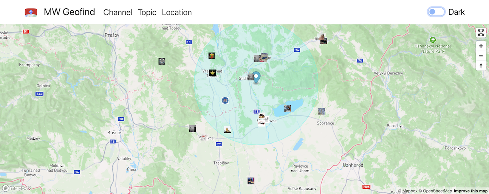
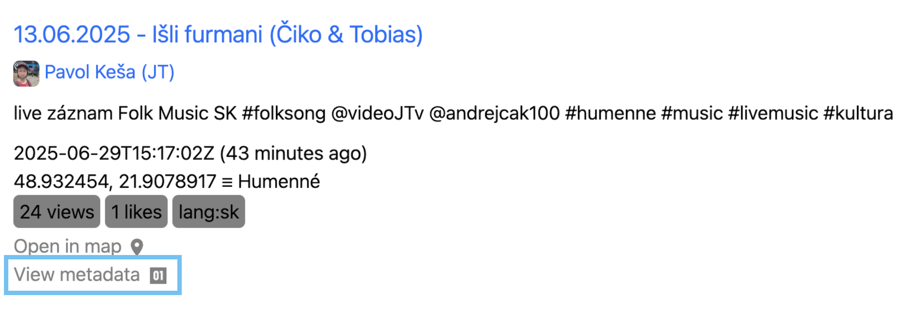
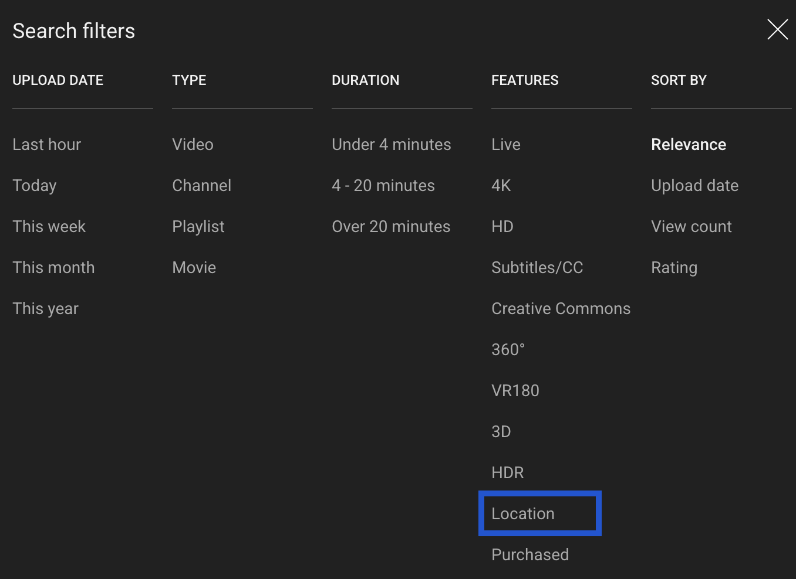

# MW Geofind

## URL

[https://mattw.io/youtube-geofind/location](https://mattw.io/youtube-geofind/location)

## Description

MW Geofind is an online tool designed for identifying YouTube videos tagged with a geographical location.

### How to use

You can search for YouTube videos by keywords or location (i.e., location name or coordinates). Additionally, you can filter the results by timeframe ("past hour", "past 30 days etc.), video duration, and language.

* To optimize the keyword search, have a look at the [documentation](https://github.com/mattwright324/youtube-geofind/wiki/YouTube-Keyword-Operators) for YouTube keyword operators.
* When searching by location, users can set a radius between 1 and 1000km.
* Search results are visualized on a map, which shows icons from the YouTube videos. See example below.

<figure><figcaption>
Search results for YouTube videos geotagged within 20km of the Hungarian State Opera House in Budapest. A radius of 20km is shown (in the green circle). Each icon represents a YouTube channel. Note that the map also shows some videos geotagged beyond the 20km radius.
</figcaption></figure>

* Under **Geotags**, user can find a list of the search results, including a thumbnail, the video title, upload date, duration, and an excerpt of the video description. Due to restrictions from YouTube, an export function is not directly available.
* Under **Share,** a link can be copied and shared so that others can access the search results.

How to access video metadata

Users can click on "View metadata" on any result in the search results list to view a video's metadata in json. A new tab will open in "[MW Metadata - Bulk](https://mattw.io/youtube-metadata/bulk)" which is another tool by the same developer.

<figure><figcaption>
View metadata - marked in blue
</figcaption></figure>

Here are excerpts of the json data available.\

### **Understanding geotags in YouTube videos.**

On YouTube, geotags are [set manually by the video creators](https://support.google.com/youtube/answer/7638112?hl=en\&co=GENIE.Platform%3DDesktop), and [not derived from the videos' EXIF data](https://github.com/mattwright324/youtube-geofind/wiki). When video creators upload their content, they can choose to specify a location. (Typically, they start typing the name of the location, and a dropdown list becomes available for selection. This selection mechanism can sometimes lead to inaccuracies.)

Geotags can also be [imprecise](https://github.com/mattwright324/youtube-geofind/wiki), as [YouTube's metadata](https://developers.google.com/youtube/v3/docs/search/list) are set up such that the same coordinates can refer to multiple locations (e.g., "Manhattan, New York" and "United States" can have the same coordinates). Researchers should set the radius in MW Geofind to specify the search parameters.\
\
Given these caveats, researchers should use the search results from MW Geofind as one of many reference points and seek to independently verify any location information.

#### Available format

MW Geofind is available in the web browser: [https://mattw.io/youtube-geofind/location](https://mattw.io/youtube-geofind/location)

Find the code and latest commits on Github: [https://github.com/mattwright324/youtube-geofind](https://github.com/mattwright324/youtube-geofind)

### Similar tools

YouTube's search can perform a similar search by location but there are several disadvantages.

How to do a location search on YouTube

1. Enter a location name in the search bar.
2. Click "Filters".
3. Select "Location".\
   

Some of the disadvantages compared to MW Geofind are:

* On YouTube, the user can only search by location name and cannot search by coordinates.
* On YouTube, geotags are in the video creator's chosen language. E.g., a French speaker may geotag their video "États-Unis" instead of "United States". If searching on YouTube by location name, the correct language needs to be used to find the geotagged videos. In comparison, searching by coordinates in MW Geofind avoids this issue.
* On YouTube, the time frame selected must be recent (i.e., the choices are limited to "last hour", "today", "this week", "this month", "this year"). MW Geofind allows more flexibility (e.g., between Jan 1 to Feb 15, 2017), enabling searches for older videos.

See the [MW Geofind documentation](https://github.com/mattwright324/youtube-geofind/wiki) for more information.

## Cost

* [x] Free
* [ ] Partially Free
* [ ] Paid

## Level of difficulty

<table><thead><tr><th data-type="rating" data-max="5"></th></tr></thead><tbody><tr><td>1</td></tr></tbody></table>

## Requirements

* **Web:** any web browser.

## Limitations

* **API rate limits:** MW Geofind is a popular tool that frequently (almost daily) exhausts YouTube's API rate limits. The rate limits are reset daily around 9am US Pacific time. Therefore, users who find MW Geofind unresponsive or not functioning should check back again in the morning, Pacific time.
* **Location information may be inaccurate**: MW Geofind makes an initial search and then makes additional calls to get `recordingDetails` and `locationDescription` from the YouTube[ API](https://developers.google.com/youtube/v3/docs/videos#recordingDetails). Users should understand that the coordinates do not necessarily refer to a precise location, as the same coordinates can refer to a country, city, landmark, address, or point of interest. Again, users should seek to independently verify the location information. Please see discussion in MW Geofind [project wiki](https://github.com/mattwright324/youtube-geofind/wiki).

## Ethical Considerations

**Privacy**: Video creators could have deliberately or inadvertently provided location information and other identifying details in their video content, geotag, or other metadata. When using information from publicly uploaded videos, researchers should take into account the context of their research or the timing of their publication, giving full respect to the privacy of the video creator or any individuals appearing in the video.

## Guides and articles

**Official Wiki** **from the developer**

* [https://github.com/mattwright324/youtube-geofind/wiki](https://github.com/mattwright324/youtube-geofind/wiki)

**Tutorials**

_How to find geotagged videos on YouTube | Geofind OSINT Tool Tutorial_ (2023).\
• Video: [https://www.youtube.com/watch?v=3WdeRiy1dvI](https://www.youtube.com/watch?v=3WdeRiy1dvI)\
• _Article:_ [https://gralhix.com/2022/04/21/how-to-find-geotagged-videos-on-youtube/](https://gralhix.com/2022/04/21/how-to-find-geotagged-videos-on-youtube/)

## Tool provider

Matthew Wright [https://mattw.io/](https://mattw.io/) - United States

## Advertising Trackers

* [x] This tool has not been checked for advertising trackers yet.
* [ ] This tool uses tracking cookies. Use with caution.
* [ ] This tool does not appear to use tracking cookies.

| Page maintainer |
| --------------- |
| river\_n        |
|                 |
