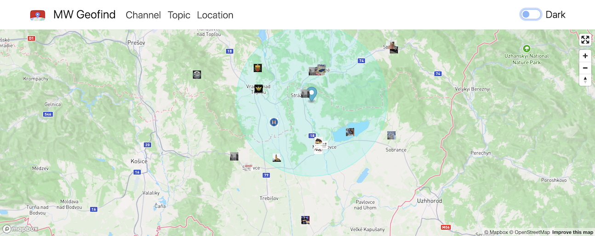
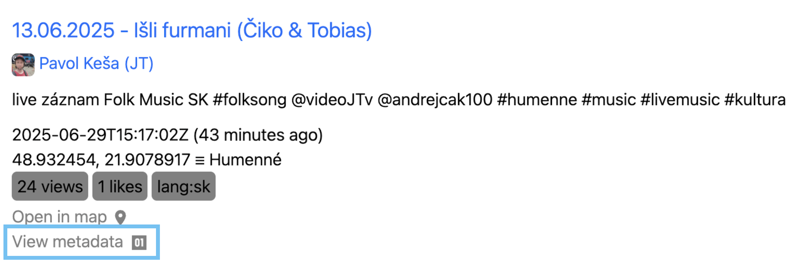
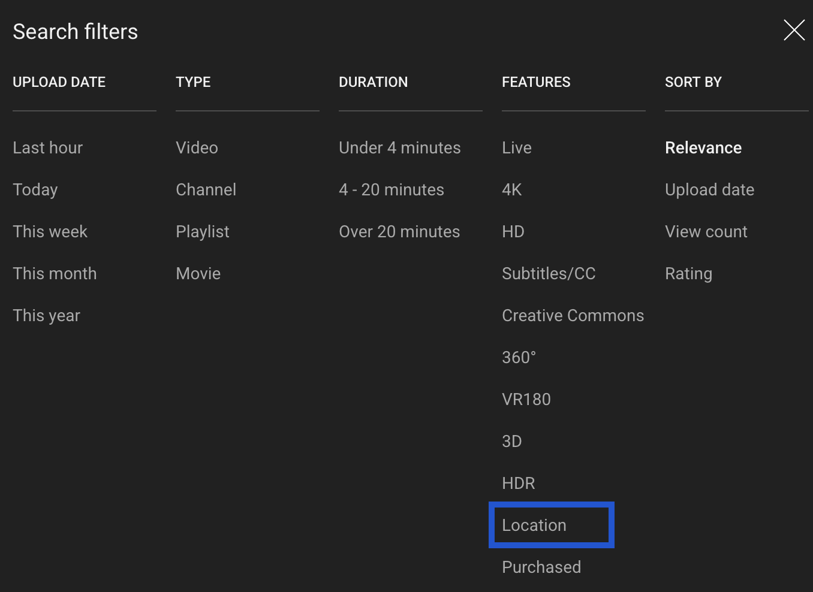

# MW Geofind

## URL

[https://mattw.io/youtube-geofind/location](https://mattw.io/youtube-geofind/location)


## The code of MW Geofind was last updated in 2024. Although the tool still functions in searching for geotagged videos, fewer creators currently use manual geotagging. Additionally, Youtube has updated its search algorithms. Please see the 'Similar Tools' section for details.


## Description

MW Geofind is an online tool designed for identifying YouTube videos tagged with a geographical location.

### How to use

You can search for YouTube videos by keywords, location name, or coordinates. Additionally, you can filter results by timeframe ("past hour", "past 30 days" etc.), video duration, and language.

* To optimize the keyword search, have a look at the [documentation](https://github.com/mattwright324/youtube-geofind/wiki/YouTube-Keyword-Operators) for YouTube keyword operators.
* When searching by location, users can set a radius between 1 and 1000km.
* Search results are automatically visualized on a map, which shows icons from the YouTube videos. Click on the icon to see the video's title, channel, and other details. Alternatively, scroll down the page to see the same details listed.


Restricted by [Youtube's API rate limits](https://github.com/mattwright324/youtube-geofind/issues/11), MW Geofind will not function if the day's limit has been reached. This is reset every day at 9am Pacific time. If you attempt to search and the page appears unresponsive, or the word "Idle" appears above the search bar, then use other methods to search (or wait till the next day after 9am Pacific time). See the section Similar Tools for details.


<figure><figcaption>
Search results visualized on a map, for YouTube videos geotagged within 20km of the Hungarian State Opera House in Budapest. A radius of 20km is shown (in the green circle). Each icon represents a YouTube channel. Note that the map also shows some videos geotagged beyond the 20km radius.
</figcaption></figure>

* Under **Geotags**, user can find a list of the search results, including a thumbnail, the video title, upload date, duration, and an excerpt of the video description. Due to restrictions from YouTube, an export function is not directly available.
* Under **Share,** a link can be copied and shared so that others can access the search results.

How to access video metadata

To access the metadata, scroll down to view the search results and click "View metadata". This opens a new tab in your web browser, showing the metadata through another tool, [MW Metadata - Bulk](https://mattw.io/youtube-metadata/bulk), by the same developer.

<figure><figcaption>
View metadata - marked in blue
</figcaption></figure>

Here is an excerpt showing some of the JSON data available. (JSON is a format for structuring and storing data, where information is stored in text and as name-value pairs.) For each video, you will find metadata such as the date and time of upload, the geotag, and other information such as counts for the number of views, likes, favorites, and comments for the video.\
\
 

Unfortunately, a bulk export function is not available [due to Youtube policy](https://github.com/mattwright324/youtube-metadata/discussions/150).

### **Understanding geotags in YouTube videos**

On YouTube, geotags are [set manually by the video creators](https://support.google.com/youtube/answer/7638112?hl=en\&co=GENIE.Platform%3DDesktop), and [not derived from the videos' EXIF data](https://github.com/mattwright324/youtube-geofind/wiki). When video creators upload their content, they can choose whether to specify a location. (Typically, they start typing the name of the location, and a dropdown list becomes available for selection. This selection mechanism can sometimes lead to inaccuracies.) Importantly, geotags are optional, i.e., video creators can leave it blank.

Geotags can also be [imprecise](https://github.com/mattwright324/youtube-geofind/wiki), as [YouTube's metadata](https://developers.google.com/youtube/v3/docs/search/list) are set up such that the same coordinates can refer to multiple locations (e.g., "Manhattan, New York" and "United States" can have the same coordinates). Researchers should set the radius in MW Geofind to specify the search parameters.\
\
Video creators can intentionally enter an inaccurate geotag.\
\
Given these caveats, researchers should use the search results from MW Geofind as only one reference points and seek to independently verify any location information.

#### Available format

MW Geofind is available in the web browser: [https://mattw.io/youtube-geofind/location](https://mattw.io/youtube-geofind/location)

Find the code and latest commits on Github: [https://github.com/mattwright324/youtube-geofind](https://github.com/mattwright324/youtube-geofind)

### Similar tools

#### Google dork

Using Google dorking (or the equivalent in other search engines) can lead to more results. For example, use `intitle:"keyword"` or `intext:"keyword"` to find videos whose title or text description mention your targeted location.

#### Searching on native Youtube

Another approach is to use YouTube's search by location function.

How to do a location search on YouTube

1. Enter a location name in the search bar.
2. Click "Filters".
3. Select "Location".\
   

Searching directly on Youtube can lead to more comprehensive search results (i.e., more videos found).

* On YouTube, the time frame selection can be limiting (i.e., the choices are "last hour", "today", "this week", "this month", "this year"). MW Geofind allows more flexibility (e.g., between Jan 1 to Feb 15, 2017), enabling searches for older videos.

Since 2025, Youtube has started to process visual content in videos, including objects, people, scenes and places, in order to [create AI-generated summaries for videos](https://uk.pcmag.com/ai/158798/youtube-search-gets-its-own-ai-overviews-but-access-is-limited). The visual information is also used to inform the search results. This further improve the comprehensiveness of Youtube search results for a place name, though it can also lead to some false positives.

#### yt-dlp

For those comfortable with using command line tools, [yt-dlp](https://github.com/yt-dlp/yt-dlp) might be preferable with its broader functionalities (e.g., faster downloads, audio extraction). To load the video's metadata, use: `yt-dlp --print-json [VIDEO_URL]`\
\
The metadata would include the video location only if the video was geotagged by the creator. Note that since September 2025, [additional JavaScript components are required](https://github.com/yt-dlp/yt-dlp/issues/14404) for yt-dlp to function properly.

## Cost

* [x] Free
* [ ] Partially Free
* [ ] Paid

## Level of difficulty

<table><thead><tr><th data-type="rating" data-max="5"></th></tr></thead><tbody><tr><td>1</td></tr></tbody></table>

## Requirements

* **Web:** any web browser.

## Limitations

* **Location information may be inaccurate**: MW Geofind makes an initial search and then makes additional calls to get `recordingDetails` and `locationDescription` from the YouTube[ API](https://developers.google.com/youtube/v3/docs/videos#recordingDetails). Users should understand that the coordinates do not necessarily refer to a precise location, as the same coordinates can refer to a country, city, landmark, address, or point of interest. Again, users should seek to independently verify the location information. You can find a discussion about this issue in MW Geofind's [project wiki](https://github.com/mattwright324/youtube-geofind/wiki).
* **Search results are not comprehensive**: MW Geofind is a tool specific to finding for geotagged videos. As discussed above, the video creator can choose to omit geotagging (i.e., leaving it blank), or provide inaccurate or imprecise geotags, or geotag in a different language. Therefore, search results from MW Geofind can be seen as a narrow subset of all possible videos uploaded from a location.

## Ethical Considerations

* Video creators could have deliberately or inadvertently provided wrong location information and other identifying details in their video content, including in the metadata. Always verify any location information independently.
* When using information from publicly uploaded videos, researchers should weigh privacy interests of the video creator or any individuals appearing in the video against the need for research publications in the public interest.

## Guides and articles

**Official Wiki** **from the developer**

* [https://github.com/mattwright324/youtube-geofind/wiki](https://github.com/mattwright324/youtube-geofind/wiki)

**Tutorials**

_How to find geotagged videos on YouTube | Geofind OSINT Tool Tutorial_ (2023).\
• Video: [https://www.youtube.com/watch?v=3WdeRiy1dvI](https://www.youtube.com/watch?v=3WdeRiy1dvI)\
• _Article:_ [https://gralhix.com/2022/04/21/how-to-find-geotagged-videos-on-youtube/](https://gralhix.com/2022/04/21/how-to-find-geotagged-videos-on-youtube/)

## Tool provider

Matthew Wright [https://mattw.io/](https://mattw.io/) - United States

## Advertising Trackers

* [x] This tool has not been checked for advertising trackers yet.
* [ ] This tool uses tracking cookies. Use with caution.
* [ ] This tool does not appear to use tracking cookies.

| Page maintainer |
| --------------- |
| river\_n        |

August 31, 2026
