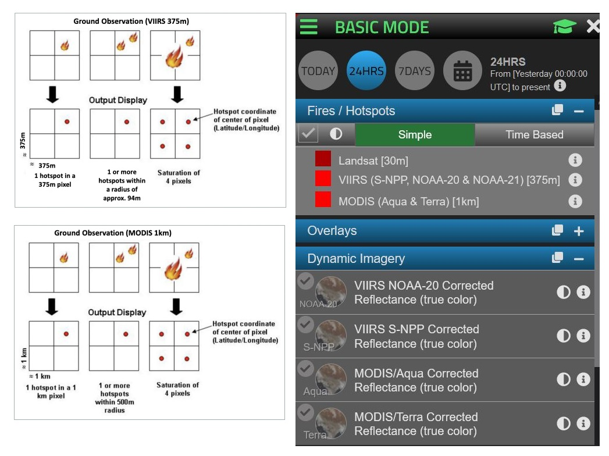
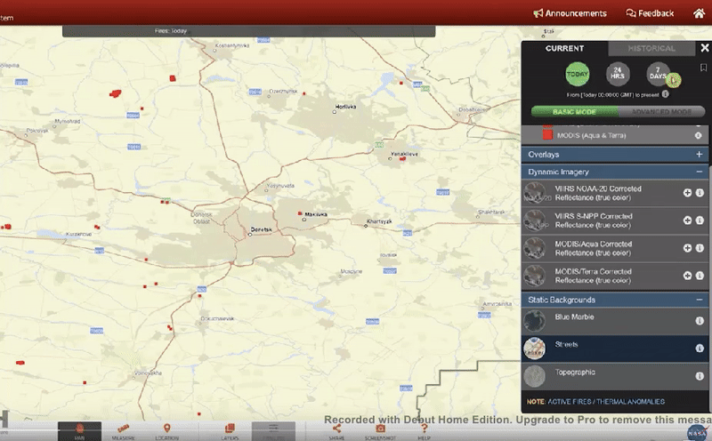
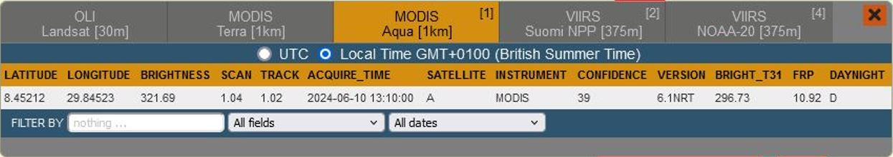
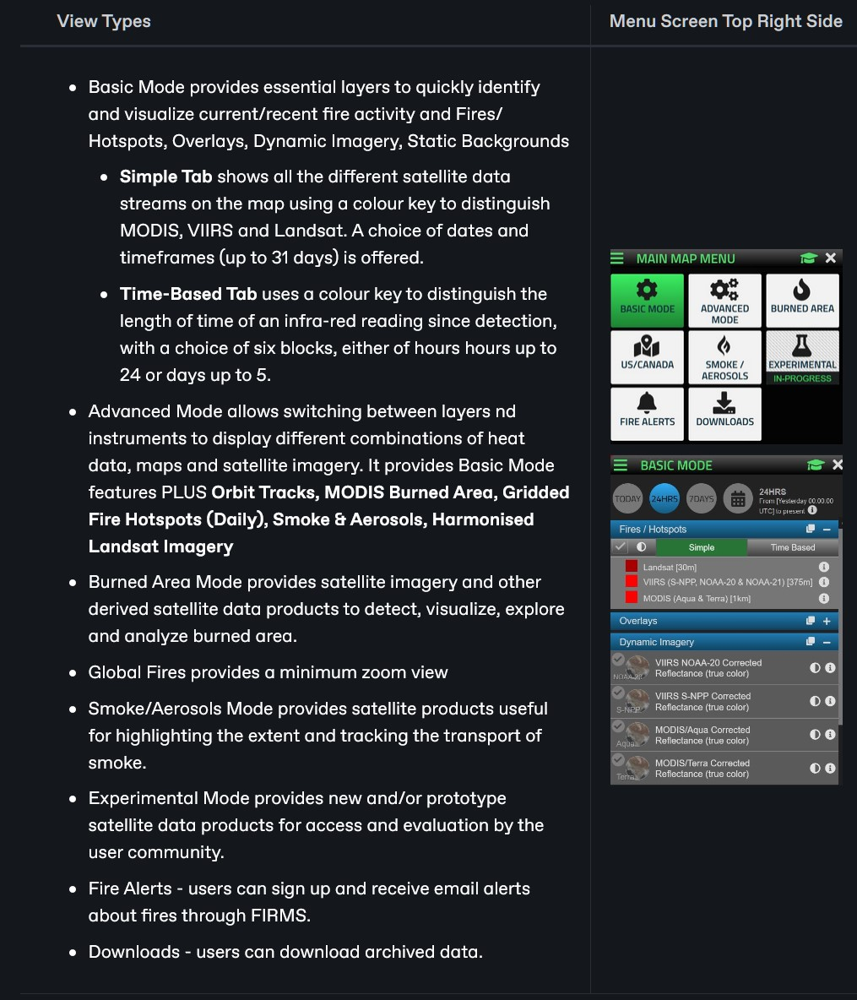
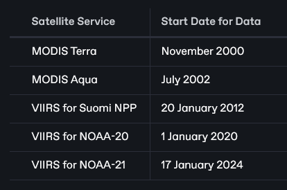

# NASA FIRMS

## URL

[**https://firms2.modaps.eosdis.nasa.gov/map/**](https://firms2.modaps.eosdis.nasa.gov/map/)


**AT  2/10/25  THE RECENT LAPSE IN US FEDERAL GOVERNMENT FUNDING MEANS THAT THIS TOOL IS CURRENTLY TEMPORARILY SUBJECT TO**&#x20;

* SUSPENSION OF DATA UPDATES
* UNAVAILABILITY OF SOME INFORMATION

Much of the source data in NASA FIRMS from the Modis, Sentinel 2 and VIIRS services, so other portals based on the same services as NASA FIRMS will be similarly affected. Alternative data sources are being sought in the interim.


<figure><figcaption>
<strong>VIEWING DIFFERENT SATELLITES' DATA AND ADJUSTING THE TIME PERIOD DISPLAYED USING THE FIRMS INTERFACE</strong> <em>We acknowledge the use of data and/or imagery from NASA's Fire Information for Resource Management System (FIRMS) (https://earthdata.nasa.gov/firms), part of NASA's Earth Science Data and Information System (ESDIS).</em>
</figcaption></figure>

### Description


It is important to know the geographical context for the area you are researching in order to be able to interpret infra-red satellite data appropriately.\
NASA FIRMS includes an inferred "Type" category for hotspot pixels from its VIIRS satellites: - **Presumed vegetation fire** = 0\
\- **Active volcano** = 1\
\- **Other static land source** = 2\
\- **Offshore detection** = 3


FIRMS (**F**ire **I**nformation for **R**esource **M**anagement **S**ystem) aims to distribute NRT (Near Real-Time) active fire data, primarily for the purposes of resource management. It can be repurposed for Open Source investigation, particularly around military action and environmental change.

For example, the NASA FIRMS infra-red satellite sensor data has been used for geolocation, verification, war attack monitoring, frontline/troop movement estimates, forest fire monitoring, bushfire monitoring and war frontline tracking, amongst other things.

### Use Cases for NASA FIRMS with Input Data, Output Data and Data Input Options...(Click each tab to see further information)



* Location (latitude, longitude) MULTIPLE LOCATION SELECTION IS POSSIBLE
* Date
* Time
* Time Period
* Filter Selections: Satellite Name
* Filter Intensity Level



* Fire ID
* FRP (Fire Radiative Power) values
* Confidence Level of fire pixels
* Discovery Date
* For VIIRS only: Inferred Fire Type (vegetation/volcano/other static land source/offshore
* Time Since Fire Discovered
* Situation Report



<figure><figcaption>
<strong>OPEN SOURCE RESEARCH TASKS OR 'USE CASES' SUPPORTED BY NASA FIRMS </strong><em><strong>(I</strong>magery from NASA's Fire Information for Resource Management System (FIRMS) (https://earthdata.nasa.gov/firms)</em>
</figcaption></figure>



<figure><figcaption>
<strong>DIFFERENT WAYS FOR THE USER TO ENTER NECESSARY INFORMATION</strong> <em><strong>(I</strong>magery from NASA FIRMS)</em>
</figcaption></figure>



### **Example Imagery Relating to A Selection of Significant Natural and Man-made Instances where Infra-Red Radiation Was Detected**

<table data-view="cards" data-full-width="true"><thead><tr><th></th><th></th><th></th><th></th><th></th><th data-hidden data-card-cover data-type="files"></th></tr></thead><tbody><tr><td><strong>VOLCANIC ERUPTION AREA, ICELAND Q2 2010</strong> Intensity: Max>1000MW</td><td>Boundary: Varying Often</td><td>Duration: Months</td><td>Type: 1 (active volcano)</td><td></td><td><a href=".gitbook/assets/VOLANOsmallannotated.jpg">VOLANOsmallannotated.jpg</a></td></tr><tr><td><strong>GRENFELL FIRE AREA, LONDON 14/06/2017</strong></td><td>Intensity: Max &#x3C;10MW Boundary: Relatively static Duration: 2-3 days</td><td>Type: 0 (Presumed vegetation fire)</td><td></td><td></td><td><a href=".gitbook/assets/GRENFELL.JPG">GRENFELL.JPG</a></td></tr><tr><td><strong>PORT TALBOT STEELYARD, WALES 2010</strong></td><td>Intensity: Max=11MW</td><td>Boundary: Relatively static Duration: Years</td><td>Types: 2 (static land source) &#x26; 3 (offshore)</td><td></td><td><a href=".gitbook/assets/port talbotsteelworks.JPG">port talbotsteelworks.JPG</a></td></tr></tbody></table>

These images show the variety of I-R sources which researchers will encounter & need to interpret. _**(I**magery from NASA's Fire Information for Resource Management System FIRMS )_

### The Data

The NASA FIRMS main data sources are radiometry equipment aboard orbiting satellites including:

* MODIS (Moderate Resolution Imaging Spectroradiometer) aboard the Aqua satellite and the Terra satellite
* VIIRS (Visible Infrared Imaging Radiometer Suite aboard three satellites: S-NPP, NOAA 20 and NOAA 21 (formally known as JPSS-1 and JPSS-2)).


NASA FIRMS is a very ‘fast’ service - data is usually uploaded within 3 hours of capture.


The data from these satellites can be viewed in NASA FIRMS, but is also available as an overlay layer in [NASA Worldview](https://worldview.earthdata.nasa.gov/), and as downloads or alerts in different formats: \*.shp, [\*.kml](https://en.wikipedia.org/wiki/Keyhole_Markup_Language), \*.txt and [\*.wms](https://www.ogc.org/standard/wms/).

The different satellites connected to NASA FIRMS have different sensor resolutions, so MODIS carries a coarse sensor where fire is represented in squares of 1km x 1km, whereas VIIRS has a finer sensor where fire is represented in squares of 375m x 375m. Thus more accurate location comes from the finer sensor, i.e. VIIRS.

<figure><figcaption>
<strong>SELECTING SATELLITE SOURCES FROM TOP RIGHT MAP MENU, WITH A COMPARISON OF SATELLITE RESOLUTIONS</strong> <em>(Images from NASA FIRMS)</em>
</figcaption></figure>


The size of the fire on the ground may be smaller than the size of the entire pixel in NASA FIRMS which indicates its presence. The location of the fire is within the area covered by the pixel, but it is not necessarily in the centre and it is not possible to determine a more accurate location than this within NASA FIRMS



The orbits of different satellites can be followed using the [OrbTrack](https://app.gitbook.com/o/WQpOq5ZFue4N6m65QCJq/s/7eAPkvBn3RpUIi2qPZKI/) app


#### Time As A Variable

The ability for the user to select a time period, using a horizontal slider across the bottom of the screen, or a menu calendar, is very powerful for analysis. The radio buttons labelled TODAY, 24 HOURS OR 7 DAYS filter the data according to the length of the time period of data capture.

<figure><figcaption>
<strong>TIME PERIOD BUTTONS AND CALENDAR OPTION</strong>
</figcaption></figure> <figure><figcaption>
DATE PERIOD CALENDAR BAR ACROSS BOTTOM OF SCREEN
</figcaption></figure>

#### Different Properties of Fire

Metrics such as confidence value and FRP value are assigned to map squares.

* **Confidence value** is a measure of the likelihood of fire, either on a high-nominal-low scale or a 0 to 100 % scale.
* **FRP** (Fire Radiative Power) is a measure of the power of the radiation in MegaWatts. The largest fires seen in recent OSINV research have reached around 500MW. FRP depicts the pixel-integrated fire radiative power in megawatts (MW) for both VIIRS and MODIS satellites.\
  [https://www.earthdata.nasa.gov/faq/firms-faq#ed-fire-on-ground](https://www.earthdata.nasa.gov/faq/firms-faq#ed-fire-on-ground)

#### Viewing Hotspots Over Time

<figure><figcaption>
<strong>USING NASA FIRMS TO VIEW FIRE DATA OVER A SPECIFIED TIME PERIOD IN A UKRAINIAN WAR ZONE</strong> <em><strong>(I</strong>magery from NASA FIRMS )</em>
</figcaption></figure>

#### Viewing Hotspots Close Up At Pixel Level

<figure><figcaption>
<strong>LEFT MOUSE CLICK (FIRMLY) ON PIXELS AT HIGH ZOOM GIVES A CIRCLE OF ANALYSIS AND PIXEL DATA ACQUISITION DETAILS</strong> <em><strong>(I</strong>magery from NASA FIRMS )</em>
</figcaption></figure>

Pixel data details displayed for the selected area include location, brightness, scan, track, acquire time, satellite name, confidence, FRP and day/night\\

<figure><figcaption>
<strong>AVAILABLE DATA FOR EACH FIRE PIXEL FOR MODIS SATELLITES, THE VIIRS SATELLITES ALSO HAVE A FIRE CATEGORY FIELD</strong>
</figcaption></figure>

### The Interface

There are a large number of user selection menus available to filter data, configure views, etc., and they are arranged in a hierarchy structure, which can be confusing to navigate:

<figure><figcaption>
NAVIGATING THE NASA FIRMS INTERFACE
</figcaption></figure>



**FIRMS-Level Options on Map Selection, Resources, Tutorials, Archive Download.**\
A section of NASA FIRMS information can be selected under the three horizontal bars icon on the top left side of the screen, which offers sections on:

<figure><figcaption>
<em><strong>(I</strong>magery from NASA FIRMS )</em>
</figcaption></figure>



A display mode can be selected under the three horizontal bars icon on the right of the screen, the Main Map Menu:

<figure><figcaption>
<em><strong>(I</strong>magery from NASA FIRMS )</em>
</figcaption></figure>



The Date Slider appears across the bottom of the screen when the corresponding button is pressed on the Centre Floating Toolbar. It is used to select date ranges for display, in addition to the Buttons and Calendar Option on the Top Right Menu (shown below)

<figure><figcaption>
<strong>TIME PERIOD BUTTONS AND CALENDAR OPTION</strong>
</figcaption></figure> <figure><figcaption>
<strong>TIME SLIDER FOR SELECTING DATE RANGES</strong>
</figcaption></figure>




NASA FIRMS floating toolbar (found Bottom Centre of the Screen) calls floating windows for Measurement, Location, Layers, Timeframe Ruler, Downloads, Link Sharing, Help, Screen Display Mode and Exit.

<figure><figcaption>
<strong>EACH BUTTON CALLS ANOTHER FLOATING TOOLBAR OR RULER</strong>
</figcaption></figure>

**The Location Tool** accepts input as names, co-ordinates or auto-detected current user location.

<figure><figcaption>
<strong>NB MULTIPLE LOCATIONS CAN BE SELECTED SIMULTANEOUSLY</strong>
</figcaption></figure>

The Layers Tool allows configuration of a selection of Overlays, as well as Backgrounds

<figure><figcaption>
BACKGROUND OPTIONS ARE DUPLICATED IN THE RIGHT MAP MENU (which offers 4 of the total of 6 options)
</figcaption></figure>

Blue Marble background (satellite), Firefly (grey shades), Streets (streetview) and Topographic (map) are provided, plus two more shades of grey background.

<figure><figcaption></figcaption></figure>




NASA FIRMS permits multiple location selection for searches


## Cost

* [x] Free
* [ ] Partially Free
* [ ] Paid

## Level of difficulty

<table><thead><tr><th data-type="rating" data-max="5"></th></tr></thead><tbody><tr><td>3</td></tr></tbody></table>

NASA FIRMS data is well-presented and the interface is not difficult to use at basic level. The number of different features which are available, but hidden amongst multiple menus, can be daunting. The difficulty rating reflects this and the challenges in interpreting FIRMS data in a realistic manner.

## Requirements

NASA FIRMS can be used without an account or provision of any data up front. However, for services such as fire alerts, users must provide an email.

Determining the Most Appropriate Source of Fire Data for A Research Application - (click here to clarify the best sources...)

FIRMS sources of both NRT (near real time) and standard fire data are:

* Moderate Resolution Imaging Spectroradiometer ([MODIS](https://www.earthdata.nasa.gov/sensors/modis)) from the Terra and Aqua platforms
* Visible Infrared Imaging Radiometer Suite ([VIIRS](https://www.earthdata.nasa.gov/sensors/viirs)) (375m) from the Suomi National Polar-orbiting Partnership (Suomi NPP), NOAA-20, and NOAA-21 platforms

It is important to cite exact data sources in scientific publications and to be sure the data source used is the most appropriate for the application by referencing [difference between NRT and standard fire data](https://www.earthdata.nasa.gov/faq/firms-faq#ed-nrt-standard) and [MODIS Fire User Guides](https://www.earthdata.nasa.gov/earth-observation-data/near-real-time/firms/about-firms#publications)

## Limitations

**Accuracy:** Care must be taken in the interpretation of NASA FIRMS data. The satellites involved do not take direct photographs, but rather measure radiation, and the radiation data is used to generate imagery.

Sources of Misinterpretation include Reflections, Industrial Sources, Cloud and Tree Cover and Volcanic Activity. (Click arrow for more detail...)

* Hotspots visible on the map may not be fires, they can also be high IR readings from metal structures reflecting heat or a very hot desert terrain or industrial sources such as cement industry kilns.
* Smoke plumes carrying hot material into the air can register as fire edges on VIIRS, which is particularly responsive to heat sources at night time.
* Cloud cover and tree canopies can hide fires, and if the satellite passes over a fire when it is at its weakest, it may not be visible as some fires are too weak to register (called a “cold” fire).
* Volcanic eruptions and flares from gas wells show up on FIRMS as indistinguishable from vegetation fires.

FIRMS is usually most valuable when used in conjunction with other tools, often to narrow down satellite imagery searches.

* The resolution of FIRMS data, which varies according to the satellite source, means that one or multiple active fires can be contained in one pixel.
* FIRMS will likely not register cooler or smaller fires and 100 metres squared is the smallest size of fire which would generally be detected.
* FIRMS satellites may not be above an area of interest at the time of interest, so a thermal event can take place without being captured.

Dates For which Data Are Available: MODIS from Nov 2000, VIIRS from Jan 2012. (Click the arrow for more detail on 5 specific services and dates...)

Estimating a Burned area: It is not recommended to use active fire locations to estimate burned area...(Click the arrow for more detail)

...as determining burned areas to an acceptable degree of accuracy is not possible due to nontrivial spatial and temporal sampling issues. For some applications, however, acceptable accuracy can be achieved, although the effective area burned per fire pixel is not simply a constant, but rather varies with respect to several different vegetation and fire-related variables. See [Giglio et al. (2006)](https://earthdata.nasa.gov/earth-observation-data/near-real-time/firms/about-firms#ed-firms-publications) for more information. See "[Where can I get the MODIS burned area product?](https://www.earthdata.nasa.gov/faq/firms-faq#ed-modis-burnedarea)"\
\
Most recently, Harmonized Landsat Sentinel (HLS) false color composite imagery was included in FIRMS and these data can be helpful in estimating burned area (see [FIRMS Blog post on adding HLS](https://wiki.earthdata.nasa.gov/pages/viewpage.action?pageId=246842893)).

NB Algorithms have been adapted to avoid the effects of sun glint causing false alarms over highly reflective surfaces, e.g. metallic rooftops.

False Positive Fire Detection can occur when super-heated smoke plumes cause artefacts in night time detections OR when monthly mission calibration manoeuvres are carried out...(Click the arrow for more detail)

...Regular approximately monthly on-orbit mission calibration manoeuvres are conducted for both satellites to maintain performance. These involve briefly rolling the satellite over in orbit to view the moon, using it to calibrate the reflective solar bands of the sensor. Anomalous observation data is often collected as the satellite rolls back to point the sensor at the earth, see example:

\
\&#xNAN;_**(I**magery from NASA FIRMS )_

## Ethical Considerations

Active fire data involves many ethical considerations, since it pertains to a highly destructive force which rapidly changes landscapes and environments and is available for the US and Canada in real-time and within 3 hours for the rest of the world.

Scenarios in which FIRMS data has geopolitical significance are feasible since fire can closely track military front lines in conflict zones.

NASA FIRMS data should be acknowledged through the appropriate citation: See [https://www.earthdata.nasa.gov/faq/firms-faq#ed-citation.](https://www.earthdata.nasa.gov/faq/firms-faq#ed-citation.)

## Guide

[Tutorials on FIRMS](https://firms2.modaps.eosdis.nasa.gov/tutorials/) by NASA

* [VIIRS](https://viirsland.gsfc.nasa.gov/PDF/VIIRS_activefire_User_Guide.pdf) Active Fire User Guide (Updated July 2018)
* [MODIS Collection 6 and 6.1 Version 1.0 ](https://modis-fire.umd.edu/files/MODIS_C6_C6.1_Fire_User_Guide_1.0.pdf)Active Fire User Guide (Updated May 2021)

[Fire Data Academy](https://firms.modaps.eosdis.nasa.gov/academy/) features examples of analyzing and visualizing fire data using Google Colaboratory (Colab), Jupyter Notebooks, and Python

Bellingcat Website Article: [Scorched Earth: Using NASA Fire Data to Monitor War Zones by Carlos Gonzales, October 4, 2022](./)


**YOUTUBE VIDEO ON USING NASA FIRMS FOR OPEN SOURCE RESEARCH BY CARLOS GONZALEZ OF BELLINGCAT**


NASA Earthdata Tutorial: [https://www.youtube.com/watch?v=SSd7KnWN9CM](https://www.youtube.com/watch?v=SSd7KnWN9CM)

Volcanoes: There is a separate system for volcanoes and eruptions at [http://modis.higp.hawaii.edu/](http://modis.higp.hawaii.edu) which has been validated for volcano detection, unlike MODIS and VIIRS (although they both do detect active volcanoes).

## Tool provider

NASA (North American Space Agency) via: Sentinel Hub and Copernicus Browser

## Advertising Trackers

* [ ] This tool has not been checked for advertising trackers yet.
* [x] This tool uses tracking cookies. Use with caution.
* [ ] This tool does not appear to use tracking cookies.

### Page Maintained By:-

***

Sophie Tedling:
