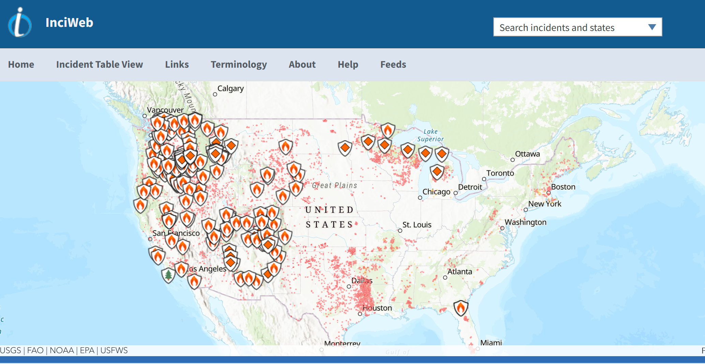

# National Interagency Fire Center

## URL

[https://www.nifc.gov/](https://www.nifc.gov/)

## Description

The [National Interagency Fire Center](https://www.nifc.gov/) is a resource for wild land fire personnel and other emergency services employees to perform their jobs regarding wildfire management.

The NFIC's website provides historical information on wildfires in the United States including statistics, maps, daily situation reports, news, agency-specific information and general information about how ground wildfires are managed. A researcher can use the site in various ways including clicking on the links for specific information relating to wildfires including general fire data, updates to current wildfire incidents, historical information for past wildfires, maps, statistics and more. The website also offers a keyword search function which will return the results containing the searched terms.

<figure><figcaption></figcaption></figure>

The [InciWeb](https://inciweb.wildfire.gov/) provides information about various wildfires in the United States.

<figure><figcaption></figcaption></figure>

The [National Fire News](https://www.nifc.gov/fire-information/nfn) section is updated on a weekly basis with information about how many large fires are currently active across the country, and the number of firefighters, support personnel and equipment currently assigned to those incidents. Other information includes geographical information and potential wildfire outlooks.

<figure><figcaption></figcaption></figure>

[Statistics](https://www.nifc.gov/fire-information/statistics) include data such as how many incidents and burned acres year-to-date, how many of those acres were burned in large fires, how many large fires are currently being suppressed, how many new large fires there are and how many personnel as well as other information are also available.

## Cost

* [x] Free
* [ ] Partially Free
* [ ] Paid

## Level of difficulty

<table><thead><tr><th data-type="rating" data-max="5"></th></tr></thead><tbody><tr><td>1</td></tr></tbody></table>

## Requirements

Internet access is required for accessing the NIFC.

## Limitations

The NIFC has a lot of information that may be overwhelming to sort through depending on the needs of the user and may require time to find the specific information. It does not provide real-time information on wildfires.

The NIFC is also located in Boise, Idaho, which is located in the Mountain Time Zone. Updates to the website including daily situation reports, news and other information may be dependent on when employees can access the site. There may also be delays if the area is under the threat of wildfires in the area.

There may be delays in updates to the NIFC due to [cuts](https://www.ms.now/news/doge-cuts-trump-administration-minnesota-wildfire-elon-musk) to the federal government, including staff who may have been tasked with updating and uploading the newest information.

## Ethical Considerations

None.

## Guides and articles

[Scientific Data](https://www.nature.com/articles/s41597-025-05208-0): This study is an example of how NIFC data can be used.

## Tool provider

The NIFC is a website of the United States Department of Interior.

## Similar tools

Users looking for state-specific information may perform searches of the requested state government websites.

## Advertising Trackers

* [x] This tool has not been checked for advertising trackers yet.
* [ ] This tool uses tracking cookies. Use with caution.
* [ ] This tool does not appear to use tracking cookies.

| Page maintainer           |
| ------------------------- |
| Bellingcat volunteer team |
|                           |
