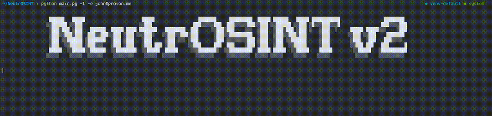

# NeutrOSINT

## URL

[https://github.com/Kr0wZ/NeutrOSINT](https://github.com/Kr0wZ/NeutrOSINT)

## Description

NeutrOSINT is an open-source Python tool designed to determine if a Proton Mail email address exists and to retrieve its most recent PGP Key creation date.


**PGP (Pretty Good Privacy)**

PGP is an encryption method used to encrypt and sign messages developed by Philip Zimmermann in 1991.

* It ensures **confidentiality** by encrypting data so only the intended recipient can decrypt it;
* It guarantees **integrity** by allowing the recipient to verify that the message wasn’t altered during transit;
* It offers **authentication** through digital signatures that confirm the sender’s identity;
* And it supports **non-repudiation**, meaning the sender cannot later deny having sent the signed message.

Proton Mail automatically creates PGP key pairs with each email. These pairs are then used to encrypt and sign outgoing messages as well as decrypt incoming messages.

You can generate a new PGP key pair in your Proton Mail settings.

For more information on PGP and how it is used by Proton Mail, check these two guides:

* [What is PGP encryption and how does it work? - Proton Blog](https://proton.me/blog/what-is-pgp-encryption)
* [How to use PGP with Proton Mail - Proton Blog](https://proton.me/support/how-to-use-pgp)


<figure><figcaption><p>NeutrOSINT uses the email's associated PGP key to detect if an email exists or not.</p></figcaption></figure>

The tool supports two modes:

* **Light Mode (API Mode):** Uses Proton Mail's API to check email validity. This mode is best suited for quick checking a few usernames or emails as the API has a request limit.
* **Selenium Mode (Browser-automated mode):** Connects with your own Proton Mail credentials to check email addresses. Use this mode to test a consequent list of usernames or emails without getting a cooldown. Also use it when you need to verify [business emails](https://proton.me/blog/business-email-address).

## Cost

* [x] Free
* [ ] Partially Free
* [ ] Paid

The tool is free and open source.

## Level of difficulty

<table><thead><tr><th data-type="rating" data-max="5"></th></tr></thead><tbody><tr><td>3</td></tr></tbody></table>

The tool requires users to run Python scripts and configure API access or credentials.

## Requirements

* **Python** (compatible with Python 3.6+)
* **Optional:** Google Chrome (for Selenium Mode)
* **Optional:** Proton Mail credentials (for Selenium Mode)
* **Optional:** Proxy configuration if needed (for bypassing the API's request limit).
* **Optional:** A file containing the list of email addresses for batch operations

## Limitations

* **On PGP Key Creation Date**: The PGP Key Creation Date isn't always the email address creation date as a new PGP Key can be generated from the Proton Mail settings.
* **API Limits:** The light mode relies on Proton Mail's API that has request limit of 100 requests per hour.

## How to Use

### Installation

1. **Clone the NeutrOSINT Repository:**

Open your terminal and run:

```
git clone https://github.com/Kr0wZ/NeutrOSINT.git
cd NeutrOSINT
```

2. **Set Up a Virtual Environment**

```
python3 -m venv venv
source venv/bin/activate # For Linux/Mac
venv\Scripts\activate # For Windows
```

[This article](https://new.pythonforengineers.com/blog/python-tip-always-use-a-virtual-environment/) explains why virtual environments are recommended for manipulating Python projects.

3. **Install NeutrOSINT:**

```
pip install -e .
```

### Usage

#### Command Syntax

```
 neutrosint [-h] [-l] [-u USERNAME] [-p PASSWORD] [-f FILE | -e EMAIL] [-k] [-o FILE] [-P IP:PORT]
```

#### Options

```
  -h, --help            show the help message
  -l, --light           Light mode in which we call the API instead of connecting with credentials. Useful when few emails to check. This mode is used by default when the option is not specified.
  -u USERNAME, --username USERNAME
                        (Selenium Mode) Username to connect to your ProtonMail account
  -p PASSWORD, --password PASSWORD
                        (Selenium Mode) Password to connect to your ProtonMail account
  -f FILE, --file FILE  Specify containing list of emails to check
  -e EMAIL, --email EMAIL
                        Check existence of this email. You can also input a username and it will look for the associated emails in all Proton's domains.
  -k, --key             Print the public PGP key for that email account
  -o FILE, --output FILE
                        File where results are stored
  -P IP:PORT, --proxy IP:PORT
                        IP:PORT of proxy to make requests. To use Tor, you must have installed it and specify '127.0.0.1:9050' as proxy
```

### Examples

**Example 1: Validate a Single Email Address**

This is the most basic usage of NeutrOSINT. It will test **testemail@proton.me** validity and display its **PGP Creation Date**, **Fingerprint** and **Encryption Algorithm**.

```
neutrosint -e testemail@proton.me
```

Output:

```
[+] Valid email: testemail@proton.me - PGP key creation date: 2024-01-23 19:03:09 - Fingerprint: 48a12baccc85050aca5372933902de16b4d380d5 - Algorithm: ECC Curve25519
```

**Example 2: Display the PGP Public Key**

You can specify the **-k** option to display the PGP Key.&#x20;

```
neutrosint -e testemail@proton.me -k
```

Output:

```
[+] Valid email: testemail@proton.me - PGP key creation date: 2024-01-23 19:03:09 - Fingerprint: 48a12baccc85050aca5372933902de16b4d380d5 - Algorithm: ECC Curve25519
-----BEGIN PGP PUBLIC KEY BLOCK-----
Version: ProtonMail

xjMEZa//XRYJKwYBBAHaRw8BAQdAlrdmzYiqWhpOXKvXzrxVfROeXFkkk2pZ
LhmJSBEI/FDNKXRlc3RlbWFpbEBwcm90b24ubWUgPHRlc3RlbWFpbEBwcm90
b24ubWU+wr8EExYIAHEFgmWv/10DCwkHCRA5At4WtNOA1TUUAAAAAAAcABBz
YWx0QG5vdGF0aW9ucy5vcGVucGdwanMub3JnrnuQFWwUa3SonwqI2d0WEAIV
CAMWAAICGQECmwMCHgEWIQRIoSuszIUFCspTcpM5At4WtNOA1QAA6IkA/0lz
c9mUVF0fhbbylbWW1uHCdWIzR/49+p3/8/HbNGYPAQDcmAggo6MDnfA5XsYM
+JRaKMPIHaP+VrU0vhjWrAwRCc44BGWv/10SCisGAQQBl1UBBQEBB0BE1Q6b
BXErbggFa2YhRMg75yUG7L2zwomI90AHthKoBwMBCgnCrgQYFggAYAWCZa//
XQkQOQLeFrTTgNU1FAAAAAAAHAAQc2FsdEBub3RhdGlvbnMub3BlbnBncGpz
Lm9yZ8ouMuN9vVvT1xInLOdGJE8CmwwWIQRIoSuszIUFCspTcpM5At4WtNOA
1QAADqEBAIKTLyp9hYAbUtFQqeSRS+c2W2Jlny6Hk1SzYefvTcKRAP4h4UtA
WLtava4OQTLtDRF2Cia64P7TRSnrjXnbW49RBQ==
=BDcT
-----END PGP PUBLIC KEY BLOCK-----
```

**Example 3: Fetch for a username**

You can specify a username and it will look for the associated emails in all known Proton domain names.

```
neutrosint -e ausername
```

Output:

```
[+] Valid email: ausername@proton.me - PGP key creation date: 2022-04-15 14:34:15 - Fingerprint: faf075734410f5fd5d17dca0371cde3748787c9c - Algorithm: ECC Curve25519
[+] Valid email: ausername@protonmail.com - PGP key creation date: 2016-09-18 18:45:41 - Fingerprint: a3e3117f120e5c943bacc7f9fa23b3614b64ce53 - Algorithm: RSA 2048
[-] Proton email does not exist: ausername@pm.me
[+] Valid email: ausername@protonmail.ch - PGP key creation date: 2024-06-23 14:10:00 - Fingerprint: 3188ad11691d4be2a2ac914dc0a221bd972514ae - Algorithm: ECC Curve25519
[-] Proton email does not exist: ausername@passmail.net
```

**Example 4: Validate Multiple Emails from a File**

Create a file named **emails.txt** with one entry (email or username) per line:

```
testemail1@proton.me
testemail2@proton.me
invalidemail@proton.me
testemail
```

Run the command below. It will also save the results in a results.txt file.

```
neutrosint -f emails.txt -o results.txt
```

Output:

```
[+] Valid email: testemail1@proton.me - PGP key creation date: 2024-05-26 14:59:57 - Fingerprint: ecad29c2dbe7bfe2502de60ead400eed276af9d5 - Algorithm: ECC Curve25519
[+] Valid email: testemail2@proton.me - PGP key creation date: 2024-10-10 18:18:32 - Fingerprint: 0fe007f41351ef6daf04d938c485697fe97859f6 - Algorithm: ECC Curve25519
[+] Valid email: invalidemail@proton.me - PGP key creation date: 2024-01-14 04:58:45 - Fingerprint: eb75346a5445fdfed2a4763b6558080449dcfd52 - Algorithm: ECC Curve25519
[+] Valid email: testemail@proton.me - PGP key creation date: 2024-01-23 19:03:09 - Fingerprint: 48a12baccc85050aca5372933902de16b4d380d5 - Algorithm: ECC Curve25519
[+] Valid email: testemail@protonmail.com - PGP key creation date: 2020-03-18 05:37:43 - Fingerprint: 0a2b8de4786db46dd34fa43328fb68b38741b588 - Algorithm: RSA 2048
[-] Proton email does not exist: testemail@pm.me
[+] Valid email: testemail@protonmail.ch - PGP key creation date: 2024-09-05 14:09:24 - Fingerprint: c30fa959ceec222bb749433ced59990eb9220863 - Algorithm: ECC Curve25519
[-] Proton email does not exist: testemail@passmail.net
```

**Example 5: Using Selenium Mode**

The request limit of the API in Light Mode is 100 requests. When you reach the API limit, the following message will be displayed:

```
[+] Valid email: someemail@protonmail.com - Can't retrieve PGP keys. API limit reached
```

If you reach this limit or if you know you have a lot of entries to test, then you can use Selenium Mode which requires to have a valid set of credentials. The Selenium Mode will automate a browser to simulate a human-like interaction with the Proton Mail website. It will login using your credentials, start composing a new email and check for the target availability.

When you type in an email in the destination field, a request is made to check for the email availability when it's a Proton Email.

<figure><figcaption><p>The lock shows that the email is valid and the encryption is possible.</p></figcaption></figure>

<figure><figcaption><p>When the email does not exist, an error message is displayed.</p></figcaption></figure>

The Selenium Mode will leverage the UI's capabilities to retrieve this information. To use it you need to specify your email and password using the **-u** and **-e** options.

This example will use a file containing more than 100 usernames.


**Example 6: Using a Proxy (Advanced)**

Start your proxy and specify it in the command line (e.g. 127.0.0.1:8080). You might want to use:

* [**Tor**](https://www.torproject.org/)**:** The Onion Router opens a proxy at 127.0.0.1:9050
* Any free or paid proxy from a provider you trust.
* Your own proxy.

```
python main.py -l -e testemail@proton.me -o results.txt -P 127.0.0.1:8080
```

Output:

```
[+] Valid email: testemail@proton.me - Creation date: 2023-01-18 11:13:24
```

### Advanced Usage: Bypassing API Limits through proxies (requires a bit of scripting knowledge)

1. **Using multiple proxies**

If you have multiple emails to test, you can develop your own script to use multiple proxies and avoid a cooldown. Let's say you have three different proxies. Here's how you would do it in bash:

```bash
#!/bin/bash

# Define the list of proxies
proxies=(
    "127.0.0.1:8080"
    "127.0.0.1:8081"
    "127.0.0.1:8082"
)

# Define the input file containing email addresses
input_file="emails.txt"

# Define the output file to store the results
output_file="results.txt"

# Loop through each email address
while IFS= read -r email; do
    for proxy in "${proxies[@]}"; do
        echo "Testing email: $email with proxy: $proxy"
        # Execute the command and append the results directly to the output file
        python main.py -l -e "$email" -P "$proxy" >> "$output_file" 2>&1
        if [ $? -ne 0 ]; then
            echo "Error while testing email $email with proxy $proxy. Trying next proxy."
            continue  # Change proxy and retry
        else
            break  # Exit the proxy loop if successful
        fi
        # Wait for 2 seconds to avoid cooldowns
        sleep 2
    done
done < "$input_file"

echo "Testing completed. Results appended to $output_file."

```

2. **Using Tor Circuit Changing**

Another solution would be to route requests through the Tor network. If a request fails, the script requests a new Tor circuit to attempt the validation again.

```bash
#!/bin/bash

# Define the Tor control port and authentication (if required)
tor_control_port="127.0.0.1:9051"
tor_password=""  # Add the Tor control password if needed

# Define the input file containing email addresses
input_file="emails.txt"

# Define the output file to store the results
output_file="results.txt"

# Function to request a new Tor circuit
new_tor_circuit() {
    echo "Requesting a new Tor circuit..."
    if [ -n "$tor_password" ]; then
        echo -e "AUTHENTICATE \"$tor_password\"\nSIGNAL NEWNYM\nQUIT" | nc $tor_control_port
    else
        echo -e "SIGNAL NEWNYM\nQUIT" | nc $tor_control_port
    fi
    sleep 10  # Wait for the new circuit to be established
}

# Loop through each email address
while IFS= read -r email; do
    while true; do
        echo "Testing email: $email with Tor circuit"
        # Execute the command and append the results directly to the output file
        python main.py -l -e "$email" >> "$output_file" 2>&1
        if [ $? -ne 0 ]; then
            echo "Error while testing email $email. Requesting new Tor circuit."
            new_tor_circuit  # Request a new Tor circuit and retry
        else
            break  # Exit the retry loop if successful
        fi
        # Wait for 2 seconds to avoid cooldowns
        sleep 2
    done
done < "$input_file"

echo "Testing completed. Results appended to $output_file."
```

## Ethical Considerations

Use responsibly for legitimate research purposes.

## Guides and articles

[GitHub - NeutrOSINT](https://github.com/Kr0wZ/NeutrOSINT): Includes detailed instructions for setup and usage.

## Tool provider

The tool is developed and maintained by [KrowZ](https://blog.synoslabs.com/about.html), a french pentester, youtuber, streamer and OSINT enthusiast.

## Advertising Trackers

* [x] This tool has not been checked for advertising trackers yet.
* [ ] This tool uses tracking cookies. Use with caution.
* [ ] This tool does not appear to use tracking cookies.

| Page maintainer           |
| ------------------------- |
| Bellingcat Volunteer Team |
