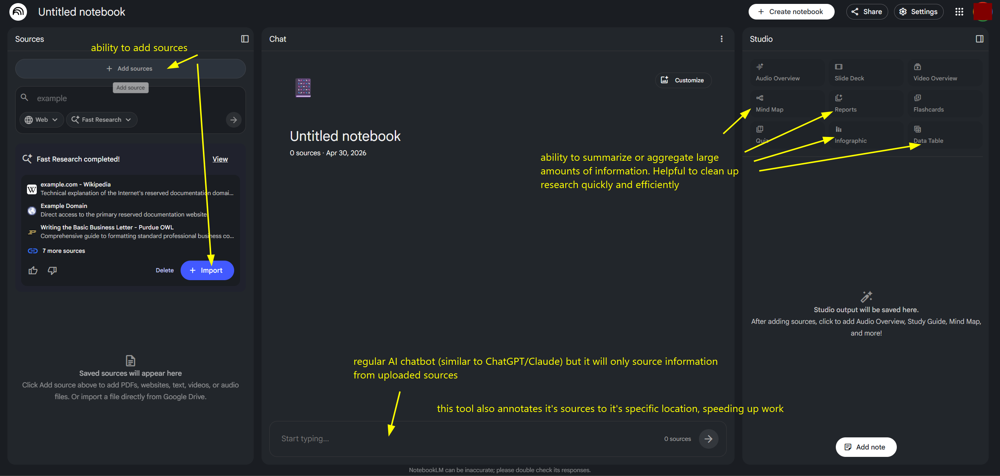

# NotebookLM

## URL

[https://notebooklm.google.com/](https://notebooklm.google.com/)

## Description

NotebookLM is an AI-powered research tool built on Google’s Gemini models that allows users to upload their own documents and interact with them through a chat-based interface. Instead of pulling information from the wider web, it only references the sources you provide, which makes its outputs more grounded in a specific dataset.

Once documents are uploaded, NotebookLM can generate summaries, answer questions, and highlight connections across multiple sources. It can also point to where specific information comes from within the uploaded material, allowing users to trace responses back to original documents.

For open source researchers, this is useful when working with large collections of data such as social media posts, reports, transcripts, or archived content. Rather than manually reviewing each source, researchers can use NotebookLM to quickly extract key information, compare narratives across sources, and identify patterns within a dataset. This can help speed up the analysis phase of an investigation, especially when dealing with large or unstructured amounts of information.\
\
Use cases:

* Summarizing large collections of social media posts, reports, or leaked documents
* Comparing claims across multiple sources to identify inconsistencies or overlaps
* Identifying repeated narratives or patterns in disinformation campaigns
* Organizing and extracting key points from large datasets used in investigations 

#### Specific use case:

NotebookLM can be used to analyze a collection of social media posts or documents related to a potential disinformation campaign. By uploading multiple sources, researchers can quickly identify repeated phrases, shared narratives, or overlapping claims, helping trace how information spreads.

<figure><figcaption></figcaption></figure>

## Cost

* [x] Free
* [ ] Partially Free
* [ ] Paid

The free tier of this app has daily limits on amount of sources, notebooks, chat queries and audio/video generations.\
\
The price for the paid version is $19.99/month for higher limits.\
\
Free version:

* Up to 50 sources per notebook
* Up to 100 notebooks total
* Up to 500,000 words per source (very large docs)
* Up to 200MB per file upload
* 50 chat queries per day
* [https://support.google.com/notebooklm/answer/16269187?hl=en\&sjid=10357465133907705294-NC#zippy=%2Cfile-size-limit-for-sources-in-notebooklm%2Climits-for-notebooklm](https://support.google.com/notebooklm/answer/16269187?hl=en\&sjid=10357465133907705294-NC#zippy=%2Cfile-size-limit-for-sources-in-notebooklm%2Climits-for-notebooklm)

Paid version:

* 300 sources per notebook (much larger scale)

**Note**: Researchers can partially work around this limitation by consolidating multiple pieces of information into fewer documents (combining social media posts or notes into a single file). However, this requires additional preprocessing and may reduce clarity or traceability between individual sources.

## Level of difficulty

<table><thead><tr><th data-type="rating" data-max="5"></th></tr></thead><tbody><tr><td>1</td></tr></tbody></table>

## Requirements

* Google Account

## Limitations

* NotebookLM only works with uploaded sources and cannot independently browse or retrieve external data
* The number of sources per notebook is limited (approximately 50 sources in the free version), which can be restrictive for large-scale investigations
* It is primarily designed for analysis and summarization, not for data collection or scraping
* While more grounded than general-purpose LLMs, it can still misinterpret or incorrectly summarize source material
* Uploaded documents are stored and processed by Google

## Ethical Considerations

* Documents are stored and processed by Google, so this is not ideal for sensitive/classified information.
* Still has potential for hallucinating/misunderstanding your source information, although this seems to be substantially lower than LLMs like Claude and ChatGPT given that doesn't reference the wider web.
* According to Google, NotebookLM does not use uploaded documents to train its models. However, documents are still processed and stored by Google, meaning sensitive or high-risk data should be handled with caution.\
  More info: [https://support.google.com/notebooklm/answer/17004255?hl=en\&sjid=10357465133907705294-NC](https://support.google.com/notebooklm/answer/17004255?hl=en\&sjid=10357465133907705294-NC)

## Guides and articles

[Google's Official Guide](https://support.google.com/notebooklm#topic=16164070)

[YouTube Tutorial - Santrel Media](https://www.youtube.com/watch?v=UG0DP6nVnrc)

## Tool provider

Google

## Similar tools

* ChatGPT/Custom GPTS
  * Weakness: Creating Custom GPTs is a paid service
  * Weakness: Not optimized for handling large/complex datasets
  * Strength: Custom GPTs are similarly useful
  * Strength: web browsing can be enabled if outside sources are needed
* Claude/Claude Projects
  * Weakness: Creating custom projects is a paid service
  * Weakness: Not optimized for handling large/complex datasets
  * Weakness: Not clear if you can turn off web browsing.
  * Strength: Custom projects are similarly useful

## Advertising Trackers

* [ ] This tool has not been checked for advertising trackers yet.
* [x] This tool uses tracking cookies. Use with caution.
* [ ] This tool does not appear to use tracking cookies.

| Page maintainer |
| --------------- |
| Arsen Drobakha  |
