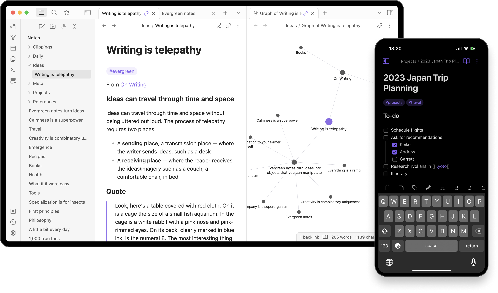

# Obsidian

## URL

[https://obsidian.md/](https://obsidian.md/)

## Description

Obsidian is a knowledge base on top of a local folder of plain text Markdown files. It is designed to make it easy to write and organize your thoughts, ideas, and projects, effectively turning your collection of notes into a connected web of knowledge. This tool is aimed at helping individuals manage their knowledge, supporting various uses from academic research, personal note-taking, to project management.

One of the key features of Obsidian is its ability to create and follow links between your notes, allowing you to navigate your knowledge base like a personal wiki. You can easily reference other notes, creating a network of information that is easy to traverse and expand. The tool also supports advanced Markdown editing, customizable themes, and community-developed plugins that extend its functionality further. Obsidian supports plugins that allow [Omnivore](https://app.gitbook.com/o/WQpOq5ZFue4N6m65QCJq/s/PI7b9IZu22nWNb4YYhRC/ "mention") highlights to be imported.

Although free it's not open source.

<figure><figcaption>
Obsidian Screenshot
</figcaption></figure>

Obsidian can be particularly useful for journalists in several ways:

1. **Research Organization**: It enables the consolidation of research notes, sources, and data all in one place, making it easier to manage and navigate through extensive information.
2. **Story Development**: Journalists can construct and organize their story or article outlines, connecting different pieces of research and notes to flesh out their texts.
3. **Interview Management**: Keeping track of interview notes is simplified, as each interview can be linked to topics, stories, or other interviews, creating a web of information that is easy to reference.
4. **Archiving Stories and Sources**: By using Obsidian, journalists can archive their stories, notes, and sources in a searchable, interconnected manner, making it easy to retrieve and re-use information in the future.
5. **Collaboration**: Though primarily designed for personal use, Obsidian's ability to work with local Markdown files means journalists can use third-party tools to sync and collaborate on files with colleagues.

## Cost

* [ ] Free
* [x] Partially Free
* [ ] Paid

<!---->

* **Personal use:** free.&#x20;
* **Commercial use**: paid.
* **Sync across devices**: paid.
* **Publish to cloud**: paid.&#x20;

## Level of difficulty

<table><thead><tr><th data-type="rating" data-max="5"></th></tr></thead><tbody><tr><td>2</td></tr></tbody></table>

## Requirements

Obsidian is available on the following platforms:

* MacOS
* Windows
* Linux
* iOS
* Android

## Limitations

While Obsidian is a powerful note-taking and knowledge base application, it has the following limitations:

* **Offline Only**: Primarily operates offline (unless you pay), which means real-time collaboration or cloud-based access is limited compared to some alternatives.
* **Learning Curve**: The plethora of features and customization options may be overwhelming for new users.
* **Mobile Experience**: While available on iOS and Android, the mobile experience might not be as robust as the desktop version due to screen size and different user interface considerations.
* **No Built-in Publish Feature**: Unlike some competitors, Obsidian requires additional plugins or external services to publish notes online.
* **Limited External Integration**: While plugins can extend functionality, native integration with external services (like Google Calendar or Trello) is not as extensive out of the box.

## Ethical Considerations

While Obsidian as a tool focuses on enhancing personal and professional productivity through effective note-taking and knowledge management, it carries its own set of ethical considerations:

* **Data Privacy**: Given its offline-first approach, users have significant control over their data. However, users must be vigilant about exporting or sharing their notes through external services, which may not uphold the same privacy standards.
* **Plugin Security**: The capacity to extend Obsidian's functionality with plugins is powerful but also introduces the need to trust third-party developers. Users must exercise caution, ensuring they install reputable plugins to avoid potential security risks.
* **Accessibility**: Although Obsidian offers a wide range of features, its learning curve and interface may pose accessibility challenges for users who are not tech-savvy or have disabilities. Efforts to make the application more intuitive and accessible could enhance its ethical standing.
* **Sustainability of the Free Model**: While Obsidian’s core functions are available for free, the long-term sustainability of such a model depends on a sufficient number of users opting for paid features. This balance between free access and financial viability is crucial to ensuring the tool's development and support.
* **Collaboration Equity**: The limited real-time collaboration feature in the absence of a paid subscription could create disparities in collaborative settings, especially in educational or low-income environments.&#x20;

## Guide

To effectively use Obsidian, especially for beginners or those looking to refine their skills, the following resources are highly recommended:

**Official Wiki**&#x20;

* [**Official help and documentation**](https://help.obsidian.md/Home): Obsidian Help site.&#x20;

**Tutorials and Articles**

* _A Guide to Obsidian: Local, Markdown-Powered Networked Notes — SitePoint_ (2021). Available at: https://www.sitepoint.com/obsidian-beginner-guide/, https://www.sitepoint.com/obsidian-beginner-guide/ (Accessed: 12 April 2024).
* Tietze, C. (2024) ‘Uncommon OSINT: Obsidian, Semantic Meaning and NLP’, _Medium_, 13 April. Available at: [https://medium.com/@farallon/uncommon-osint-obsidian-semantic-meaning-and-nlp-3339e1e51d70](https://medium.com/@farallon/uncommon-osint-obsidian-semantic-meaning-and-nlp-3339e1e51d70) (Accessed: 23 April 2024).

**Video Tutorials**

* _Obsidian for Beginners: Start HERE — How to Use the Obsidian App for Notes_ (2020). Available at: [https://www.youtube.com/watch?v=QgbLb6QCK88](https://www.youtube.com/watch?v=QgbLb6QCK88) (Accessed: 12 April 2024).
* _Obsidian Note Taking Tutorial for Beginners - Start HERE (w/ example)_ (2021). Available at: [https://www.youtube.com/watch?v=d3e7GWsqoU0](https://www.youtube.com/watch?v=d3e7GWsqoU0) (Accessed: 12 April 2024).

#### Developer Resources

* [**https://github.com/obsidianmd**](https://github.com/obsidianmd)

**Community and Support**

* [**User Forum**](https://forum.obsidian.md/)**:** help and support.
* [**Discord**](https://discord.gg/obsidianmd): community and support.

By utilizing these resources, users can enhance their Obsidian experience.

## Tool provider

Dynalist Inc. [https://obsidian.md/](https://obsidian.md/) - Canada

## Advertising Trackers

* [x] This tool has not been checked for advertising trackers yet.
* [ ] This tool uses tracking cookies. Use with caution.
* [ ] This tool does not appear to use tracking cookies.

| Page maintainer |
| --------------- |
| Unassigned      |
|                 |

