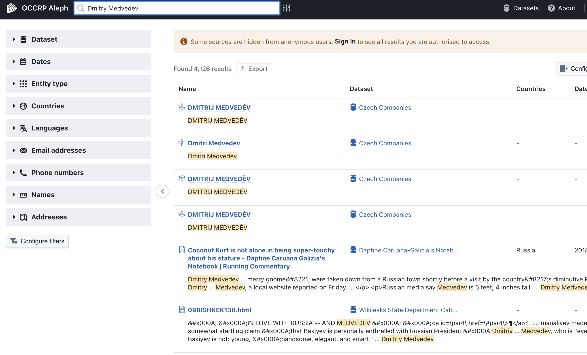
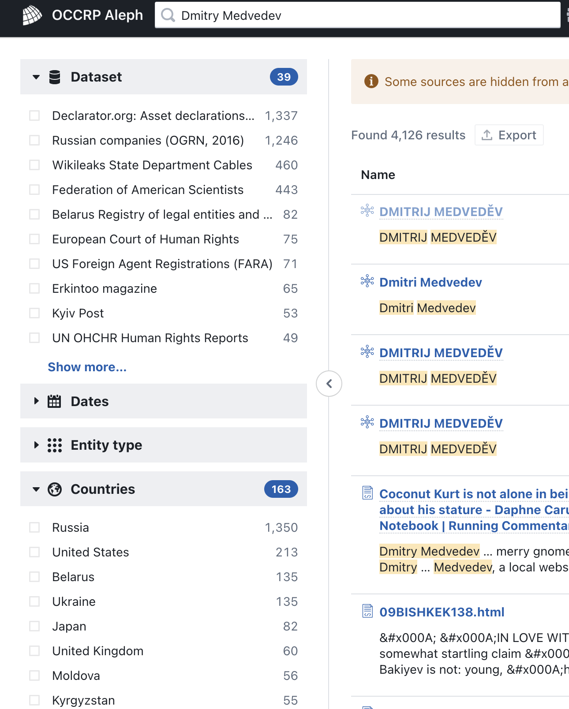
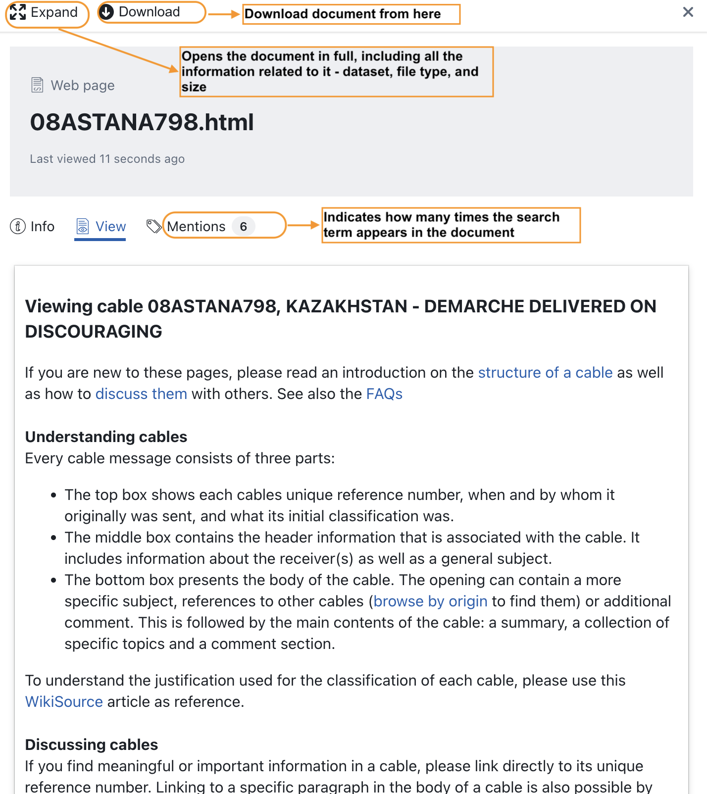
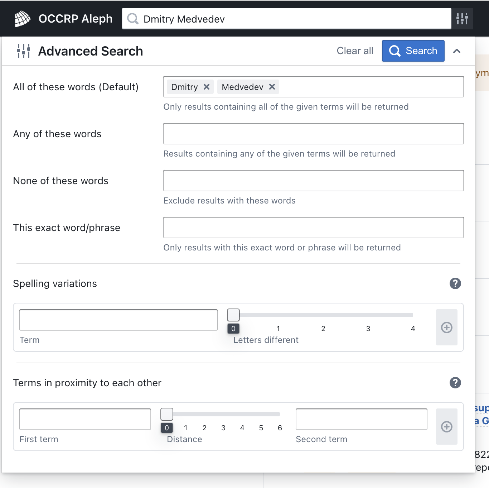
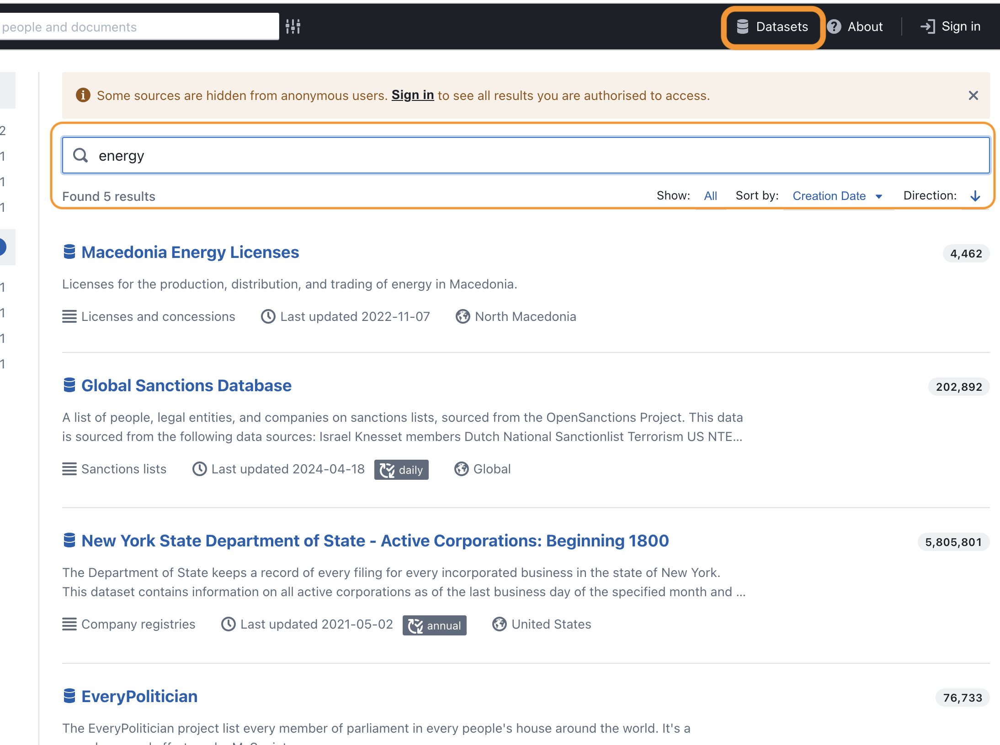
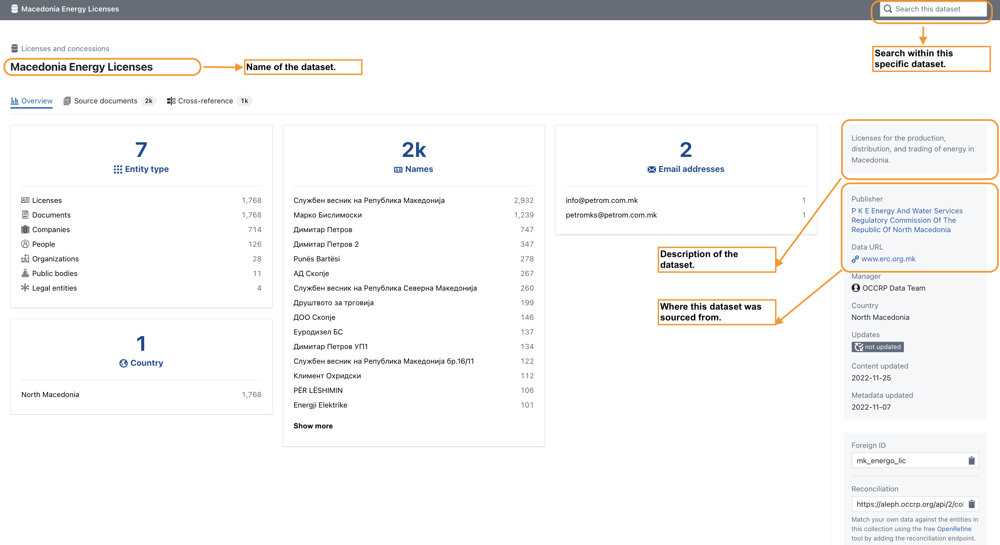
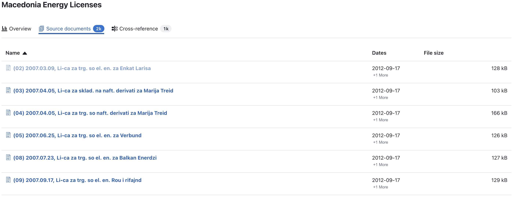
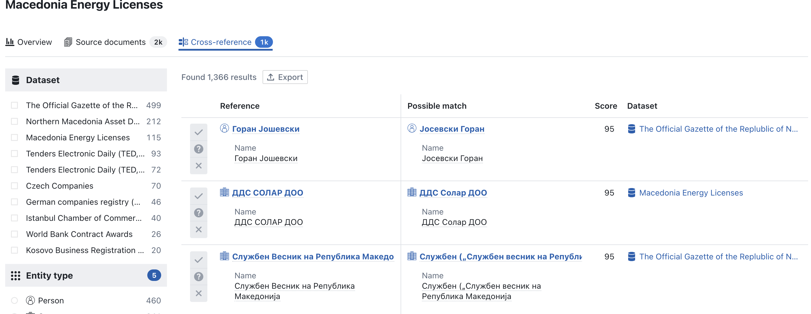

# OCCRP Aleph

## URL

[https://aleph.occrp.org/](https://aleph.occrp.org/)

## Description

Aleph is a platform by the Organized Crime and Corruption Reporting Project (OCCRP) to help journalists and investigators "follow the money". It provides access to many datasets on people and companies, and offers tools to organize and visualize data. Investigators can use Aleph to search sanctions lists, corporate registries, leaks, and more. They can also create workspaces to collaborate and upload their own data to cross-reference with Aleph's datasets.                 &#x20;

### How to search and filter data

Type the name of an individual, an organization, a company or a keyword in the search bar. The results will display the total number of mentions of your search term and the <mark style="color:yellow;">yellow highlights</mark> will show the context in which the search term appears.

<figure><figcaption>
 The search term Dmitry Medvedev returns over 4,000 results.
</figcaption></figure>

To narrow down the search results, use the menu on the left to filter by date, country, language of the document, and datasets[^1].

<figure><figcaption>
Example of all the available filters.
</figcaption></figure>

To view a particular entry, click on the hyperlink you are interested in. This opens a pop-up in the same window. From here you can review the document online or download it.

<figure><figcaption>
View of a selected document from the results page
</figcaption></figure>

The OCCRP Aleph website has a handy [video tutorial](https://www.youtube.com/watch?v=I3AxSMBzJ14) on how to search and filter data as well as written detailed instructions on [search basics](https://docs.aleph.occrp.org/users/search/basics/).

### How to perform an advanced search

In addition to basic keyword searches, Aleph offers advanced search capabilities, enabling users to find matches based on spelling variations, term proximity, and other sophisticated criteria.

The advanced search options can be helpful in cases when there are too many results and you need to narrow down your search further. You can use the fields in the advanced search, or you can use search operators.

<figure><figcaption>
Advanced search options on the Aleph website
</figcaption></figure>

Some examples of search operators that can be used instead of the advanced search form above:

_**""** Quotations - putting a phrase within quotations will prompt the search to find the exact match of that phrase, for example **"money laundering"** will return results for this same search term._

_**\~** Proximity variant 1 - this is useful when you need to search for slight variations in a search term, for example launder\~3 will search for launder, but also matches that that include up to 3-letter variations of "launder" - launder**ed,** launder**ing**, laund**ers**. These variations include adding, removing, and changing a letter._

_**\~** Proximity variant 2 - used to find words in proximity to each other and is helpful when you need higher relevance for the results, for example "fraud minister"\~5 will search these two words within a given distance from each other. In this case it will search for matches where **fraud** and **minister** are five or fewer words apart from each other._

_**+/-** Inclusion/exclusion of keywords - finds matches that contain one search term but exclude another, for example +Moscow -Medvedev will search documents that contain the word Moscow, but will exclude that contain Medvedev. Please be aware that in this case it will also exclude documents that contain BOTH Moscow and Medvedev._

_**AND** operator - searches matches in which each result must contain both the keywords, but won't return matches that only contain just one of those keywords, for example **Russia AND Medvedev**._

_**OR** operator - searches all matches that contain one or the other search keyword, or both, for example **Russia OR Medvedev**._

_Searches can be as intricate as you want them to be, for example +Medved\~2 AND (Moscow OR Kremlin OR Krasnodar) -Putin. Additionally, these searches work in Cyrillic._

OCCRP Aleph does provide a step-by-step tutorial on advanced searches [here](https://docs.aleph.occrp.org/users/search/advanced/).

### How to search within datasets

At the top of the Aleph page there is a menu called Datasets which opens a search for each dataset in the OCCRP databank. You can use the search bar to find a specific dataset and browse its contents.

<figure><figcaption>
The top right menu Datasets takes you to the search bar. Use keywords to find datasets you are interested in.
</figcaption></figure>

<figure><figcaption>
View of a specific dataset. Each of the names, emails, and entity types above is hyperlinked and opens a new page for the selected item.
</figcaption></figure>

Use the Source Documents menu to review each uploaded file in this dataset. The documents are all available for download. Additionally, you can chose the Cross-reference menu to check for different spellings of names, or variations in the names. The cross-reference results are also available for download and can help clear out uncertainties in your research.

<figure><figcaption>
Example of the Source documents view
</figcaption></figure> <figure><figcaption>
Example of the Cross-reference view
</figcaption></figure>

If you have created an account for Aleph, you can also make use of their Investigation workspaces. Here is a [detailed guide](https://docs.aleph.occrp.org/users/investigations/overview/) on how to create and handle a workspace.

You can find the[ languages supported on Aleph here](https://docs.aleph.occrp.org/developers/reference/languages/) and which ones have an [OCR](https://en.wikipedia.org/wiki/Optical_character_recognition) feature.

## Cost

* [x] Free
* [ ] Partially Free
* [ ] Paid

## Level of difficulty

<table><thead><tr><th data-type="rating" data-max="5"></th></tr></thead><tbody><tr><td>3</td></tr></tbody></table>

Aleph provides a range of tools and mechanisms to aid investigations. They are simple to use, but familiarizing yourself with the different tools and their functions may take some time.

## Requirements

No account is necessary to browse Aleph data. However, if you need an export of the results from a search, you need to create a free account. This requires the submission of evidence of relevant previous work (reports, articles, etc.), the name of the organization you are affiliated with and your role there. The same goes for creating research project spaces.

Some datasets are only accessible to approved users. To be approved, you must fill out [this form](https://occrp.atlassian.net/servicedesk/customer/portal/14).

## Limitations

The OCCRP has restricted access to certain datasets. Access to protected materials can be granted to investigative journalists, activists, or researchers.

Leaked datasets by nature are not always complete, and are thus imperfect sources.

Some data types are not compatible with Aleph.

## Ethical Considerations

While leaked datasets can provide valuable insights and foster transparency, they often involve sensitive and personal information obtained without consent. Thus, making use of these datasets can harm individuals whose data has been exposed. It is therefore imperative to weigh the public interest against privacy violations and ensure data is handled responsibly, with respect for legal and ethical standards.

## Guides and articles

[Aleph User Guide](https://docs.aleph.occrp.org/users/)

Aleph's[ technical documentation](https://docs.aleph.occrp.org/developers/) for developers, including an architecture overview, API usage, ingest pipelines, named entity and pattern extraction, development and operations guides.

OCCRP: [How to Search, Use Filters, and Set Alerts](https://www.youtube.com/watch?v=I3AxSMBzJ14)

Humber College's StoryLab: [Using OCCRP’s Aleph for Dark Web Data Analysis](https://humberstorylab.ca/projects/general/using-occrps-aleph-for-dark-web-data-analysis/)


A detailed introduction to Aleph


Associação Brasileira de Jornalismo Investigativo: [Learn how to use Aleph in your journalistic investigations](https://www.youtube.com/watch?v=4WEQvkOZWEw) (video in Portuguese)

## Tool provider

The [Organized Crime and Corruption Reporting Project (OCCRP)](https://www.occrp.org/en/about-us)

## Advertising Trackers

* [ ] This tool has not been checked for advertising trackers yet.
* [x] This tool uses tracking cookies. Use with caution.
* [ ] This tool does not appear to use tracking cookies.

| Page maintainer |
| --------------- |
| LPetrova        |

[^1]: Datasets in the OCCRP Aleph database range from public tender documentation, company registrations to human rights courts filings.
