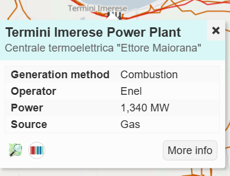
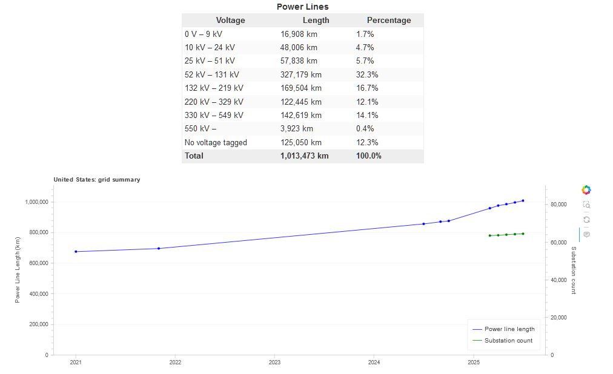

# Open Infrastructure Map

## URL

[https://openinframap.org](https://openinframap.org)

## Description

<figure><figcaption>
OPEN INFRASTRUCTURE MAP INTERFACE, SHOWING THE USER ZOOMING IN ON A LOCATION, SELECTING AN OFFSHORE WIND TURBINE THEN A POWER PLANT, AND SUMMONING AN INFORMATION WINDOW FOR EACH USING LEFT CLICK.
</figcaption></figure>

Open Infrastructure Map allows users to search for and view global infrastructure networks which include:

* power lines, power plants, generators, power line supports, switchgear
* telecom
* gas
* petroleum
* water
* other pipelines

Users can select and display different layers of infrastructure data at their chosen location on the globe. The map helps reveal infrastructure data from [OpenStreetMap](https://www.openstreetmap.org/) (OSM) which is not as easy to access when directly visiting [OSM](https://pmc.ncbi.nlm.nih.gov/articles/PMC8437094/).&#x20;

### The Interface

The tool presents a globe that the user can turn in order to zoom in on a geographical location of interest.  A location can also be selected by either typing a name or entering latitude and longitude co-ordinates into the search box on the top left of the screen. &#x20;

<figure><figcaption>
<strong>EXPLODED VIEW OF THE OPEN INFRASTRUCTURE MAP INTERFACE, SHOWING SOME OF THE FEATURES AVAILABLE</strong>
</figcaption></figure>

Clicking the **Layers button** on the right of the screen opens a checkbox list of various types of infrastructure that the user can select or deselect for display.  Clicking the **Key button** provides a guide to interpreting the icons and colored lines representing various infrastructure types, which the user can consult to identify the infrastructure being displayed. For example, an icon of a tower denotes a telecom tower; a red line represents a ≥ 220 kV powerline, and so forth. &#x20;

Once the user has zoomed in sufficiently on a location — e.g. a power station -- the user can left click on it, which opens a mini window containing additional details about the location.&#x20;

<figure><figcaption></figcaption></figure>

<mark style="color:$warning;">**EXAMPLE OF A MINI WINDOW SHOWING INFORMATION ABOUT THE TERMINI IMERESE POWER PLANT IN MALTA**<mark style="color:$warning;">&#x20;

The map also provides a selectable "[nighttime lights](https://mapyourgrid.org/tools/)" background option, in addition to the standard OSM background. <mark style="color:$warning;">This option could allow open source researchers to discover electrical grid damage or preservation after a natural disaster, for example.</mark>

On the top left of the screen, one can access significant functionality via the menu links labelled **About, Stats** and **Export**:

* **Stats:** This link allows for selecting an area (usually a country) to obtain statistical information on its electricity network; specifically:
*   The proportions of different voltage power lines and their cumulative length:

    <figure><figcaption>
<strong>EXAMPLE OUTPUT FOR USA: POWER LINES WITH DISTRIBUTION BY VOLTAGE &#x26; LENGTH:</strong>
</figcaption></figure>

    *   &#x20;The power plants by number, energy source and output in megawatts (MW):

        <figure><figcaption>
<strong>EXAMPLE OUTPUT FOR USA: POWER PLANTS DISTRIBUTED BY NUMBER, SOURCE &#x26; MW</strong>
</figcaption></figure>

    These statistics give a quick picture of the shape and composition of power generation and power networks.  That said, the statistics are based on OSM data, which is crowdsourced and therefore rarely 100% reliable.
* **Export:** This link details the scope of the Open Infrastructure Map data, the available formats for export and their limitations, and gives access to purchase exported data, along with the relevant terms and conditions. At the time of writing on 30/7/25, prices ranged from GBP 80 for a power export per country to GBP 700 for a power export worldwide.

Open Infrastructure Map can support investigations  around infrastructure, general geolocations and ecology/sustainability.

## Example Use Case

A user leveraged Open Infrastructure Map to [locate Los Angeles's Scattergood-Olympic underground transmission line.](https://news.ycombinator.com/item?id=29951252)

## Cost&#x20;

It is free to use the tool to view and explore infrastructure data, but access to large-scale or packaged commercial data exports comes with a cost.&#x20;

* [ ] Free
* [x] Partially Free
* [ ] Paid

## Level of difficulty

<table><thead><tr><th data-type="rating" data-max="5"></th></tr></thead><tbody><tr><td>2</td></tr></tbody></table>

## Requirements

An internet connection and browser.

## Limitations

* Open Infrastructure Map may be incomplete or contain outdated information <mark style="color:$primary;">because OpenStreetMap relies on crowdsourced data, which is unlikely to be</mark>[ <mark style="color:$primary;">100% accurate</mark>](https://www.nature.com/articles/s41467-023-39698-6)
* The infrastructure paths on the map may be schematic, i.e. they may omit information such as the exact path of the infrastructure — for example, a data cable — in favour of clearly displaying where the cable starts and finishes. (London's 'Tube' maps are a good example of schematic maps, also see [Evaluating schematic route maps in wayfinding tasks for in-car navigation by Galvado, Krukar and Schwering](https://pmc.ncbi.nlm.nih.gov/articles/PMC8437094/).)
* The [data exports provided by the tool](https://www.infrageomatics.com/products/osm-export) are validated to work correctly with Google Earth Pro, but due to their size, they may not work in all applications that consume KML ([Keyhole Markup Language](https://www.geowgs84.com/post/what-exactly-is-a-kml-file-and-how-can-i-create-one)). Due to size limitations with Google Earth Pro, KML exports for larger countries (the USA, Russia, and China) are filtered to only include power assets with a voltage rating of 25 kV or above, and generation assets with an output of 50 MW and above. Worldwide KML exports are not possible due to these limitations.

## Guides and articles

Article on research conducted with this tool: [https://news.sky.com/story/ukraine-war-how-much-the-lights-have-gone-out-in-kyiv-revealed-for-the-first-time-by-nasa-satellites-12773049](https://news.sky.com/story/ukraine-war-how-much-the-lights-have-gone-out-in-kyiv-revealed-for-the-first-time-by-nasa-satellites-12773049)&#x20;

Using the nighttime lights feature: [https://mapyourgrid.org/tools/](https://mapyourgrid.org/tools/)

## Tool provider

[Russ Garrett](https://russ.garrett.co.uk/) from London created and runs the tool.  He describes himself as a generalist software developer, systems architect and operations engineer.&#x20;

## Advertising Trackers

* [ ] This tool has not been checked for advertising trackers yet.
* [x] This tool uses tracking cookies. Use with caution.
* [ ] This tool does not appear to use tracking cookies.

| Page maintainer |
| --------------- |
| Sophie/Sarah    |
|                 |
