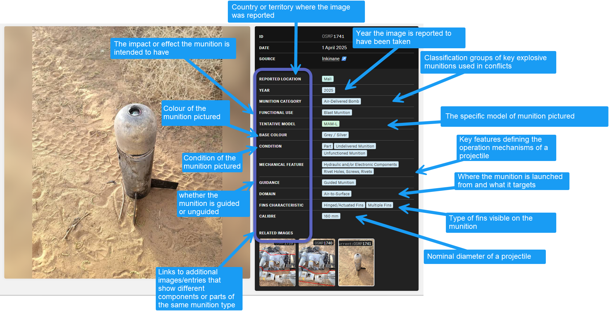
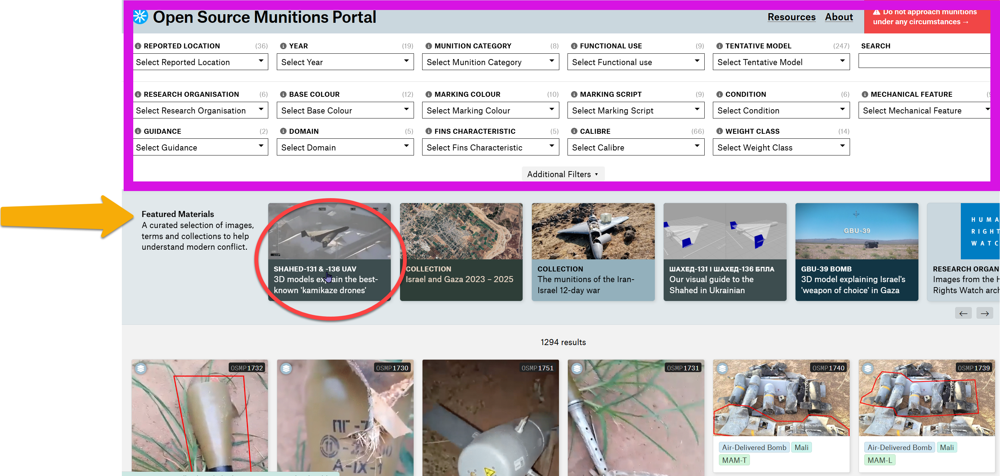
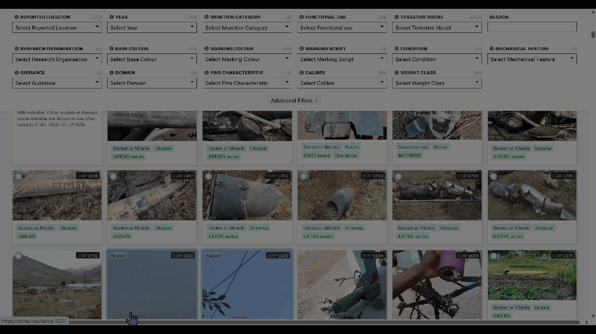
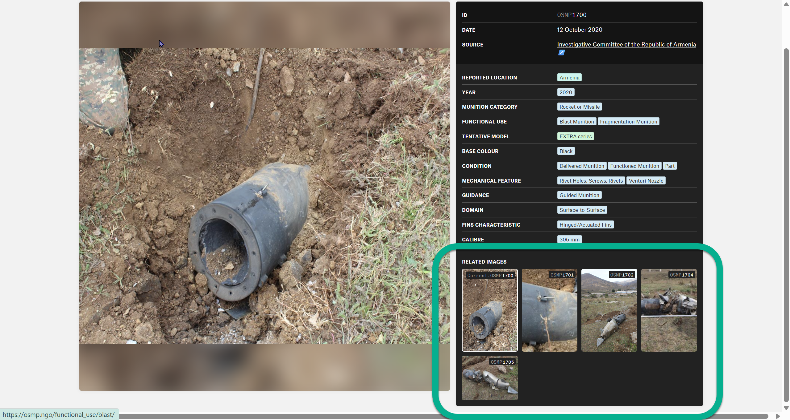
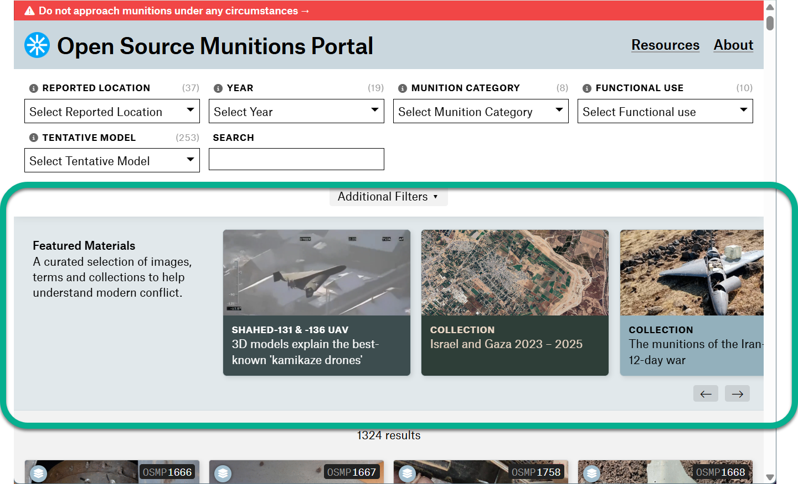
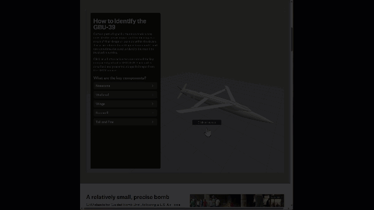

# Draft Rewrite 25 Nov 2025

## Description


Disclaimer: Munitions are dangerous. Do not approach them.&#x20;

This website contains information about ordnance, explosives and related items for educational and reference purposes only. The content should not be used for (1) attempting self-guided disposal of explosive devices; (2) manufacturing explosive devices or components; (3) handling explosive ordnance without proper training; (4) any illegal activities involving explosive materials.


Open Source Munitions Portal (OSMP) is a verified image repository of munition types. [It is a tool for researchers and journalists interested in learning about munition use and impact in conflicts.](https://osmp.ngo/about/) It contains more than 1000 verified images of [functioned munitions](#user-content-fn-1)[^1] and is particularly helpful for researchers, as it allows them to visually compare their image source with what is in the repository.

Any researcher or investigator interested in determining the type of munition used in a particular attack can visit the portal with their source imagery. They can then search through the portal’s images to make comparisons and see if they can find a match. If available, users will be able to find some, if not all of the following information about the munition: **Reported Location, Reported Year, Munition Category, Functional Use, Tentative Model, Base Color, Condition, Mechanical Feature, Guidance, Domain, Fins Characteristics, Caliber, Related Images, Research Organization, Marking Color, Marking Script.**


[Every image has been reviewed by at least two specialists](https://osmp.ngo/about/) (See methodology) before it is published in the portal. Every entry has been classified under at least one munition category. Researchers using this portal will, at a minimum, **be able to classify** the munition they are inquiring about.&#x20;


<figure><figcaption></figcaption></figure>


**TIP:** Based on our tests, the portal is more beneficial for current conflicts and images of munition fragments than for unexploded munitions.




### Data Source

The portal’s data comes from various sources.&#x20;

1. Social Media - According to the tool providers, the portal sources its images from social media platforms sync as Twitter/X, Telegram, and Facebook [(see timestamp 00:16:11)](https://rss.com/podcasts/bellingcatstagetalk/1965759/). It predominantly uses Arabic- and Ukrainian-language social media ([see timestamp 00:30:48](https://rss.com/podcasts/bellingcatstagetalk/1965759/))
2. Partner organizations - OSMP signed formal agreements with these organizations [(timestamp 00:17:00)](https://rss.com/podcasts/bellingcatstagetalk/1965759/) to use their images in the portal and link them to the source and external reference page.&#x20;

The partner organizations are: [Mwatana for Human Rights](https://www.mwatana.org/en/home), [Airwars](https://airwars.org), [ARES (Armament Research Services)](https://armamentresearch.com/), [Bellingcat](https://bellingcat.com), [Human Rights Watch](https://hrw.org), [Myanmar Witness](https://www.info-res.org/myanmar-witness/).

3. Public Submissions - The portal allows the public to submit an image and contribute to the portal’s archive via [this form. ](https://docs.google.com/forms/d/e/1FAIpQLSc27fdYPQEvV6lKHwEpddw4nZdU1YD0GOIvXRBKimIh35g0RA/viewform)


Submissions must include decent-quality images where the munition/remnant is visible and a source link. The team runs reverse-image searches on submitted content to seek the most reliable, closest-to-original sources before expert classification begins. [(Timestamp 00:29:02 - 00:30:21)](https://rss.com/podcasts/bellingcatstagetalk/1965759/)&#x20;


### Munition Categories



<table data-view="cards"><thead><tr><th></th><th data-hidden data-card-cover data-type="image">Cover image</th></tr></thead><tbody><tr><td><ul><li><a href="https://www.youtube.com/watch?v=Bw2Jji323ik"><strong>Air-Delivered Bomb</strong> </a></li></ul></td><td data-object-fit="contain"><a href=".gitbook/assets/2025-11-25_19-32-54.png">2025-11-25_19-32-54.png</a></td></tr><tr><td><a href="https://www.youtube.com/watch?v=UlLCAvMztfE"><strong>Artillery Gun Projectile</strong></a></td><td data-object-fit="contain"><a href=".gitbook/assets/2025-11-25_19-37-39.png">2025-11-25_19-37-39.png</a></td></tr><tr><td><a href="https://www.youtube.com/watch?v=8FTuKLzQkYg"><strong>Rockets and Missiles</strong></a></td><td data-object-fit="contain"><a href=".gitbook/assets/2025-11-25_20-36-41.png">2025-11-25_20-36-41.png</a></td></tr><tr><td><a href="https://youtu.be/zwlbretmEis?si=730m0Ds9CQMCv6Ee"><strong>Mortar Projectiles</strong></a></td><td data-object-fit="contain"><a href=".gitbook/assets/2025-11-25_20-32-25.png">2025-11-25_20-32-25.png</a></td></tr><tr><td><a href="https://www.youtube.com/watch?v=2kH1kEPCJI8"><strong>Tank Gun Projectiles</strong></a></td><td data-object-fit="contain"><a href=".gitbook/assets/2025-11-27_19-08-28.png">2025-11-27_19-08-28.png</a></td></tr><tr><td><a href="https://osmp.ngo/munition-category/mines/"><strong>Mines</strong></a></td><td></td></tr><tr><td><a href="https://osmp.ngo/munition-category/recoilless-munitions/"><strong>Recoiless Munitions</strong> </a></td><td></td></tr><tr><td><a href="https://osmp.ngo/munition-category/submunitions/"><strong>Submunitions</strong></a></td><td></td></tr></tbody></table>

Note that this category list is regularly updated. Check the OSMP website directly for the most current version.&#x20;

## How to Use: Interface and Navigation

Users can find information in the portal through different ways. Users can:

1. Filter; (2)  Use the search bar; (3) Use the collection of “Featured Materials”; (4) Use the “Related” Feature

### **KEYWORD SEARCH AND FILTER**

<figure><figcaption>
This image shows the various ways to search for munitions in the portal. This shows the landing page of OSMP. Immediately at the top (PURPLE BOX) are filtering and search options; Below (YELLOW ARROW) are munitions grouped as a "collection" either by munition type (those commonly used); by conflict area; or by research organization (munitions documented by external organizations). Users can also find 3D models of common munition types like the Shahed UAV and the GBU-39 (RED CIRCLE).
</figcaption></figure>

_**Users have 17 ways to filter for information. See the tabs below for the different input options.**_&#x20;



This functions as a standard search bar, allowing users to enter keywords of interest.&#x20;



_(Country or territory where the image was reported.)_&#x20;

Afghanistan, Armenia, Azerbaijan, Cambodia, Cyprus, Democratic Republic of the Congo, Ethiopia, Gulf of Oman, Haiti, Iran, Iraq, Israel, Israeli-occupied Golan Heights, Jordan, Kazakhstan, Laos, Lebanon, Libya, Mali, Marshall Islands, Myanmar, Nigeria, Pakistan, Palestinian Territories, Philippine Sea, Qatar, Red Sea, Russia, Saudi Arabia, Somalia, Sudan, Syria, Thailand, Ukraine, United Kingdom, United States, Yemen



_(Year the image is reported to have been taken)_

2003, 2006, 2009, 2010, 2011, 2012, 2013, 2014, 2015, 2016, 2017, 2018, 2019, 2020, 2021, 2022, 2023, 2024, 2025



Air-Delivered Bomb, Artillery Gun Projectile, Mines, Mortar Projectile, Recoilless Munitions, Rocket or Missile, Submunitions, Tank Gun Projectile

See [OSMP's Glossary](https://osmp.ngo/glossary) for the definition of each category.&#x20;



_(The impact or effect the munition is intended to have.)_

Blast Munition, Chemical Munition, Cluster Munition, Decoy Munition, Fragmentation Munition, Illumination Munition, Incendiary Munition, Kinetic Munition, Shaped Charge Munition, Smoke Munition

See [OSMP's Glossary](https://osmp.ngo/glossary) for the definition of each category.&#x20;



_(Specific model of the munition pictured)_

3-Z-2, 3M-14 / 3M-54 Kalibr series, 3M-14 Kalibr series, 3M-54 Kalibr series, 3M22 Zircon series, 3OF22, 3S9, 3VOF32, 3VOF81, 40M11, 57E6 Pantsir, 5V24/5V27 (S-125), 5V27 (S-125), 5V55 (S-300), 5V55 (S-300)/48N6 (S-400), 9M120, 9M14 Malyutka, 9M22 Grad series, 9M22S Grad, 9M22U Grad, 9M27 Uragan series, 9M27K Uragan, 9M27K Uragan series, 9M27K2, 9M27K3, 9M28-1 Grad, 9M28S Grad, 9M317 Series, 9M33 series, 9M330/9M331, 9M38 series, 9M38M1, 9M39, 9M51, 9M54 Smerch series, 9M544, 9M55 Smerch series, 9M55K Smerch series, 9M7 Iskander series, 9M723K1 Iskander, 9M79 Tochka series, 9M79K Tochka series, 9M79M Tochka, 9M83 series, A1Zh, A1ZhD, AASM-250 HAMMER series, ADM-160B MALD, AGM-114 Hellfire series, AGM-114 Hellfire/AGM-179 JAGM, AGM-114R9X Hellfire, AGM-142 Popeye series, AGM-154 JSOW series, AGM-154C JSOW, AGM-84 series, AGM-84H and AGM-84K SLAM-ER series, AGM-88 HARM and AARGM series, AGM-88E AARGM, APKWS series, Arash series, Arash-2, Arrow 2, Arrow 3, BGM-71 TOW, BK18M, BLU-108, BLU-109, BLU-111, BLU-117, Blue Sparrow series, BM-15, Brimstone I, Carpet, CBU-105D/B, CBU-52B/B, CBU-58A/B, Chameleon 3, D-5, DM 105, Emad, ERFB, EXTRA series, F-843, F-864, FAB-500 M54, FAB-500 M62, FAB-500Sh series, Fadak 2, Fajr 1, Falaq-1, Fattah-1, Fateh-110 series, FGM-148 Javelin missile, GBU-12 Paveway II series, GBU-16 Paveway II series, GBU-24 Paveway III series, GBU-31 JDAM, GBU-32 JDAM, GBU-38 JDAM, GBU-39 series, GBU-53/B StormBreaker, Gerbera series, GMLRS, Grom, Harop, Haseb Fajr-1, HE 60MA, HE 82M, HE ER FB-BB, J-M49A2, JDAM kit, JDAM-ER kit, JROF-K, JVA 1571, Kh-101, Kh-22 series, Kh-31 series, Kh-47M2 Kinzhal series, Kh-55 Series, Kh-59 series, Kh-59MK2, Kheibar Shekan, Kheibar Shekan / Fattah-1, KN-23/KN-24/Hwasong-11 series, Lizard kit, M-302/Khaibar-1/Fadi-2, M1, M107, M1101, M117 series, M150, M26 series, M302A1 / A2, M325, M329 APAM, M339, M344, M44A2, M48, M485, M485 series, M49A2, M712 Copperhead, M77/M101, M795, M824, M825 series, M825A1, M91, M927, M933 series, M982 Excalibur, M996, MAB-10B6, MAB-25E3, MAB-5B3, MAM-L, MAM-T, MGM-140 ATACMS series, Mikholit, MIM-401 Talon series (THAAD), MK 80 series, MK 82 series, MK 83 series, MK 84 series, MO.I.01.04 series, Nasr-1/Nasr-2, NLAW Missile, NR269, O-832, O-832 series, O-832D, OF-19, OF-25, OF-25T, OF-26, OF-29, OF-36, OF-39 Krasnopol, OF-43, OF-462, OF-462Zh, OF-482M, OF-540, OF-56-1, OF-843, OF-843B, OF-NMR, OF45, OF49, OF5, OF56, OF56-1, OF59, OFAB-100-120, OFAB-250 ShN, OFAB-500 ShR, OFZAB-500, OG-9 series, Osa series, P1A1, Paveh/Quds series, Paveway kit, PFM-1 series, PG-7 series, PG-7VL, PG-9, PTM-1 series, Qaem-5, R-122, R-13, R-27, R-73, R-77, Rampage series, RBK-250, RBK-500 PTAB-1M, RBK-500 series, RGM/UGM-109 Tomahawk Land Attack Missile (TLAM) series, RIM-161 Standard Missile 3 (SM-3) Blk I series, Romach/Bar series, S-25-O, S-25-OFM, S-5 series, S-5KPB, S-8, S-832S, S-843, S6, Shahab-3 series, Shahed-101 series, Shahed-131 series, Shahed-131/136 series, Shahed-136 series, Shahed-238 series, SkyStriker, SPICE 1000, SPICE 1000 kit, SPICE 2000, SPICE 2000 kit, SPICE 250, Spike Firefly, Spike series, Storm Shadow/SCALP-EG, Stunner, SUU-30H/B, Tamir, Type 63, Type 63 series, VOF-463M, ZAB-250-200





_(The external organization that documented the munition)_&#x20;

[Mwatana for Human Rights](https://www.mwatana.org/en/home), [Airwars](https://airwars.org), [ARES (Armament Research Services)](https://armamentresearch.com/), [Bellingcat](https://bellingcat.com), [Human Rights Watch](https://hrw.org), [Myanmar Witness](https://www.info-res.org/myanmar-witness/).



_(Colour of the munition pictured)_&#x20;

&#x20;Black, Blue, Brown, Copper, Gold, Green, Grey/Silver, Orange, Purple, Red, White, Yellow/Tan



_(Colour of all, or some of the markings on the munition)_

Black, Blue, Brown, Gold, Green, Grey/Silver, Orange, Red, White, Yellow



_(Language or script of the marking on a munition)_

Chinese, Cyrillic, Farsi, Hebrew, Japanese, Latin, Numerical, Symbols, Turkish



_(Condition of the munition pictured. See:_ [_OSMP Glossary_](https://osmp.ngo/glossary) _for the precise meaning of these terms. )_

Delivered Munition, Functioned Munition, Part, Undelivered Munition, Unfunctioned Munition, Whole




_(Key features defining the operation mechanisms of a projectile)_

Driving Bands; Flat Base; Hydraulic and/or Electronic Components; Obturating Rings or Gas Check Bands; Rivet Holes, Screws, Rivets; Rocket Assisted; Suspension Lugs; Venturi Nozzle; Welding Seams&#x20;





_(whether a munition is guided or unguided)_

_&#x47;_&#x75;ided munition, Unguided munition



_(Where a munition is launched from and what it targets)_&#x20;

Air-to-Air; Air-to-Surface; Drone (UAV); Surface-to-Air; Surface-to-Surface



_(The type of fins visible on the munition)_

Fins Attached to Perforated Cylinder; Fixed Fins; Hinged/Actuated Fins; Multiple Fins; Wide Fins



_(Nominal diameter of a projectile in mm or inches)_

55 mm, 57 mm, 60 mm, 70 mm, 72 mm, 73 mm, 76 mm, 80 mm, 81 mm, 82 mm, 85 mm, 90 mm, 93 mm, 105 mm, 106 mm, 107 mm, 120 mm, 122 mm, 125 mm, 127 mm, 130 mm, 150 mm, 152 mm, 155 mm, 160 mm, 165 mm, 178 mm, 180 mm, 200 mm, 203 mm, 206 mm, 220 mm, 227 mm, 230 mm, 235 mm, 240 mm, 254 mm, 265 mm, 266 mm, 300 mm, 302 mm, 306 mm, 310 mm, 343 mm, 350 mm, 357 mm, 360 mm, 370 mm, 375 mm, 380 mm, 400 mm, 500 mm, 514 mm, 518 mm, 533 mm, 600 mm, 610 mm, 630 mm, 650 mm, 740 mm, 800 mm, 910 mm, 920 mm, 1000 mm, 1250 mm, 1380 mm



_(Weight class of the aerial bomb pictured)_

2.5 kg, 20 kg, 49 kg, 50 kg, 200 kg, 250 kg, 250 lbs, 500 kg, 500 lbs, 700 kg, 750 lbs, 1000 lbs, 2000 lbs, 3000 lbs



### ANALYST NOTES

**Analyst Notes** are sometimes added to an OSMP entry after review by two ARES specialists. These notes provide extra details that may not necessarily be obvious from the basic classification. These are sometimes used to highlight diagnostic features or explain how they arrived at a tentative identification of a munition. This sometimes includes notes on specific variants when identifiable.&#x20;

Based on our tests, this bridges the gap between a simple tag and a full technical explanation, which gives users a more intermediate understanding of how the munition was identified without it being overly complicated.&#x20;


NOTE: This feature is not available in all entries. But it is recommended to check them if available.&#x20;

**TIPS:**&#x20;

1. Use Analyst Notes to find information on alternative names for munitions. **Munitions are sometimes called by different names**, such as the[ GBU-39, which is also referred to as SDB (Small Diameter Bomb)](https://osmp.ngo/osmp537/) OSMP537.
2. [GIJN's Tipsheet](https://gijn.org/stories/new-open-source-munitions-tool-investigate-bombing-civilians/) recommends checking this to counter misinformation and propaganda claims, as seen in [this entry ](https://osmp.ngo/osmp731/)


<table data-card-size="large" data-view="cards"><thead><tr><th></th><th data-hidden data-card-cover data-type="image">Cover image</th></tr></thead><tbody><tr><td><strong>FIRST:</strong> <strong>If available, researchers can find the "Analyst Notes" immediately at the landing page with the munition entry.</strong> </td><td><a href=".gitbook/assets/2025-12-01_14-00-07.png">2025-12-01_14-00-07.png</a></td></tr><tr><td><strong>SECOND: If available, researchers can find the "Analysts Notes"  when clicking on an individual OSMP entry, at the bottom of the classification and other information.</strong> </td><td><a href=".gitbook/assets/2025-12-01_14-01-09.png">2025-12-01_14-01-09.png</a></td></tr></tbody></table>

### RELATED MUNITIONS

A key feature of OSMP is its "Related" function.  The "Related" feature works like a cross-referencing tool in OSMP. It visually links other images or entries that show: (1) [Different parts or components of the same munition type](https://osmp.ngo/osmp1641/); (2) [Different views or angles of the same munition remnants that the user may not have previously seen](https://osmp.ngo/osmp1700/); (3) Additional remnants that may help with proper identification.&#x20;


Note that this feature is not available in all entries.&#x20;


There are two ways to do it.&#x20;

**METHOD 1: From the landing page, users can hover over one image/entry, and it will immediately highlight the other images related to their source imagery.**

<figure><figcaption>
METHOD 1: Users can hover over a particular munition entry, and the tool automatically highlights possible related munitions to what they are searching. Seen here, we hover over OSMP 1701 which automatically highlights in BLUE/GREY the other entries that are related to OSMP 1701. 
</figcaption></figure>

**METHOD 2: Click on an individual entry and scroll below to see related entries.**&#x20;

<figure><figcaption>
METHOD 2:  Click on an individual entry, in this case, OSMP 1700 and scroll to the bottom. If available, OSMP will link additional images that is related to the current image being investigated.  
</figcaption></figure>


TIP: Use this feature to boost investigation in two ways:&#x20;

1\) Gain a fuller picture - Start with fragment → find match → see related entries with different angles/components → gain fuller picture of more than just a remnant.&#x20;

2\) Backward discovery/ Finding more leads: Those related images reveal **what else to look for** → researcher returns to original incident site/footage → searches for previously unrecognized components now that they know what the complete munition looks like


### OSMP AND CIVILIAN HARM INCIDENTS

Use OSMP with [Airwars' database ](http://airwars.org/)of verified incidents of civilian harm.&#x20;

OSMP also links munitions directly to Airwars’[ verified civilian harm incidents](https://airwars.org/civilian-casualties/) to keep the focus on human impact. If available, users can find this by clicking on an individual OSMP entry and scrolling to the bottom. It is labeled **“External Research”** and includes an excerpt on the number of civilian deaths, location, and a link to the external source.&#x20;


This feature is not available in all entries.&#x20;


**For example:**&#x20;

[OSMP506](https://osmp.ngo/osmp506/) is associated with Airwars’s civilian harm incident [ISPT0283](https://airwars.org/civilian-casualties/ispt0283-october-17-2023/).

<figure><figcaption>
TWO-WAY DATABASE: If available, <strong>scroll down</strong> to "External Research" for any individual OSMP entry to check if there are links to incidents of civilian harm. Each incident report is verified with geolocation information. <strong>Scroll down</strong> on the individual Airwars incident for reference to a particular munition back to OSMP's database. 
</figcaption></figure>

### OSMP COLLECTION AND 3D MODELS

#### **OSMP Collection**&#x20;

Users can also find munition information in the featured materials collection on the landing page. At the moment, these are materials conveniently grouped according to conflict (i.e.[ Iran-Israel 12-day war](https://osmp.ngo/collection/iran-israel-conflict-june-2025/); [Ukraine 2022-2025](https://osmp.ngo/collection/ukraine-2022-2024/)) or according to research organization (i.e. [Human Rights Watch](https://osmp.ngo/research_organisation/human-rights-watch/))

<figure><figcaption>
Featured Materials found on the landing page of the tool, below the filtering options. 
</figcaption></figure>

#### 3D MODELS

OSMP also features a few 3D Models of common munition types. This includes a short introduction and an interactive 3D model with tips on identifying or differentiating the munition.&#x20;

<figure><figcaption>
Seen here is a 3D model of a GBU-39. To the left are key features to help users identify this particular munition. 
</figcaption></figure>

## Limitations

Note that the portal is a work in progress, and new items are constantly being added. This sometimes poses challenges, such as:

1. There may not be enough munition categories currently represented, and users may not be able to find specific munition categories, such as Small Arms and Light Weapons (SALW).&#x20;
2. There are not many entries on landmines at the moment, compared to CAT-UXO, [which has more than 400 entries. ](https://cat-uxo.com/explosive-hazards/landmines)
3. Geographic distribution is currently limited. A majority of the entries are found in the Middle East and Ukraine. There are a few entries for Europe and North America. However, Haiti has one entry, and South America currently has no entries. If looking for munitions related to these regions, it is advisable to use other tools, such as CAT-UXO.&#x20;

## Cost

Free

## Guides and Use Cases

Aagaard, Charlotte. "Major civilian casualties: Danish-equipped fighter jets behind bloody attack in Gaza." _Danwatch_, 1 September 2024. [https://danwatch.dk/en/major-civilian-casualties-danish-equipped-fighter-jets-behind-bloody-attack-in-gaza/](https://danwatch.dk/en/major-civilian-casualties-danish-equipped-fighter-jets-behind-bloody-attack-in-gaza/)

Ali, Taz. "Small, deadly GBU-39 bombs are Israel's weapons of choice." _i-news_, September 2024. [https://inews.co.uk/news/world/small-deadly-gbu-39-bombs-israel-weapons-choice-3261816](https://inews.co.uk/news/world/small-deadly-gbu-39-bombs-israel-weapons-choice-3261816)

Open Source Munitions Portal (OSMP). "Resources." OSMP. Accessed 2 December 2025. [https://osmp.ngo/resources/](https://osmp.ngo/resources/)

Philp, Rowan. "New Open Source Tools and Tips to Investigate Bombing of Civilians." _Global Investigative Journalism Network (GIJN)_, 2024. [https://gijn.org/stories/new-open-source-munitions-tool-investigate-bombing-civilians/](https://gijn.org/stories/new-open-source-munitions-tool-investigate-bombing-civilians/)

## Tool Provider

[Airwars](https://airwars.org/), UK and[ Armament Research Services (ARES)](https://aresarmament.com/), Australia

\
 

[^1]: The munition has either partially or fully operated, and the intended effect has occurred. For explosive munitions, this usually means a detonation. (Source: [https://osmp.ngo/resources/glossary/](https://osmp.ngo/resources/glossary/) )&#x20;
