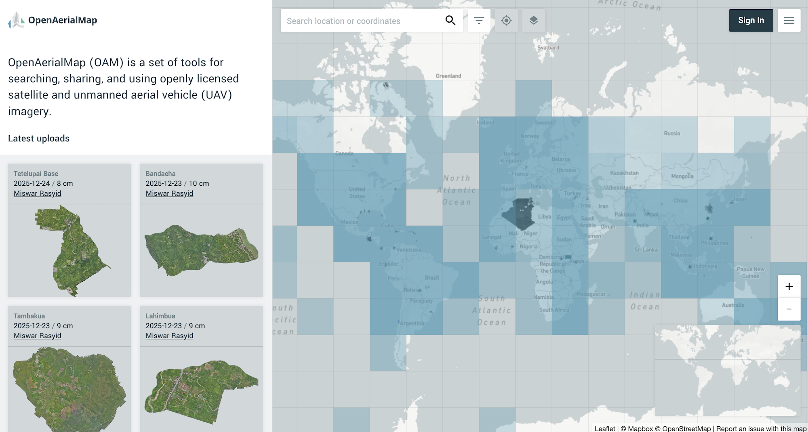
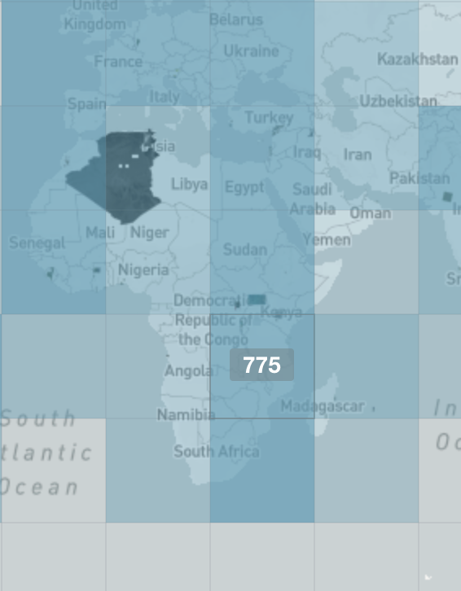

# OpenAerialMap

## URL

[https://openaerialmap.org/](https://openaerialmap.org/)

## Description

OpenAerialMap (OAM) is a platform providing open access to a wide range of satellite and aerial imagery, including high-resolution (10-30cm resolution) imagery captured by unmanned aerial vehicles (UAV). Potential use cases for open-source researchers include:

* Change detection, e.g., identifying [new construction](https://theconversation.com/how-drones-can-improve-scientific-research-in-the-field-54696), damage or [shoreline changes](https://www.youtube.com/watch?v=AuETN1pek9Y).
* Geolocation
* Mapping of humanitarian or [weather events](https://research.noaa.gov/drones-are-helping-scientists-understand-major-weather-events/)

Note that OAM provides static imagery that can be aligned onto a map layer. This is not a platform for accessing drone videos.

OAM imagery are uploaded by various sources such as humanitarian organizations, drone operators (including individuals), satellite imagery providers, government surveying agencies. All imagery are publicly licensed, and should be attributed to the [Open Imagery Network](https://openimagerynetwork.github.io/) (OIN) of the Humanitarian OpenStreetMap Team. See Licensing information on the [About](https://openaerialmap.org/about/) page.&#x20;

Compared to aerial imagery captured by aircraft, UAV (or drones) fly at lower altitudes, allowing granular close-ups of small, specific sites. However, UAV imagery will be limited in [range](https://beyondsky.xyz/blog/hardware/how-far-do-drones-fly-explore-flight-range-and-real-world-limits-in-2025) and [weather conditions](https://doi.org/10.1038/s41598-021-91325-w).&#x20;

#### OAM - Basic navigation

On [openaerialmap.org](https://openaerialmap.org/), click “Start Exploring”. The interface will display a world map in a grid. Darker-color squares indicate a larger number of images available. If you know the specific location you are checking, enter the coordinates in the search bar.&#x20;

Alternatively, pan and zoom into your area of interest, or click on the relevant part of the grid.&#x20;

Latest uploads are also displayed on the sidebar (left side).&#x20;

<figure><figcaption>
Mosaic layer shown after "Start Exploring" from the page openaerialmap.org
</figcaption></figure>

Note: **Searching by entering keywords in the search bar is not recommended**, as this may yield irrelevant or incomplete results (or no results). This is because the search term (e.g., country name) may not appear in the text metadata of the imagery. Also imagery metadata can be in languages other than English.&#x20;

From the world map, when hovering over a grid, a number will be shown to indicate how many images are available in that tile. Below, there are 775 images available in that area of the grid. Click to see those available images in the sidebar, shown as tiles of colored polygons.&#x20;

<figure><figcaption></figcaption></figure>

#### Viewing the imagery in the browser

An example image is shown below.&#x20;

<figure><figcaption>
Example: image of University of Eswatini uploaded by Mdumiseni Wisdom D. Dlamini.  
</figcaption></figure>

Marked in the orange rectangle, click the download button (left) to download the raw .tiff file. Or click the zoom button (right) to fit the imagery on the screen. The imagery is aligned to the map layer.&#x20;

**Tips**:&#x20;

* Coordinates can be found in the URL. For example, the above image's URL is: [https://map.openaerialmap.org/#/31.307988166809082,-26.4788802356307,16/square/300301322/5ca678b9b21ec90007944d55](https://map.openaerialmap.org/#/31.307988166809082,-26.4788802356307,16/square/300301322/5ca678b9b21ec90007944d55?_k=oyqwad)\
  Thus the coordinates are: 31.307988166809082, -26.4788802356307\
  When entering into OpenStreetMap or Google Maps, enter these coordinates in the reverse order, i.e., -26.4788802356307, 31.307988166809082.
* If you are on a slow internet connection, the high-resolution imagery can take 30 seconds or longer to load on the browser. While waiting, you may be shown a message saying that "0 imagery is available".&#x20;

**Metadata** shown on the sidebar will include:&#x20;

* Date of capture
* Image resolution (in cm)
* Sensor — meaning the type of equipment (e.g., UAV model) used for image capture&#x20;
* Source, attribution and license type (e.g. CC-BY-4.0 or other open licenses)

#### Using OAM imagery in QGIS

<strong>Using TMS (Tile Map Service) data</strong>

TMS data are large photos pre-cut into small, fixed-size squares (tiles, often 256x256 pixels) and organized in a zoomable pyramid. The simpler structure allows fast, efficient web delivery and display.&#x20;

Click "TMS" to copy the URL.&#x20;

**Step-by-step guide**

\[insert image]

1. **Add a New XYZ Tile Connection**
   * Go to the Browser panel (on the left side of QGIS). Right-click on XYZ Tiles and select "New Connection...".
2. **Enter TMS Connection Details**
   * In the dialog box, give your connection a name (e.g., "Location - aerial imagery").&#x20;
   * Enter the TMS URL in the URL field, using the format provided by your TMS provider (e.g., `https://{server}/{z}/{x}/{y}.png`). You may need to adjust the y-axis.&#x20;
3. **Save and Add the TMS Layer**
   * To save, click OK. To add the TMS layer, either double-click the new connection in the Browser panel > XYZ Tiles, or drag it onto the map canvas. The aerial imagery tiles will now appear as a background layer on your QGIS map.&#x20;
4. **Adjustments and trouble-shooting**

* If needed, use the Layer Properties to adjust display settings, opacity, or coordinate reference system.&#x20;

<strong>Using WMTS (Web Map Tile Service) data</strong>

WMTS is more complex, with features including discovery, standardized metadata, and support for interoperability across different GIS systems.&#x20;

Click WMTS to copy the URL from OpenAerialMap.&#x20;

**Step-by-step**

1. Go to **Layer > Add Layer > Add WMS/WMTS Layer** (globe icon), or open the **Data Source Manager** and select **WMS/WMTS**.
2. Click **New** to create a new connection. Enter a name for the connection and paste the WMTS URL.
3. Click **OK** to save, then click **Connect** to load available layers or tilesets.
4. Select your desired layer, verify the Coordinate Reference System (CRS) and image format (PNG/JPEG), then click **Add**.
5. The WMTS layer should now appear in your **Layers** panel and display on the map.

## Cost

* [x] Free
* [ ] Partially Free
* [ ] Paid

## Level of difficulty

<table><thead><tr><th data-type="rating" data-max="5"></th></tr></thead><tbody><tr><td>2</td></tr></tbody></table>

## Requirements

Any modern web browser.&#x20;

Login is not required to access the imagery. (A user account is needed for API access and for uploading new imagery.)&#x20;

## Limitations

* **Coverage:** Not all locations will have up-to-date or high-resolution imagery.
* **Licensing:** Most content is openly licensed under Creative Commons, but some datasets may have attribution or use restrictions; check the metadata.
* **Delay:** Compared to low-res satellite imagery, there may be a significant delay between drone image capture and upload to the platform.
* **Data accuracy considerations**: Researchers should be aware that drone imagery could have been uploaded with inaccuracies in date/time stamps and GPS coordinates. Inaccuracies can be caused by GPS drift, firmware bugs, incorrect software settings, or manual input errors, leading to misalignment. As always, researchers should inspect images for missing data or corruption, and use checkpoints (known points not used in processing) to verify the image-to-map accuracy.

## Ethical Considerations

* **Privacy considerations**: Given the high resolution of drone imagery, where the imagery covers human activities or large public gatherings, researchers would need to be mindful of privacy considerations. This is particularly relevant if they need to reuse or republish part of the drone imagery.&#x20;

## Guides and articles

#### Documentation and official blog

* [OpenAerialMap User Guide](https://docs.openaerialmap.org/browser/user-guide/)

#### Guides

(Oct 23, 2023). Simple GIS Software Tutorials - Displaying OpenAerialMap Imagery in Simple GIS Client, [https://www.youtube.com/watch?v=woDsyAQQMko](https://www.youtube.com/watch?v=woDsyAQQMko)  \
\
(Feb 16, 2024). Download High-Resolution (1 cm to 30 cm) Aerial Images from Open Aerial Map for Free, [https://www.youtube.com/watch?v=R0QDzChfJ-0](https://www.youtube.com/watch?v=R0QDzChfJ-0)&#x20;

(Mar 1, 2023). Search and Visualize OpenAerialMap Imagery Interactively with Leafmap, [https://www.youtube.com/watch?v=P51j9robY98](https://www.youtube.com/watch?v=P51j9robY98)&#x20;

## Tool provider

&#x20;[Humanitarian OpenStreetMap Team (HOT)](https://www.hotosm.org/en/tools-resources/tech-product-suite/open-aerial-map/)

## Similar tools

**DJI SkyPixel**: DJI's community platform [SkyPixel](https://www.skypixel.com/) has drone imagery publicly available and searchable. However, the metadata may be incomplete, especially the coordinates shown may not allow researchers to easily map a drone video to the map. Coverage also tends to be focused on scenic locations and tourist sites. For those who need to reuse or republish imagery, there may be licensing or usage rights issues.&#x20;

**OpenTopography**: If the research involves checking elevation, [OpenTopography](https://opentopography.org/) offers high-resolution point cloud datasets or LiDAR data covering more than 500,000 km² globally. However, users would need to have experience loading large datasets, and reading and interpreting LiDAR data.&#x20;

* The website has a graphical user interface where users can request the dataset they need — users will specify the location (coordinates or indicate on map), data output type (e.g., ARC ASCII Grid, GeoTiff), and the type of visualization needed. The DEM (Digital Elevation Model) from LiDAR data will then be available for download.&#x20;

**Environmental monitoring purposes**: [Global Forest Watch](https://www.globalforestwatch.org/map/) currently offers low resolution Sentinel-2 (10m res) & Landsat 8 (30m res) imagery for near real-time checks. See the [Bellingcat Toolkit guide to Global Forest Watch](https://bellingcat.gitbook.io/toolkit/more/all-tools/global-forest-watch) here.&#x20;

**National portals of geodata:** At the national level, sites such as the [USGS Earth Explorer](https://earthexplorer.usgs.gov/) or [UK Environment Agency’s LIDAR portal](https://environment.data.gov.uk/DefraDataDownload/) have some aerial imagery, but usually from aircrafts and not from UAVs.&#x20;

**For historical research:** local governments and societies may have archives of satellite and aerial imagery. For example, Scotland's National Collection of Aerial Photography (NCAP) is developing an Air Photo Finder ([https://airphotofinder.ncap.org/homepage](https://airphotofinder.ncap.org/homepage); in beta and subject to subscription), which will feature historically significant aerial photos dating back to the 1920s.&#x20;

## Advertising Trackers

* [x] This tool has not been checked for advertising trackers yet.
* [ ] This tool uses tracking cookies. Use with caution.
* [ ] This tool does not appear to use tracking cookies.

| Page maintainer |
| --------------- |
| River N.        |
|                 |
