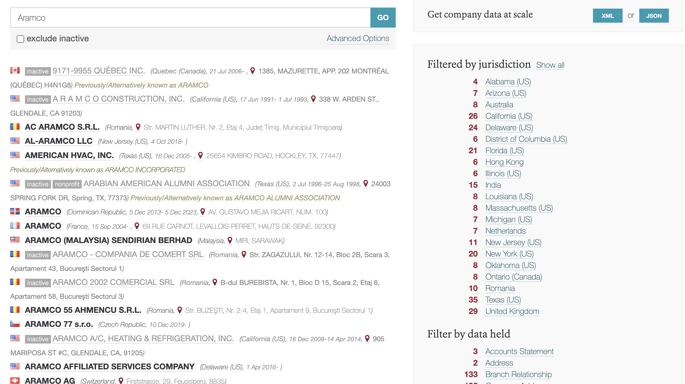
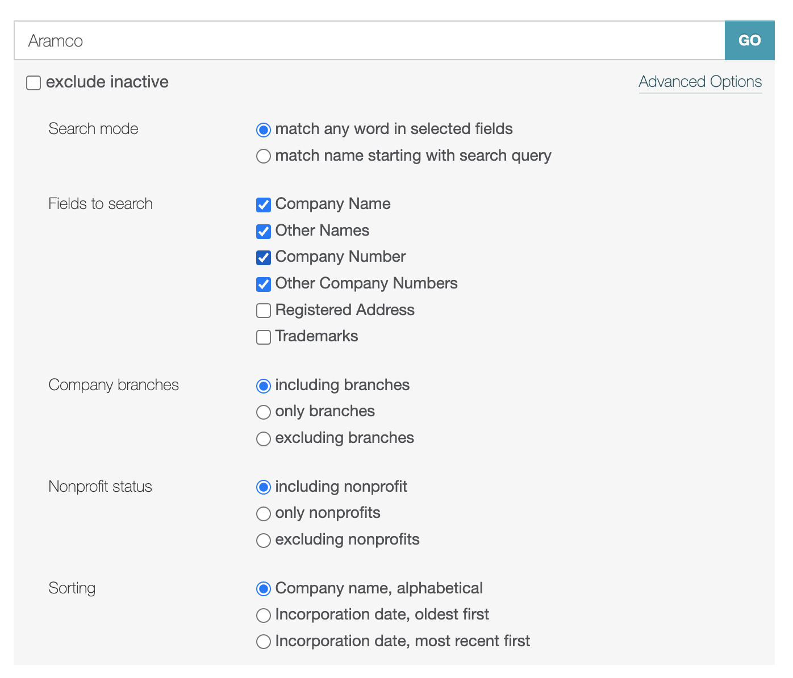
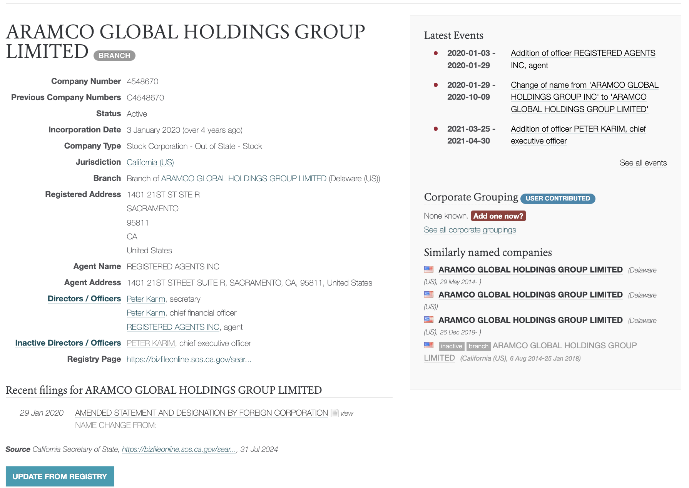
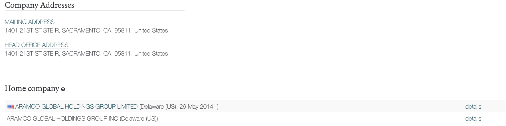
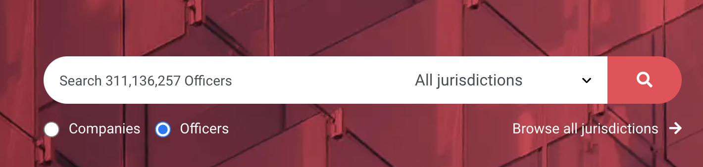
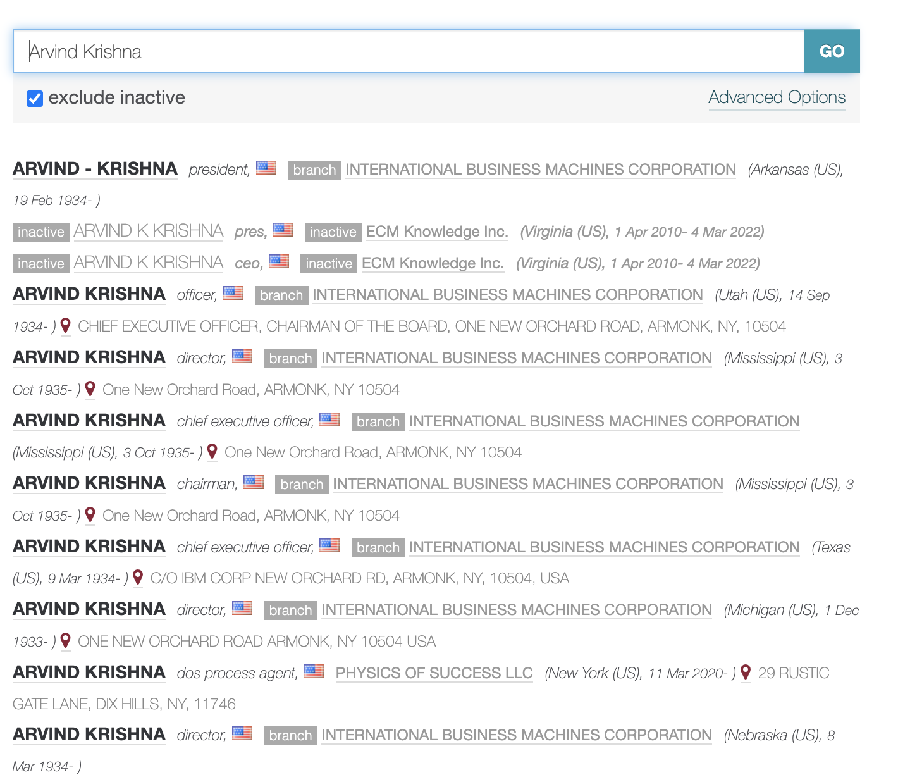
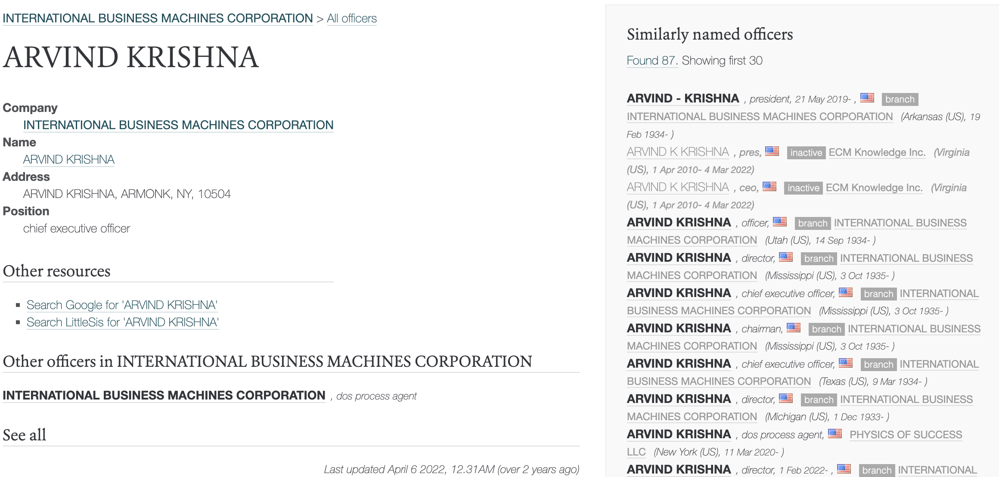

# OpenCorporates

## URL

[https://opencorporates.com/](https://opencorporates.com/)

## Description

OpenCorporates provides a unified search of corporate and legal entity-level data across 170+ jurisdictions. It is a free repository of company registries aggregated from primary public sources, published to promote corporate transparency.

**How to search for a company**

* Go to [opencorporates.com](https://opencorporates.com/) and log in with your credentials or create an account.
* In the search field select Companies and type the name of the entity you are interested in. If you're unsure of the full legal name of an entity, type a partial name.

<figure><figcaption>
OpenCorporates home page with search field with Companies option selected
</figcaption></figure>

* If you know the jurisdiction in which the entity is located or registered, click on the dropdown menu '_Browse all jurisdictions_' in the search bar to select the jurisdiction for a more targeted search. Skipping this step will cast a wider net and the search will return all available entities with the same or similar names in multiple jurisdictions. This is a good option if you want to track subsidiaries, parent entities or otherwise related entities to the one you are researching.

<figure><figcaption>
List of results for keyword 'Aramco'
</figcaption></figure>

* Searching by a partial name or if more than one entity has a similar or almost identical name, the results page will show all relevant entries corresponding to your search term (see above image). It will also show **BOTH** active and inactive entities. To exclude the inactive ones, click on the checkbox 'exclude inactive' located just below the search bar. The results page also has additional filters on the right for jurisdiction, as well as various filters for data associated with the entries, filters for company type and current status. These can be used to narrow down the search results.
* The search bar in the results page also offers advanced search options - where the keyword occurs, search mode, non-profit status, include/exclude company branches.

<figure><figcaption>
Advanced options filters in the results page
</figcaption></figure>

* Once you have located the entity of interest, click on it to see all the information associated with it. This might include registration / incorporation / dissolution dates, company registration number, status (active/inactive), jurisdiction, address, directors or officers and a link to the original source of information.

<figure><figcaption>
View of the company of interest
</figcaption></figure> <figure><figcaption>
View of the company of interest
</figcaption></figure>

**How to search for a Company Officer**

* Follow the same steps as above, but select the Officer option just below the search bar on the home page.

<figure><figcaption>
OpenCorporates home page with search field with Officers option selected
</figcaption></figure>

<figure><figcaption>
Search results with the name of IBM CEO Arvind Krishna
</figcaption></figure>

* Once you have located the person of interest, click on their name to see all the information associated with them. The information for officers is often very limited, however the results page will provide clues and information whether that person is associated in any way with other companies, i.e. the results page information can be used to piece together a business affiliations profile of a specific individual.            &#x20;

<figure><figcaption>
Specific information for IBM CEO Arvind Krishna from one of selected search results
</figcaption></figure>


Data in  OpenCorporates is dependent on the information provided by the local companies registers provide in their jurisdictions. Each jurisdiction is different, thus the level of detail might differ. b

Be mindful that there might be more than one company with the same name and that does not mean it is in any way connected to the one you are researching. The same rule applies for individuals. There may be more than one person with the same name in your results, but these could be name match only records.


The website has a very useful [Case Studies](https://opencorporates.com/case-studies/) section where you can view how companies and NGOs have used OpenCorporates data for their needs

## Cost

* [ ] Free
* [x] Partially Free
* [ ] Paid

API access requires a [monthly/yearly subscription](https://opencorporates.com/plug-in-our-data/) for commercial uses, starting from GBP 2,250 per year for the Essentials package, GBP 6,600 /year for the Starter package, GBP 12,000/year for the Basic package.  &#x20;

## Level of difficulty

<table><thead><tr><th data-type="rating" data-max="5"></th></tr></thead><tbody><tr><td>2</td></tr></tbody></table>

## Requirements

Free registration needed to access the full information on entities/individuals. Without registration, users cannot see additional information associated with a particular entry.

## Limitations

Permitted users: If you’re a **journalist, NGO, academic conducting public benefit research,** **or using it for personal interest**, you’re a “Permitted User.” **Corporations, financial institutions, and government departments** need a subscription to access the data. Source: [OpenCorporates usage details](https://blog.opencorporates.com/2024/06/11/can-i-use-opencorporates/).

Data accuracy and use: **The data is provided “as is.”** The complexity of sources means occasional errors. Use the information wisely and double-check critical details. Heavy data extraction, such as scraping, is prohibited unless you’re a search engine indexing content. Source: [OpenCorporates usage rules.](https://blog.opencorporates.com/2024/06/11/can-i-use-opencorporates/)

[According to their own website](https://knowledge.opencorporates.com/knowledge-base/there-is-an-error-with-the-company-record-on-opencorporates/), if there is an error, you can contact their support and these errors might include outdated information about entities or individuals, duplications of data, miscategorized entities.

## Ethical Considerations

As this data is publicly accessible and from government sources, users should be comfortable using this tool without ethical qualms. However, research on individuals should not be used for personal gain, doxxing, harassment or purposes and/or actions that could be considered illegal or criminal.

## Guides

[Following the Money: A Beginner’s Guide to Using the OpenCorporates API](https://www.bellingcat.com/resources/2023/08/24/following-the-money-a-beginners-guide-to-using-the-opencorporates-api/) - Katherine de Tolly, Bellingcat

[CIJ Using OpenCorporates for Investigations](https://www.youtube.com/watch?v=G_swgQEUGh8) - The Centre for Investigative Journalism

OpenCorporates video guide on [how to search for an Officer](https://knowledge.opencorporates.com/knowledge-base/how-to-search-for-an-officer-video-guide/).

OpenCorporates video guide on [how to search for a company](https://knowledge.opencorporates.com/knowledge-base/web-portal-onboarding/).

OpenCorporates [glossary of terms](https://knowledge.opencorporates.com/knowledge-base/glossary-of-terms/).

A [quick tip sheet](https://dataharvest.eu/wp-content/uploads/2019/06/opencorp-tip-sheet.pdf) by Dataharvest – The European Investigative Journalism Conference.

## Tool provider

OpenCorporates, incorporated in England and Wales (Company Registration Number 07444723).

## Advertising Trackers

* [ ] This tool has not been checked for advertising trackers yet.
* [x] This tool uses tracking cookies. Use with caution.
* [ ] This tool does not appear to use tracking cookies.

| Page maintainer |
| --------------- |
| LPetrova        |
