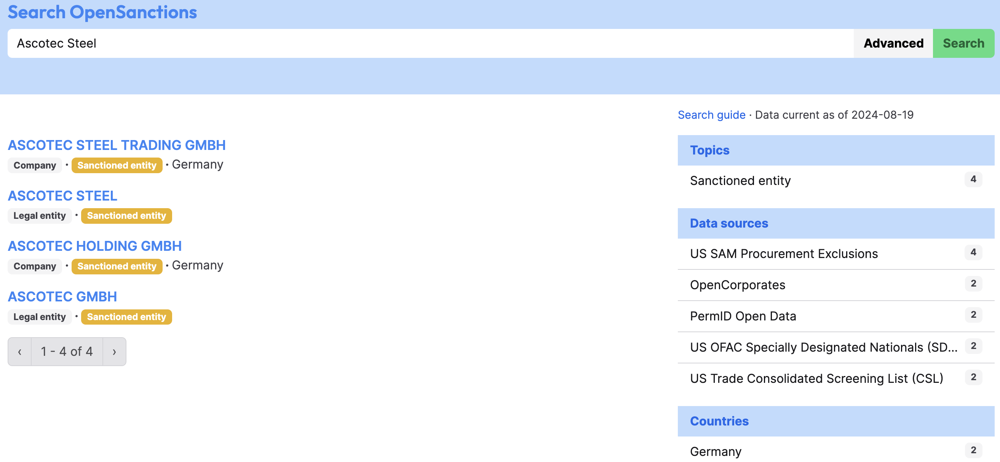
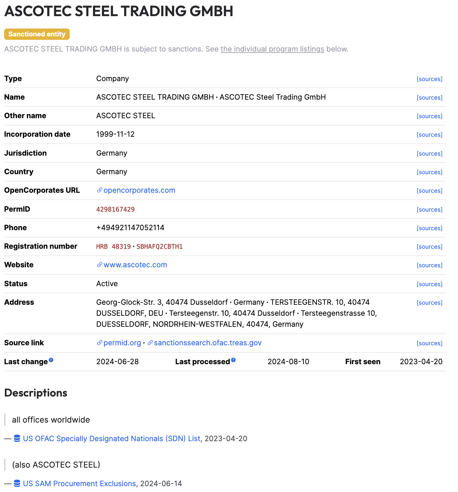
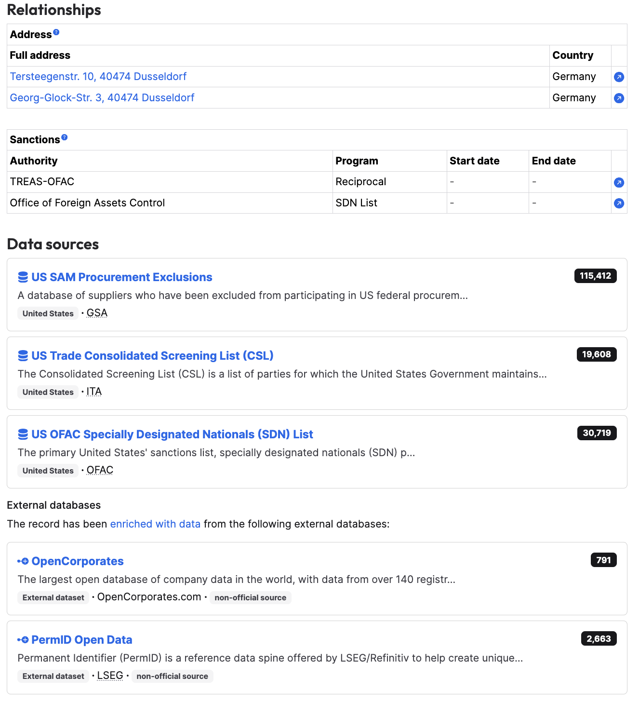
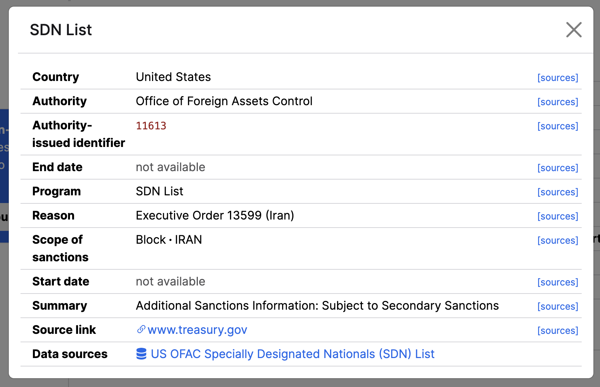
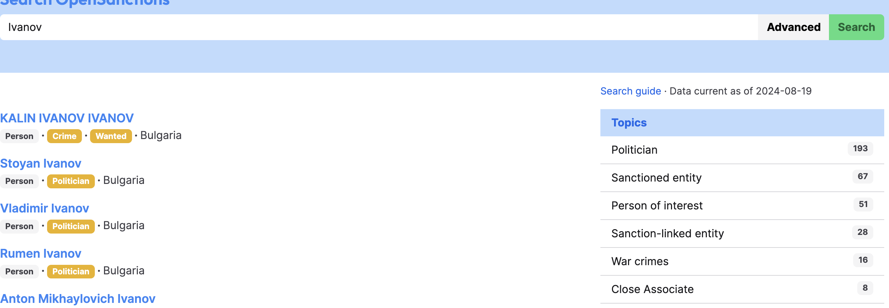
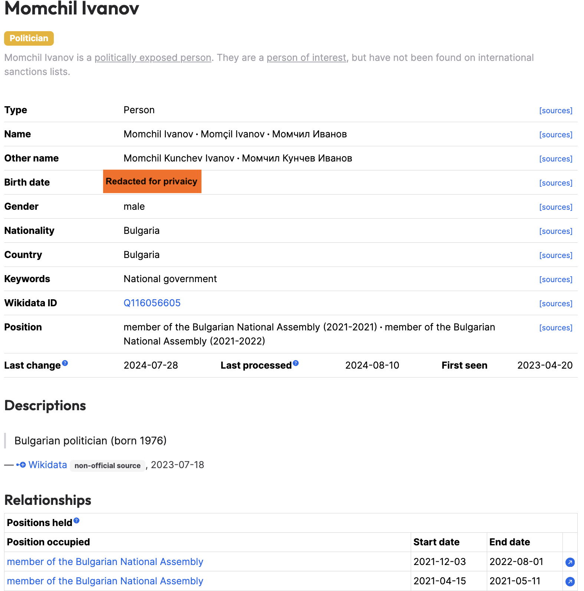
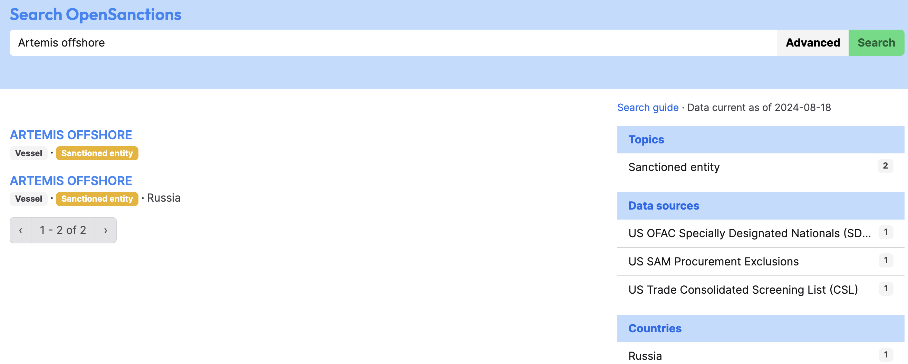
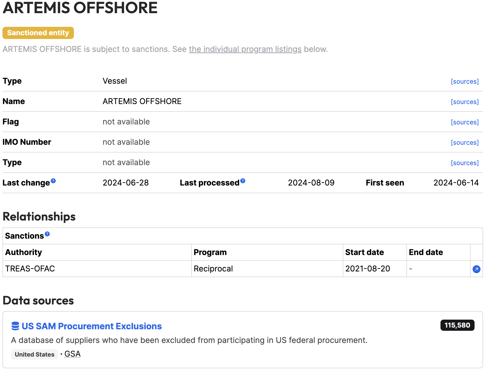
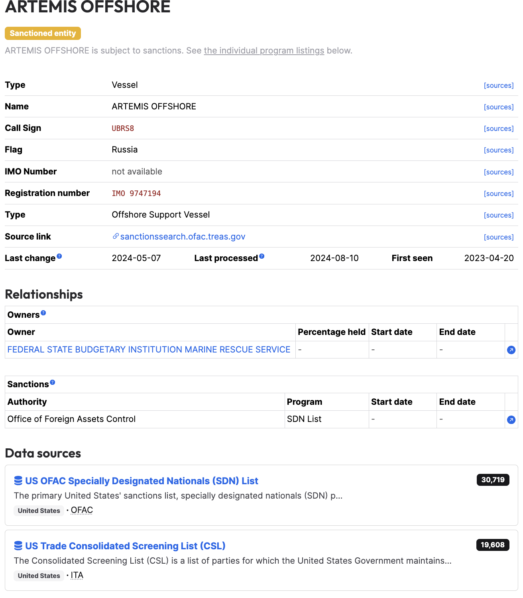

# OpenSanctions

## URL

[https://www.opensanctions.org/](https://www.opensanctions.org/)

## Description

OpenSanctions provides a structured database of people and entities subject to sanctions or other financial restrictions, politically exposed persons (PEPs) and other individuals and entities of interest. The database is curated by a team of researchers and journalists, and is designed to be easily accessible and usable by individuals, organizations, and governments.

The data includes information on individuals, organizations, and vessels that are subject to sanctions, as well as the legal frameworks and sanctions regimes that apply to them. OpenSanctions is intended to help individuals and organizations comply with international sanctions laws, as well as to facilitate research and investigative journalism into financial crime and corruption.

OpenSanctions has 269 separate dataset collections with multiple sources of data. All the data collected and provided by OpenSanctions is publicly available. The full list of sources can be found and explored [here](https://www.opensanctions.org/datasets/sources/). Each dataset has its own page with a description, options for a bulk download of data and information on where the data has been sourced from. The page also features consolidated sanctions on 75,746 entities.

<figure><figcaption>
Schedule of updates frequency on the OpenSantions website.
</figcaption></figure>

For basic desktop research, go to [https://www.opensanctions.org/research/](https://www.opensanctions.org/research/) and type the name of an entity, a person or a vessel in the search bar.

**Example 1: Search for an entity**

* Type the name of an entity in the search bar. In this case Ascotec Steel. The search returns 4 results, because this company has subsidiaries with the word Ascotec in the name, and because the data comes from separate data sources.

<figure><figcaption></figcaption></figure>

* Review all the results to locate the company of interest, in this case Ascotec Steel Trading GmbH. The profile for this company includes information on its incorporation date (November 11, 1999), jurisdiction (Germany), addresses and the sanctioning authority (OFAC).
* Once you open a company profile, read through each line of the tables provided. Each line gives information on what the data represents. For example in the Relationships section the information lists two addresses, associated with Ascotec Steel Trading GmbH. The Data sources sections indicates where this information comes from. In this case from OpenSanctions databases compiled by scraping publicly available data from the US Trade Consolidated Screening List (a list of parties for which the U.S. government maintains restrictions on certain exports, reexports, or transfers of items), the U.S. SAM Procurement Exclusions (database of suppliers who have been excluded from participating in federal procurement), and the OFAC Specially Designated Nationals (SDN) List (the primary U.S. sanctions list, specially designated nationals (SDN) part).

<figure><figcaption>
Basic information on the company - addresses associated with it, when it was incorporated and where, its registration number with the German authorities (HRB 48319).
</figcaption></figure> <figure><figcaption>
The sanctioning authority is located in the Sanctions section, in this case OFAC which is listed in two different ways - TREAS-OFAC and Office of Foreign Assests Control.
</figcaption></figure>

* The little arrows next to each data point opens a pop-up window showing additional information regarding the type of sanction. For more details on a specific sanction, you can visit the websites provided in the URLs from OpenSanctions to conduct further research on the company.

<figure><figcaption>
Info on the specific sanction: what was the reason (an executive order for blocking property of the Government of Iran and Iranian financial institutions), the sanctioning authority (OFAC), sanction ID No. (11613)
</figcaption></figure> <figure><figcaption>
This sanction entry was sourced from the government procurement website of the US - SAM.gov and lists the fact that Ascotec Steel is prohibited from participating in public procurement bids.
</figcaption></figure>

**Example 2: Search for an individual**

* Type the name of an individual in the search bar. If you are uncertain about the full legal name, try using the individual's last name. In this case Ivanov. The search returns 531 results for a last name Ivanov. The results can be filtered by topics, data sources and countries using the lists on the right.

<figure><figcaption>
Results for searching by keyword 'Ivanov'
</figcaption></figure>

* Once you have located the individual of interest, click on the name to open their profile. Please note that individuals appearing on the OpenSanctions website iclude sanctioned persons, as well as politically exposed persons (politicians, government officials, government employees). In this case the individual is a politician - member of a national parliament.

<figure><figcaption>
Profile for Momchil Ivanov with information about his date of birth, his full legal name and why he is a politically exposed person - member of the Bulgarian parliament.
</figcaption></figure>

**Example 3: Search for a vessel**

* Type the name of a vessel. In this case the vessel is Artemis Offshore. The search returns two separate results because the data comes from separate data sources. However, looking into each result indicates that this vessel was sanctioned by the U.S. Office of Foreign Assets Control (OFAC).

<figure><figcaption>
Search results for the Artemis Offshore vessel
</figcaption></figure>

* The first result does not provide a lot of information, other than the sanctioning authority and the data source for the entry. In this case the sanctioning autorithy - TREAS-OFAC refers to the [Office of Foreign Assets Control ("OFAC") of the U.S. Department of the Treasury](#user-content-fn-1)[^1]. A sanctioning authority in this context is a government body with the power to impose sanctions. These may include the United Nations, the European Union, OFAC, the Organization for Security and Cooperation in Europe (OSCE).

<figure><figcaption></figcaption></figure>

* The second result provides more detailed information, most importantly the call sign of the vessel (a unique ID number to ships and boats), under which flag it operates, and who owns it. In this case it is owned by the Russian Marine Rescue Service. This information can be used to cross-reference the vessel through other tools such as [VesselFinder](https://www.vesselfinder.com/) or [MarineTraffic](https://www.marinetraffic.com/).

<figure><figcaption></figcaption></figure>

## Cost

* [ ] Free
* [x] Partially Free
* [ ] Paid

OpenSanctions is free for non-commercial users. Business and commercial users must either acquire a data license, or subscribe to the pay-as-you-go API service.

## Level of difficulty

<table><thead><tr><th data-type="rating" data-max="5"></th></tr></thead><tbody><tr><td>2</td></tr></tbody></table>

## Requirements

No specific requirements for desktop research. Some requirements and set-up needed to use the API.

## Limitations

Does not cover a lot of jurisdictions when it comes to politically exposed persons (PEPs) - 28 countries, one European Union dataset collection and one global dataset with a total of 681,011 entries. Most of the datasets are reportedly updated daily. Possibly missing a lot of names of individuals that hold government positions in countries across the world.

Possible duplication of entries in the databases - there is a possible overlap of data in different datasets. Although OpenCorporates claims do perform de-duplication to avoid overlap and confusion, this is still a possibility.

The vessels database is very limited with just over 2,000 entries and researchers should use other available tools in addition to OpenSanctions to look for vessels.

The search returns different number of results or no results at all if the searched keyword is typed in Cyrillic (e.g. using search term _Gazprom_ returns 44 results, while using _Газпром_ returns 327 results). This is an issue with desktop research if there are too many similar results and the researcher has to go through a number of them to locate a specific entity.

## Ethical Considerations

Personally Identifiable Information (PII) is usually masked or hidden and the information comes from public sources, usually government ones, however if PII has not been redacted, it should be used with caution.

## Guide

OpenSanctions API user and implementation [guide](https://api.opensanctions.org/#section/Introduction).

OpenSanctions datasets [collections](https://www.opensanctions.org/datasets/) in `.json` format that are downloadable, with the option to be integrated in other systems and databases.

A [use-case article](https://www.opensanctions.org/articles/2024-05-03-guernsey-fiu/) on how the Guernsey Financial Intelligence Unit used OpenSanctions to fight money laundering and drug trafficking.

Convier: [Sanctions screening of documents with OpenSanctions and Convier](https://www.youtube.com/watch?v=eLVHuM6WLfY)

Neo4j: [OpenSanctions Demo](https://www.youtube.com/live/T3uGVrrMeTo?si=wPPIUZG_-Z24cCzM\&t=1319)

## Tool provider

OpenSanctions Datenbanken GmbH, a for-profit entity based in Germany. From September 2021 to February 2022, the project received financial support from the German Federal Ministry for Education and Research (Bundesministerium für Bildung und Forschung, BMBF) under grant identifier 01IS21S48.

## Similar tools

There are various tools for researching sanctions on the web. Bellingcat also has descriptions and guides on SanctionsExplorer, EU Sanctions Map and OCCRP Aleph. Although they serve the same purpose, there are some major differences among them:

<figure><figcaption></figcaption></figure>

## Advertising Trackers

* [ ] This tool has not been checked for advertising trackers yet.
* [x] This tool uses tracking cookies. Use with caution.
* [ ] This tool does not appear to use tracking cookies.

| Page maintainer |
| --------------- |
| LPetrova        |

[^1]: The Office of Foreign Assets Control is a financial intelligence and enforcement agency of the U.S. Treasury Department. It administers and enforces economic and trade sanctions in support of U.S. national security and foreign policy objectives.
