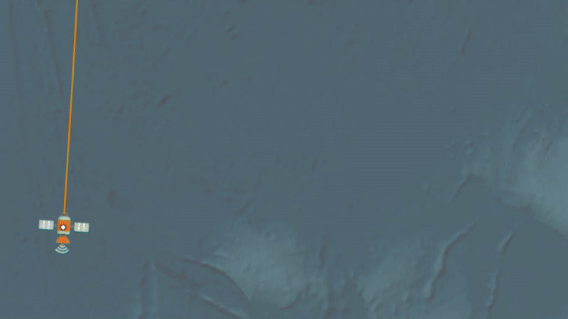
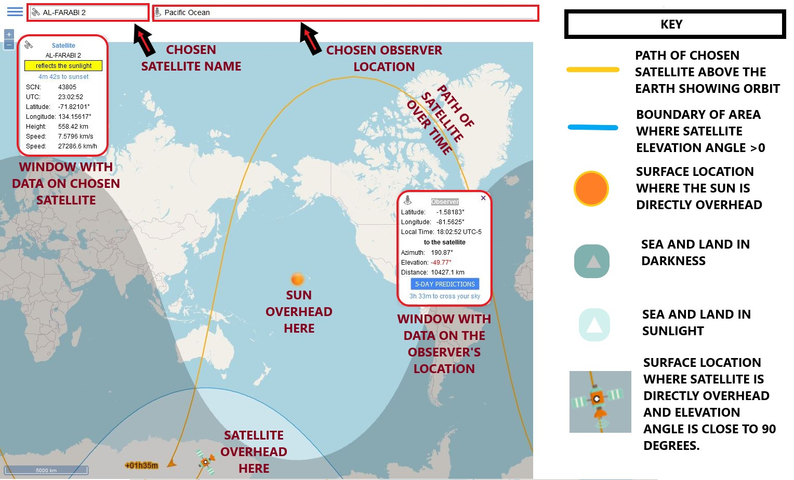

# OrbTrack

## URL

[**https://www.orbtrack.org**](https://www.orbtrack.org)


**Disambiguation:** This article describes a web-based app called OrbTrack, written by Torsten Hoffman (author of popular app [SunCalc](https://bellingcat.gitbook.io/toolkit/more/all-tools/suncalc)) which displays data on over 10,000 satellites in a graphical interface for a time period 5 days ahead of the use date. It does not cover the mobile app of the same name, written by James Nikolai, stored on GitHub.


## Description

<figure><figcaption>
<strong>ORBTRACK SHOWING SATELLITE PATH, LOCATING OBSERVER &#x26; GENERATING TIMED PASS GRAPHIC</strong>
</figcaption></figure>

Satellites carry many different forms of sensor, e.g. photographic imaging, heat imaging ([Infra-Red](https://www.earthdata.nasa.gov/learn/find-data/near-real-time/viirs)) , LIDAR ([Laser Imaging/Light Detection and Ranging](https://www.synopsys.com/glossary/what-is-lidar.html)) imaging, SAR ([Synthetic Aperture Radar](https://www.keysight.com/blogs/en/inds/2020/08/28/what-is-synthetic-aperture-radar)) imaging,... Not all of these require the earth to be in sunlight to collect useful data and some of these can operate successfully in the presence of cloud cover.

OrbTrack is a web-based app which allows users to explore satellite sources of imagery by:

* entering the geographical location of an observer (i.e. an area of interest)
* projecting for 5 days forward the path of a chosen satellite over time, and its distance and angle from the observer
* calculating the times when the chosen satellite is in sunlight, and when in darkness
* calculating the times when the chosen satellite has a line of sight to the observer

**Satellite Sensor Technology**

A large segment of Open Source research involves the use of satellite imagery, gathered using a variety of sensor technology. The resolution and aspect of this imagery is crucial in the success of an investigation.

<strong>The Role of Satellite Imagery in Open Source Investigation.</strong> Much, but not all, of the available higher resolution imagery sits behind paywalls and an investigator's access may be limited in both the range of imagery providers and a maximum quote on numbers of images...(click the side arrow for more information)

Satellite imagery is often pivotal in confirming and/or dating/timing a geolocation investigation which has been solved via other means. It is valuable to researchers to understand which satellite services are likely to provide imagery of regions of interest at the right time, date, resolution and aspect for their needs.

<strong>Features Affecting Imagery's Value to An Investigation: Elevation Angle, Cloud, Sunlight</strong>...(click the side arrow for more information)

Examples of features which affect the value of satellite imagery to an investigation include:

* The elevation angle of the satellite from the observer determines the aspect of the image, e.g. a 90 degree elevation angle is directly overhead and shows mountain summits and rooftops on buildings, whereas a lower angle shows features like mountainsides and the walls of buildings.
* The presence of cloud cover in the atmosphere will interfere with some imaging technologies (e.g. visual spectrum photography), but not others (e.g. LIDAR).
* A low light level on the surface of the Earth (i.e. when facing away from the sun) affects some imaging technologies (e.g. visual spectrum photography), but not others (e.g. Infra-red).

### Use Cases for OrbTrack with Input Data, Output Data and Data Input Options...(Click each tab to see further information)



* Observer Location
* Satellite Name/ Selection of Satellite from Database List
* Selection of a Satellite Path from the System-Generated List of Satellite Passes Over the Observer Location in the Next 5 days



<figure><figcaption></figcaption></figure>



**Satellite-Focused Research:**

* Finding the path of a given satellite, including the high level information as to whether it is in or near geostationary orbit, and its range of height and speed.

**Location-Focused Research:**

* Finding satellites which pass over an area of interest at an angle of elevation useful to the user (and therefore may reveal sensor detail of the Earth's surface which was previously unavailable)
* Find the location for a given satellite at user-defined angles (azimuth and election) and date & time.



<figure><figcaption></figcaption></figure>



### The Interface

<figure><figcaption>
<strong>THE ORBTRACK INTERFACE</strong>
</figcaption></figure>

As well as satellite position information, the OrbTrack interface provides its speed, its height, its path over time, its position relative to a user-defined Observation location, the position of the sun, the areas of the earth in night and day, and the area of the earth below the satellite which has a positive elevation angle to the satellite.


**Relationship Between Satellite Velocity and Height:** As a general rule, satellites closer to the Earth travel at a higher velocity than those at greater distance or 'height' from the Earth's surface. So height and velocity are inversely proportional in this case. For geostationary orbit, satellites require an altitude of around 36,000 km (see below). Geostationary satellites are of course particularly useful if they cover an area of research interest because of their singular focus.



**THE RELATIONSHIP BETWEEN SATELLITE HEIGHT AND VELOCITY, AND THE SPECIAL CASE OF GEOSTATIONARY ORBIT (Youtube video, xmphysiscs:** Why must geostationary satellites be parked at altitude of 36000 km?)


### The Data

The satellite database is provided from [www.celestrack.com](https://www.celestrack.com) by Dr T. S. Kelso. Researchers can use it to cross-reference service names with satellite names. This is usually a one-to-many relationship where a service uses a number of satellites to deliver regular (or even continuous) imagery in the intended area(s) of focus.

An example of one service which is used in Open Source Research would be the Planet satellite service, which operates what is called 'constellations' of satellites, which have different spatial, temporal and radiometric resolutions.

<figure><figcaption>
THE PLANET SERVICE SATELLITES IN MOTION AROUND THE ROTATING EARTH. Courtesy of <a href="https://www.planet.com/">Planet</a> and <a href="https://www.visualcinnamon.com/about/">Nadieh Bremer</a>
</figcaption></figure>


OrbTrack includes a distance scale on all its earth maps.


## Cost

* [x] Free
* [ ] Partially Free
* [ ] Paid

## Level of difficulty

<table><thead><tr><th data-type="rating" data-max="5"></th></tr></thead><tbody><tr><td>3</td></tr></tbody></table>

The OrbTrack interface is not difficult to use: the difficulty rating reflects the contextual understanding required to use OrbTrack effectively. This includes concepts around satellites, their orbits, their position relative to the Earth and the Sun, the different types of sensors they carry, how imaging is affected by elevation angle, etc.

## Requirements

None. OrbTrack does not require any form of login or registration.

## Limitations

**Time Limited:** OrbTrack provides satellite path data for 5 days ahead of the date upon which it is being used. It cannot provide historical data or forward predictions past this point. This is a serious limitation for many Open Source Research applications.

**No "Reverse Search":** OrbTrack allows the user to find information about a particular satellite over a particular time period, but search within this space needs to be done by trial and error: for example, OrbTrack will not take as inputs the co-ordinates of a given location and a given angle of elevation and return the list of satellites whose paths fulfil this angle to that location within the next 5 days.

## Ethical Considerations

By its nature, satellite imaging can be intrusive and be used to focus attention on locations and people which could prove unwelcome.

## Guides and articles

[https://www.torsten-hoffmann.de/web.html](https://www.torsten-hoffmann.de/web.html) A brief overview of how OrbTrack fits within the suite of free apps which include suncalc.org, mooncalc.org, planetscalc.org.

## Tool provider

Torsten Hoffman (Germany) with satellite data from Dr T. S. Kelso via [www.celestrack.com](https://www.celestrack.com).

## Advertising Trackers

* [ ] This tool has not been checked for advertising trackers yet.
* [x] This tool uses tracking cookies. Use with caution.
* [ ] This tool does not appear to use tracking cookies.

| Page maintainer: |
| ---------------- |
| Sophie Tedling:  |
|                  |
