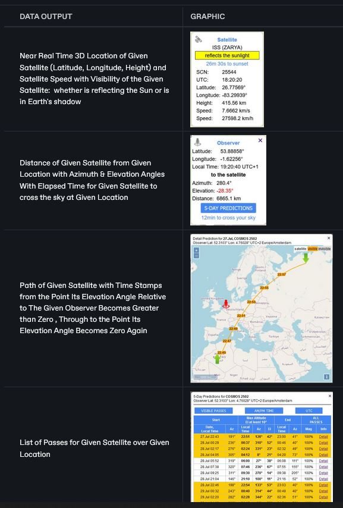

# OrbTrack

## URL

## [https://www.orbtrack.org](https://www.orbtrack.org)

## Description

<figure><figcaption>
<strong>THE ORBTRACK INTERFACE</strong>
</figcaption></figure>


Satellites can carry many different forms of sensor, e.g. photographic imaging, heat (Infra-red) imaging, LIDAR  (Laser Imaging Detection and Ranging) imaging, SAR ([Synthetic Aperture Radar](https://www.keysight.com/blogs/en/inds/2020/08/28/what-is-synthetic-aperture-radar)) imaging,... Not all of these require the earth to be in sunlight to collect useful data. Some of these can operate successfully in the presence of cloud cover.


#### Review of Orbtrack.org

**Orbtrack.org** is a real-time satellite tracking website that offers comprehensive tools for monitoring the positions and orbits of various satellites and other celestial objects. Here is a detailed review of its features, performance, and overall utility:

**Key Features**

1. **Real-Time Tracking**:
   * Orbtrack.org provides real-time data on the location and trajectory of satellites orbiting the Earth. Users can select any satellite from a vast catalog and view its current position, as well as predict its path for the next five days​ ([OrbTrack](https://www.orbtrack.org/))​​ ([Lizard Tail](https://www.lizard-tail.com/isana/tracking/))​.
2. **Diverse Object Tracking**:
   * The platform tracks not only satellites but also the International Space Station (ISS), rocket bodies, debris, planets, and stars. This makes it a versatile tool for both amateur astronomers and professional researchers​ ([JNikolai Dev](https://jnikolai.dev/apps/orbtrack/))​.
3. **Live Streams**:
   * Users can access live streams from the ISS, which include internal views when the crew is on-duty and external views of the Earth. This feature adds an engaging visual element to the tracking experience​ ([OrbTrack](https://www.orbtrack.org/))​.
4. **User Interface and Customization**:
   * The website features a clean and user-friendly interface with options for metric and imperial measurements. It also allows users to set their observer location manually or automatically, enhancing the accuracy of the tracking information provided​ ([OrbTrack](https://www.orbtrack.org/))​​ ([JNikolai Dev](https://jnikolai.dev/apps/orbtrack/))​.
5. **Open Source and Privacy**:
   * Orbtrack.org is an open-source project, ensuring transparency and community involvement in its development. It does not store personal data outside of the user's device, emphasizing privacy and security​ ([JNikolai Dev](https://jnikolai.dev/apps/orbtrack/))​.
6. **Offline Capabilities**:
   * The app version of Orbtrack.org can calculate satellite positions without an internet connection, making it useful in remote locations or during field research where internet access is limited​ ([JNikolai Dev](https://jnikolai.dev/apps/orbtrack/))​.

**Performance**

The website performs reliably, with a quick loading time averaging around 1.6 seconds. It does not use file compression, which could further enhance its performance, but its current speed is generally acceptable​ ([Web Statistics and Analysis | HypeStat](https://hypestat.com/info/orbtrack.org))​.

**Areas for Improvement**

1. **Advanced Features**:
   * While Orbtrack.org covers the basics effectively, adding more advanced features like augmented reality (AR) views, which are present in some other apps, could enhance its utility and user engagement.
2. **User Support and Documentation**:
   * Providing more comprehensive user guides and support resources would help new users take full advantage of the platform's capabilities.
3. **Mobile Optimization**:
   * Although the site is functional on mobile devices, a dedicated mobile app with enhanced features and optimization for smaller screens could improve user experience significantly.

**Conclusion**

Orbtrack.org is a powerful and versatile tool for satellite tracking, suitable for both casual users and professional researchers. Its real-time tracking capabilities, privacy focus, and offline functionality make it a reliable choice. However, there is room for improvement in terms of advanced features and user support. For anyone interested in tracking satellites and other celestial objects, Orbtrack.org is a highly recommended resource.



Observer Location

Satellite Name




<figure><figcaption></figcaption></figure>



Location-Focused Research: Finding satellites which pass over an area of interest at an angle of elevation useful to the user.

Finding the path of a given satellite, including the high level information as to whether it is in or near geostationary orbit.

Find the location for a given satellite at user-defined angles (azimuth and election) and date & time

Testing whether a satellite passes over an area of interest at a particular angle of elevation (and therefore may reveal sensor detail of the Earth's surface which was previously unavailable)

Satellite-\~focused Research:&#x20;



<figure><figcaption></figcaption></figure>



## Cost

* [x] Free
* [ ] Partially Free
* [ ] Paid

## Level of difficulty

<table><thead><tr><th data-type="rating" data-max="5"></th></tr></thead><tbody><tr><td>3</td></tr></tbody></table>

The OrbTrack interface is not difficult to use: the difficulty rating reflects the contextual understanding required to use OrbTrack effectively. This includes concepts around satellites, their orbits, their position relative to the Earth and the Sun, the different types of sensors they carry, how imaging is affected by elevation angle,etc.&#x20;

## Requirements

None. OrbTrack does not require any form of login or registration.

## Limitations

OrbTrack provides satellite path data for 5 days ahead of the date upon which it is being used. It cannot provide historical data or forward predictions past this point.

## Ethical Considerations

\[\[The ethical considerations of each tool should be described.]]

## Guides and articles

\[\[Link to guides on this tool and to articles on research that was done with the help of this tool]]

## Tool provider

Torsten Hoffman with satellite data from Dr T. S. Kelso via [www.celestrack.com](https://www.celestrack.com).

## Advertising Trackers

* [x] This tool has not been checked for advertising trackers yet.
* [ ] This tool uses tracking cookies. Use with caution.
* [ ] This tool does not appear to use tracking cookies.

| Page maintainer |
| --------------- |
| Sophie Tedling  |
|                 |
