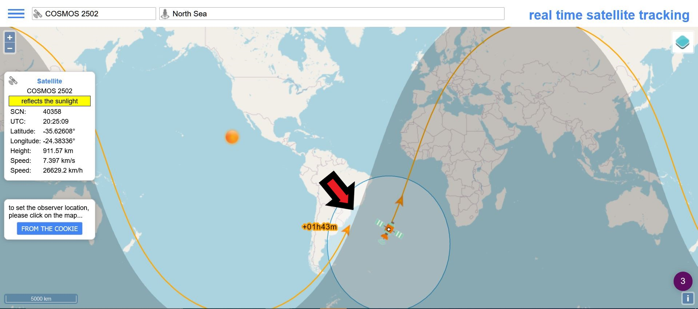

# Supplementary Material OrbTrack

<figure><figcaption></figcaption></figure>

**The Role of Satellite Imagery in Open Source Investigation**

Much, but not all, of the available higher resolution imagery sits behind paywalls and an investigator's access may be limited in both the range of imagery providers and a maximum quote on numbers of images. Satellite imagery is often pivotal in confirming and/or dating/timing a geolocation investigation which has been solved via other means. It is valuable to researchers to understand which satellite services are likely to provide imagery of regions of interest at the right time, date, resolution and aspect for their needs.&#x20;

| Input Data        | Text Entry Methods                                                            | Graphical interface Input                                                                                       |
| ----------------- | ----------------------------------------------------------------------------- | --------------------------------------------------------------------------------------------------------------- |
| Observer Location | Latitude and Longitude co-ordinates typed into text boxes on Main Menu window | 
Left Mouse Click Location on the world map background

Click Find My Location button on Menu window
 |
|                   |                                                                               |                                                                                                                 |
|                   |                                                                               |                                                                                                                 |

Visible and invisible passes

Time UTC or Local

Measurement Imperial or Metric

<table><thead><tr><th width="118" align="center">DATA</th><th width="209" align="center">TEXT INPUT</th><th align="center">GRAPHIC INPUT</th></tr></thead><tbody><tr><td align="center">Satellite Selection</td><td align="center">Text input window Top Left Screen</td><td align="center">Left Mouse Click on "Choose" button next to Satellite of Choice in the Active Satellites List (Launched from Main Menu SHOW CATALOG button)</td></tr><tr><td align="center">Observer Location</td><td align="center"><ul><li>Text input window Top Right Screen</li></ul><ul><li>Text input of Observer Latitude and Longitude in Main Menu</li></ul>

</td><td align="center"><ul><li>Left Mouse click on the blue FIND MY LOCATION BUTTON ON Main Menu under 3 lines symbol top left.</li><li>Left Mouse Click on Background Map at Chosen Observer Location</li></ul></td></tr><tr><td align="center">Choice of Background Format</td><td align="center"></td><td align="center">
Left Mouse Click one of the three Radio Button options for background map format

</td></tr><tr><td align="center">Select Satellite Pass</td><td align="center"></td><td align="center">Left Mouse Click on "Detail" button next to your selected satellite pass in right hand Info column on the 5 Day predictions window. This window is reached by clicking the blue 5-DAY PREDICTIONS button on the Observer window</td></tr></tbody></table>

| DATA OUTPUT                                                                                                                                                                                        | GRAPHIC                                                                                         |
| -------------------------------------------------------------------------------------------------------------------------------------------------------------------------------------------------- | ----------------------------------------------------------------------------------------------- |
| Near Real Time 3D Location of Given Satellite (Latitude, Longitude, Height) and Satellite Speed with Visibility of the Given Satellite:  whether is reflecting the Sun or is in Earth's shadow     |                        |
| Distance of Given Satellite from Given Location with Azimuth & Elevation Angles With Elapsed Time for Given Satellite to cross the sky at Given Location                                           |                        |
| Path of Given Satellite with Time Stamps from the Point Its Elevation Angle Relative to The Given Observer Becomes Greater than Zero , Through to the Point Its Elevation Angle Becomes Zero Again |  |
| List of Passes for Given Satellite over Given Location fpr 5 days                                                                                                                                  |                        |
|                                                                                                                                                                                                    |                                                                                                 |

**Verifying Satellite Data:**&#x20;

**Locating and Selecting Useful Satellite Data**

**Location-Focused Research:**&#x20;

Finding satellites which pass over an area of interest at an angle of elevation useful to the user.

Find the location for a given satellite at user-defined angles (azimuth and election) and date & time

Testing whether a satellite passes over an area of interest at a particular angle of elevation (and therefore may reveal sensor detail of the Earth's surface which was previously unavailable)

**Satellite-Focused Research:**&#x20;

Finding the path of a given satellite, including the high level information as to whether it is in or near geostationary orbit.

| USE CASE                                                                                              | INPUT | OUTPUT |
| ----------------------------------------------------------------------------------------------------- | ----- | ------ |
| Find the location for a given satellite at user-defined angles (azimuth and election) and date & time |       |        |
|                                                                                                       |       |        |
|                                                                                                       |       |        |

#### Review of Orbtrack.org from ChatGPT

**Orbtrack.org** is a real-time satellite tracking website that offers comprehensive tools for monitoring the positions and orbits of various satellites and other celestial objects. Here is a detailed review of its features, performance, and overall utility:

**Key Features**

1. **Real-Time Tracking**:
   * Orbtrack.org provides real-time data on the location and trajectory of satellites orbiting the Earth. Users can select any satellite from a vast catalog and view its current position, as well as predict its path for the next five days​ ([OrbTrack](https://www.orbtrack.org/))​​ ([Lizard Tail](https://www.lizard-tail.com/isana/tracking/))​.
2. **Diverse Object Tracking**:
   * The platform tracks not only satellites but also the International Space Station (ISS), rocket bodies, debris, planets, and stars. This makes it a versatile tool for both amateur astronomers and professional researchers​ ([JNikolai Dev](https://jnikolai.dev/apps/orbtrack/))​.
3. **Live Streams**:
   * Users can access live streams from the ISS, which include internal views when the crew is on-duty and external views of the Earth. This feature adds an engaging visual element to the tracking experience​ ([OrbTrack](https://www.orbtrack.org/))​.
4. **User Interface and Customization**:
   * The website features a clean and user-friendly interface with options for metric and imperial measurements. It also allows users to set their observer location manually or automatically, enhancing the accuracy of the tracking information provided​ ([OrbTrack](https://www.orbtrack.org/))​​ ([JNikolai Dev](https://jnikolai.dev/apps/orbtrack/))​.
5. **Open Source and Privacy**:
   * Orbtrack.org is an open-source project, ensuring transparency and community involvement in its development. It does not store personal data outside of the user's device, emphasizing privacy and security​ ([JNikolai Dev](https://jnikolai.dev/apps/orbtrack/))​.
6. **Offline Capabilities**:
   * The app version of Orbtrack.org can calculate satellite positions without an internet connection, making it useful in remote locations or during field research where internet access is limited​ ([JNikolai Dev](https://jnikolai.dev/apps/orbtrack/))​.

**Performance**

The website performs reliably, with a quick loading time averaging around 1.6 seconds. It does not use file compression, which could further enhance its performance, but its current speed is generally acceptable​ ([Web Statistics and Analysis | HypeStat](https://hypestat.com/info/orbtrack.org))​.

**Areas for Improvement**

1. **Advanced Features**:
   * While Orbtrack.org covers the basics effectively, adding more advanced features like augmented reality (AR) views, which are present in some other apps, could enhance its utility and user engagement.
2. **User Support and Documentation**:
   * Providing more comprehensive user guides and support resources would help new users take full advantage of the platform's capabilities.
3. **Mobile Optimization**:
   * Although the site is functional on mobile devices, a dedicated mobile app with enhanced features and optimization for smaller screens could improve user experience significantly.

**Conclusion**

Orbtrack.org is a powerful and versatile tool for satellite tracking, suitable for both casual users and professional researchers. Its real-time tracking capabilities, privacy focus, and offline functionality make it a reliable choice. However, there is room for improvement in terms of advanced features and user support. For anyone interested in tracking satellites and other celestial objects, Orbtrack.org is a highly recommended resource.


Satellites can carry many different forms of sensor, e.g. photographic imaging, heat imaging ([Infra-red](https://www.earthdata.nasa.gov/learn/find-data/near-real-time/viirs)) , LIDAR  ([Laser Imaging/Light Detection and Ranging](https://www.synopsys.com/glossary/what-is-lidar.html)) imaging, SAR ([Synthetic Aperture Radar](https://www.keysight.com/blogs/en/inds/2020/08/28/what-is-synthetic-aperture-radar)) imaging,... Not all of these require the earth to be in sunlight to collect useful data. Some of these can operate successfully in the presence of cloud cover.

