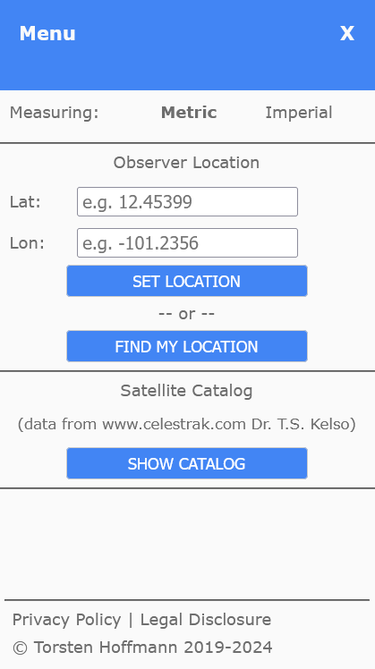

# Supplementary Material OrbTrack

<figure><figcaption></figcaption></figure>

| Input Data        | Text Entry Methods                                                            | Graphical interface Input                                                                                       |
| ----------------- | ----------------------------------------------------------------------------- | --------------------------------------------------------------------------------------------------------------- |
| Observer Location | Latitude and Longitude co-ordinates typed into text boxes on Main Menu window | 
Left Mouse Click Location on the world map background

Click Find My Location button on Menu window
 |
|                   |                                                                               |                                                                                                                 |
|                   |                                                                               |                                                                                                                 |

Visible and invisible passes

Time UTC or Local

Measurement Imperial or Metric
