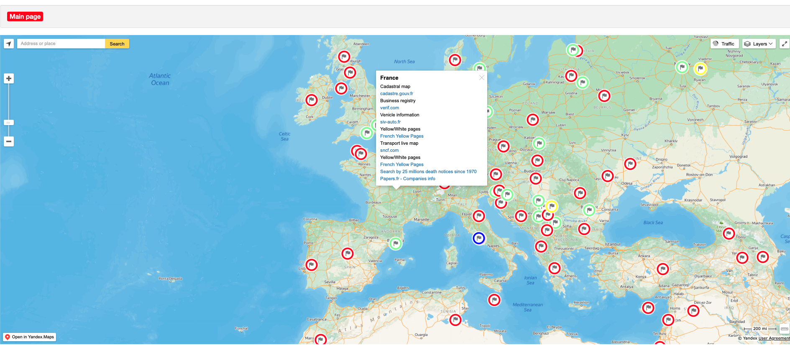

# OSINT Tools Map

## URL

[https://cybdetective.com/osintmap/](https://cybdetective.com/osintmap/)

## Description

The OSINT Tools Map is an interactive, continuously updated map created by Cyber Detective that lists open-source intelligence (OSINT) resources from around the world. Each country entry contains links to official and unofficial data sources such as business registries, land cadastres, court databases, phone directories, and media archives. Its structured layout allows users to quickly locate national or regional information sources, making it a valuable starting point for investigators researching unfamiliar countries or sectors.

The map offers a wide range of tools that draw from various public records and datasets. These include cadastral maps with land ownership details, business registries for company information, yellow pages for local listings, and court databases that can be essential for legal and investigative work.

Although the depth of information varies by country—with some offering more extensive data than others—the OSINT Tools Map still provides a broad and practical entry point for users, even when exploring regions with limited digital transparency.

<figure><figcaption>
Screenshot of the OSINT Tools Map (October 2025), showing global coverage of OSINT resources by country and category.
</figcaption></figure>

To start using the OSINT tools map, click directly to explore specific countries, cities, or regions, or use the search bar to quickly find the location you are interested in. Additionally, the platform offers a list of countries, cities, territories, and services, which can be accessed by scrolling down, providing an alternative way to navigate through the various available resources.

For example, for France, various online resources provide valuable information across different sectors. The official cadastral map can be accessed through cadastre.gouv.fr, offering detailed property records. For business registry information, verif.com serves as a useful platform, helping users check company details. Vehicle information can be found on siv-auto.fr, which provides registration and status updates.

The French Yellow Pages can be explored through the Yellow/White pages directory, which lists businesses and services. For transport-related updates, the live map on sncf.com provides real-time information about train schedules. Additionally, papers.fr offers access to over 25 million death notices since 1970, as well as company information, contributing to a comprehensive resource for historical and business data.

<figure><figcaption>
France OSINT resources page(October 2025)
</figcaption></figure>

## Features

* Interactive map: navigate visually by country and region.
* Categorized sources – includes business registries, cadastral maps, vehicle databases, phonebooks, court records, and local archives.
* Regular updates – new data sources and links are added frequently.
* Direct access – each entry links directly to third-party public data sites (availability may vary by country).
* Simple interface – lightweight, browser-based map that requires no registration or login.

## Cost

* [x] Free
* [ ] Partially Free
* [ ] Paid

## Level of difficulty

<table><thead><tr><th data-type="rating" data-max="5"></th></tr></thead><tbody><tr><td>1</td></tr></tbody></table>

## Requirements

* The OSINT Tools Map is fully web-based and can be accessed using any modern browser (e.g., Chrome, Firefox, Edge, Safari) on desktop or mobile devices.

## Limitations

While the OSINT Tools Map is regularly maintained, it functions primarily as a directory of links to external resources, rather than as a database containing the data itself. Linked sources may change, move, or become unavailable over time, and the map does not display update timestamps for individual datasets. As a result, availability and relevance of listed resources can vary, and researchers should verify the current status of any linked source.

## Ethical Considerations

Researchers should be mindful of local privacy laws, access restrictions, and ethical standards when using resources linked through the OSINT Tools Map. Many listed sources provide access to public records or personal data that may be subject to jurisdiction-specific legal or ethical constraints. Information obtained through these sources should be used responsibly and in accordance with applicable laws, particularly when handling personal or sensitive data.

## Guide and articles

* You can find the official GitHub repository here: [https://github.com/cipher387/osintmap](https://github.com/cipher387/osintmap)

## Tool provider

The OSINT Tools Map was created by [@cyb\_detective ](https://cybdetective.com/).

## Advertising Trackers

* [x] This tool has not been checked for advertising trackers yet.
* [ ] This tool uses tracking cookies. Use with caution.
* [ ] This tool does not appear to use tracking cookies.

| Page maintainer |
| --------------- |
| Unassigned      |
|                 |
