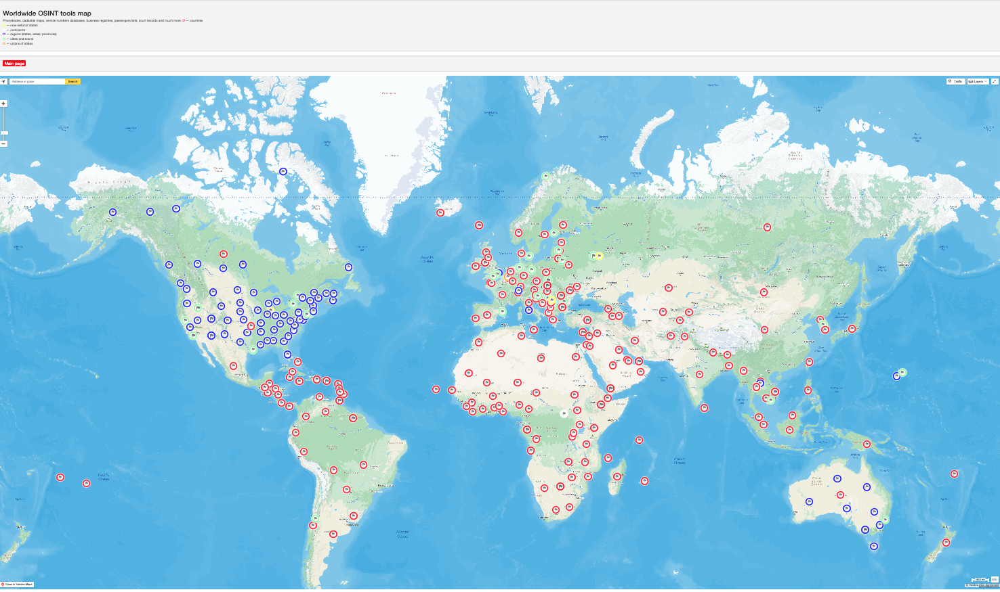
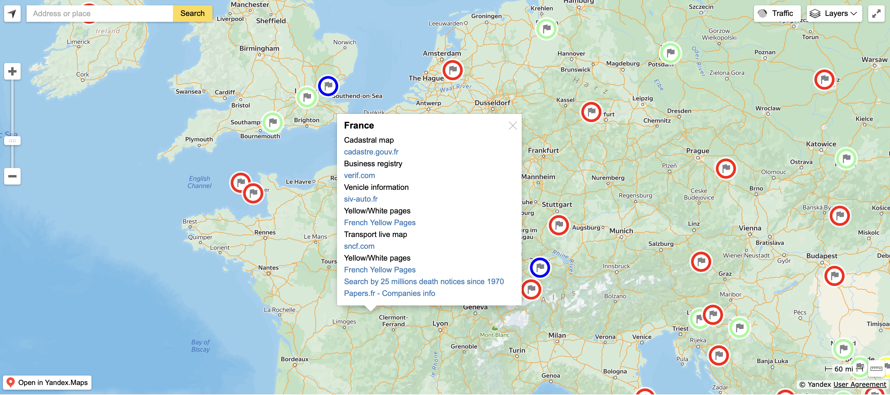

# Osint Tools Map

## URL

[https://cybdetective.com/osintmap/](https://cybdetective.com/osintmap/)

## Description

The Worldwide OSINT Tools Map, created by Cyberdetective, is an interactive platform that makes it easy for researchers to access publicly available information from across the globe. The website organizes data into different categories, including now-defunct states, continents, regions (like states, provinces, and areas), as well as cities and towns. This structure helps users find relevant resources even when they’re unfamiliar with a specific country or region.

The platform offers a wide range of tools that tap into various public records and sources. These include cadastral maps, which provide details about land ownership and property, business registries for information on registered companies, yellow pages for local business listings, and court documents that can be essential for legal and investigative work.

While the available resources may differ by country, with some offering more comprehensive data than others, the website still provides plenty of useful options for users, even when researching less familiar or harder-to-research locations.

<figure><figcaption>
Front page of OSINT tools map.
</figcaption></figure>

To start using the OSINT tools map, click directly to explore specific countries, cities, or regions, or use the search bar to quickly find the location you are interested in. Additionally, the platform offers a list of countries, cities, territories, and services, which can be accessed by scrolling down, providing an alternative way to navigate through the various available resources.

For example, for France, various online resources provide valuable information across different sectors. The official cadastral map can be accessed through cadastre.gouv.fr, offering detailed property records. For business registry information, verif.com serves as a useful platform, helping users check company details. Vehicle information can be found on siv-auto.fr, which provides registration and status updates.

The French Yellow Pages can be explored through the Yellow/White pages directory, which lists businesses and services. For transport-related updates, the live map on sncf.com provides real-time information about train schedules. Additionally, papers.fr offers access to over 25 million death notices since 1970, as well as company information, contributing to a comprehensive resource for historical and business data.

<figure><figcaption>
France OSINT resources
</figcaption></figure>

## Cost

* [x] Free
* [ ] Partially Free
* [ ] Paid

## Level of difficulty

<table><thead><tr><th data-type="rating" data-max="5"></th></tr></thead><tbody><tr><td>1</td></tr></tbody></table>

## Requirements

* The OSINT Tools Map is fully web-based and can be accessed using any modern browser (e.g., Chrome, Firefox, Edge, Safari) on desktop or mobile devices.

## Limitations

The map is a directory and not a database. Some of the external databases may require a subscription or payment for full access. The page also doesn’t show a date when it was last updated, so some site might go offline or change their access policies.

## Ethical Considerations

It is always important to keep an eye on local privacy regulations and ethical standards. Be aware that improper use of personal data from publicly available information may have legal implications.

## Guide and articles

* You can find the official GitHub repository here: [https://github.com/cipher387/osintmap](https://github.com/cipher387/osintmap)&#x20;

## Tool provider

The OSINT Tools Map was created by [@cyb\_detective ](https://cybdetective.com/).

## Advertising Trackers

* [x] This tool has not been checked for advertising trackers yet.
* [ ] This tool uses tracking cookies. Use with caution.
* [ ] This tool does not appear to use tracking cookies.

| Page maintainer |
| --------------- |
| Unassigned      |
|                 |
