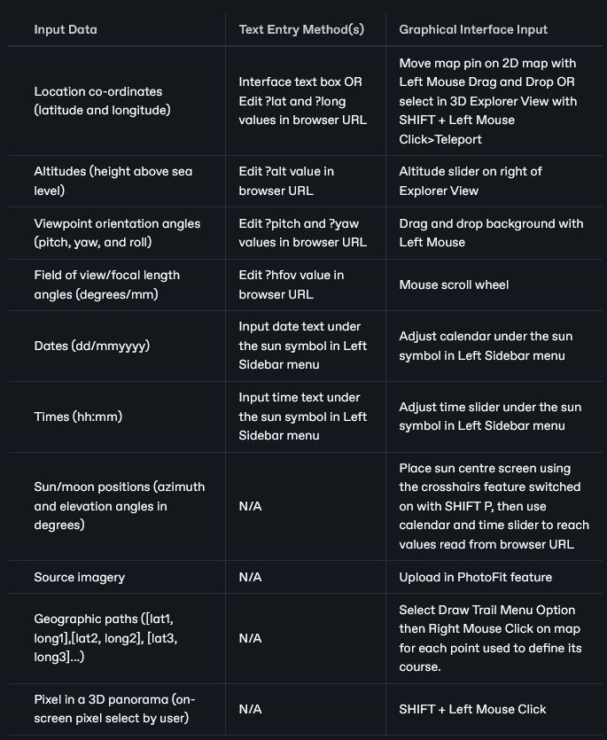
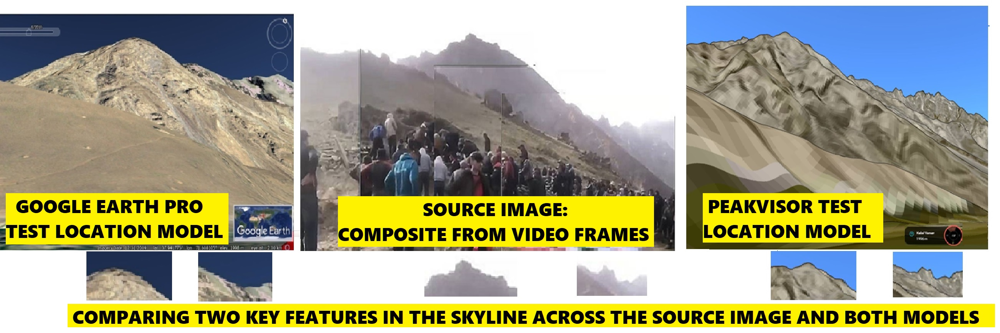
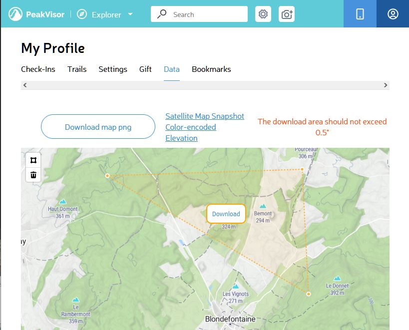
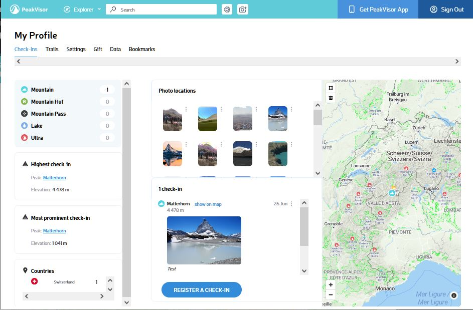
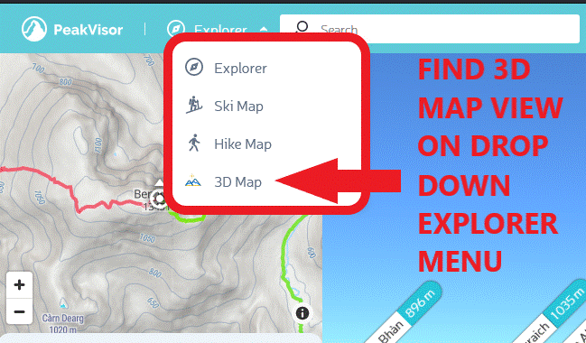
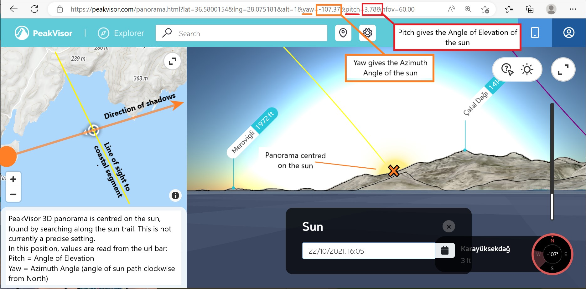
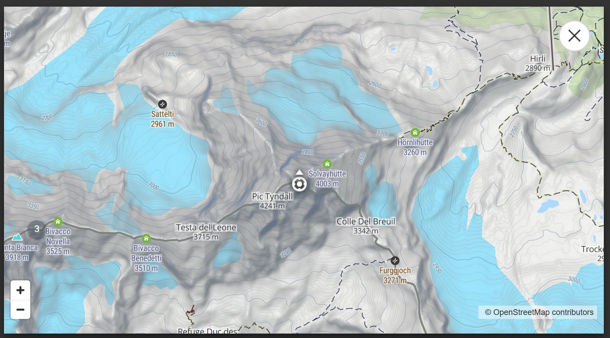
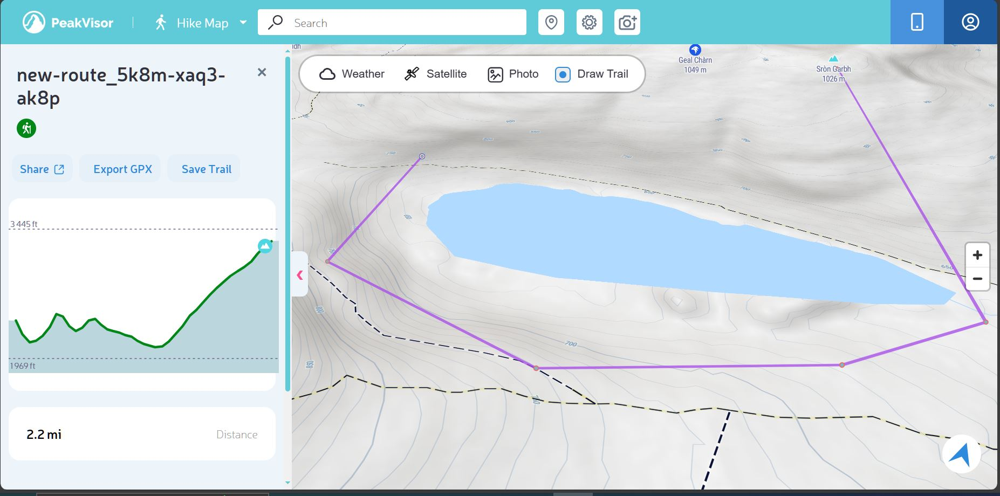
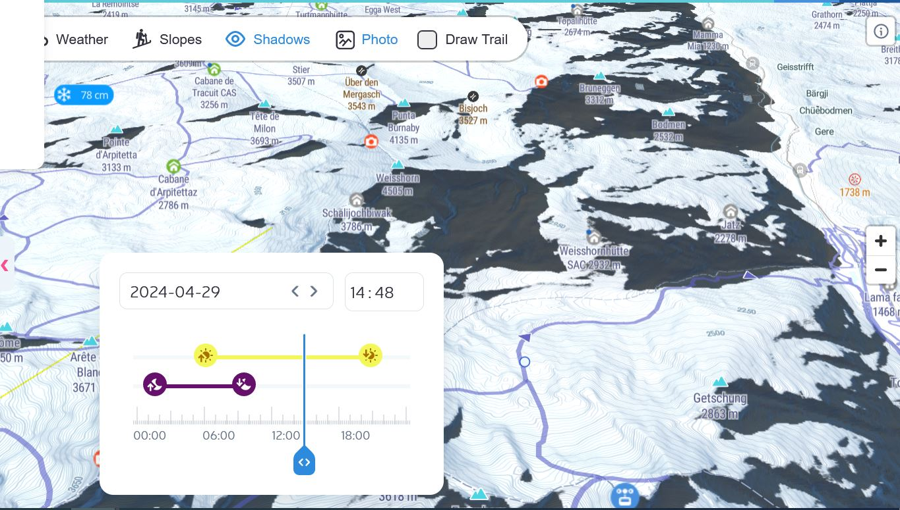
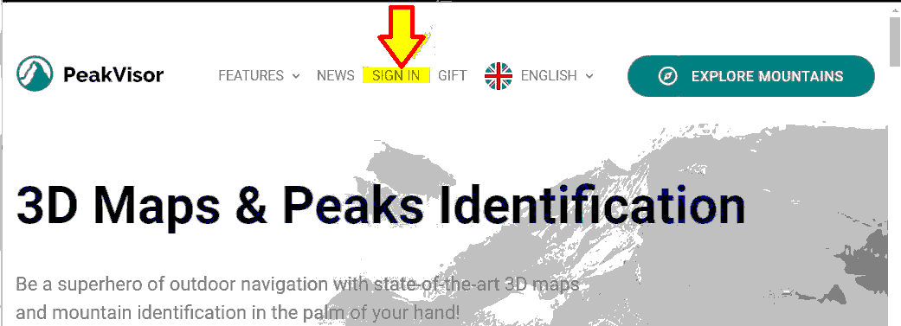

# PeakVisor

## URL

[https://peakvisor.com](https://peakvisor.com/)

## Description

### Multi-Functional Open Source Research Using PeakVisor

PeakVisor is a multi-function OSINV tool for examining high-accuracy geographic data in the form of 2D and 3D maps and rendered terrain models of near-photographic quality. This geographic data is also overlaid with detailed sun/moon, slope, shadow, elevation and, where available, weather information. PeakVisor is a leading tool for dramatic terrains, e.g. mountains, coastlines, canyons...

<figure><figcaption>
<strong>PEAKVISOR RENDERING TERRAIN MODELS IN THE MAIN WINDOW (RIGHT) AT LOCATIONS SELECTED BY THE USER WITH THE MAP PIN IN THE INSET MAP WINDOW (LEFT)</strong>
</figcaption></figure>


Beware that PeakVisor comes in 2 versions: the **Web-Based App, used for Open Source research, described here**, and the Smartphone App, used for outdoor navigation, which has significantly different functionality. Online resources can mislead as they often don't specify which version they cover.


This article covers the Web-Based PeakVisor Version for Open Source research. The 2 PeakVisor versions were developed for separate purposes...(click panel arrow for more)

PeakVisor was first developed as a navigation/orientation smartphone app for mountaineers, skiers and hikers, and uses mobile phone inputs like GPS location, compass, etc. in this version of the app. It delivers augmented reality outputs where maps are superimposed over the live camera view on the mobile phone to fix location by matching map to camera views.

The web-based version has been developed specifically for Open Source research since 2022 via the POPSI project (on X/Twitter: [@PVforOSINV](https://x.com/PVforOSINV)). It allows users to input numerical values to describe 3D geographical viewpoints in terms of latitude, longitude, altitude, pitch, yaw, roll and horizontal angle of view. It superimposes maps over geolocation source imagery to fix location by matching map to historic recorded views. **This article covers the web-based version for Open Source research**. This is best used with a large screen and an exact pointing device like a mouse. A free login is required to access all features.

### Open Source Research With PeakVisor: Use Cases, Data Input, PeakVisor Outputs, How to Enter Data...(Click the four tabs to access details)



* Location co-ordinates (latitude and longitude)
* Altitudes (height above sea level)
* Viewpoint orientation angles (pitch, yaw, and roll)
* Field of view/focal length angles (degrees/mm)
* Dates (dd/mmyyyy)
* Times (hh:mm)
* Sun/moon positions (azimuth and elevation angles in degrees)
* Source imagery
* Geographic paths (\[lat1, long1],\[lat2, long2], \[lat3, long3]...)
* Pixel in a 3D panorama (on-screen pixel select by user)



* 3D rendered terrain models
* PhotoFits of 3D terrain overlaid with user source imagery
* Distances between locations
* Elevation plots (x axis = distance along path, y axis = elevation)
* 3D and 2D maps with associated, readable values for
  * Location (latitude and longitude)
  * Altitude
  * Vewpoint orientation (pitch, yaw, and roll)
  * Field of view/focal length angles (degrees/mm)
  * Sun/moon positions (azimuth and elevation angles in degrees)
  * Shadows (map with shadow areas showing dark against light terrain)
  * Weather
  * Slopes (map with slope areas showing coloured against light terrain)



USE CASES: PeakVisor allows Open Source Researchers to geolocate and chronolocate source images by matching terrain profiles, sun/moon trails, shadows, slopes and weather.

<figure><figcaption>
<strong>COMPARING THE DATA INPUTS AND OUTPUTS RELEVANT TO EACH USE CASE</strong>
</figcaption></figure>



There is often more than one method to input data in the PeakVisor interface. Some involve typing information into text boxes in the graphical interface, some involve editing the Browser Address Bar url (considered a short cut), and some involve mouse pointer interaction directly with maps, calendars and sliders. Here is a summary table:

<figure><figcaption>
HOW TO ENTER DATA INTO PEAKVISOR
</figcaption></figure>



### PhotoFitting: PeakVisor's Most Powerful Geolocation Feature:

PeakVisor's most widely-used and praised feature to date is that it provides a geolocation ["PhotoFit"](https://www.youtube.com/watch?v=pWlukJ0v-pw\&t=7590s)function - see below.

<figure><figcaption>
<strong>THE PHOTOFITTING PROCESS: MATCHING THE PEAKVISOR TERRAIN MODEL TO THE USER'S SOURCE PHOTOGRAPH WATCH THE MOVEMENT OF THE RED LINE AGAINST THE PHOTOGRAPH SKYLINE</strong>
</figcaption></figure>

PhotoFit superimposes the outline of PeakVisor's 3D rendered terrain model at the User's Test Location over the User's uploaded source image to try to find a match...(click panel arrow for more)

As a PhotoFit user you can:-

1. Upload a photograph you are trying to geolocate using the Toolbar Camera icon.
2. Specify the location which you want to test as potentially being the location shown in the photograph.
3. Generate a rendered model of the terrain at a given location, which PeakVisor creates from its high quality global LIDAR satellite & map data.
4. Superimpose PeakVisor's terrain model outline over your photograph and adjust the location, orientation and field of view of the terrain model to try to match very exactly to determine whether the photograph and test co-ordinates are the same place.


PeakVisor will not search for a matching location for your source imagery, **you must provide a test location, i.e. a "guess"** in order to use PhotoFit for confirmation. Obviously you can repeat the process, testing different locations, until hopefully a match is found.


<figure><figcaption>
<strong>PHOTOFIT SUPERIMPOSES THE RENDERED TERRAIN OUTLINE AT THE TEST CO-ORDINATES OVER THE USER'S UPLOADED PHOTOGRAPH TO SEE IF THEY MATCH TO CONFIRM THE GEOLOCATION</strong>. A VISUALLY OBVIOUS EXAMPLE HAS BEEN CHOSEN FOR PROOF OF CONCEPT
</figcaption></figure>

IFF the PeakVisor terrain outline fits very well over the same characteristic features in the photograph, then this is very strong evidence of an accurate geolocation. The more points of inflexion\* there are in the contours being fitted, the stronger the confirmation of location. The example above is a very visually obvious geolocation, chosen to demonstrate the principle. The source image (a photograph of the Matterhorn mountain) has been uploaded to PeakVisor in "Explorer" view, and the user is moving the red silhouette of the model (which PeakVisor generated at the test location) across the photograph to try to adjust it to fit.\
\* Point of inflexion = change in direction


**PhotoFit Adjustment Can Be Time-Consuming**: The user has a selection of variables which can be adjusted to obtain an image match: viewpoint location, viewpoint angles of pitch, yaw and roll, viewpoint field of view/focal length.

**Remember that the camera may have moved or zoomed** between images if your source imagery is a 'spliced' panorama, so the goodness of fit may change between panels.



Visually, **changing Field of View and changing Viewpoint Location** can appear confusingly similar. They **are not the same thing**: the first is like zooming a telescope to change the view whilst remaining stationary, the second is moving closer or further away to change the view. Generally, changing Viewpoint Location is the more important means of obtaining a good geolocation PhotoFit.

Most cameras are set to around 60 degree Field of View. Exceptions which would justify changing the Field of View to obtain a fit are the use of zoom, security camera imagery, which often uses high angle 'fish eye' lenses.


The PhotoFit feature is particularly useful where local "Streetview" imagery is not available, e.g. in the usual sources like [Google Earth](#user-content-fn-1)[^1], [Google Maps](#user-content-fn-1)[^1], [Yandex Maps,](https://app.gitbook.com/o/WQpOq5ZFue4N6m65QCJq/s/q7NUaKbwWjmBoTIWkxHK/) Mapillary[^1], etc., either

* because no images have been taken, e.g. in a very remote area OR
* because they are unavailable for geopolitical reasons, e.g. war, government intervention.

### Data Quality in PeakVisor

PeakVisor is often used in conjunction with Google Earth Pro for geolocation research because some locations which can be recognised using PeakVisor 3D rendered models cannot be identified using Google Earth Pro. (Click panel arrow for more)

This is because PeakVisor's high data quality (from LIDAR satellite and maps), and realistic image rendering, capture small details in the terrain which make it identifiable. Whereas Google Earth presents more smoothed, less characteristic terrain models. This is particularly likely in extreme terrains such as mountains, canyons and coastlines.

<figure><figcaption>
<strong>THE CENTRAL SOURCE IMAGE IS RECOGNISABLE IN THE PEAKVISOR RENDERED MODEL OF THE TEST LOCATION THROUGH ACCURATE DEPICTION OF KEY SKYLINE FEATURES</strong>
</figcaption></figure>


Use PeakVisor in conjunction with other tools like Google Earth Pro and satellite imagery to obtain the fullest understanding of Test terrain and environment for which geolocation is needed. Exploit the differences of these tools, e.g. Google tools are quick to cover terrain in real time, strong on time-stamped historical data, strong on local photographic imagery, weak on exact photographic location, unclear on photographic aspect. PeakVisor is weak on cityscapes, sparse on local photographic imagery, slower to switch viewpoint, but strong on orientation, clear on numeric viewshed data and strong on distance measurement in 3D panoramas.


### Data Download from PeakVisor

PeakVisor provides an elevation data download feature for a maximum ground surface rectangle area equating to 0.5 degrees square of latitude and longitude. The user can define the location and shape of the download rectangle data and save it as a \*.png file in the Data tab of the PROFILE page.

<figure><figcaption>
<strong>PEAKVISOR'S DATA DOWNLOAD FEATURE REQUIRES A USER PROFILE TO DOWNLOAD ELEVATION DATA IN A USER-DEFINED RECTANGULAR AREA OF UP TO 0.5 DEGREES X 0.5 DEGREES</strong>
</figcaption></figure> <figure><figcaption>
PEAKVISOR USERS WITH AN ACCOUNT CAN ACCESS A PROFILE PAGE WHICH OFFERS THE ABILITY TO STORE PHOTOS, LOCATIONS AND PATHS, TO DOWNLOAD DATA FILES, SYNCH WITH GARMIN, EXPORT TO GPX, ETC.
</figcaption></figure>

### FIVE Different Views for Terrain in PeakVisor


3D Map view feature is temporarily disabled as at 23/8/25, pending review.


1. [Explorer View](./#view-one-explorer-view-3d-rendered-terrain-model) (3D rendered terrain model displayed with 2D Map View)
2. [2D Map View](./#view-two-2d-map-view)
3. [3D Map View](./#view-three-3d-map-view)- Temporarily disabled as at 23/8/25
4. [Hike Map View](./#view-four-hike-map-view)
5. [Ski Map View](./#view-five-ski-map-view)

As well as [**Explorer View**](./#view-three-explorer-view-3d-rendered-terrain-model), which always displays a 3D rendered terrain model of a given location next to [2D Map View](./#id-2d-map-view), PeakVisor provides a number of other view types for its topological data:, [3D Map View](./#id-3d-map-view), [Hike Map View](./#view-four-hike-map-view), and [Ski Map view](./#view-five-ski-map-view). These are accessible from the Drop Down menu under Explorer in the Toolbar - see below:

<figure><figcaption>
<strong>CHANGING PEAKVISOR'S VIEW SETTING USING THE DROP DOWN MENU UNDER "EXPLORER" IN THE TOOLBAR</strong>
</figcaption></figure>

### VIEW ONE: "Explorer" View (3D Rendered Terrain Model)

Currently the default PeakVisor view after the landing page, shown simultaneously with the 2D Map in a smaller window on the left of the screen. View from a specific user-defined altitude (ground level by default), no contour lines, a few map labels, full terrain simulation (no buildings), date, sun/moon phase &#x26; time of day simulation.... (Click panel arrow for more)

* Sun and moon trail feature accessible from this view, with date and time input
* Left Mouse Down moves two viewing angles (pitch and yaw)
* SHIFT + Arrow Keys move viewpoint location (latitude and longitude)
* On-screen slider adjusts altitude
* SHIFT + C changes colour of rendered 3D terrain outline
* SHIFT + L toggles peak name labels on and off
* SHIFT + P toggles centre screen cross-hairs on and off
* PhotoFit feature invoked from this view using the Camera Icon on the Toolbar

<figure><figcaption>
<strong>PEAKVISOR PANORAMA VIEW FROM GROUND LEVEL WITH TERRAIN &#x26; SUN TRAIL FOR DATE AND TIME</strong>
</figcaption></figure>

#### Special Functions of Explorer View

Teleport to a Different User-Selected Viewpoint: SHIFT + Left Mouse Click... (Click panel arrow for more)

In 3D Explorer View it is possible to select a point in the rendered terrain model from the 3D Explorer View. This is done by pressing SHIFT and then Left Mouse Clicking over the pixel at the desired location.

* A red map pin labelled with '?' in white is drawn at the chosen spot.
* A subwindow appears, showing the co-ordinates of the point, its elevation and its distance from the viewpoint.
* This subwindow has a large blue "Teleport" button, which refreshes the panorama to a viewpoint at the chosen new location

<figure><figcaption>
THE DISTANCE MEASUREMENT FUNCTION IN THE 2D WINDOW AND THE TELEPORT FUNCTION IN THE 3D EXPLORER WINDOW, WHICH SWITCHES THE VIEWPOINT TO A LOCATION IN THE 3D RENDERED VIEW SELECTED BY THE USER
</figcaption></figure>


The developers have reports of problem using the Teleport function from users and look to resolve them by July 24 during an major upgrade.


Measure Distance from the Viewpoint to a User-Selected Point: SHIFT + Left Mouse Click... (Click panel arrow for more)

The distance displayed in the subwindow upon SHIFT + Left Mouse Click on the Explorer view panorama is the distance between the observer, the user-selected viewpoint location, and the object which has just been highlighted. It is simultaneousy displayed on the 2D Map as a blue line between the viewpoint (white map pin with arrow) and the chosen location (red map pin).


The Distance measurement feature can be used as a rapid way to determine lines of sight, i.e. using PeakVisor output we can say "If this image was taken at location L1, then the following features would be visible because there is a line of sight to their locations from L1 (and vice versa)." Where the horizon is chosen as line of sight, this can be a very useful way to determine what should and should not be visible from a given location.


Sun and Moon Trail Calculations: Use SHIFT + P with time slider to explore the relationship between location, date, time, sun azimuth and sun elevation... (Click panel arrow for more)

* Use the subwindow under the Sun icon on the left sidebar to set Date on the calendar
* Use the timeslider in the subwindow under the Sun icon to set Time
* Switch on the centre screen cross hairs using SHIFT P to allow exact positioning and measurement
* Move the sun across the sky using the time slider in the left sidebar
* Place the sun in the centre of the cross hairs to read off accurate azimuth (yaw) and elevation (pitch) angles.

<figure><figcaption>
EXAMPLE USE OF PEAKVISOR TO DETERMINE THE EXACT POSITION OF THE SUN AT A GIVEN DATE, TIME &#x26; LOCATION
</figcaption></figure>

The PeakVisor view above could be used to test whether the location, time and date of geolocation source imagery were consistent and feasible, e.g. at the test location, could the sunset still be visible from the viewpoint at the time and date claimed?


When the sun is centre screen in the PeakVisor Explorer view, the yaw value in the Browser address bar url is the azimuth angle of the sun, and the pitch value is the elevation angle.


There are also view types for Skiers and Hikers, each of which has functionality useful for Open Source research:

### VIEW TWO: 2D Map View

By default, this view is shown in a small left hand window next to a larger Explorer View rendered terrain in the right hand window, though it is possible to maximise 2D Map View as needed... (Click panel arrow for more)

* from altitude directly overhead above chosen viewpoint, including elevation contour lines and map feature labels, no terrain simulation
* Left Mouse Down over the background allows the user to move around the map
* Left Mouse down over the Map Pin allows the user to move the viewpoint of the Explorer View model

<figure><figcaption>
<strong>PEAKVISOR 2D MAP VIEW WITH CONTOUR LINES AND MAP LABELS (PLACES, PATHS, CONTOURS ETC)</strong>
</figcaption></figure>

### VIEW THREE: 3D Map View - temporarily disabled pending review

Chosen from the View Selection Drop Down in the menu bar. View from an altitude above chosen viewpoint, including elevation contour lines and map feature labels, no terrain simulation.... (Click panel arrow for more)

* Left Mouse Down changes location of map co-ordinates (latitude, longitude
* Right Mouse Down changes viewing angles (pitch, yaw, roll) within limits
* Use Left and Right Mouse Down simultaneously to 'tour' a landscape feature.

<figure><figcaption>
<strong>PEAKVISOR 3D MAP VIEW SHOWING MOUSE CONTROLS: LEFT MOUSE FOR LOCATION, RIGHT MOUSE FOR PITCH (VERTICAL) AND YAW (HORIZONTAL)</strong>
</figcaption></figure>

### **VIEW FOUR: Hike Map** View:-

Chosen from the View Selection Drop Down in the menu bar. This view offers an altitude above chosen viewpoint, set at an angle to the earth (rather than viewing vertically downward), elevation contour lines and map feature labels, no terrain simulation. CLICK for more details...... (Click panel arrow for more)

* **Weather:** This is not globally available,and only provides forecasts and direct data feeds from some mountainous regions where specific marked weather station data is published with a time lag of hours, rather than days. When available, this is extremely valuable geo- and chronolocation information which can narrow down timeframes and geographical search areas. The forecast presence of the aurora borealis is also included as a coloured map overlay for relevant regions.\
  Weather data is classed as either Forecasts of temperature, precipitation and wind or as Weather Station data, which appears as a sidebar menu when available.
* **Satellite:** tbc
* **Photo:** Toggles the map pins on the map which represent stored locations
* **Draw Trail:** Allows the user to draw and store a trail on the map as a set of points input by Right Mouse Click. This appears as a sidebar menu on the left of the screen.

<figure><figcaption>
<strong>DRAWING AND STORING A TRAIL IN HIKE MAP VIEW - TRAIL IS PURPLE, SIDEBAR SHOWS TRAIL ELEVATION PLOT</strong>
</figcaption></figure>

### VIEW FIVE: Ski Map View

Chosen from the View Selection Drop Down in the menu bar. This view offers an altitude above chosen viewpoint, elevation contour lines and map feature labels, information on slopes, routes and ski lift status, no terrain simulation.... (Click panel arrow for more)

In addition to Weather, Photo and Draw Trail functions, Ski Map Options additionally deliver

* Slopes : Map colour shading to indicate degree of slope of the terrain, from white for flat, through yellow for mild to orange and red for steep.
* **Shadows** : An overlay view generated around a user-input date and time, where the shadows cast by the landscape are rendered in detail.

* Slopes: Map colour shading to indicate degree of slope of the terrain, from white for flat, through yellow for mild to orange and red for steep.

<figure><figcaption>
THE SLOPE OVERLAY IN PEAKVISOR SKI VIEW COLOURS SLOPES OF SIMILAR GRADIENT ACCORDING TO A 'HEATMAP' SCALE
</figcaption></figure>


Very useful for doing wide-area searches to match major slope terrain features and thus reduce search space in a geolocation.


* **Shadows**: An overlay view generated around a user-input date and time, where the shadows cast by the landscape are rendered in detail.

<figure><figcaption>
SHADOWS CAST ACROSS THE LANDSCAPE AT THE DATE AND TIME SHOWN
</figcaption></figure>


Move the time slider to watch the major shadows cast by terrain features move across the landscape at the date, time and place you choose. Very powerful for confirmation of geolocation imagery containing terrain shadows, e.g. how far does the shadow of that mountain/canyon side reach at a certain time of day and year?


***

## Cost

* [x] Free
* [ ] Partially Free
* [ ] Paid

## Level of difficulty

<table><thead><tr><th data-type="rating" data-max="5"></th></tr></thead><tbody><tr><td>3</td></tr></tbody></table>

It is easy to use PeakVisor's basic features, but the most useful ones take some time to master.

The PhotoFit feature often requires a good deal of adjustment to obtain a good fit, and some understanding of visual field of view and focal length. [Watch the video above](./#description) and note that many different small adjustments are needed to get the skyline fit.

Similarly, the Sun and Moon trails feature takes time to master for chronolocation purposes, and the use of the centre screen crosshairs (SHIFT + P) is needed for accuracy.

## Requirements

An email login is needed for some functions like elevation data download, location and path saving. This can be created using the SIGN IN feature in the centre of the top menu on the landing page - see below.

<figure><figcaption>
<strong>PEAKVISOR LANDING PAGE SHOWS A "SIGN IN" FUNCTION UNTIL A USER REGISTERS AN ACCOUNT</strong>
</figcaption></figure> <figure><figcaption>
<strong>ONCE THE USER HAS AN ACTIVE ACCOUNT, THEY GAIN ACCESS TO THE PROFILE FEATURES VIA THE LANDING PAGE</strong>
</figcaption></figure>

## Limitations

* **Performance:** PeakVisor Web version for OSINV is a development project, so performance can be volatile whilst upgrading. See [_Performance Issues and Their Management_](https://www.youtube.com/watch?v=xNqSwL9j8h4\&t=5353s)
* **Urban Environments Rarely Usefully Rendered:** PeakVisor Source Data is greater than 30m/pixel in many areas, but features smaller than 30m cannot be assumed to be visible on PeakVisor Explorer View rendered terrains. Thus urban environments will rarely be usefully rendered with respect to bulidings, but useful information can be gleaned about urban lanscapes and lines of sight.
* **Resizing Windows:** PeakVisor 3D and 3D Explorer windows can switch zoom scale when Teleporting between viewpoint locations in the model, which means users often need to resize and adjust scale during their work.
* **Buffering Effect at Capacity Limit:** PeakVisor operates at the limit of capacity when the user continuously adjusts viewpoint in 3D Explorer View, because it must constantly re-render the imagery. If buffering limits are reached, the system will 'boomerang' back to a previous location. The way to work around this is to move the viewpoint in increments.

<figure><figcaption>
<strong>DEMONSTRATING THE EFFECTS OF RESOURCE LIMITATIONS WHEN TRYING TO MOVE LOCATION TOO RAPIDLY</strong>
</figcaption></figure>

## Ethical Considerations

### Overview: Ethical Low Risk, High Opportunity

PeakVisor can and has been used in geolocating imagery from remote areas which claims to depict mistreatment of indigenous minorities. As such, it can be used support to work which seeks to protect human rights, indigenous peoples, minorities and the environment through accurate geolocation. The type of exact (within 30m, sometimes 10m in some areas) geolocation which tools like PeakVisor and satellite imagery (sometimes used in conjunction) can deliver can indirectly reveal the identify of people providing source information, which could put them/their contacts at risk of reprisal. Source information providers may or may not be aware of this risk, so there is a responsibility on the Open Source researcher, who may have more information for accurate risk assessment, to evaluate that risk on their behalf. Many information providers willingly undertake the risk of reprisal for the benefit of drawing public/global attention to situations and events they hope will be changed or acted upon as a result of exposure.

Personal Privacy of, and Risk To, PeakVisor Users... (Click panel arrow for more)

PeakVisor does not as yet deal primarily in user-generated photography (although this may change over time). Currently it has the capacity to store and share images, and these are mainly of climbers, hikers and skiiers at locations they consider to be an achievement to reach. There is a small potential risk to them in publishing their presence at a particular location and time. If they understood that their images would be shared by PeakVisor, they have willingly undertaken this risk by uploading them.

Risk to the Environment... (Click panel arrow for more)

Promotion of remote/difficult-to-access locations through such photography could lead to sufficient numbers of new visitors to create environmental damage, particularly if PeakVisor imagery was used by mainstream media and reached very large numbers of consumers. PeakVisor's data accuracy and Smartphone app version make reaching such locations easier to less expert people, and so increase the numbers likely to make the attempt. Depending upon the existence of local communities and the nature of their economies, more visitors might be welcomed, or deplored, but every location has a limit on the number of visitors it can sustain without harm.

Risk to Communities... (Click panel arrow for more)

PeakVisor's promotion of remote/difficult-to-access locations and navigational assistance in accessing them could pose a threat to the wellbeing, safety and way of life of local communities.

## Guide


Almost all the tutorial and guide material currently online for PeakVisor refers to the Smartphone version of the tool and for this reason is not included here as much of the functionality is not yet available in the web version for Open Source Research, and some is not applicable. PeakVisor's developers have not yet created Help content for the web version of PeakVisor as the tool is so newly developed and major changes are ongoing.


<table><thead><tr><th width="187">Author +/ Source</th><th width="154">Format</th><th>Title and Link</th></tr></thead><tbody><tr><td>Sophie Tedling, Bellingcat Website</td><td>Article on an OS Investigation using PeakVisor</td><td><a href="https://www.bellingcat.com/resources/2023/07/13/more-than-mountaineering-using-peakvisor-for-geolocation/"><strong>More than Mountaineering: Using PeakVisor for Geolocation</strong></a></td></tr><tr><td>Sophie Tedling, YouTube, Bellingcat Channel</td><td><strong>Video Webinars:</strong></td><td><a href="https://www.youtube.com/watch?v=xNqSwL9j8h4">Using PeakVisor For Geolocations</a></td></tr><tr><td>Sophie Tedling, YouTube, Bellingcat Channel</td><td><strong>Video Webinars:</strong></td><td><a href="https://www.youtube.com/watch?v=pWlukJ0v-pw">How To Use PeakVisor, The Mountaineering App, For Open-Source Research</a></td></tr><tr><td>X/Twitter</td><td>X/(Twitter) Account</td><td><a href="https://x.com/PVforOSINV">@PVforOSINV</a></td></tr></tbody></table>

#### Video Excerpts for Specific Topics:

[_00:22:50_](https://www.youtube.com/watch?v=pWlukJ0v-pw\&t=1370s) _Five USP PeakVisor Features: 30m Global Accuracy Data, Contour Mapping for Lines of Sight, Sun Trails for Chronolocation, Distance Calculation within Virtual Terrain, Photofit Image Match Validation_

[_01:01:20_](https://www.youtube.com/watch?v=pWlukJ0v-pw\&t=3680s) _PeakVisor Map Interface: Explore Mountains Map Page_

[_01:09:55_](https://www.youtube.com/watch?v=pWlukJ0v-pw\&t=4195s) _Seven Underlying Parameters Describe the PV Panorama_

[_01:27:25_](https://www.youtube.com/watch?v=pWlukJ0v-pw\&t=5245s) _How to Input a Location_

[_01:28:31_](https://www.youtube.com/watch?v=pWlukJ0v-pw\&t=5311s) _How to Adjust Altitude and Read Contours in the 2D Map_

[_01:32:09_](https://www.youtube.com/watch?v=pWlukJ0v-pw\&t=5529s) _How to Adjust Viewing Angles_

[_01:36:08_](https://www.youtube.com/watch?v=pWlukJ0v-pw\&t=5768s) _How to Adjust Field of View and What It Means_

[_01:43:22_](https://www.youtube.com/watch?v=pWlukJ0v-pw\&t=6202s) _How to Move from an Existing Location_

[_01:48:43_](https://www.youtube.com/watch?v=pWlukJ0v-pw\&t=6523s) _How to Measure Distance to Another Location_

[_02:06:30_](https://www.youtube.com/watch?v=pWlukJ0v-pw\&t=7590s) _How to find a PhotoFit_

[_00:37:06_](https://www.youtube.com/watch?v=xNqSwL9j8h4\&t=2226s) _Sun and Moon Trails and the Shadow Method: Suncalc_

[_01:05:25_](https://www.youtube.com/watch?v=xNqSwL9j8h4\&t=3925s) _Depth and Field of View_

[_01:07:38_](https://www.youtube.com/watch?v=xNqSwL9j8h4\&t=4058s) _Field of View, Focal Length and HFOV: Chasing the Perfect Photofit_


_The PeakVisor website help does not refer specifically to the Web Version, and so describes some major features which are only available on Smartphones._


## Tool provider

Routes Software SRL, VIA CAVOUR 2 LOMAZZO, COMO, 22074 ITALY

## Advertising Trackers

* [ ] This tool has not been checked for advertising trackers yet.
* [x] This tool uses tracking cookies. Use with caution.
* [ ] This tool does not appear to use tracking cookies.

| Page maintainer:- |
| ----------------- |
| Sophie Tedling;   |
|                   |

[^1]: To be cross-referenced with other Toolbox tool entries.
