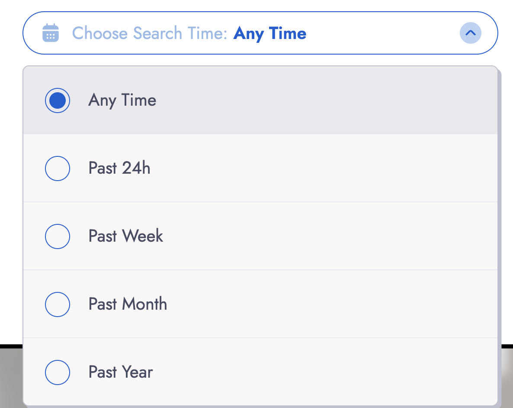

# PimEyes

## URL

[https://pimeyes.com/en](https://pimeyes.com/en)

## Description

PimEyes lets users upload pictures of a person and conducts an AI search to find pictures of faces that look similar. The results contain photos of similar looking people and link to websites where those pictures show up online, often allowing identification (name, organisation etc.) of the pictured individuals. PimEyes' [website states](https://pimeyes.com/en/faq) that the tool only searches public websites and does not look at social media and videos (or video thumbnails). Back in 2020, [netzpolitik.org ](https://netzpolitik.org/2020/pimeyes-face-search-company-is-abolishing-our-anonymity/)had still found social media photos in their results list while testing the tool. According to an [interview](https://netzpolitik.org/2022/pimeyes-ceo-the-user-is-the-stalker-not-the-search-engine/) with CEO Giorgi Gobronidze, PimEyes had "approximately 2.1 billion faces maximum" hashed in 2022.

Thetool provider [writes](https://pimeyes.com/en/faq) that the tool is "intendend solely for personal use". However, no measures are taken to prevent users from also uploading photos of others.&#x20;

During the last few years, open source researchers and journalists have added the tool to their personal toolbox. For instance, Bellingcat used Pimeyes during [an investigation (by German journalists) to search for a picture of RAF terror suspect Daniela Klette](https://www.zdf.de/nachrichten/politik/deutschland/daniela-klette-verhaftung-gesichtserkennung-pimeyes-100.html) who had long been in hiding. The tool has also played a role in [identifying US Capitol January 6 rioters](https://gijn.org/stories/how-open-source-experts-identified-the-us-capitol-rioters/). It is important to note that using tools like Pimeyes is never enough to identify the same person across several pictures, facial recognition tools always have to be combined with other research methods to allow for reliable conclusions.

To use Pimeyes, simply upload a photo of a person of interest. It is possible to upload up to five pictures of the same individual. If the quality of the picture is low, Pimeyes suggests uploading a better picture and provides tips like having the person in the picture "looking forward" or having "no elements covering the face". However, it is also possible to ignore those suggestions and to do a search with a low quality image. Our own tests showed that even with a low quality image, the tool is often still able to provide results. While the tool struggled to find matches for people wearing masks, it was also able to work with pictures of people who were visible from the side.

Users can choose whether they want to search for pictures that have been indexed by Pimeyes recently or they can opt for "Any Time".

<figure><figcaption></figcaption></figure>

Pimeyes shows when each picture in the results list has been indexed. This can be seen at the bottom of the information box that comes up when clicking on a listed picture:

<figure><figcaption></figcaption></figure>

The tool is sometimes (but not always) able to find pictures that have been indexed by Pimeyes on the same day. Keep in mind that this is not necessarily the day when the picture was published online. While working on long-term investigations, searching for the same picture at different points in time can yield new results.&#x20;

Pimeyes also offers a "safe search" feature which tries to exclude "possible adult content from results". Be aware that this type of content can otherwise show up in the search results. There is also a "deep search" [option](https://pimeyes.com/en/blog/how-to-use-pimeyes-a-brief-guide#paragraph9) that is only available to users with the most advanced plan and which claims to search the index ["more thoroughly"](https://pimeyes.com/en/blog/how-to-use-pimeyes-a-brief-guide#paragraph9).

The tool provider claims that their system is deleting pictures uploaded by users for search purposes within 48 hours and that they "[do not store any private data from our users](https://pimeyes.com/en/faq)". We are not able to independently verify those claims.

Pimeyes is a paid tool. While users can receive a list of pictures with similar looking people when uploading a picture to the free test version, they can not see on which websites those pictures can be found. However, in some cases open source researchers can also use Google dorks to try to find out more about the pictures in the results list.

To demonstrate this, we uploaded an image of the late former prime minister of Pakistan, Zulfikar Ali Bhutto. The tool provided several results but without a subscription, it was not possible to click on "Open website" for any of the results.&#x20;

However, each of the photos in the results list displayed an imcomplete URL, in this case "https://thefrontierpos....".

<figure><figcaption>
Example of one of several search results after uploading a picture of the former prime minister of Pakistan, Zulfikar Ali Bhutto. 
</figcaption></figure>

Typing this incomplete URL into search engines brought up the the name "The Frontier Post", a local Pakistan site, and the full URL of their website. We now searched for "_Zulfikar Ali Bhutto" site:thefrontierpost.com_ on Google:

<figure><figcaption>
Google Images results for a search for a name and the URL of the website to which a Pimeyes result might be linking.
</figcaption></figure>

The brought up several pictures of Zulfikar Ali Bhutto on the website of The Frontier Post, including the photo that had also showed up in our Pimeyes search results. Open source researchers can now click on the URL to this phot to continue their research.&#x20;

## Cost

* [ ] Free
* [ ] Partially Free
* [x] Paid

The first 10 searches are partially free: It is possible to upload pictures and to see the results list but it is not possible to click on (or see) the URLs to see on which websites the pictures from the results list are appearing.&#x20;

A subscription is always required to access detailed results. See the pricing details [here](https://pimeyes.com/en/premium).

## Level of difficulty

<table><thead><tr><th data-type="rating" data-max="5"></th></tr></thead><tbody><tr><td>1</td></tr></tbody></table>

## Requirements

A web browser and a subscription for accessing results.

## Limitations

Don't assume that only because Pimeyes presents a picture of a person as a match, that this picture necessarily shows your person of interest. Facial recognition tools can provide inaccurate results, it is important to combine the use of facial recognition tools with other research methods to be able to draw accurate conclusions.

Low-resolution images,  black-and-white pictures or pictures of people whose faces are partly covered may not lead to useful results as outlined by [Pimeyes](https://pimeyes.com/en/blog/how-to-improve-the-facial-recognition-search-results).

## Ethical Considerations

The use of facial recognition tools can be highly problematic from an ethical point of view. NPR's article '[Too dangerous': Why even Google was afraid to release this technology](https://www.npr.org/2023/10/11/1204822946/facial-recognition-search-engine-ai-pim-eyes-google) outlines how tools like Pimeyes can enable stalking and the surveillance of people in the public space. The tool also provides [results from pornographic sites](https://www.nytimes.com/2022/05/26/technology/pimeyes-facial-recognition-search.html) and can (mis)identify women that are visible on pornographic pictures.

Journalists and open source researchers should carefully assess whether and in which cases the use of facial recognition tools should be considered.&#x20;

Poynter providers a starter kit for an AI ethics policy for [newsrooms](https://www.poynter.org/ethics-trust/2024/how-to-create-newsroom-artificial-intelligence-ethics-policy/). In this [interview](https://lincolncenter.asu.edu/), experts from Arizona State's Lincoln Center for Applied Ethics talk about the "The ethical implications of facial recognition technology."

You might also want to have a look at Josephine Lulamae's reflections on the ethical use of facial recognition tools in AlgorithmWatch's article: [War Crimes OSINT, Harassment, Doxxing Police and Protesters: Face Recognition for Everyone](https://algorithmwatch.org/en/face-recognition-for-everyone/) (2022).

## Guide

Pimeyes' own [user guide.](https://pimeyes.com/en/blog/how-to-use-pimeyes-a-brief-guide#paragraph9)

Henk van Ess: [Facial Recognition Made Easy](https://gijn.org/resource/facial-recognition-made-easy/)< Global Investigative Journalism Network, 2023.

## Similar tools

[FaceCheck.ID](https://bellingcat.gitbook.io/toolkit/more/all-tools/facecheck.id) is another facial recognition tool that allows users to upload pictures to find pictures of similar looking people.

While FaceCheck.ID only allows payment via cryptocurrency, a Pimeyes subscription can be paid via ["Credit or Debit card, PayPal, Google Pay or Apple Pay"](https://pimeyes.com/en/premium).

## Tool provider

The website does not provide details about the tool provider. According to news reports, the details [surrounding](https://www.washingtonpost.com/technology/2021/05/14/pimeyes-facial-recognition-search-secrecy/) the initial [ownership](https://www.nytimes.com/2022/05/26/technology/pimeyes-facial-recognition-search.html) are murky. The new owner of PimEyes is [Giorgi](https://www.nytimes.com/2022/05/26/technology/pimeyes-facial-recognition-search.html) Gobronidze [as](https://netzpolitik.org/2022/pimeyes-ceo-the-user-is-the-stalker-not-the-search-engine/) of 2022.

## Advertising Trackers

* [x] This tool has not been checked for advertising trackers yet.
* [ ] This tool uses tracking cookies. Use with caution.
* [ ] This tool does not appear to use tracking cookies.

| Page maintainer |
| --------------- |
| Anisa Shabir    |
|                 |
