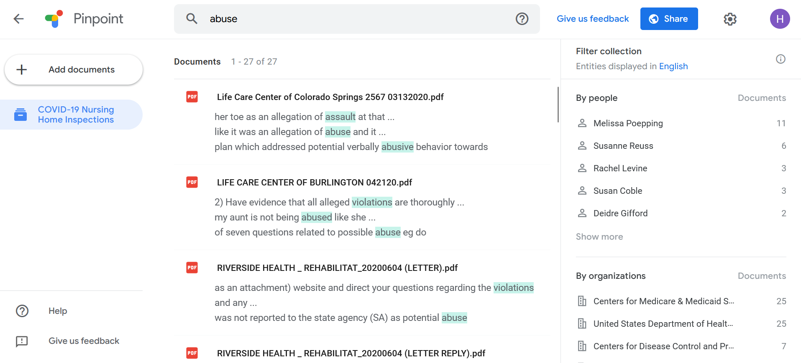

# Pinpoint

## URL

https://journaliststudio.google.com/pinpoint/about

## Description

Pinpoint is a research tool designed to assist journalists and academics in examining and analyzing large document collections. With Pinpoint, users can upload and search through hundreds of thousands of documents, images, emails, handwritten notes, and audio files to find specific keywords, locations, organizations, or individuals. It’s part of the [Journalist Studio](https://journaliststudio.google.com/), Google’s free tool kit for research, data analysis, and data visualization.

Users can store up to 200,000 documents in each collection, extract text from handwritten documents to make them searchable, query text from images, transcribe audio recordings and search for identifiers in image collections. For example, using Pinpoint, you can search for mentions of "abuse" or "violence" in Washington Post's public collection of COVID-19 Nursing Home Inspections:

<figure><figcaption></figcaption></figure>

## Cost

* [x] Free
* [ ] Partially Free
* [ ] Paid

## Level of difficulty

<table><thead><tr><th data-type="rating" data-max="5"></th></tr></thead><tbody><tr><td>1</td></tr></tbody></table>

## Requirements

No requirements, including Google account, to browse and use public collections by other organizations. But you need to certify that you are an academic or a researcher to Google in order to upload documents.&#x20;

<figure><figcaption></figcaption></figure>

## Limitations & Ethical Considerations

Pinpoint has experimental features that use Google's Generative AI solutions, and according to [this notice](https://support.google.com/pinpoint/answer/14338615?hl=en) on Generative AI in Pinpoint, these features "may display inaccurate information, including information about people." Additionally, some of the information you provide may be used to improve functionality, and "Google human reviewers may read, annotate and process a sample of your Pinpoint data, including your prompts and thumbs up or down feedback." As a result, Google cautions against including information "that can be used to identify you, such as phone numbers, email addresses, or birth dates when using Pinpoint’s generative AI features."&#x20;

We recommend exercising caution and/or checking with your parent organization before uploading sensitive or proprietary information, documents and data into Pinpoint.

According to [Pinpoint Additional Terms of Service](https://support.google.com/pinpoint/answer/13071911?hl=en), "if you upload content to Pinpoint, you give Google permission to use that content, including to operate and promote Pinpoint, in accordance with the [Google Terms of Service](https://policies.google.com/terms) and [Google’s Privacy Policy](https://policies.google.com/privacy)."&#x20;

## Guides and articles

[Getting Started with Pinpoint](https://journaliststudio.google.com/pinpoint/getting-started), and [video ](https://newsinitiative.withgoogle.com/resources/trainings/pinpoint/video-getting-started-with-pinpoint/)

[About Pinpoint](https://support.google.com/pinpoint/answer/11948320?hl=en)

[How to make the most of Pinpoint](https://www.fastcompany.com/90841519/how-to-make-the-most-of-pinpoint-part-of-googles-toolkit-for-journalists) by Fast Company

## Tool provider

Google

## Advertising Trackers

* [x] This tool has not been checked for advertising trackers yet.
* [ ] This tool uses tracking cookies. Use with caution.
* [ ] This tool does not appear to use tracking cookies.

| Page maintainer |
| --------------- |
|                 |
|                 |
