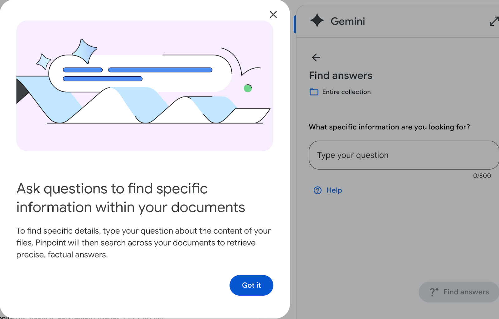

# Pinpoint

## URL

[https://journaliststudio.google.com/pinpoint/about](https://journaliststudio.google.com/pinpoint/about)

## Description

Pinpoint is an AI-powered research tool designed to assist journalists and academics in structuring and analysing large document collections. Within Pinpoint, users can upload and search through documents, images, emails, handwritten notes, and transcriptions of audio files; pinpoint extracts entities as keywords, locations, organisations, and person names. It supports both manual document labeling (tagging by subject or other custom definition) and automated entity extraction, so users can search by fields like date, sender, etc. Pinpoint is part of the [Journalist Studio](https://journaliststudio.google.com/), Google’s free tool kit for research, data analysis and data visualisation.&#x20;

<figure><figcaption>
Upload documents to a Pinpoint collection and it will convert to pdf and automatically extract persons, organisations and locations. 
</figcaption></figure>

Since june 2026, Google Pinpoint's basic features are open to anyone with a google account. Pinpoint Professional is still aimed at journalists and academics and offers more storage (100 GB vs 1 GB), high priority in processing queues and early access to new features.&#x20;

Pinpoint Professional users can store up to [240.000 documents ](https://support.google.com/pinpoint/answer/11955480?hl=en-IN#upload_documents)in each collection, extract text from handwritten documents or non-searchable pdfs to make them searchable, query text from images, transcribe audio recordings and search for identifiers in image collections.

It is possible to upload audio files up to 2 hours long, which can be transcribed in txt files in [over 100 languages](https://support.google.com/pinpoint/answer/11991030).

Its [extract structured data](https://support.google.com/pinpoint/answer/13012346?hl=en) function allows you to convert similarly structured documents into a csv or spreadsheet which can be exported to Excel, Google Sheets or a database.

For example, using Pinpoint, you can search for mentions of keywords like "abuse" or "violence" in [Washington Post's public collection of COVID-19 Nursing Home Inspections](https://journaliststudio.google.com/pinpoint/search?collection=989c939c11b20432). Named entities inside the documents as persons, organisations and locations are recognised automatically and can be used as filters.

<figure><figcaption>
Collections can be private or published so that they are available to the public via <a href="https://journaliststudio.google.com/pinpoint/explore">Explore</a>. 
</figcaption></figure>

Collections from your workspace can also be published so that they are searchable for everyone, also without a google or Pinpoint account or login.&#x20;

## Cost

* [x] Free
* [ ] Partially Free
* [ ] Paid

## Level of difficulty

<table><thead><tr><th data-type="rating" data-max="5"></th></tr></thead><tbody><tr><td>1</td></tr></tbody></table>

## Requirements

* A [Google account](https://support.google.com/pinpoint/answer/11948321?hl=en) for smaller collections of documents; basic features; 1 GB storage versus 100 GB for Pinpoint Professional. Click [here](https://support.google.com/pinpoint/answer/17006598) for a full comparison between a basic and the professional account.
* Journalists and academics with a google account can [request access ](https://journaliststudio.google.com/pinpoint/requestaccess)to Pinpoint Professional. Google asks applicants to clarify their role, organisation and proof of work; it is not clear how this information is used or verified. &#x20;
* Researchers can apply through [this form](https://docs.google.com/forms/d/e/1FAIpQLSd2owbRY5gLj6iXDSgPrPapsPoFo4xD2VLmrAhJ24d-Isq1xQ/viewform) for early access to generative AI features.

<figure><figcaption>
The sign-up process requires information like the user's full name, name of the employer and proof of work.
</figcaption></figure>

## Limitations&#x20;

* The quality of the automated data-extraction varies significantly from document to document, especially for languages other than english; be aware of false positives or missed entities.&#x20;
* The document processing for automated data extraction or transcription is a one-time event and freezes the document; the output will not be automatically upgraded when the AI models improve. It may be necessary to reupload into new collections periodically.&#x20;
* Extra [generative AI features](https://support.google.com/pinpoint/answer/14338615?hl=en) require acitvity; if collections remain inactive for more than 4 months, some Gemini features may be unavailable. Google mentions that re-uploading documents is required when receiving a "Limited processing resources" error.
* Pinpoint's generative AI features are currently only available in a [list of countries](https://support.google.com/pinpoint/answer/14338615?hl=en#support_countries).

## Ethical Considerations

Exercise caution and/or check with your parent organization before uploading sensitive or proprietary information, documents and data into Pinpoint.

Pinpoint has experimental features that use Google's [Generative AI solutions](https://support.google.com/pinpoint/answer/14338615?hl=en). Google's AI training disclosure is ambiguous and there is no opt-out.

According to [Pinpoint Additional Terms of Service](https://support.google.com/pinpoint/answer/13071911?hl=en), "if you upload content to Pinpoint, you give Google permission to use that content, including to operate and promote Pinpoint, in accordance with the [Google Terms of Service](https://policies.google.com/terms) and Google’s Privacy Policy."&#x20;

<figure><figcaption>
Google's article <a href="https://support.google.com/pinpoint/answer/14338615?hl=en">Use generative AI to research documents </a>in Pinpoint (27 June 2026)
</figcaption></figure>

Google does also [state](https://support.google.com/pinpoint/answer/14338615?hl=en) that the uploaded documents are private by default - unless actively published - and will not be used for training Large Language Models (LLMs). However, all uploaded files are copied to Google's servers and processed by Gemini.

<figure><figcaption>
Be aware that alll uploaded files are copied and processed with Gemini.
</figcaption></figure>

## Guides and articles

[Getting Started with Pinpoint](https://support.google.com/pinpoint/answer/11948320?hl=en\&ref_topic=11949739\&sjid=5429787754045626721-NC), and [video](https://newsinitiative.withgoogle.com/resources/trainings/pinpoint/video-getting-started-with-pinpoint/)

National Press Foundation: [How to use Google Pinpoint](https://www.youtube.com/watch?v=Dt7g-0TcbLY)



Also see the [review and tool comparison](https://mediacopilot.ai/google-pinpoint-review-free-transcription-thats-good-enough-for-most-journalists/) by the Media Copilot (march 2026).

## Tool provider

Google, US

## Advertising Trackers

* [ ] This tool has not been checked for advertising trackers yet.
* [x] This tool uses tracking cookies. Use with caution.
* [ ] This tool does not appear to use tracking cookies.

| Page maintainer                     |
| ----------------------------------- |
| Bellingcat Volunteer Team / Lavache |
|                                     |
