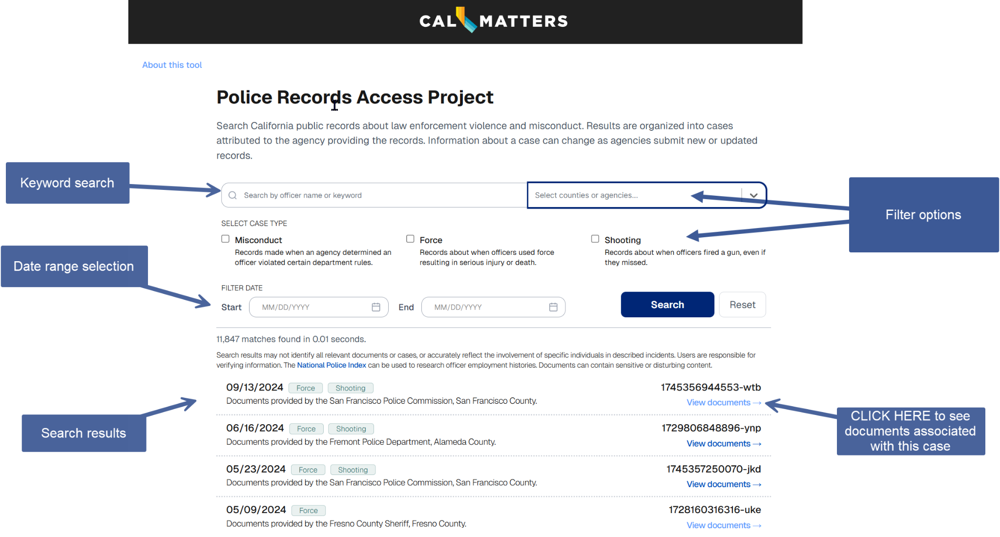
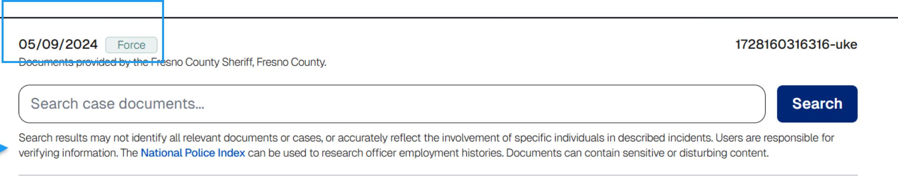

# Police Records Access Project

## URL



## Description

The Police Record Access Project is a [publicly searchable database](https://clean.calmatters.org/about) containing previously confidential records on shootings by law enforcement officers, law enforcement misconduct, and serious uses of force in the State of California. The tool aims to [provide transparency](https://news.stanford.edu/stories/2025/09/police-records-access-project-searchable-database-law-enforcement-transparency) into some of the statewide law enforcement records. It was made possible by California’s transparency laws ([SB 1421](https://leginfo.legislature.ca.gov/faces/billTextClient.xhtml?bill_id=201720180SB1421) and [SB 16](https://leginfo.legislature.ca.gov/faces/billTextClient.xhtml?bill_id=202120220SB16)). This centralized database also solves the challenge of having to file a public records request via numerous individual agencies to receive this type of information.

_**Where is the data from?**_

Since 2019, members of the [California Reporting Project](https://projects.scpr.org/california-reporting-project/) have requested data from [“nearly 700 law enforcement agencies”](https://clean.calmatters.org/about) in California.

[According to the tool provider](https://clean.calmatters.org/about), these agencies include:&#x20;

* Police departments
* Sheriff departments
* Public school and university police forces
* California Highway Patrol
* Prison
* Probation departments
* District attorneys
* California Attorney General’s office
* Coroners
* Medical examiners
* Oversight boards and commissions
* Other California government agencies &#x20;

_**What types of records are available?**_&#x20;


**Graphic Content Warning:** Items may contain disturbing images, videos, or descriptions


The records are wide-ranging. According to the [tool provider](https://clean.calmatters.org/about) (paragraph 2), they include, among others: Investigative reports, autopsy reports, written transcripts of law enforcement officers' interviews, video interviews of law enforcement officers, photographs, investigative hearings, and body-cam footage. In addition, our tests show that the records also include meeting minutes from different police commissions. &#x20;

_**What is not included?**_

[The records do not include crime scene photographs, audio or video recordings. ](https://calmatters.org/justice/2025/08/police-misconduct-records-database/)Personal information of sexual assault and domestic violence victims are also [redacted](https://calmatters.org/justice/2025/08/police-misconduct-records-database/) from these records.&#x20;

_**How was the database built and categorized?**_&#x20;

According to the tool providers’ [methodology](https://clean.calmatters.org/about) (paragraph 3), the database was built using technologies such as generative AI, coupled with a manual review of a subset of cases per year.&#x20;

Each record is labeled neutrally, indicating only the incident date and the agency that provided the documents.&#x20;

**Example:** 2/18/2024 - Documents provided by the San Diego Police Department, San Diego County&#x20;

\
The broad categories of included cases are Force, Shooting, and Misconduct.  These are defined by the tool providers [as follows](https://clean.calmatters.org/about#Methodology):&#x20;

* **FORCE:** “Police use-of-force incidents causing 'great bodily injury' or death”;
* **SHOOTING:** “Police shootings, fatal or not, including accidental and missed shots”;
* **MISCONDUCT:** “Sustained findings by agencies that an officer committed specific types of misconduct, including sexual assault, excessive force, dishonesty, prejudical action, unlawful arrest, and unlawful search”.


Note: Each record/case can belong to ONE OR ALL three categories.&#x20;


### How to Use the Database

_**Where To Access**_

According to this [StanfordReport article](https://news.stanford.edu/stories/2025/09/police-records-access-project-searchable-database-law-enforcement-transparency), the database is free to access through the websites of CalMatters and its partner news organizations:&#x20;

* CalMatters - [https://clean.calmatters.org/](https://clean.calmatters.org/)&#x20;
* KQED - [https://policerecords.kqed.org/](https://policerecords.kqed.org/)
* LA Times - [https://clean.latimes.com/](https://clean.latimes.com/)
* San Francisco Chronicle - [https://clean.sfchronicle.com/](https://clean.sfchronicle.com/)&#x20;

_**How To Search**_

The search functionality is straightforward to use. The key features are keyword search, filter, and viewing records as PDF:

1. Keyword search: Users can perform a general search for officer names, locations or specific terms.
2. Filters: Search can be refined by

* County: Based on our tests, the records have been categorized from approximately 56 out of the [58 counties](https://www.counties.org/counties/) in California.&#x20;
* Law enforcement agency
* Case type&#x20;
* Date range

\

<figure><figcaption>
This is the landing page, which automatically sends users to the search function.
</figcaption></figure>

_**How to View and Search Specific Records**_

Each case provides access to the original, redacted PDF documents. A case can contain more than one document, and each document can contain several pages. Users can search through all documents related to a case via a dedicated search bar.&#x20;

<figure><figcaption>
When clicking on a specific search result, users are shown the list of documents associated with that case. Note the search bar that searches documents specific to the case in question. 
</figcaption></figure>


TIP: Users can also cross check search results with the [National Police Index](https://national.cpdp.co/state/California) of California to look up further info about officers.


## Cost

* [x] Free
* [ ] Partially Free
* [ ] Paid

## Level of difficulty

<table><thead><tr><th data-type="rating" data-max="5"></th></tr></thead><tbody><tr><td>2</td></tr></tbody></table>

## Requirements

Modern web browser

PDF reader

## Limitations&#x20;

* Records have a lag time between when they are requested via public records requests and when they appear in the database. At launch, the database covered records from 2015 to 2023 and updates every 24 hours with newly available records (see minute 3:15 [in this video](https://www.youtube.com/watch?v=svPcA5XvJ6U)). In the same [video](https://www.youtube.com/watch?v=svPcA5XvJ6U), the tool providers state that they continue to put in requests to add to the database.&#x20;
* The dataset does not include all use-of-force cases. [Only two types of use-of-force incidents are covered](https://clean.calmatters.org/about#Important-Notes) in the database:
  * "Discharge of a weapon at a person by police (excluding tasers, paintball guns, or other weapons using less lethal ammunition)."
  * "Police uses of force resulting in death or 'great bodily injury'"
* The database does not cover all cases of police misconduct, [its focus is on the following cases](https://clean.calmatters.org/about#Important-Notes): "cases of 'sustained' findings of sexual assault, excessive force, dishonesty, prejudical action, unlawful arrest, and unlawful search or where an officer was accused of those actions and left the agency before the investigation was completed".
* While information that can identify a person [has usually been redacted](https://clean.calmatters.org/about#Important-Notes), some files that still contained such type of information were excluded from the database.
* Searches can miss relevant documents if different terminology is used ([e.g., “taser” vs. “electronic control weapon”](https://clean.calmatters.org/about#Important-Notes)). Users should always review the underlying government records.
* There is a time lag as police agencies must [conclude an investigation](https://clean.calmatters.org/about#Important-Notes) before it is added to the database.&#x20;
* Images, video and audio from incidents is not included.
* There is no graphic content warning which is immediately visible. The warning sign is small and not easy to find.&#x20;
* The screenshot below shows that the tool warns its users that the "search results may not necessarily identify all relevant documents or cases".&#x20;

<figure><figcaption>
This caveat is mentioned at the bottom of the main search results. It includes a graphic content warning which can easily be overlooked. 
</figcaption></figure>

* Be aware that records may change or be updated: "Information about a case can change as agencies submit new or updated records" is specified at[ the top of the search bar](https://clean.calmatters.org/).&#x20;
* Be aware of potential errors in some record dates. During our tests, we found that the dates in the records list (see screenshot below) refer to the incident date.&#x20;

<figure><figcaption>
The date highlighted in the blue box is the date of the incident. However, a few records may not display the correct date. Users are encouraged to cross check with other sources. 
</figcaption></figure>

However, some dates are not accurately displayed. For example, [one record](https://clean.calmatters.org/cases/1743019578959-kdy) lists the date as October 31, 2023, but the[ underlying document](https://cleanpdfs.blob.core.windows.net/pdfs/74/28/04/742804475f8535e404fa8eae232a8b80d1cf31f6) cites an incident date of September 2014. This inconsistency makes it difficult for users to determine to which event the system’s listed date is actually tied to.&#x20;

## Ethical Considerations&#x20;

* Privacy and harm - although victim data is redacted it may still be possible to identify a victim through the incident itself so caution should be exercised in how the data is used. &#x20;
* Some documents contain text or images that can be potentially disturbing for viewers.
* Accuracy - possible errors in data mean that any data should be independently verified.

## Similar Tools

There are similar tools out there that cover a similar topic, compiling data on police violence. They are primarily:&#x20;

1. [Mapping Police Violence](https://mappingpoliceviolence.us/) (MPV)
2. [Fatal Encounters](https://fatalencounters.org/)
3. [Police Violence Report](https://policeviolencereport.org/)

However, the Police Records Access Project is fundamentally different from the other three tools. It provides the [primary source documents](https://clean.calmatters.org/about), which are the actual government investigative files, autopsy reports, body camera transcripts, and photos.  While MPV, Fatal Encounters, and Police Violence Report provide structured data such as visualizations, spreadsheets, databases, and not the original investigative documents. The Police Records Access Project is more of a document repository than an analytical report or a compilation of data drawn mostly from secondary sources, rather than the law enforcement agencies (see data sources below).&#x20;

COMPARISON TABLE

| Database                                                            | Geographic Scope                                | Data Sources                                                                                                                                                                                                                                                                                                                                                                                                       | What can I do with it?                                                                                                                                                                                                    |
| ------------------------------------------------------------------- | ----------------------------------------------- | ------------------------------------------------------------------------------------------------------------------------------------------------------------------------------------------------------------------------------------------------------------------------------------------------------------------------------------------------------------------------------------------------------------------ | ------------------------------------------------------------------------------------------------------------------------------------------------------------------------------------------------------------------------- |
| [Police Records Access Project](https://clean.calmatters.org/about) | California only                                 | [Official government records](https://clean.calmatters.org/about) obtained through public records requests to approximately 700 California law enforcement agencies including police departments, sheriff's departments, public school/university police, California Highway Patrol, prisons, probation departments, district attorneys, Attorney General's office, coroners, medical examiners, oversight boards. | Searchable database of primary documents and records (see limitations above)                                                                                                                                              |
| [Mapping Police Violence (MPV)](https://mappingpoliceviolence.us/)  | National (United States)                        | [Official police use of force data collection programs from California, Texas, and Virginia; The Gun Violence Archive; Fatal Encounters database](https://mappingpoliceviolence.us/aboutthedata); [Google Alerts for news media mentions](https://mappingpoliceviolence.org/methodology); Original research through social media, obituaries, criminal records databases, and police reports.                      | 
Downloadable CSV dataset

 

Interactive maps 

  
                                                                                                                                         |
| [Fatal Encounters](https://fatalencounters.org/)                    | National - all 50 states and DC (United States) | [Three primary sources](https://fatalencounters.org/methodology/): 1) Paid researchers conducting systematic searches (85% of records), 2) Public records requests to law enforcement agencies (\~2,500 requests made), 3) Crowdsourced internet searches by volunteers; [Cross-checking with The Guardian and Washington Post](https://pmc.ncbi.nlm.nih.gov/articles/PMC10109543/).                               | 
Google Sheets or downloadable CSV full data or of smaller custom datasets

 

Search interface (Structured data fields with demographic info, location data, circumstances - but no source documents)
 |
| [Police Violence Report](https://policeviolencereport.org/)         | National (United States)                        | [Media reports, obituaries, public records, Gun Violence Archive, and Washington Post databases](https://policeviolencereport.org/) (it also synthesizes Mapping Police Violence data).                                                                                                                                                                                                                            | These are annual reports  based on MPV data                                                                                                                                                                               |

***

\
\

## Guides and articles

### Articles

* Lampros, A. (2025) ‘A new database on police use of force and misconduct in California makes public 1.5 million pages of once-secret police records’, _UC Berkeley Journalism_, 4 August. Available at: [https://journalism.berkeley.edu/police-records-access/](https://journalism.berkeley.edu/police-records-access/) (Accessed: 7 September 2025).
* _Thousands of formerly secret files on police misconduct now public in California through searchable database | The Independent_ (no date). Available at: [https://www.independent.co.uk/news/world/americas/crime/california-police-misconduct-database-b2801901.html](https://www.independent.co.uk/news/world/americas/crime/california-police-misconduct-database-b2801901.html) (Accessed: 7 September 2025).
* Lewis, S. and Small, J. (2024) _‘How to Kill a Cop’: Death, Despair and Corruption in California’s Most Violent Prison | KQED_. Available at: [https://www.kqed.org/news/12017652/how-to-kill-a-cop-death-despair-and-corruption-in-californias-most-violent-prison](https://www.kqed.org/news/12017652/how-to-kill-a-cop-death-despair-and-corruption-in-californias-most-violent-prison) (Accessed: 26 September 2025).
* Solomon, M., Newsroom, M.K. of T.C. and KVCR, M.A. of (2023) _San Bernardino Police Involved In Fatal Shooting Of Fleeing Man Both Have Histories Of Alleged Excessive Force_, _LAist_. Available at: [https://laist.com/news/criminal-justice/san-bernardino-police-rob-adams-fatal-shooting-fleeing-man-michael-yeun-imran-ahmed](https://laist.com/news/criminal-justice/san-bernardino-police-rob-adams-fatal-shooting-fleeing-man-michael-yeun-imran-ahmed) (Accessed: 26 September 2025).
* X _et al._ (2021) _What secret files on police officers tell us about law enforcement misconduct_, _Los Angeles Times_. Available at: [https://www.latimes.com/california/story/2021-03-19/sb-1421-sheriffs-department-disclosure](https://www.latimes.com/california/story/2021-03-19/sb-1421-sheriffs-department-disclosure) (Accessed: 26 September 2025).

### **Video**&#x20;

* _Learn about the Police Records Access Project_ (2025). Available at: [https://www.youtube.com/watch?v=ZxNJ\_4Io-KQ](https://www.youtube.com/watch?v=ZxNJ_4Io-KQ) (Accessed: 17 September 2025).
* _Inside California’s new police records database | KTVU_ (2025). Available at: [https://www.youtube.com/watch?v=svPcA5XvJ6U](https://www.youtube.com/watch?v=svPcA5XvJ6U) (Accessed: 17 September 2025).

## Tool providers&#x20;

Community Law Enforcement Accountability Network, USA. See the list of members [here. ](https://clean.calmatters.org/about#Who-we-are)

## Advertising Trackers

* [ ] This tool has not been checked for advertising trackers yet.
* [ ] This tool uses tracking cookies. Use with caution.
* [x] This tool does not appear to use tracking cookies.

| Page maintainer                     |
| ----------------------------------- |
| Afton and Bellingcat volunteer team |
|                                     |
