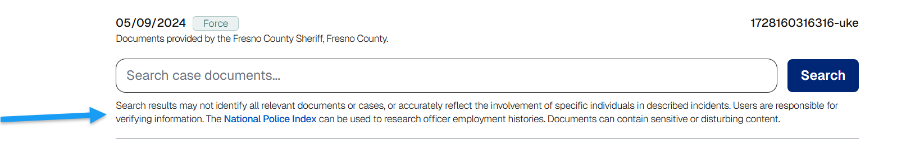

# Police Records Access Project

## URL



## Description \[Afton]

\[\[ A full description of the tool, any background information needed to use it. What problem does it solve? Can you give an example use case? ]]

## Cost

* [x] Free
* [ ] Partially Free
* [ ] Paid

\[\[Pricing or subscription information, if relevant.]]

## Level of difficulty

<table><thead><tr><th data-type="rating" data-max="5"></th></tr></thead><tbody><tr><td>1</td></tr></tbody></table>

## Requirements \[Afton]

\[\[Information on the requirement for using a tool, for instance, API key, e-mail address etc.]]

## Limitations \[Fraser]

* no graphic content warning \[Afton]
* this? \[Afton]

<figure><figcaption></figcaption></figure>

records may change or be updated: "Information about a case can change as agencies submit new or updated records" on the top of the search bar \[Afton]

\[\[The limitations of each tool should be described. This is important for researchers if they want to decide whether they should invest the time to learn how to use a new tool.]]

## Ethical Considerations \[Fraser]

\[\[The ethical considerations of each tool should be described.]]

## Guides and articles \[Afton]

\[\[Link to guides on this tool and to articles on research that was done with the help of this tool]]

## Tool provider \[Afton]

\[\[Name the tool provider (and potentially info on them)]]

## Similar tools \[Afton]

\[\[Compare this tool with similar tools which can be used for the same research purpose. What are the strengths and weaknesses of each tool?]]

## Advertising Trackers

* [x] This tool has not been checked for advertising trackers yet.
* [ ] This tool uses tracking cookies. Use with caution.
* [ ] This tool does not appear to use tracking cookies.

| Page maintainer                                                |
| -------------------------------------------------------------- |
| \[\[Your name here (optional) or "Bellingcat volunteer team"]] |
|                                                                |
