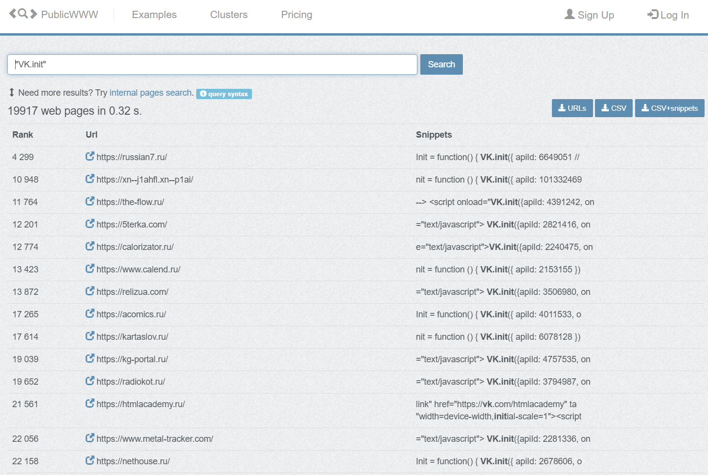

# PublicWWW

## URL

[https://publicwww.com/](https://publicwww.com/)

## Description

PublicWWW is a specialized search engine that indexes the underlying code and technologies of websites. Unlike traditional search engines, which focus on visible content, PublicWWW scans and catalogs [HTML](https://developer.mozilla.org/en-US/docs/Web/HTML), [JavaScript](https://developer.mozilla.org/en-US/docs/Web/JavaScript), [CSS](https://developer.mozilla.org/en-US/docs/Web/CSS), and [HTTP headers](https://developer.mozilla.org/en-US/docs/Web/HTTP/Reference/Headers) - in short, the public code that defines the content and functionality of a website. It currently indexes millions of web pages, offering advanced search capabilities including regular expressions, domain filters, and other criteria for highly precise queries ([Query Syntax](https://publicwww.com/syntax.html)).

The following example search returns indexed websites with code referencing chatgpt.com. The results show the URL of the indexed site that matches, the Rank column shows the relative popularity/visibility of the site in the index, and the final column shows the relevant code snippet that the search matched on. In the top-right corner, there are several formats in which this data can be downloaded, included CSV.

<figure><figcaption></figcaption></figure>

The platform enables users to identify specific code snippets, analytics codes, embedded widgets, themes, and other hidden elements used across the web - these can all be examined to identify possible links between different websites. It can detect the use of content management systems, JavaScript libraries, tracking codes, and server-side technologies. PublicWWW also provides statistical insights such as file types analysed, generator tags, server headers, and technology adoption trends, allowing for detailed examination of website structures and code usage patterns across a large portion of the internet.

The following example search returns results with embedded widgets related to VKontakte (VK), Russia's largest social media platform. The `VK.init({apiId: ...})` code links a website to a specific VK app or community via a unique numeric API ID. For OSINT work, this ID acts as a digital fingerprint. If multiple domains share the same API ID, investigators might be able to identify related  sites which can be helpful when researching coordinated networks.

<figure><figcaption></figcaption></figure>

## Cost

* [ ] Free
* [x] Partially Free
* [ ] Paid

Free tier includes top 3m websites only

Free & Pro Tier details and pricing: [https://publicwww.com/prices.html](https://publicwww.com/prices.html)

## Level of difficulty

<table><thead><tr><th data-type="rating" data-max="5"></th></tr></thead><tbody><tr><td>1</td></tr></tbody></table>

## Requirements

An e-mail address is required to create an account.

## Limitations

* Only sites that are crawlable by a web crawler are included.
* No crawl schedule is available but it appears the database is updated regularly to reflect changes to the websites the tool covers.
* Sites behind login walls, paywalls, or CAPTCHAs are typically excluded unless there’s a publicly accessible portion.

## Ethical Considerations

Unknown operator

## Guides and articles

Query syntax: [https://publicwww.com/syntax.html](https://publicwww.com/syntax.html)

Example usage for OSINT investigation: [https://www.memeticwarfare.io/p/mww-chinese-ulster-cluster](https://www.memeticwarfare.io/p/mww-chinese-ulster-cluster)

## Tool provider

Not publicly disclosed

## Similar tools

[What CMS](https://bellingcat.gitbook.io/toolkit/more/all-tools/what-cms) - WhatCMS and PublicWWW both help investigators identify the underlying technologies of websites, but they operate in slightly different ways. WhatCMS analyses a single website directly to detect the content management system or framework it uses (e.g. WordPress, Drupal, etc.), which can assist in attribution or infrastructure mapping. PublicWWW, on the other hand, is a source code search engine that indexes the HTML, JavaScript, and CSS of millions of sites. Investigators can use it to find other domains sharing the same tracking codes, analytics IDs, or CMS fingerprints, making it valuable for linking related sites or mapping a digital network. In short, WhatCMS identifies what a specific site runs, whereas PublicWWW helps find where else the same code or identifiers appear across the web.

## Advertising Trackers

* [ ] This tool has not been checked for advertising trackers yet.
* [ ] This tool uses tracking cookies. Use with caution.
* [x] This tool does not appear to use tracking cookies.

| Page maintainer |
| --------------- |
| Freya           |
