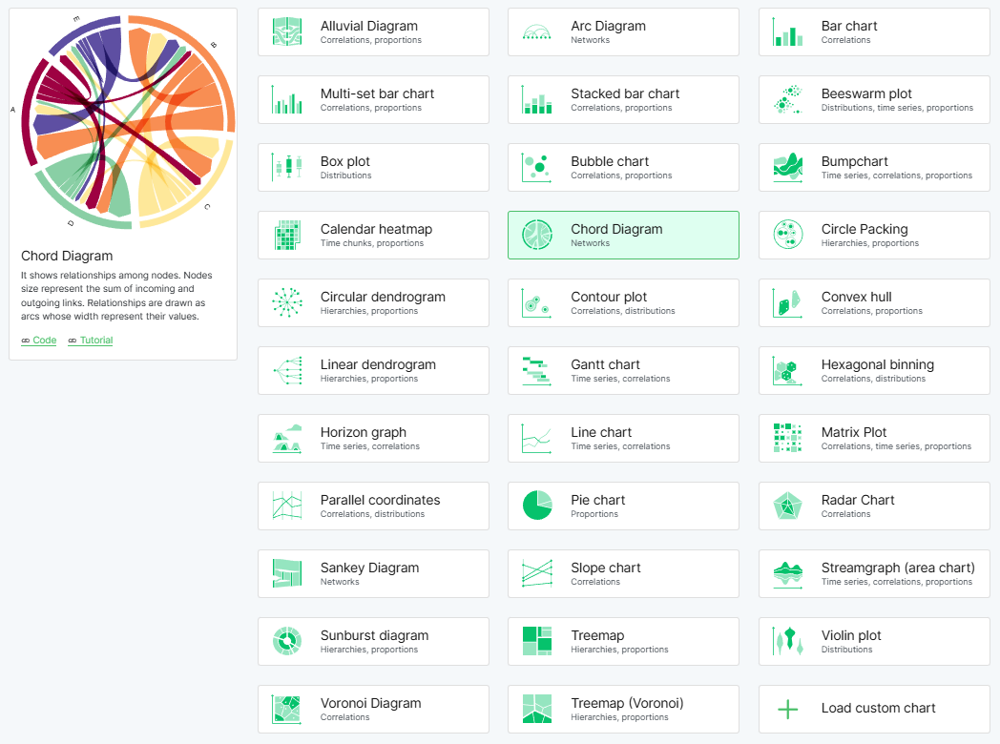

# RAWGraphs

## URL

[https://app.rawgraphs.io/](https://app.rawgraphs.io/)

## Description

RAWGraphs is a web-based [open-source](https://github.com/rawgraphs/rawgraphs-app) data visualization software designed to make [complex data easy to visualize](https://www.rawgraphs.io/about). It was conceived as a tool for designers and data visualization enthusiasts to bridge the gap between spreadsheet applications and vector graphics editors​. The software is built on top of the [D3.js library](https://d3js.org/) (a JavaScript framework for creating data-driven visuals) and produces graphics in the SVG (Scalable Vector Graphics) format​.&#x20;

RAWGraphs allows users to create a variety of charts and diagrams without any coding skills. It has an intuitive drag-and-drop interface where data columns can be mapped to visual variables of a chart. This approach lets journalists, designers, researchers, and other users quickly generate visualizations and then refine them using external graphic software if needed​.

<figure><figcaption>
The vast number of charts available.
</figcaption></figure>

## Key Features

* **Free and Open Source:** RAWGraphs is free to use (no fees or registration required), and its source code is available under the [Apache 2.0 open-source license](https://github.com/rawgraphs/rawgraphs-app). This means anyone can use or modify the tool, and [community contributions](https://www.rawgraphs.io/learning/what-is-rawgraphs-our-approach-to-data-visualization) are welcome.
* **Web-Based Application:** It runs entirely in the web browser, with no installation needed. All data processing happens client-side (in your browser), so your input data is [**not uploaded or stored on any server**​.](https://www.rawgraphs.io/learning/how-to-load-and-format-your-data-for-rawgraphs)&#x20;
* **User-Friendly Interface:** The tool offers a graphical interface for building visualizations by loading data and assigning fields to chart elements. No programming knowledge is needed to create chart&#x73;**.**
* **Wide Range of Chart Types:** RAWGraphs offers nearly 30 types of visualizations, from traditional charts to more unusual layouts​. You can create basic charts like bar graphs or line plots and specialized diagrams for complex data (see the list of available chart types below).
* **Flexible Data Import:** Data can be imported in various ways, as long as it’s in a tabular (table-like) format. You can copy and paste data from spreadsheets, [upload text-based data files](https://www.rawgraphs.io/learning/how-to-load-and-format-your-data-for-rawgraphs) (CSV, TSV or other delimiter-separated values, and JSON formats)​, or [fetch data directly from a URL](https://www.rawgraphs.io/learning/how-to-load-and-format-your-data-for-rawgraphs) or a live [**SPARQL** ](https://en.wikipedia.org/wiki/SPARQL)query endpoint (a way to retrieve data from databases like Wikidata). RAWGraphs also provides some sample datasets, and it allows importing previously saved project files (with a `.rawgraphs` extension) to resume work.
* **Customization and Extensibility:** Advanced users can extend RAWGraphs by adding new chart types. In version 2.0.1, support for custom charts was introduced, [allowing users to load their own visualization modules “on the fly” ](https://www.rawgraphs.io/post/rawgraphs-updates-with-version-2-0-1)without modifying the core code​. This means if a needed chart type is not available by default, you can code it (following RAWGraphs’ chart specifications) and plug it into the interface for others to use.
* **Export and Editing:** RAWGraphs visualizations can be refined and exported for different uses. The tool allows adjustments to colors, shapes, and visual settings, then exports as SVG or PNG images. SVG files are particularly useful for opening in vector graphic editors like Adobe Illustrator or Inkscape for lossless editing.

## Using RAWGraphs involves a few simple steps:

1. **Load Your Data:** Input your dataset by pasting it into the app or uploading a file (e.g., CSV). You can also retrieve data via a web link or a SPARQL query if needed.
2. **Choose a Chart Type:** Select one of the available visualization models from the RAWGraphs gallery (e.g. a bar chart, alluvial diagram, etc.).
3. **Map Data to Visual Variables:** Assign the columns or fields of your dataset to the visual dimensions of the chart. For example, you might drag a “Category” field to a color attribute or an “Amount” field to the size or length of bars. The interface will update the chart preview accordingly.
4. **Tune and Export:** Adjust styling options like colors, margins, or labels to fine-tune the appearance. Once satisfied, export your visualization as an SVG or PNG file for sharing or further editing​.&#x20;

### **Example Use Cases**:

1. **Investigative Journalism**: Visualize connections between offshore entities in financial data, as demonstrated in the [Panama Papers case](https://www.rawgraphs.io/gallery/the-belgians-in-the-panama-papers). Using alluvial diagrams, RAWGraphs reveals flows between individuals, intermediaries, and destinations, making complex financial relationships accessible for public understanding.
2. **Cybersecurity**: Display patterns in web traffic and botnet activities, as seen in a [case study on UK spam traffic](https://www.behance.net/gallery/37500391/WIRED-UK-The-Rise-and-Fall-of-the-UKs-Biggest-Spammer). Researchers can use stacked area charts to analyze fluctuating volumes of internet requests, revealing attack cycles and patterns.
3. **Public Space Management**: [Analyze the flow and distribution](https://www.rawgraphs.io/gallery/objects-left-behind) of lost items, like at Dublin Airport, through Sankey diagrams, mapping where items were lost and categorizing them by type.
4. **Humanitarian and Conflict Data**: [Represent sensitive data on attacks](https://www.rawgraphs.io/gallery/emergency-afghanistan20), such as those on education facilities in Afghanistan, using beeswarm plots to emphasize individual events over time, conveying both the frequency and the emotional weight of each incident.

## Cost

* [x] Free
* [ ] Partially Free
* [ ] Paid

## Level of difficulty

<table><thead><tr><th data-type="rating" data-max="5"></th></tr></thead><tbody><tr><td>2</td></tr></tbody></table>

## Requirements

No registration or account is needed. RAWGraphs processes data entirely in the user’s browser, meaning no server-side data storage or processing occurs.

## Limitations

RAWGraphs requires data to be formatted in a single table structure. Supported file types include .csv, .tsv, .dsv, and .json. If data requires extensive cleaning or transformation (e.g., restructuring from wide to narrow format), this must be done before uploading. While RAWGraphs includes basic data transformation options, more advanced manipulation may require external tools.

## Ethical Considerations

Since RAWGraphs processes data locally in the browser, it does not upload or store data on any servers, making it suitable for visualizing sensitive or confidential information. However, users should remain cautious about data privacy and take steps to protect sensitive data on their systems.

## Guides and articles

[RAWGraphs Learning Guide](https://www.rawgraphs.io/learning)

Polimi OpenKnowledge (Director). (2020, May 29). _Create data visualizations: RAWGraphs in 8 minutes (Michele Mauri)_ \[Video recording]. [https://www.youtube.com/watch?v=Yfac2CZJrP0](https://www.youtube.com/watch?v=Yfac2CZJrP0)

UofILibrary (Director). (2022, November 30). _RAWGraphs—Data Hub Tool Talk_ \[Video recording]. [https://www.youtube.com/watch?v=A1iQb00FjUU](https://www.youtube.com/watch?v=A1iQb00FjUU)

## Tool provider

RAWGraphs was first released in 2013 as “RAW” by researchers at the DensityDesign Lab (Politecnico di Milano). It is maintained and developed by the DensityDesign Lab, the design studio Calibro, and the development firm Inmagik​. [https://www.rawgraphs.io/about](https://www.rawgraphs.io/about)

## Advertising Trackers

* [ ] This tool has not been checked for advertising trackers yet.
* [x] This tool uses tracking cookies. Use with caution.
* [ ] This tool does not appear to use tracking cookies.

| Page maintainer |
| --------------- |
| Martin Sona     |
