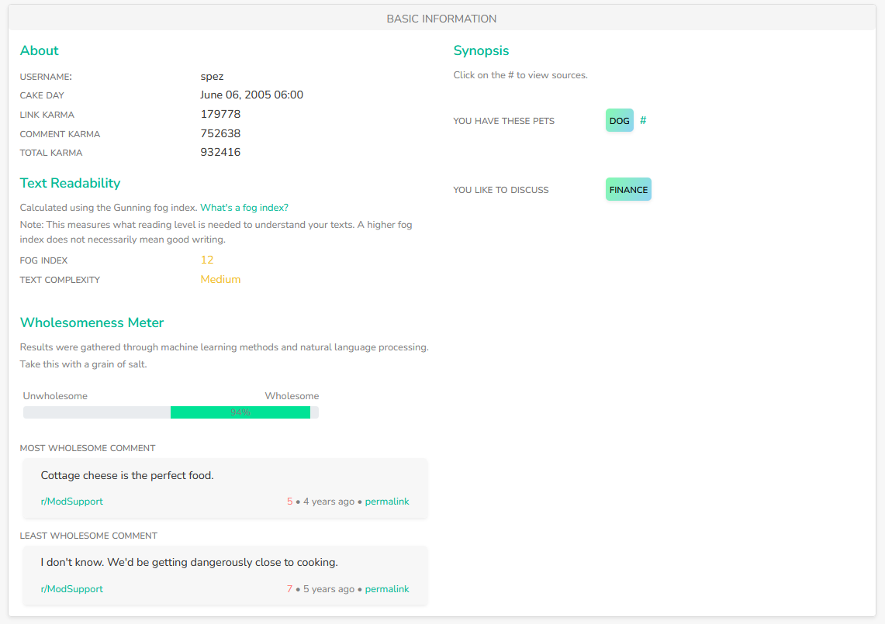

# RedditMetis

## URL

[https://redditmetis.com](https://redditmetis.com)

## Description

RedditMetis is a free, web-based dashboard for quick, one-off checks on any **public** Reddit account.\
Type a username (without the `u/` prefix) and the [site fetches](https://redditmetis.com/) the last 1,000 comments **and** the last 1,000 submissions made by that user, then builds an interactive report in your browser.



<figure><figcaption>
Public Profile of Steve Huffman aka "spez" - the CEO of Reddit
</figcaption></figure>



<figure><figcaption></figcaption></figure>



<figure><figcaption></figcaption></figure>



<figure><figcaption></figcaption></figure>



<figure><figcaption></figcaption></figure>



<figure><figcaption></figcaption></figure>



**What the report shows**

* **Activity statistics** – a heat-map of posting hours plus monthly counts of comments and submissions (helpful for spotting time zones or daily routines).
* **Comment analysis** – sentiment (positive / neutral / negative), readability scores (Flesch), average length, and keyword cloud.
* **Submission analysis** – top link types and external domains.
* **Corpus overview** – most-used words, top subreddits, potentially controversial comments, and entities that the user has self-disclosed (profession, nationality, etc.) with a link back to the original post for context.
* **Export** – copy-ready CSV/JSON for offline archiving.

RedditMetis was inspired by SnoopSnoo (now defunct) and rebuilt from a fork of its open-source code ([GitHub repo](https://github.com/jibalio/redditmetis)).

## Cost

* [x] Free
* [ ] Partially Free
* [ ] Paid

Enter a username, press **Analyse** – no technical skills required.

## Level of difficulty

<table><thead><tr><th data-type="rating" data-max="5"></th></tr></thead><tbody><tr><td>1</td></tr></tbody></table>

## Requirements

* **No login is needed – all data is sourced** from Reddit’s public API.
* **Modern browser** – Chrome, Firefox, Edge or Safari 15 +. Older browsers may not render the interactive charts correctly.
* **Network speed** – the report is built client-side; a slow connection will delay the fetch.

## Limitations

* **Public data only** – the tool cannot read private messages, private subreddits, or removed content.
* **Fixed scope** – each run covers exactly the latest **1,000 comments and 1,000 submissions**; older posts are ignored ([Site FAQ](https://redditmetis.com/faq)).
* **Caching** – results are cached for **≈ 2 hours** to save API calls; very recent activity may not appear ([FAQ](https://redditmetis.com/faq)).
* **Reddit rate limit** – the current free API ceiling is **100 requests per minute**; very busy accounts may take a minute or two to finish ([Reddit Data API wiki](https://www.reddit.com/r/redditdev/wiki/api/)).
* **NLP accuracy** – sentiment and entity extraction can misread sarcasm or joking self-descriptions.
* **Profile not found** – typos, shadow-bans or aggressive ad-blockers can break a lookup (FAQ).

## Ethical Considerations

* **Pattern revelation** – heat maps can expose a user’s daily schedule or time zone.
* **Context matters** – automated sentiment may misclassify humour or irony; always read the source comment.
* **No consent** – the analysed user does not approve each lookup; share results responsibly and within your local data-protection laws.
* **Tool unaffiliated** – RedditMetis is not endorsed by Reddit.

## Guides and articles

[Guide: Using Reddit in OSINT](https://authentic8.com/osint-guide-reddit) (Aug 2024);\
[Week in OSINT #2022-13](https://sector035.nl/articles/2022-13) (Apr 2022);\
[Reddit for E-commerce – user-behaviour tips](https://buddyinfotech.com/reddit-ecommerce) (Dec 2024)

## Tool provider

Created by GitHub user **jibalio** and hosted on AWS. Codebase is a fork of u/orionmelt’s open-source SnoopSnoo analyser ([GitHub](https://github.com/jibalio/redditmetis)).

## Similar tools

* [**Redective**](https://www.redective.com/) – comparable free report with activity charts and top subreddits.
* [**Reddit User Analyser**](https://reddit-user-analyser.netlify.app/) _(various mirrors)_ – fast, lightweight overview of favourites and word counts.
* [**Pushshift API**](https://github.com/pushshift/api) – historical Reddit dataset for developers; requires scripting.

## Advertising Trackers

* [ ] This tool has not been checked for advertising trackers yet.
* [x] This tool uses tracking cookies. Use with caution.
* [ ] This tool does not appear to use tracking cookies.

Cookies are limited to site preferences, Google Analytics and AdSense ads (Cookie policy).

| Page maintainer |
| --------------- |
| Martin Sona     |
|                 |
