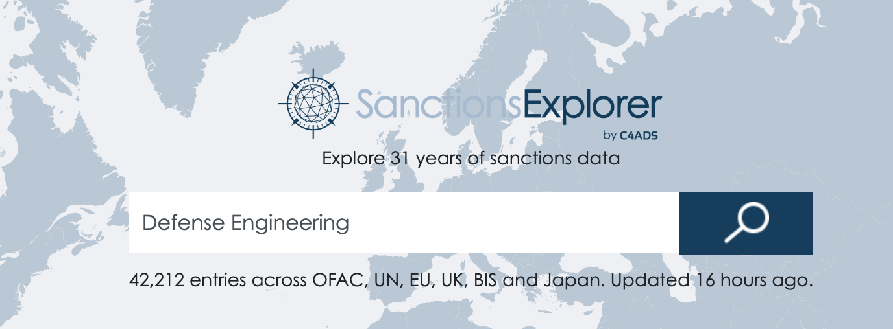
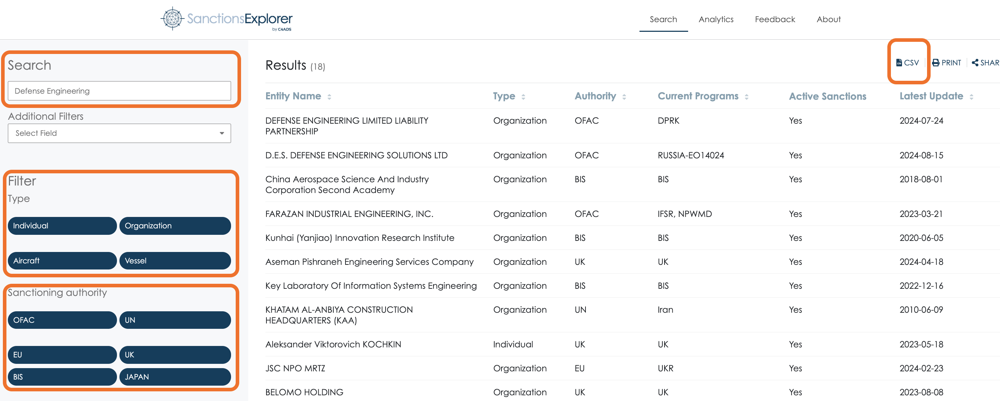
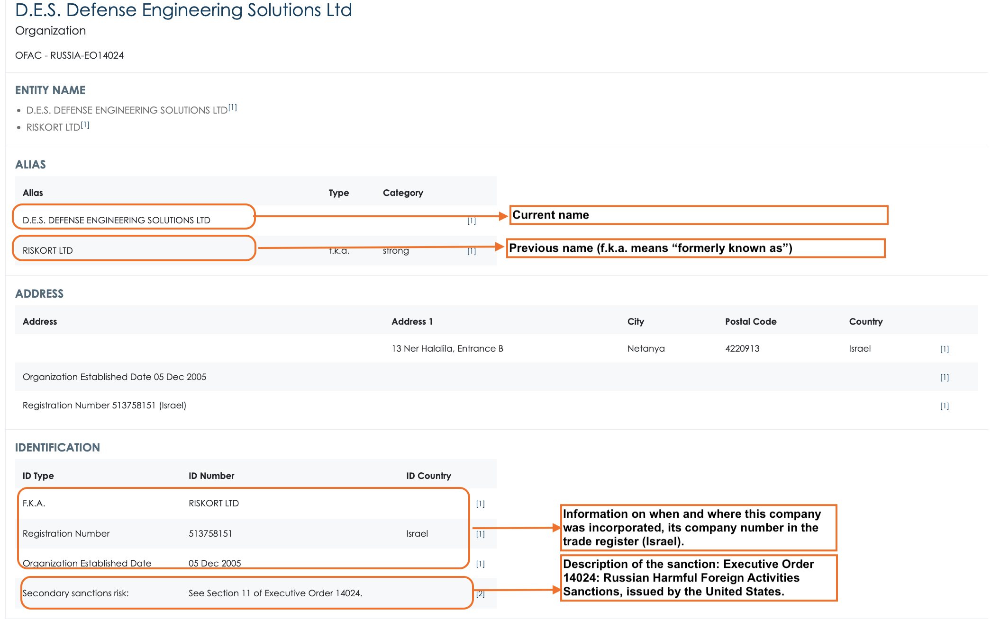
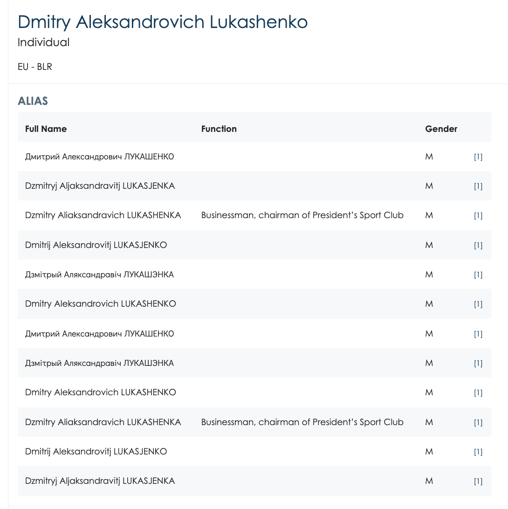
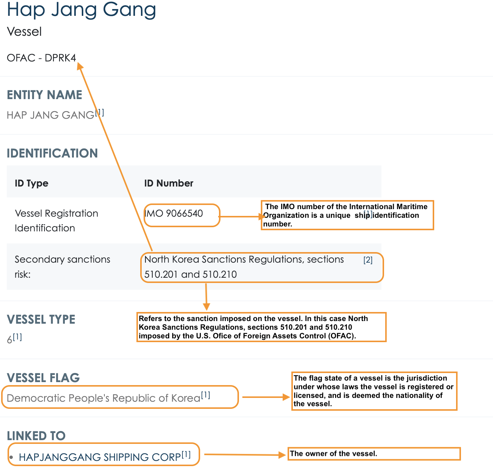
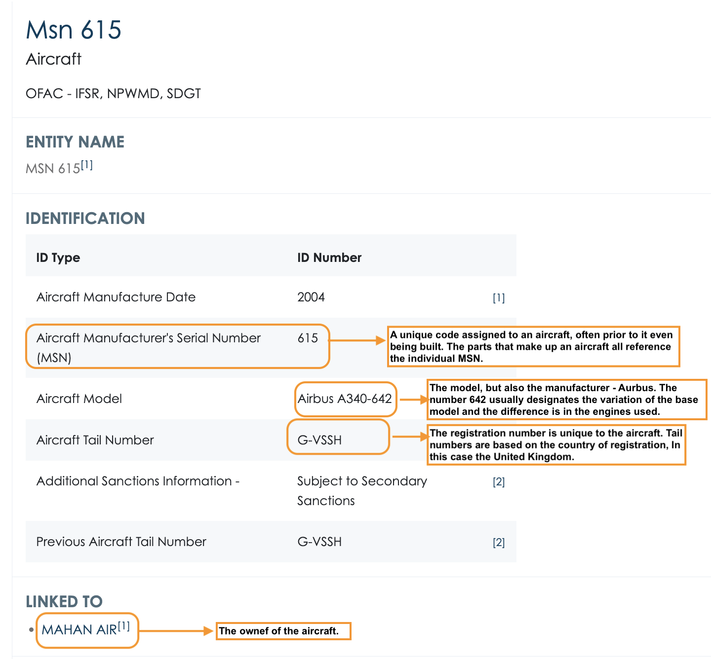
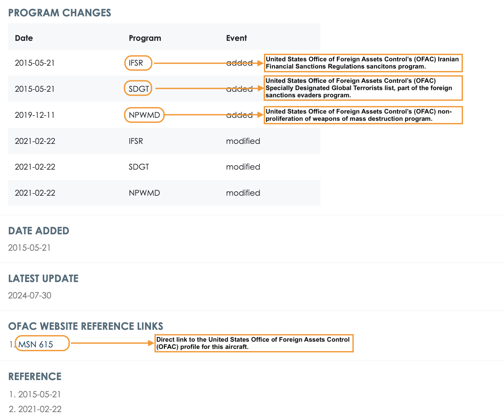
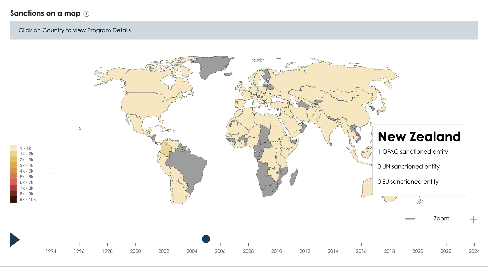

# SanctionsExplorer

## URL

[https://sanctionsexplorer.org/](https://sanctionsexplorer.org/)

## Description

Explorer was developed by C4ADS as a "[comprehensive source](https://sanctionsexplorer.org/about) of all current and historical sanctions data across all major sanctioning authorities." Sanctions Explorer is a joint project between non-profits [Archer](https://archerimpact.com/about) and [C4ADS](https://c4ads.org/about-us/).&#x20;

It includes sanctions imposed by the U.S. Office of Foreign Assets Control (OFAC), the United Nations (UN), the European Union (EU), the United Kingdom (UK), the U.S. Department of Commerce, Bureau of Industry and Security (BIS) and Japan. Sanctions Explorer persistently monitors the UN, EU, and OFAC websites for updates to the sanctions lists and publishes the new data to the website as it goes active. The home page shows the time of the most recent update of the sanctions database which is updated daily.

Sanctions Explorer derives its data from the following four sources: [Historical OFAC Data](https://ofac.treasury.gov/), Current [OFAC Data](https://sanctionslist.ofac.treas.gov/Home/SdnList), [EU Data](https://data.europa.eu/data/datasets/consolidated-list-of-persons-groups-and-entities-subject-to-eu-financial-sanctions-fisma?locale=en), and [UN Data](https://main.un.org/securitycouncil/en/content/un-sc-consolidated-list).

The data contains sanctioned individuals, entities, vessels and aircraft. To search for any of these categories, type a keyword in the search bar. The search is designed in such a way to also run "fuzzy" keywords - words that are only a few characters different than the search query. For example, the words 'Hong' and 'Hone' only differ by one letter. Matches are sorted by relevance and get more inexact the further you scroll. Source: [SanctionsExporer FAQ](https://sanctionsexplorer.org/faq).

<figure><figcaption>
Search bar for keyword queries
</figcaption></figure>

* Example of the results using the search query Defense Engineering. The filters on the left can be used to narrow results by organization, individual, vessel or aircraft. At the top right there is an option to export all the search results into a CSV file.

<figure><figcaption>
Results page for search query Defense Engineering
</figcaption></figure>

Clicking on any of the Entity Names will open the profile for that specific entity.&#x20;

* An example of what a profile for an organization looks like. The information includes current and previous names of a company of organizations, the date they were registered or incorporated with the relevant authorities in the country, possible addresses and the sanctions they are subject to.

<figure><figcaption>
Profile for Defense Engineering Solutions. Click to expand and view explanation notes.
</figcaption></figure> <figure><figcaption>
Profile for Defense Engineering Solutions. Click to expand and view explanation notes.
</figcaption></figure>

* An example of what a profile for an individual looks like. The information includes the full legal name of an individual including their aliases and variations of their name with different possible spellings, personal data like date and place of birth and the sanctions they are subject to.

<figure><figcaption>
Profile for Dmitry Lukashenko. Click to expand and view explanation notes.
</figcaption></figure> <figure><figcaption>
Profile for Dmitry Lukashenko. Click to expand and view explanation notes.
</figcaption></figure>

* An example of what a profile for a vessel looks like. The information includes the name of the vessel, the country responsible for it, its owner. However, information on vessels is quite limited and additional research is encouraged using other platforms such as [Marine Traffic](https://www.marinetraffic.com/).

<figure><figcaption>
Profile for Hap Jang Gang vessel. Click to expand and view explanation notes.
</figcaption></figure>

* An example of what a profile for an aircraft looks like. The information includes the manufacture date, the model of the aircraft (this usually includes the name of manufacturer, but not always), the current and sometimes the previous [tail number](#user-content-fn-1)[^1], and the owner of the aircraft. Please note that to search for aircraft in Sanctions Explorer, you can use either the tail number, the name of the aircraft or the manufacturer (e.g. Airbus, Sikorsky, LockheedMartin, Bell Helicopter, Embraer, Bombardier), or the model (Phenom 300, CRJ100, etc.).

<figure><figcaption>
Profile for MSN 615 aircraft. Click to expand and view explanation notes.
</figcaption></figure> <figure><figcaption>
Profile for MSN 615 aircraft. Click to expand and view explanation notes.
</figcaption></figure>

* Sanctions Explorer has an [Analytics](https://sanctionsexplorer.org/analytics) section, where you can see statistics for the number of sanctions added over time, by type of entity (aircraft, vessel, individual, organization), the number of sanctions by authority, as well as an interactive map which shows the number of sanctioned entities year by year.&#x20;

<figure><figcaption>
Interactive map with the number of sanctioned entities by country and over time
</figcaption></figure>


Searching for delisted/unsanctioned entities is available for data collected from OFAC.&#x20;

Delisted/unsanctioned entities by the EU and UN are included, but go back only to August 2020 when SanctionsExplorer started collecting this data. EU and UN do not publish historical data or announce when an entity has been delisted.


## Cost

* [x] Free
* [ ] Partially Free
* [ ] Paid

## Level of difficulty

<table><thead><tr><th data-type="rating" data-max="5"></th></tr></thead><tbody><tr><td>2</td></tr></tbody></table>

## Requirements

Internet connection &#x20;

## Limitations

Our research shows that this resource only provides information on sanctioned entities. It does not provide information on politically exposed persons (PEPs).&#x20;

SanctionsExplorer does not have an API integration feature, so downloading data in bulk might be more difficult.

## Ethical Considerations

Profiles of individuals often features their date of birth, full legal name and place of birth. These are considered Personally Identifying Information (PII) and while the data from SanctionsExplorer is publicly available, this information should be used with caution and redacted for privacy if needed.

## Guides and articles

C4ADS: [Sanctions Explorer: How We Built It](https://c4ads.org/commentary/2020-11-30-sanctions-explorer/)

C4ADS: [Sanctions Explorer: a C4ADS Data Tool](https://c4ads.org/commentary/2020-11-30-sanctions-explorer-a-c4ads-data-tool/)

## Tool provider

Center for Advanced Defense Studies - C4ADS. A 501 nonprofit research organization in Washington, D.C.

## Advertising Trackers

* [ ] This tool has not been checked for advertising trackers yet.
* [x] This tool uses tracking cookies. Use with caution.
* [ ] This tool does not appear to use tracking cookies.

| Page maintainer |
| --------------- |
| LPetrova        |

[^1]: The tail number, or aircraft registration number, is a unique alphanumeric code assigned to each aircraft as a fundamental requirement under International Civil Aviation Organization (ICAO) regulations.
