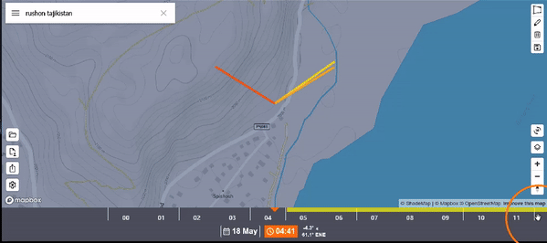
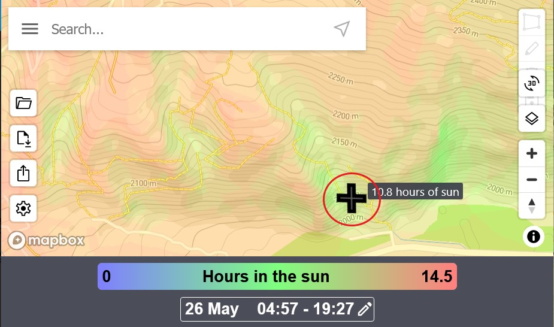
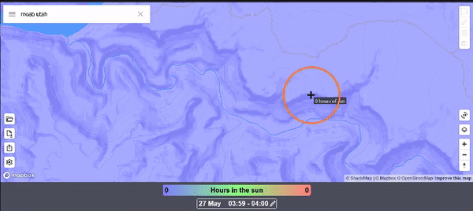
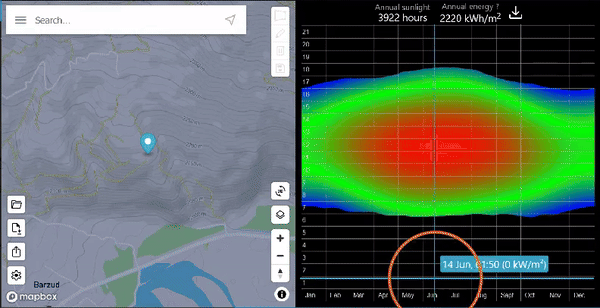
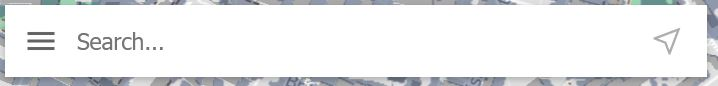
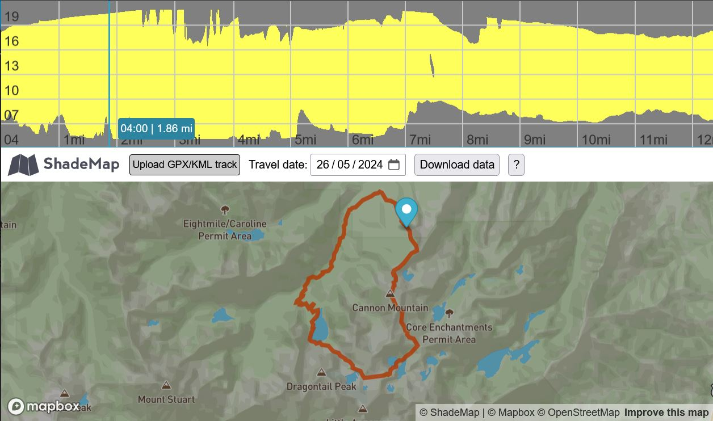
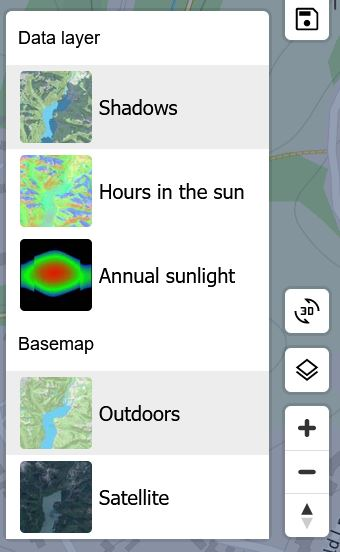
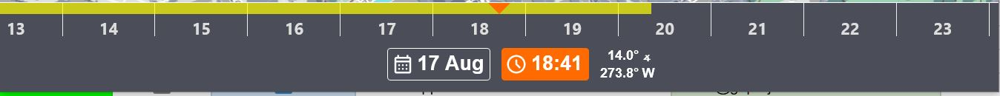
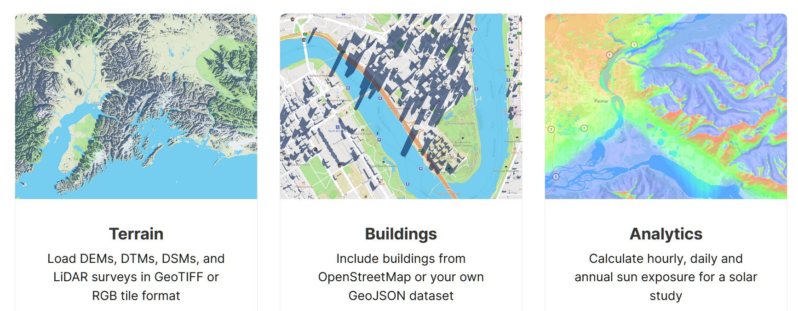

# ShadeMap

## URL

[**https://shademap.app**](https://shademap.app)

## Description

<figure><figcaption>
SHADE MAP SIMULATES THE SHADOW PATTERNS FROM SUNRISE TO SUNSET AS THE USER MOVES THE TIME SLIDER TO CHANGE THE TIME IN RUSHON, TAJIKISTAN ON 18TH MAY
</figcaption></figure>

ShadeMap can calculate shadow locations in real time and display them on a map. ShadeMap can also aggregate shadows over time to calculate how many hours of sun or shadow a specific location gets over the course of a day or over the course of an entire year. Sunlight hours and time of year are used to calculate energy values of sunlight per unit area (square metre). In addition to mapping shadow patterns for a static location, ShadeMap's [Trail Shade feature](./#trail-shade-feature-accessible-from-the-search-bar-menu) handles changing location uploaded as a user trail.


ShadeMap is also available as a Chrome browser extension which displays a sun and shadow layer for online maps including: [openstreetmap.org](https://openstreetmap.org), [alltrails.com](https://bellingcat.gitbook.io/toolkit/more/all-tools/alltrails), [gaiagps.com](https://gaiagps.com), [caltopo.com](https://caltopo.com). This is being extended to Strava, Mountain Project, OnX Maps with more to follow...


Open Source research applications of ShadeMap include geolocation and environmental monitoring and analysis... (Click for examples)

Geolocation can be supported directly where imagery contains shadows which can be matched to the model. ShadeMap is also indirectly valuable in terms of predicting terrain properties. However, it must be offset with information on cloud cover, significant pollution, airborne volcanic ash, etc. for time periods chosen:

* the likely condition of terrain at a given time and place with respect to ground moisture v sun exposure, e.g. this area was in high energy sun for 8 hours before this image was taken, so it would be very dry.
* the likely snow covering over terrain at a given time and place with respect to snow melting v sun exposure, e.g. this area could have had a light snow covering since it was entirely shaded before this image was taken.
* the likely plant life which could survive at a given place and season with respect to shade and plant species.
* the likely condition of man-made materials at a given place and time with respect to the long term interaction of light on different building materials, e.g. bleaching effect.

ShadeMap's cumulative analyses of daily sunlight hours, annual sunlight hours and annual energy values allow for the types of longer term analysis used in environmental monitoring and analysis, e.g. solar panel power potential in a given region. Data downloads are offered for users' generated results, and the developers offer assistance with large data set export (see Data Output section below).

### Using ShadeMap for Open Source Research: Use Cases, User Input Data, Output Data & Data Input Options...(Click each of the four tabs to access details)



<figure><figcaption></figcaption></figure>



* Source imagery
* Location co-ordinates or place name
* Imagery Date
* Imagery Time



* Shadow map for given location, with user facility to change date and time
* Availability of optimal quality data for the given location, with the option to purchase
* Graph of annual sunlight & annual energy for the given location across the days and months of the year & time of day
* Colour map of the given area showing daylight hours in the sun

**Data downloads** are offered for users' generated results, and the developers offer assistance with large data set export. .png>)

**SUN EXPOSURE VIEW DOWNLOAD MESSAGE**\
**EXPLAINING THE OUTPUT AND OFFERING ASSISTANCE**

A download file is generated for the current view using the File Download button  in [GeoTIFF format.](https://en.wikipedia.org/wiki/GeoTIFF) This output file contains a sun exposure value for units of area across the display, on a scale of 0 to 240. These exposure values can be scaled to minutes of sun exposure by multiplying by a factor of 6.



<figure><figcaption></figcaption></figure>




**Limitations of Trial and Error Solutions for Date, Time and Location:** Bear in mind that sometimes there may be more than one solution value for a given set of parameters.


## ShadeMap Views

There are three views in ShadeMap:

1. [Shadow View](./#view-one-shadow-view)
2. [Hours in the Sun View](./#view-two-hours-in-the-sun-view)
3. [Annual Sun View](./#view-three-annual-sunlight-view).

Each can be shown with one of two backgrounds: either map (called Outdoors) or Satellite...(click on each of the tabs to see the features of a different view)...



Shadow View draws shadows in the colour selected by the user in Settings, for the date and time set by the user. The time slider changes the view over time between sunrise and sunset, the directions for which are shown in centre screen as gold and bright orange lines respectively. Current sun direction is shown as a yellow line which moves with the Time Slider.

<figure><figcaption>
<strong>SHADOW VIEW FOCUSES AROUND THE CENTRAL LOCATION AND ALLOWS THE USER TO SELECT DATE AND TIME</strong>
</figcaption></figure>



The user sets a location, date and time period and ShadeMap calculates the number of hours in the sun for each pixel point on the map, displaying it as a 'mouse over' numerical value and also as a colour corresponding to the value range shown in the scale at the bottom of the screen.

Possible Open Source applications include:

* Analysis of the environmental causes of terrain change in a glacial region
* Geolocation of imagery showing distinctive shadow patterns in a region of deep canyons

<figure><figcaption>
<strong>HOURS IN THE SUN VIEW SHOWING COLOUR SCALE ABOVE DATE AND TIME RANGE AT THE BOTTOM OF THE SCREEN</strong>
</figcaption></figure>

<figure><figcaption>
SETTING THE DATE AND TIME PERIOD FOR HOURS IN THE SUN VIEW IN A REGION OF DEEP CANYONS
</figcaption></figure>



ShadeMap calculates the annual hours of sunlight for the chosen location and displays them in a graph of days grouped by month (horizontal x axis) versus hour of the day (vertical y axis). The sun's energy for a given date and time is presented as a numerical value in kWh/m^2^ under the cursor, whilst the colour of the pixels represents the intensity of the sun's energy along a range from black (zero) through blue and green to red (highest).

Possible Open Source applications include analysing solar panel power generation parameters in environmental research.

<figure><figcaption>
MOVING THE CURSOR ACROSS THE TIME OF DAY V MONTH PLOT FOR THE LOCATION SHOWN ON THE LEFT: EXACT DATE AND TIME ARE SHOWN FOR THE POINT UNDER THE CROSSWIRES PLUS THE ENERGY ABSORBED, WITH CUMULATIVE TOTALS AT THE TOP OF THE SCREEN
</figcaption></figure>



ZOOMING THE MAP SCALE:


DON'T use the Mouse Scroll Wheel to zoom the map scale because the focus location is lost.



DO use the "+" and "-" tool in the bottom left of the map window to zoom whilst maintaining a consistent focus location.


## The Shade Map Interface

<figure><figcaption>
THE SHADEMAP INTERFACE DOES NOT DISPLAY ALL MENUS SIMULTANEOUSLY: THIS GRAPHIC IS FOR ILLUSTRATION ONLY
</figcaption></figure>


Two advanced motion path-related features are available through the Project Menu: Trail Shade and GPX Replay. Users can model a route on the map over time and Shademap will generate the shadows visible across the terrain for that changing place and time. **This is a rare feature for OSINV researchers which can be powerful in assisting the geolocation and chronolocation of source material relating to travel along a route, e.g. photos or videos**





<figure><figcaption>
THE DATA TOOLBAR SCREEN BOTTOM LEFT
</figcaption></figure> <figure><figcaption>
<strong>THE SETTINGS MENU: CALLED FROM THE DATA TOOLBAR</strong>
</figcaption></figure>

Data display and exchange is managed through the bottom left interface toolbar, which allows

* Opening files of type: \*.tif, \*tiff, \* .gpx, \*.kml, \*.json, \*.geojson.
* Export of files as \*.tiff = Geotiff format.
* Generation of a link for sharing the view
* Interface settings around the sun direction for now, sunrise and sunset
  * Contour line units
  * Level of shadows tree canopy (where applicable)
  * Colour of shade



<figure><figcaption></figcaption></figure>

Locations can be entered either as text or as co-ordinates.

The Project menu is launched from the 3 line icon in the Search bar.



<figure><figcaption></figcaption></figure>

**Trail Shade Feature**

<figure><figcaption>
<strong>SHADEMAP'S TRAIL SHADE FEATURE MAPS SHADE ALONG A TRAIL OVER TIME</strong>
</figcaption></figure>

A specialist application of ShadeMap technology focusing on the shade profile of a given user-defined path (trail) on a given day of the year. The trail must be uploaded in GPX or KML format. Above a map of the user's trail and date a graph of the distance along the trail versus time of day is drawn to show the changing shadow patterns.

Possible Open Source Research applications include confirmation of geolocation of video source imagery taken by a moving camera.

**GPX Replay Feature**

GPX Replay plays progress along a user defined trail on a map whilst the changing shadow pattern is constantly redrawn throughout the trip.

<figure><figcaption>
SHADE MAP'S GPX REPLAY FEATURE SHOWING THE SHADE PATTERN FOR A ROUND TRIP TRAIL
</figcaption></figure>



<figure><figcaption></figcaption></figure>

Both the data view and the base map are selected in the Layers menu.



**The View and Drawing Toolbars**

View Orientation is managed through the bottom right interface toolbar, which allows to:

* Tilt adjustment via the 3D button
* View Selection via the Layers button
* Zoom via the "+" and "-" buttons
* Compass bearing reset due North via the arrow button.

By default, shadows are displayed on top of the tree canopy. To view shadows underneath the tree canopy instead, change the radio button setting from 'Top of canopy' to 'below canopy'.

<figure><figcaption>
<strong>THE VIEW TOOLBAR ADJUSTS TILT AND ZOOM AND ALLOWS SELECTION OF THREE VIEW LAYERS AND TWO BASEMAPS</strong>
</figcaption></figure> <figure><figcaption>
<strong>THE DRAWING TOOLBAR APPEARS SCREEN TOP RIGHT</strong> <strong>IN SHADOW VIEW AND HOURS IN THE SUN VIEW</strong>
</figcaption></figure>

The Drawing Toolbar buttons allow the addition of objects to the map as polygons with a specified height, object editing, deletion and saving.



<figure><figcaption></figcaption></figure>

* The two buttons switch the scale from date to time and back.
* Use the Left Mouse to drag and drop the background scale under the orange arrow.
* Sun elevation angle and azimuth angle are shown next to the time.




The coloured lines centre screen which depict the direction of the sun and its elevation through the length of its shadow concur with the system and colour scheme used in [SunCalc](https://app.gitbook.com/o/WQpOq5ZFue4N6m65QCJq/s/ScmcEIAcsvKXg7S4xa8P/) app.


### ShadeMap Data

The shadows displayed by default are estimates gathered through indirect means like crowd sourcing (i.e. OpenStreetMap contributors updating the OSM database) and low resolution data. The default data gives a general idea of shadow distribution and sun direction, but errors in the data can vary by several meters. Building data for ShadeMap comes from Overture Maps foundation, which combines OpenStreetMap with proprietary learning data sets from Google, Microsoft, Amazon and TomTom. See for further information at [https://overturemaps.org/overture-buildings-theme-hits-2-3b-buildings-with-addition-of-google-open-buildings-data/](https://overturemaps.org/overture-buildings-theme-hits-2-3b-buildings-with-addition-of-google-open-buildings-data/).

Premium data is composed of precise measurements collected via LiDAR and photogammetry surveys. This means building layouts, roof, tree and building heights will be **exact to within 30 centimeters**. This is the most accurate shadow modeling data available on this platform.

The free tree data is also derived using machine learning as described at [https://dataforgood.facebook.com/dfg/tools/canopy-height-maps/](https://dataforgood.facebook.com/dfg/tools/canopy-height-maps/)

If this data is available in a given region, an Add Trees button will appear when you zoom into street level. Tree data is purchased by square kilometer and can be accessed for one month.

* Free building data comes from volunteers at [OpenStreetMap](https://www.openstreetmap.org).
* ShadeMap buys additional building data and building heights from [Mapbox](https://shademap.app/help/mapbox.com) when the cost is manageable.
* ShadeMap relies on the less detailed [Protomaps Basemaps](https://protomaps.com/) during periods of high traffic.
* Users requiring accurate building height and roof shape data can purchase Tree Data, which is gathered through LiDAR and photogrammetry surveys.
* Users can add building data to the map via a drawing tool, which allows them to draw a building and set its height. ShadeMap will then add the shadows it casts onto the map.


**DEMONSTRATING THE DIFFERENCE IN DATA QUALITY BETWEEN FREE BASE AND PAID FOR PREMIUM DATA. THIS IS BEST OBSERVED WITH A SATELLITE VIEW SO SHADOWS OF INDIVIDUAL VISIBLE TREES & BUILDINGS SHOW UP.**



Purchased data costs can be controlled because users are offered data only for the area in which they are interested, charged per square kilometre (USD $3.99 as at Jamuary 2026).



**HOW TO ADD A USER DEFINED BUILDING TO SHADEMAP AND SET ITS HEIGHT**



Setting height to zero will delete the building again.


### The ShadeMap API (Paid For)

ShadeMap offers a [paid for API](https://shademap.app/about/) with the following features, where developer users can simulate, visualise and analyse sunlight and shadow in any current browser using their own data on terrain, buildings and vegetation and share it on the web.

<figure><figcaption>
<strong>FEATURES OF THE SHADEMAP API (APPLICATION PROGRAMMING INTERFACE)</strong>
</figcaption></figure>

## Cost

* [ ] Free
* [x] Partially Free
* [ ] Paid

Previously, ShadeMap provided data and the service for free, but if higher quality data was required, ShadeMap helps users purchase it from a third party. A free browser extension was offered, as well as a paid for API. As of 2025, Shade Map presents this model as two services, the paid one being charge per square kilometre:

Free - using estimates and volunteer data, accurate for 1-3 metres

Paid - LIDAR data and photogrammetry, accurate to 0.25 m

<figure><figcaption></figcaption></figure>

## Level of difficulty

<table><thead><tr><th data-type="rating" data-max="5"></th></tr></thead><tbody><tr><td>3</td></tr></tbody></table>

ShadeMap basic features are not difficult to use, but a good understanding of the interplay of date, time, sun position and shadow direction and length is required to use its outputs effectively.

## Requirements

* ShadeMap is free to use without a login account.
* Where very high quality data is required, ShadeMap assists the user in purchasing it from a third party.
* Users wanting to use the ShadeMap API will need to request an API key.

## Limitations

**Performance:**

ShadeMap relies heavily on the graphics processing unit (GPU) of the device it is running on.

Where performance is an issue:

1. Test whether your browser supports WebGL from this [Test Page here](https://webglreport.com/?v=2) since ShadeMap will only work with browsers which do support WebGL;
2. Reduce the size of the browser window to increase the performance.

**Data Quality**

Most ShadeMap free data does not contain accurate building heights and/or roof shapes. Users needing accurate data on these features can purchase Tree Data which provides exact measurements gathered through LiDAR and photogammetry surveys.


There have been historical email issues around the delivery of purchased Tree Data where the data emails have been sent to Spam or blocked. A workaround is being implemented and the provider can be contacted [here](https://us6.list-manage.com/contact-form?u=e5e17c9e245874654e775b644\&form_id=271345c0ff1a17865f8194ec099c597f) with any problems.


**Interface**

Some users might find the interface counterintuitive, in that:

* the user moves the time ruler against a fixed pointer, rather than moves the pointer to indicate the time.
* the user moves the background map under a fixed central point of focus to select location.

## Ethical Considerations

#### Overview: Ethical Low Risk, High Opportunity

In very rare cases, geolocation and chronolocation reveal the identity of people providing source information, which could put them/their contacts at risk of reprisal. Source information providers may or may not be aware of this risk, so there is a responsibility on the Open Source researcher, who may have more information for accurate risk assessment, to evaluate that risk on their behalf.

## Guide

ShadeMap's Online Help: [https://shademap.app/help/](https://shademap.app/help/)

Guide for the Chrome Browser Extension:


**YOU TUBE VIDEO BY THE DEVELOPER ON THE SHADE MAP BROWSER EXTENSION FOR CHROME**


Current Applications, Developments and Updates on X/Twitter: [https://x.com/shademap](https://x.com/shademap)

## Tool provider

ShadeMap, US

## Advertising Trackers

* [ ] This tool has not been checked for advertising trackers yet.
* [x] This tool uses tracking cookies. Use with caution.
* [ ] This tool does not appear to use tracking cookies.

| Page maintainer:- |
| ----------------- |
| Sophie Tedling;   |
|                   |
