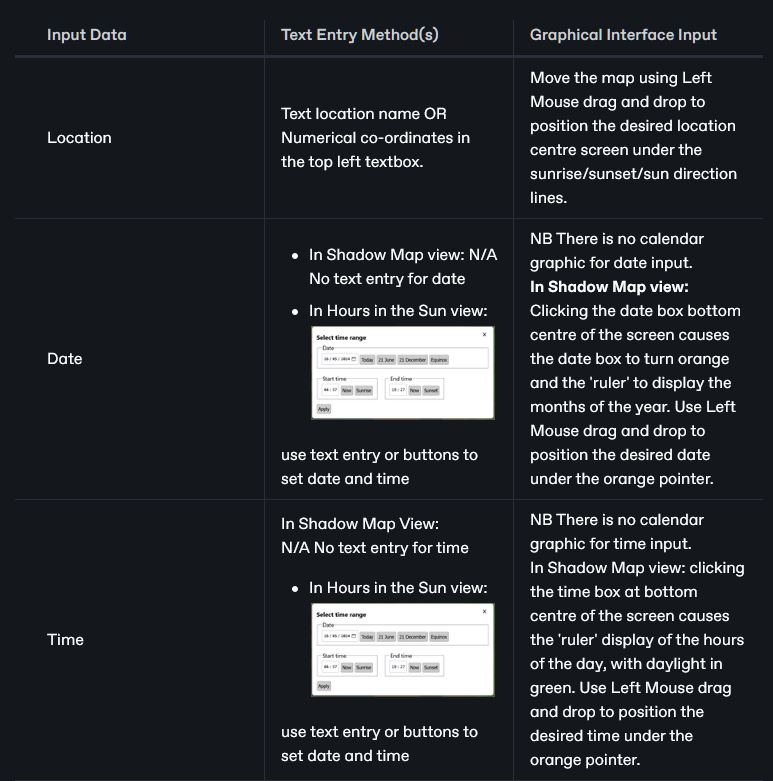
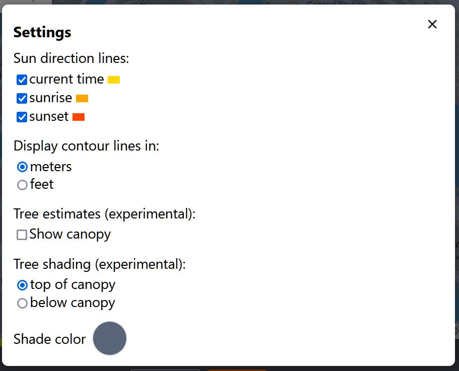

# Supplementary Material ShadeMap

## URL

[https://](https://shademap.app/)[shademap.app](https://shademap.app/)[#url](supplementary-material-shademap.md#url "mention")

## Description

<figure><figcaption>
SHADE MAP SIMULATES THE SHADOW PATTERNS FROM SUNRISE TO SUNSET AS THE USER MOVES THE TIME SLIDER TO CHANGE THE TIME IN RUSHON, TAJIKISTAN ON 18TH MAY
</figcaption></figure>

ShadeMap can calculate shadow locations in real time and display them on a map. ShadeMap can also aggregate shadows over time to calculate how many hours of sun or shadow a specific location gets over the course of a day or over the course of an entire year.


ShadeMap is also available as a Chrome browser extension which displays a sun and shadow layer for online maps including: openstreetmap.org, alltrails.com, gaiagps.com, caltopo.com. This is being extended to Strava, Mountain Project, OnX Maps with more to follow...


Open Source research applications include geolocation and for environmental monitoring.

Geolocation can be supported directly where imagery contains shadows which can be matched to the model. Shade Map is also indirectly valuable in terms of predicting terrain properties:

* the likely condition of terrain at a given time and place with respect to ground moisture v sun exposure, e.g. this area was in the sun for 8 hours before this image was taken, so it would be very dry.
* the likely snow covering over terrain at a given time and place with respect to snow melting v sun exposure, e.g. this area could have had a light snow covering since it was entirely shaded before this image was taken.
* the likely plant life which could survive at a given place and season with respect to shade and plant species.
* the likely condition of man-made materials at a given place and time with respect to the long term interaction of light on different building materials, e.g. bleaching effect.

Shade Map's cumulative analyses of daily sunlight hours, annual sunlight hours and annual energy values allow for the types of longer term analysis used in environmental monitoring.



<figure><figcaption>
INPUT AND OUTPUT DATA FOR SHADE MAP USE CASES
</figcaption></figure>



* Source imagery
* Location co-ordinates
* Imagery Date
* Imagery Time



* Shadow map for given location, with user facility to change date and time
* Availability of optimal quality data for the given location, with the option to purchase
* Graph of annual sunlight & annual energy for the given location across the days and months of the year & time of day
* Colour map fo the given area showing daylight hours in the sun



<figure><figcaption>
<strong>DIFFERENT MEANS OF DATA INPUT IN SHADE MAP</strong>
</figcaption></figure>



<table><thead><tr><th>USE CASE</th><th width="256">INPUT DATA</th><th>OUTPUT DATA</th></tr></thead><tbody><tr><td>Use of shadows in an image to determine a possible date or time at a given location.</td><td>Location of image plus one of: - Date of image - Time of image</td><td>The time/date variable can usually be established by trial and error. Time is most easily changed via the time slider on the interface. Date can be changed via the interface slider. </td></tr><tr><td>Confirmation of a proposed location, date and time through visual shadow matching of an image</td><td><ul><li>Source image</li><li>Proposed location</li><li>Date</li><li>Time</li></ul></td><td>ShadeMap model with shadows which visually match the source image.</td></tr><tr><td>Determination of the sunlight exposure in hours for a given date over a specified time perios up to a day</td><td><ul><li>Location</li><li>Start Time</li><li>End Time</li></ul></td><td>Map of the location area coloured to show sun hours over the time period, with numeric readouts under the cursor.</td></tr><tr><td>Determination of the sunlight exposure  and energy absorption of a given location over a time period up to a year</td><td><ul><li>Location</li><li>Start Date</li><li>End Date</li></ul></td><td>Map with graph of sunlight hours per month and yearly total</td></tr></tbody></table>

| Input Data | Text Entry Method(s)                                                                                                                                                                                             | Graphical Interface Input                                                                                                                                                                                                                                                                                                                                   |
| ---------- | ---------------------------------------------------------------------------------------------------------------------------------------------------------------------------------------------------------------- | ----------------------------------------------------------------------------------------------------------------------------------------------------------------------------------------------------------------------------------------------------------------------------------------------------------------------------------------------------------- |
| Location   | 
Text location name OR Numerical co-ordinates in the top left textbox.
                                                                                                                                  | Move the map using Left Mouse drag and drop to position the desired location centre screen under the sunrise/sunset/sun direction lines.                                                                                                                                                                                                                    |
| Date       | <ul><li>In Shadow Map view:    N/A No text entry for date </li><li>In Hours in the Sun view:  </li></ul>
use text entry or buttons to set date and time
 | 
NB There is no calendar graphic for date input except in Hours in the Sun view.  <strong>In Shadow Map view:</strong> Clicking the date box bottom centre of the screen causes the date box to turn orange and the 'ruler' to display the months of the year. Use Left Mouse drag and drop to position the desired date under the orange pointer.
 |
| Time       | <ul><li>In Shadow Map View:    N/A No text entry for time</li><li>In Hours in the Sun view:  </li></ul>
use text entry or buttons to set date and time
  | 
NB There is no clock graphic for time input.  <strong>In Shadow Map view:</strong> clicking the time box at bottom centre of the screen causes the 'ruler' display of the hours of the day, with daylight in green. Use Left Mouse drag and drop to position the desired time under the orange pointer.
                                           |


**Limitations of Trial and Error Solutions for Date, Time and Location:** Bear in mind that sometimes there may be more than one solution value for a given set of parameters.


### ShadeMap Data

The shadows displayed by default are estimates gathered through indirect means like crowd sourcing and low resolution data. The default data gives a general idea of shadow distribution and sun direction, but **errors in the data can vary by several meters.**

Premium data is composed of precise measurements collected via LiDAR and photogammetry surveys. This means building layouts, roof, tree and building heights will be **exact to within 30 centimeters**. This is the most accurate shadow modeling data available.

If this data is available in a given region, an Add Trees button will appear when you zoom into street level. Tree data is purchased by square kilometer and can be accessed for one month

* Free building data comes from volunteers at [OpenStreetMap](https://www.openstreetmap.org)&#x20;
* ShadeMap buys additional building data and building heights from [Mapbox](https://shademap.app/help/mapbox.com) when the cost is manageable
* ShadeMap relies on the less detailed [Protomaps Basemaps](https://protomaps.com/) during periods of high traffic.
* Users requiring accurate building height and roof shape data can purchase Tree Data, which is gathered through LiDAR and photogrammetry surveys.


**DEMONSTRATING THE DIFFERENCE IN DATA QUALITY BETWEEN FREE BASE AND PAID FOR PREMIUM DATA. THIS IS BEST OBSERVED WITH A SATELLITE VIEW  SO SHADOWS OF INDIVIDUAL VISIBLE TREES & BUILDINGS SHOW UP.**



Purchased data costs can be controlled because users are offered data only for the area in which they are interested, charged per square kilometre (USD $2.49 as at May 2024). Thus high resolution data need only be purchased for the user's area of interest.


* Users can add building data to the map via a drawing tool, which allows them to draw a building and set its height.&#x20;


**HOW TO ADD A USER DEFINED BUILDING TO SHADEMAP AND SET ITS HEIGHT**



Setting height to zero will delete the building again.


### The ShadeMap Interface

### ZOOMING THE MAP SCALE:


DON'T use the Mouse Scroll Wheel to Zoom the map scale BECAUSE the focus location is lost.&#x20;



DO use the "+" and "-" tool in the bottom left of the map window to Zoom whilst maintaining a consistent focus location.


<figure><figcaption></figcaption></figure>

<figure><figcaption>
<strong>SETTINGS FOR THE SHADEMAP INTERFACE</strong>
</figcaption></figure>

By default, shadows are displayed on top of the tree canopy. To view shadows underneath the tree canopy instead, change the radio button setting from 'Top of canopy' to 'below canopy'.

<figure><figcaption></figcaption></figure>

<figure><figcaption>
MOVING THE CURSOR ACROSS THE TIME OF DAY V MONTH PLOT FOR THE LOCATION SHOWN ON THE LEFT: EXACT DATE AND TIME ARE SHOWN FOR THE POINT UNDER THE CROSSWIRES PLUS THE ENERGY ABSORBED, WITH CUMULATIVE TOTALS AT THE TOP OF THE SCREEN
</figcaption></figure>

<figure><figcaption></figcaption></figure>

### Trail Shade

### GPX Replay

### The ShadeMap API (Paid For)

ShadeMap offers a paid for API with the following features, where developer users can simulate, visualise and analyse sunlight and shadow in any current browser using their own data on terrain, buildings and vegetation and share it on the web.

<figure><figcaption>
<strong>FEATURES OF THE SHADEMAP API (APPLICATION PROGRAMMING INTERFACE)</strong>
</figcaption></figure>

## Cost

* [x] Free
* [x] Partially Free
* [x] Paid

ShadeMap provides data and the service for free, but if higher quality data is required, ShadeMap helps users purchase it. A free browser extension is offered, as well as a paid for API.

## Level of difficulty

<table><thead><tr><th data-type="rating" data-max="5"></th></tr></thead><tbody><tr><td>3</td></tr></tbody></table>

ShadeMap basic features are not difficult to use, but a good understanding of the interplay of date, time, sun position and shadow direction and length is required to use its outputs effectively.&#x20;

## Requirements

\[\[Information on the requirement for using a tool, for instance, API key, e-mail address etc.]]

## Limitations

**Performance:**&#x20;

ShadeMap relies heavily on the graphics processing unit (GPU) of the device it is running on.&#x20;

Where performance is an issue:-

1. &#x20;Test whether your browser supports WebGL from this [Test Page here](https://webglreport.com/?v=2) since ShadeMap will only work with browsers which do support WebGL
2. Reduce the size of the browser window to increase the performance.

**Data Quality**

Most ShadeMap free data does not contain accurate building heights and/or roof shapes. Users needing accurate data on these features can purchase Tree Data which provides exact measurements gathered through LiDAR and photogammetry surveys.


There have been historical email issues around the delivery of purchased Tree Data where the data emails have been sent to Spam or blocked. A workaround is being implemented and the provider can be contacted [here](https://us6.list-manage.com/contact-form?u=e5e17c9e245874654e775b644\&form\_id=271345c0ff1a17865f8194ec099c597f) with any problems.


**Interface**

Some users might find the interface counterintuitive, in that the user moves the time ruler against a fixed pointer, rather than moves the pointer to indicate the time.

## Ethical Considerations

\[\[The ethical considerations of each tool should be described.]]

## Guide

ShadeMap's Online Help: [https://shademap.app/help/](https://shademap.app/help/)

Guide for the Chrome Browser Extension:&#x20;


**YOU TUBE VIDEO BY THE DEVELOPER ON THE SHADE MAP BROWSER EXTENSION FOR CHROME**


## Tool provider

ShadeMap 9615 NE 195th Cir Bothell, WA 98011 US

## Advertising Trackers

* [ ] This tool has not been checked for advertising trackers yet.
* [ ] This tool uses tracking cookies. Use with caution.
* [x] This tool does not appear to use tracking cookies.

| Page maintainer |
| --------------- |
| Sophie Tedling  |
|                 |

