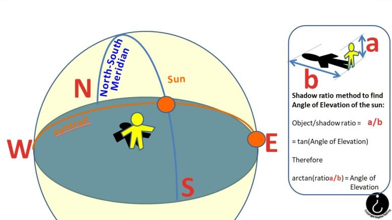
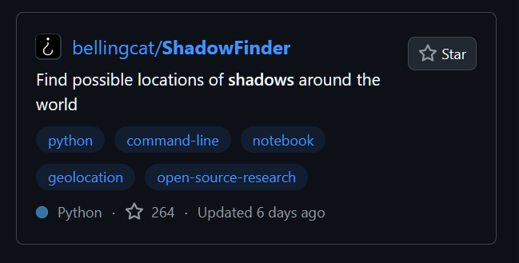
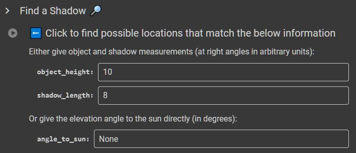
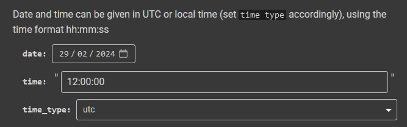

# Shadow Finder

## URL

[https://colab.research.google.com/github/Bellingcat/ShadowFinder/blob/main/ShadowFinderColab.ipynb](https://colab.research.google.com/github/Bellingcat/ShadowFinder/blob/main/ShadowFinderColab.ipynb)

## Description

<figure><figcaption>
<strong>THE SHADOW &#x26; OBJECT MEASURED CAN ONLY LIE SOMEWHERE ON THE BRIGHT CIRCLE</strong> 
</figcaption></figure>

Enter shadow length and object height, (or, instead, the angle of elevation of the sun) for a research source image, then also the date and time of the image, and see the potential locations at which such a shadow could be created for that point in time as the bright area (circle) on the world map.

<figure><figcaption>
<strong>THE ANGLE OF ELEVATION OF THE SUN CAN BE FOUND FROM THE RATIO OF THE HEIGHT OF AN OBJECT TO THE SHADOW IT CASTS (USING TRIGONOMETRY)</strong>
</figcaption></figure>

Note that the tool can be used to consider a range of inputs if the exact values are not known, since the outputs vary relatively smoothly with changes in input values.


Shadow Finder is an open source app on GitBook, which requires users to have a (free) GitHub account and to follow instructions on how to run the app.



Shadow Finder needs the date and time of the source image containing the shadow to be able to generate potential locations. This is not always available, particularly as social media sites usually remove this type of metadata (called [ExIf data](#user-content-fn-1)[^1]) before allowing an image to be posted. Researchers also need to be aware that the time and date an image is posted online is not often the same as when it was taken. HOWEVER Shadow Finder may still be useful as a "What If?" tool to exclude potential locations.


Step by step instructions for running Shadow Finder [Click the arrow]...

1. Sign up for a GitHub account if you don't already have one.
2. Log in to GitHub on a browser and type "Shadow Finder" in the search bar at the top of the Home page and press the Search button.
3. From the list which the search returns, select the "Shadow Finder" tool from Bellingcat with left mouse click:

4. Scroll down the Shadow Finder page to README section and click the bright orange button labelled "TRY IT ON COLAB". This launches ShadowFinder in an easy-access environment called Colab.

5. Scroll down to enter your shadow measurement details into the app. Input EITHER&#x20;

a. both object height and shadow length (using the same units, whether thats mm, cm, m, feet, inches. Pixels in an image may be the easiest units - it doesn't matter because Shadow Finder just needs the ratio of object height divided by shadow length)&#x20;

OR&#x20;

&#x20;b.  the elevation angle of the sun in degrees

**Definition:** The elevation angle of the sun is the inverse tangent of the ratio of the height of an object for which the sun casts a shadow to the length of that shadow. Shadow Finder needs that angle in degrees (not radians, be careful).

6. and then enter the date[^2], time[^3] (and [time zone](https://en.wikipedia.org/wiki/Time_zone) you are using):

7. Click the dark Right Arrow button in the white circle in the left margin to Run the tool, as instructed by the sentence "Click to find possible locations that match the below information". \[The white Left arrow on the square blue background is \*not\* a button you can press!]

8. If you get this warning message, click the "Run anyway" button if you're happy that [the code isn't abusing your privacy](#user-content-fn-4)[^4].

9. Be aware that the code may not always run instantaneously and could 'queue' for a brief time. The elapsed run time will be shown whilst executing the code and the total time taken displayed upon completion next to the Run arrow button. The output takes the form of a world map (see top of page) showing all possible points satisfying the input conditions on date, time, object height and shadow length (the circular locus[^5]).
10. Change the input values at will and re-run as required.

Using an object's height and the length of its shadow (or the angle to the sun) with the date and the time, the Shadow Finder code estimates the possible locations of that shadow. It plots all the possible locations (there will almost always be very many possibilities) on a world map as a bright line.


The length of the shadow fed into Shadow Finder can only be measured directly from the image if the camera is at right angles to the shadow. If not, calculations/adjustments will need to be made to correct for any other camera perspective.


### The Interface 

**Click the two tabs below** to see the different views presented to the user as they find Shadow Finder on the GitHub website (Tab 1)and then run it in Colab (Tab 2):



<figure><figcaption>
THE SHADOW FINDER PAGE ON GITHUB. PRESS THE ORANGE "TRY IT ON COLAB" BUTTON TO RUN THE PROGRAM...
</figcaption></figure>



<figure><figcaption>
WHEN YOU HIT THE ORANGE BUTTON, THIS IS WHAT THE APP LOOKS LIKE, WAITING FOR INPUT DATA FROM YOU. ADD THE DATA AND HIT THE WHITE 'RUN' BUTTON UNDER "FIND A SHADOW" TO SEE THE OUTPUT MAP WITH POSSIBLE SHADOW LOCATIONS
</figcaption></figure>



The first tab above (GitHub Page tab) shows what the Shadow Finder page looks like on GitHub, before running in Colab.

The second tab above (Click on the COLAB INTERFACE tab) shows the Colab interface which will appear after the user Runs Shadow Finder in Colab using the Orange Button.


There are multiple alternative routes to running the Shadow Finder code in addition to Colab, e.g. direct from Python. Colab is a simple route.


<figure><figcaption>
COLAB INTERFACE FOR TAKING USER INPUTS AND RUNNING THE CODE ON THEM
</figcaption></figure>

### Shadow Finder for Open Source Research: Use Cases, Data Input, Shadow Finder Outputs, How to Enter Data... (Click each of the four tabs for more detail)



* Date
* Time
* EITHER

&#x20;          Object and Shadow lengths

&#x20;      OR

&#x20;         Angle of sun elevation



The path of points (called a locus[^6] - in this case, the path is a circle) which satisfy the input criteria, drawn on a map of the world. This shows all possible locations where such a shadow could have been observed on that date at that time. Of course, the shadow would have a different orientation (azimuth angle) at different locations along the locus.



* Given a photograph containing an object and its shadow at a known date and time, find the possible locations at which this could be observable
* Given the angle of elevation of the sun at a known dat and time, find the possible locations at which this could be observable
* Elimination of a potential geolocation of an image dependent upon the shadows it contains, i.e. rule out a potential location because it doesn't lie on the Shadow Finder locus for feasible dates and times.



Data can only be input as numeric values into the text input boxes in Shadow Finder running in Colab.



The output map appears at the bottom of the page when Shadow Finder code has been run in Colab. Compare the Shadow Finder output for a given date and time with [a map showing the world's daylight, darkness and sun and moon positions](https://www.timeanddate.com/worldclock/sunearth.html?month=02\&day=29\&year=2024\&hour=12\&min=00\&sec=0\&n=%3A\&ntxt=\&earth=0) for the same point in time, shown below:

<figure><figcaption>
<strong>SHADOW FINDER MAP OUTPUT FOR NOON ON 29/2/24 WHERE THE BRIGHT RING LOCATES THE PLACES WHERE OBJECTS CAST SHADOWS 80% OF THEIR HEIGHT</strong>
</figcaption></figure>

<figure><figcaption>
<strong>TIME &#x26; DATE MAP FOR NOON ON 29/2/24  WITH SUN &#x26; MOON POSITIONS OVERLAID</strong>
</figcaption></figure>

The two representations concur on the daylight distribution and sun position for the same time and date shown:

* The centre of the world map is in daylight on both maps, with either side in darkness over the Pacific Ocean and (roughly) the Arctic Circle.
* The sun is above the Atlantic Ocean to the west of Central Africa in both maps, with the locus of the Shadow Finder map centering on the location of the sun in the "Time and Date" website map.

## Cost

* [x] Free
* [ ] Partially Free
* [ ] Paid

## Level of difficulty

<table><thead><tr><th data-type="rating" data-max="5"></th></tr></thead><tbody><tr><td>4</td></tr></tbody></table>

Data input is remarkably simple, as is running the tool IFF the user is familiar with GitHub. There is some theoretical understanding of the relationship between sun position, date and time required to use the tool effectively.

## Requirements

GitHub code such as Shadow Finder requires a GitHub account so that a user can log in to access and run the code.

## Limitations

Shadow Finder does not provide the direction of the sun (azimuth angle) at each potential location for the given date, time and elevation angle of the sun. This would only be useful if it was possible to establish the orientation of the source imagery to allow confirmation.

## Guides and articles

[https://www.bellingcat.com/resources/2024/08/22/shadow-geolocate-geolocation-locate-image-tool-open-source-bellingcat-measure/?utm\_source=discord](https://www.bellingcat.com/resources/2024/08/22/shadow-geolocate-geolocation-locate-image-tool-open-source-bellingcat-measure/?utm_source=discord)

## Tool provider

Bellingcat is the provider of this tool, authored by [Galen Reich](https://galen.reich.me.uk/#about), Bellingcat Tech Community Facilitator, Jordan Gillard, Thomas Ellmenreich and Boris Nezlobin.

## Advertising Trackers

* [ ] This tool has not been checked for advertising trackers yet.
* [ ] This tool uses tracking cookies. Use with caution.
* [x] This tool does not appear to use tracking cookies.

| Page maintainer |
| --------------- |
| Sophie Tedling  |
|                 |

[^1]: EXIF data can contain non-visual information about an image, e.g. type of camera and lens, date and time the image was taken, location at which it was taken,...

[^2]: Date format "dd/mm/yyyy"

[^3]: Time format "hh:mm:ss"

[^4]: You can view the code by clicking on "Show code" in blue at the bottom of the section under "time type:"

[^5]: 

    ### Definitions

    from The American Heritage® Dictionary of the English Language, 5th Edition.

    * noun _Mathematics_ The set or configuration of all points whose coordinates satisfy a single equation or one or more algebraic conditions.

[^6]: 

    ### Definitions

    from The American Heritage® Dictionary of the English Language, 5th Edition.

    * noun _Mathematics_ The set or configuration of all points whose coordinates satisfy a single equation or one or more algebraic conditions.
