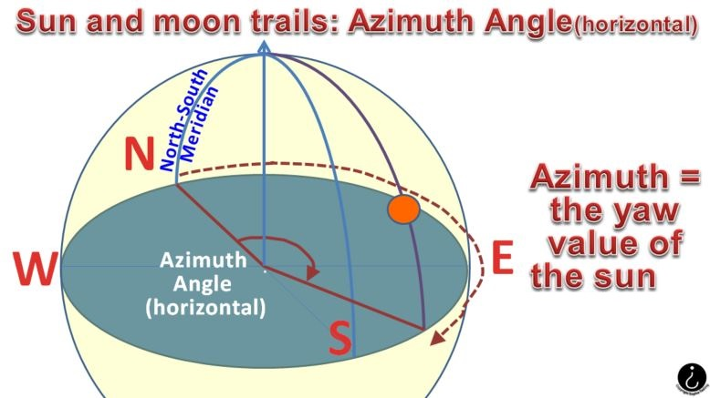
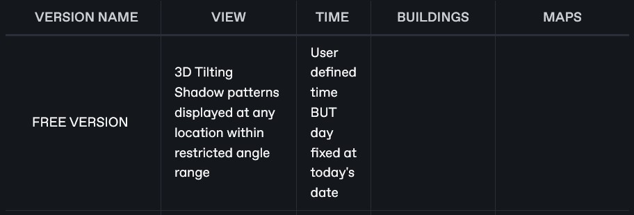
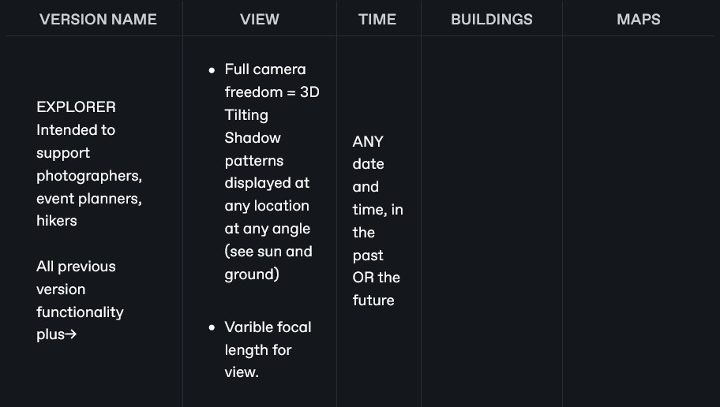
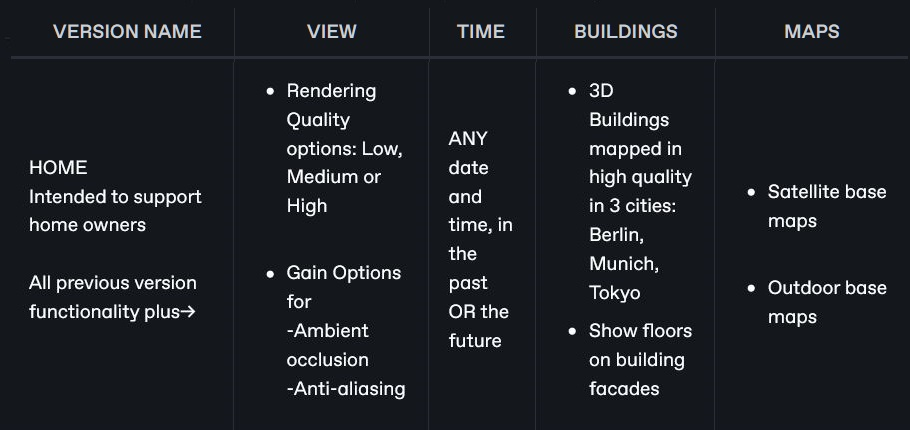
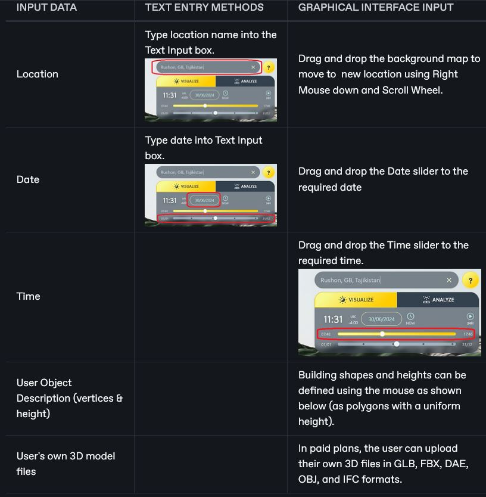
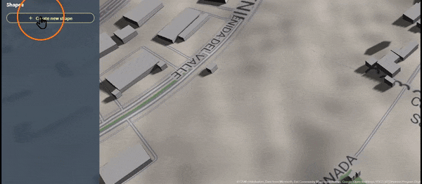
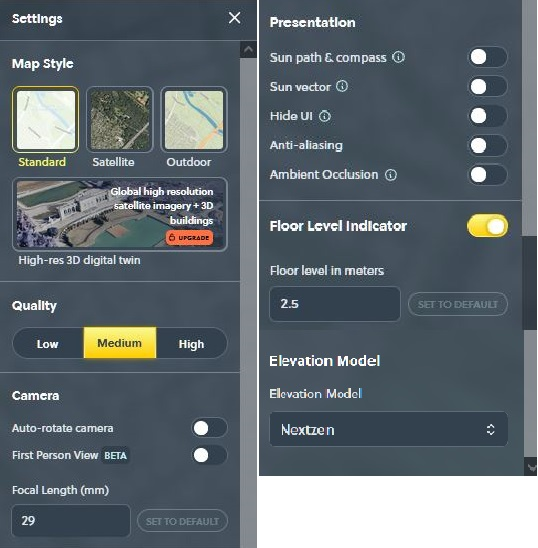
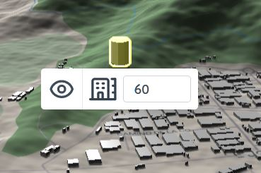
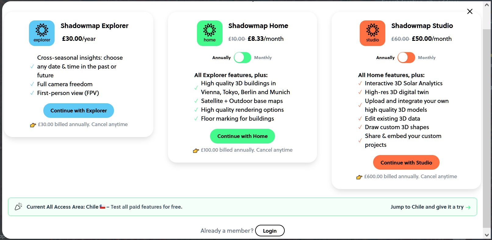

# ShadowMap

## URL

[**https://app.shadowmap.org/**](https://app.shadowmap.org/)

## Description

<figure><figcaption>
SHADOWMAP TILTING VIEW DEMONSTRATING AZIMUTH &#x26; ELEVATION ANGLES IN 3D
</figcaption></figure>

ShadowMap calculates shadow locations in real time and displays them on a 3D tilting map, showing arcs of azimuth and elevation angles along the sun's path.

For definitions of azimuth and elevation angles click here...

The trajectory of the sun is its path through space. This is defined by the variation in two angles applied to the sun seen in the sky from earth: azimuth angle and elevation angle... 

**AZIMUTH ANGLE OF THE SUN (HORIZONTAL COMPASS BEARING)**

ELEVATION ANGLE OF THE SUN (VERTICAL SEXTANT BEARING)

### Free and Paid Shadowmap Versions

A range of more advanced functions are spread across 3 paid versions with increasing numbers of features - see the table below \[click the tab for each version to show functionality].



<figure><figcaption>
COMPARING THE FOUR VERSIONS OF SHADOWMAP: FREE, EXPLORER, HOME &#x26; STUDIO
</figcaption></figure>



<figure><figcaption></figcaption></figure>



<figure><figcaption></figcaption></figure>



<figure><figcaption></figcaption></figure>



The Main Differences between all available versions are:

* The Free version is restricted to today's date, but the user can define the time of day.
* The Explorer version allows any input date and time, past or future.
* The Home version includes 3D buildings in 3 cities, plus satellite background maps.
* The Studio version allows 3D user model upload and Google hi-res satellite imagery.


ALL Shadowmap functionality, up to and including the top level Studio version, is available to **test for free** in a single selected location (Chile, at the time of writing, though this may be amended over time) called the All Access Project.




Disambiguation: ShadowMap is not the same tool as [ShadeMap](https://app.gitbook.com/o/WQpOq5ZFue4N6m65QCJq/s/EUDXS3T3viIA2t49EbQG/) from [Ted Piotrowski](https://github.com/ted-piotrowski). The name is very similar, and so is the basic functionality. ShadowMap cannot generally be used for Open Source research without payment, whereas ShadeMap is open source and charges only for higher quality data, not access to past and future sun positions like ShadowMap. ShadowMap's most expensive version, Studio, includes an interface for user-defined objects which is very easy to use. Researchers need first to understand and categorize their shadow-related problem before selecting a tool, e.g. ShadeMap, Shadow Map, PeakVisor, Shade Finder, ...




* Location (co-ordinates/name/map pin)
* Date
* Time
* User Object Description (vertices & height)
* User's own 3D model files



* Shadow pattern for buildings and landscape at a given location and time.
* 24 hour animation of the sun and shadow paths at a given location and time.
* Yearly average solar energy value for a given location in kWh/square metre.

<figure><figcaption>
PAID VERSION "STUDIO" FEATURE: SOLAR ANALYTICS, INVOKED BY PRESSING "ANALYZE" MENU BUTTON
</figcaption></figure>



* Matching an image containing shadows to determine the relationship between location co-ordinates, date, time and shadow pattern. This is useful to Open Source researchers for
  * chronolocation, i.e. to work out the time an image was taken if you know location and date
  * geolocation i.e. to work out potential location(s) if you know the date, time and shadow pattern.
* Projecting potential shadow patterns at user-defined location, date and time.
* Finding the annual average solar energy value for a given location. Examples where this would be useful are: to determine likely type of vegetation, to determine likelihood of snowfall, to determine suitability for solar power generation,...



<figure><figcaption></figcaption></figure>



<figure><figcaption>
SHADOWMAP STUDIO VERSION (HIGHEST COST): USER INPUT &#x26; MANIPULATION OF 3D SHAPES
</figcaption></figure>

### The Interface

ShadowMap has 5 main interface menus:

<figure><figcaption>
<strong>THE 5 MAIN SHADOWMAP MENUS RARELY APPEAR AT THE SAME TIME ON THE SCREEN</strong>
</figcaption></figure>


URL: Note that the Shadowmap URL which is displayed in the browser address bar is constructed to reflect the properties of the location being displayed in great detail: latitude, longitude, zoom, azimuth, etc. The user can edit all these parameters directly in the URL, hit refresh and Shadowmap will redraw accordingly. This can be a very useful shortcut but it is powerful and should be used with care.




<figure><figcaption></figcaption></figure>

The Project and Share menus allow:

* a model containing user data to be saved as a project, and to share or embed that project with default time, date, camera angle, focal length, etc. Shared models are not editable by the audience, but interaction is allowed.
* links & embeds to be updated simultaneously via the "Update" button.
* the user to create a shape in Shadowmap.
* the user to upload a model into Shadowmap.
* the user to edit buildings in the map for visibility and height.



<figure><figcaption></figcaption></figure>

The Settings menus allow:

* Setting of location co-ordinates (lat, long)
* Selection from 3 map styles
* Selection from 3 levels of image quality (high quality needs fast PC hardware)
* User definition of camera movement and focal length
* Hide/show sun path, sun vector, compass, UI, anti-aliasing, ambient occlusion (depth)
* Setting of floor height, building height, floor visibility for buildings
* FOR STUDIO VERSION: Switch to global high resolution satellite imagery & 3D buildings, toggle Ambient Occlusion enhancement demonstrated here:[https://www.youtube.com/watch?v=Wd6ITD0iI\_I](https://www.youtube.com/watch?v=Wd6ITD0iI_I)



<figure><figcaption></figcaption></figure>

* The Search Box sets location by text input or co-ordinates input.
* The Time & Date Menu sets time and date with a slider and allows numerical date input.
* The 24H button generates an animation of sun position with shadows over 24 hours.
* The Analyze tab switches to a view coloured according to degree of yearly sun radiation where numeric energy values appear for a point upon left mouse click.

<figure><figcaption></figcaption></figure>



<figure><figcaption></figcaption></figure>

The 'Hide & Height' menu appears in Visualization mode whenever the user Left Mouse clicks on a building (duly highlighted), allowing the user to reset the height & change the building visibility.



<figure><figcaption></figcaption></figure>

* The Point North compass button resets the view orientation to the north.
* The Share button allows the user to share or embed a project with default time, date, camera angle, focal length, etc. Shared models are not editable by the audience, but interaction is allowed and links & embeds can be updated simultaneously via the "Update" button.
* The Settings button invokes the Settings menu.
* The Zoom buttons adjust the scope of the view.




PARTICULARLY USEFUL FEATURES FOR OSINV ARE:

* The ability to change the focal length of the virtual camera in the model allows for more accurate image matching in OSINV research.
* The ability to add/remove buildings and model the consequent changes in shadowfall allows the user to consider past and future shadow patterns as building topology changes over time.


### The Data

Custom models (within a quota dependent upon subscription plan) up to 200MB can be uploaded in formats:

[GLB](https://docs.fileformat.com/3d/glb/), [FBX](https://en.wikipedia.org/wiki/FBX), [DAE,](https://cadexchanger.com/dae/) [OBJ](https://en.wikipedia.org/wiki/Wavefront_.obj_file), and[ IFC](https://www.spatial.com/resources/glossary/what-is-ifc)

ShadowMap cites numerous data sources for map, building and solar irradiation data ...(click for more details...

* **Basemap Tiles**
  * © [Stadia Maps](https://www.stadiamaps.com/)
  * © [Esri](https://www.esri.com) and Maxar, GeoEye, Earthstar Geographics, CNES/Airbus DS, USDA, USGS, AeroGRID, IGN, and the GIS User Community.
  * Maps © [Thunderforest](https://www.thunderforest.com), Data © [OpenStreetMap contributors](https://www.osm.org/copyright)

- **Mapzen/Nextzen Terrain Tiles** ([Additional attribution](https://github.com/tilezen/joerd/blob/master/docs/attribution.md))
- ArcticDEM terrain data DEM(s) were created from DigitalGlobe, Inc., imagery and funded under National Science Foundation awards 1043681, 1559691, and 1542736;

* Australia terrain data © Commonwealth of Australia (Geoscience Australia) 2017;
* Austria terrain data © offene Daten Österreichs – Digitales Geländemodell (DGM) Österreich;
* Canada terrain data contains information licensed under the Open Government Licence – Canada;
* Europe terrain data produced using Copernicus data and information funded by the European Union - EU-DEM layers;
* Global ETOPO1 terrain data U.S. National Oceanic and Atmospheric Administration
* Mexico terrain data source: INEGI, Continental relief, 2016;
* New Zealand terrain data Copyright 2011 Crown copyright (c) Land Information New Zealand and the New Zealand Government (All rights reserved);
* Norway terrain data © Kartverket;
* United Kingdom terrain data © Environment Agency copyright and/or database right 2015. All rights reserved;
* United States 3DEP (formerly NED) and global GMTED2010 and SRTM terrain data courtesy of the U.S. Geological Survey.

- **Nextzen Vector Tiles** ([Nextzen Developers](https://developers.nextzen.org/about.html))

* **3D buildings and trees for Vienna, Austria** © [Stadt Wien](https://digitales.wien.gv.at)
  * Datenquelle: Stadt Wien – [data.wien.gv.at](https://data.wien.gv.at)
  * Lizenz: [Creative Commons Namensnennung 4.0 International](https://creativecommons.org/licenses/by/4.0/deed.de)

- **Trees for Madrid, Spain** © [Ayuntamiento de Madrid](https://datos.madrid.es) (last update 28/11/2020)

* **Trees for Paris, France** © [Mairie de Paris](https://opendata.paris.fr) (last update 15/07/2022)

- **Solar irradiation data** © [Global Solar Atlas 2.0](https://globalsolaratlas.info), Solargis s.r.o., World Bank Group, Energy Sector Management Assistance Program (ESMAP)

## Cost

* [ ] Free
* [x] Partially Free
* [ ] Paid

Current pricing can be found at [https://shadowmap.org/pricing](https://shadowmap.org/pricing)

At the time of writing in August 2024, paid versions varied from Explorer at £2.50/month, through Home at £8.33/month to Studio at £50/month.

<figure><figcaption>
<strong>CHECK THE SHADOWMAP SITE FOR CURRENT PRICING. ABOVE PRICES AS AT SEPTEMBER 2024</strong>
</figcaption></figure>

## Level of difficulty

<table><thead><tr><th data-type="rating" data-max="5"></th></tr></thead><tbody><tr><td>3</td></tr></tbody></table>

Shadowmap has a complex set of menus and requires a good understanding of the motion of the sun over time to gain accurate results.

## Requirements

* Free version does not require login.
* Paid versions require an account and payment.
* High quality imagery requires good graphics hardware.

## Limitations

Fixed date (as the date of the system clock) in the free version is a major limitation of ShadowMap for Open Source investigation, because source imagery is rarely created and analysed on the same day.

## Ethical Considerations

The inclusion of detailed building data in Shadowmap could lead to invasions of personal privacy.

## Guide

Useful FAQs and resources can be found at[ https://shadowmap.org/support](https://shadowmap.org/support)

Detailed video presentations are on YouTube at [https://www.youtube.com/@shadowmap\_org](https://www.youtube.com/@shadowmap_org)



## Tool provider

ShadowMap Technologies GMBH, a small company based in Austria.

Founder (2021) and CEO Georg Molzer.

## Advertising Trackers

* [ ] This tool has not been checked for advertising trackers yet.
* [x] This tool uses tracking cookies. Use with caution.
* [ ] This tool does not appear to use tracking cookies.

| Page maintainer:- |
| ----------------- |
| Sophie Tedling:   |
|                   |
