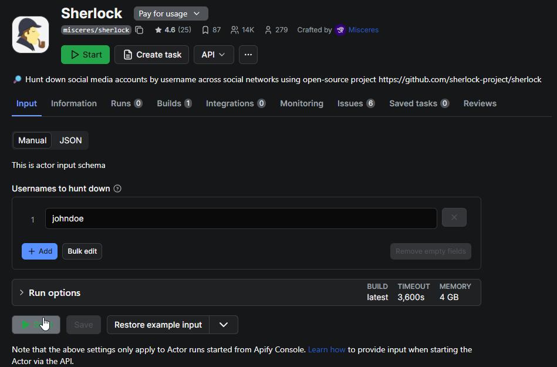

# Sherlock

## URL

[https://github.com/sherlock-project/sherlock](https://github.com/sherlock-project/sherlock)\
(current version 0.16.0, published Sept 16th 2024, as of 31. Dec 2025)

## Description

Sherlock is an open-source command-line tool (CLI) by the Sherlock Project that finds social media and online accounts by username across [**400+ websites**](https://sherlockproject.xyz/) and platforms. Users can enter one or more usernames, and Sherlock will check each against a maintained list of sites to find profiles matching that username. [It supports](https://sherlockproject.xyz/usage) limiting the search to specific sites (using `--site` flags) and can output results in various formats, including writing found account URLs to text files or exporting data as CSV and Excel (XLSX) spreadsheets. The tool also allows bulk username input via a JSON file and offers options to use proxies or Tor for the queries.

Sherlock is designed to be straightforward for OSINT investigations: it does not require API keys or login credentials for the sites it checks; instead, it simply constructs the expected profile URL for each site and observes the response to determine whether[ the username exists](https://www.hackercoolmagazine.com/complete-guide-to-sherlock-tool/k). This means it only accesses publicly available information and cannot bypass privacy settings or account restrictions.

Sherlock is primarily a CLI tool, so some familiarity with the command line is required to install and run it. However, installation is relatively accessible: the latest version is published on PyPI for one-command install (e.g. `pipx install sherlock-project` or `pip install --user sherlock-project`). There is also an official Docker image available (`sherlock/sherlock` on Docker Hub) for containerized use, as well as community packages (e.g. in [Homebrew for macOS](https://formulae.brew.sh/cask/sherlock-app), [APT in Kali Linux](https://www.kali.org/tools/sherlock/), [DNF in Fedora](https://docs.fedoraproject.org/en-US/fedora/f40/system-administrators-guide/package-management/DNF/), and BlackArch). Once installed, running Sherlock involves executing the `sherlock` command with the desired username(s) as arguments. For example, `sherlock user123` will search for “user123” on all supported sites, while adding `--csv` or `--xlsx` will save results to a file. The output lists each found profile URL (or indicates 'not found'), and by default, also saves each username’s results to a separate text file for review.

<figure><figcaption><p>A sample query on Sherlock looking for accounts that have the username "bellingcat"</p></figcaption></figure>

### CLI Usage

```
# Single username (saves a user123.txt by default)
sherlock user123

# Multiple usernames
sherlock alice bob charlie

# Try common separators between name parts with the {?} helper
# (expands to _  -  . between tokens)
sherlock john{?}doe
```

#### Output Control

```python
# Only print positives (found)
sherlock user123 --print-found

# Print everything, including not found + reasons
sherlock user123 --print-all

# Disable colored output (useful for logs/CI)
sherlock user123 --no-color

```

#### Saving results (files & formats)

```python
# Save a single-user run to a specific text file
sherlock user123 --output results/user123.txt
# short form: -o results/user123.txt

# When checking multiple users, store all their files in a folder
sherlock alice bob -fo results/
# long form: --folderoutput results/

# Also create a CSV alongside text outputs
sherlock user123 --csv

# Or generate an Excel workbook (XLSX)
sherlock user123 --xlsx

```

#### Limit the scope to certain sites

```python
# Check only specific sites (add --site repeatedly)
sherlock user123 --site GitHub --site Instagram

# Site names with spaces must be quoted (use the names from the supported list)
sherlock user123 --site "Archive of Our Own" --site "Docker Hub"
```

#### Include NSFW targets (off by default)

```python
# Add NSFW sites from the default list to your run
sherlock user123 --nsfw
```

#### Networking, OPSEC & performance

```python
# Set a longer/shorter request timeout (seconds; default is 60)
sherlock user123 --timeout 90

# Send requests through a proxy (HTTP)
sherlock user123 --proxy http://127.0.0.1:8080
# or SOCKS5 (Tor/Proxy)
sherlock user123 --proxy socks5://127.0.0.1:1080

# Route via Tor (Tor must be installed & in PATH)
sherlock user123 --tor

# Use a new Tor circuit per request (slowest, but more isolated)
sherlock user123 --unique-tor
```

#### Data source control (site list JSON)

```python
# Force use of the local bundled data.json (instead of remote)
sherlock user123 --local
# short form: -l

# Load a custom site-definition JSON (local file)
sherlock user123 --json ./custom-sites.json

# Load a custom site-definition JSON (remote URL)
sherlock user123 --json https://example.org/custom-sites.json
# short form: -j
```

#### Verbosity, version & help

```
# Extra debugging/metrics in console
sherlock user123 --verbose
# short forms also supported: -v  -d  --debug

# Show installed version & dependency info
sherlock --version

# Built-in help
sherlock --help
```

### Third Party Implementations

In addition to the core CLI, there are **third-party web-based Sherlock integrations**. For instance, an [_Apify_ cloud actor](https://apify.com/misceres/sherlock) exists that can run Sherlock searches remotely – this allows using Sherlock via a web API or dashboard without local installation (Apify offers this free of charge within their platform’s limits).

<figure><figcaption></figcaption></figure>

You can run Sherlock on Apify on the website or from a Jupyter cell with an Apify API token + JSON input.\
1\) Put your Apify API token in the APIFY\_TOKEN env var (recommended), or paste it below.\
2\) Edit the usernames list as needed, then run this cell:

```python
# If apify-client isn't available in the kernel, uncomment the next line:
# !pip -q install apify-client

import os, json
from apify_client import ApifyClient

APIFY_TOKEN = os.getenv("APIFY_TOKEN", "PASTE_YOUR_APIFY_TOKEN_HERE")

client = ApifyClient(APIFY_TOKEN)

# JSON input for the Actor
run_input = {"usernames": ["user123", "alice"]}

# Run the official Sherlock Actor and wait for it to finish, then fetch results
run = client.actor("misceres/sherlock").call(run_input=run_input)
items = list(client.dataset(run["defaultDatasetId"]).iterate_items())

print(json.dumps(items, indent=2))
# Each item looks like: {"username": "...", "links": ["https://site.tld/user/...", ...]}

```

Community developers have also created GUI front-ends; one example is [HandleFinder](https://www.reddit.com/r/DataHoarder/comments/z22hl1/i_built_an_app_that_scans_every_social_media/), a now-defunct free web application that wrapped the Sherlock tool with a simple React interface, enabling username searches directly in a browser.

Another integration is [**Sherlockeye**](https://www.sherlockeye.io/), a for-profit web platform (launched 2023) that incorporates Sherlock’s username search functionality into a polished UI with additional data enrichment; Sherlockeye offers a limited free tier, but [full use requires a paid subscription](https://www.mariosantella.com/sherlockeye-ai-driven-osint-tool/). These services can lower the technical barrier by providing a point-and-click interface; however, it is worth noting that they are external products. The core Sherlock CLI tool remains free and community-driven, and using it locally keeps the search entirely under the user’s control.

## Cost

* [x] Free
* [ ] Partially Free
* [ ] Paid

Some third-party services built around Sherlock are freemium (e.g., Sherlockeye offers limited free searches with paid plans for full access)

## Level of difficulty

<table><thead><tr><th data-type="rating" data-max="5"></th></tr></thead><tbody><tr><td>3</td></tr></tbody></table>

Using Sherlock requires basic familiarity with command-line usage and software installation. After installing Python or Docker, a user must install the Sherlock package and run it in a terminal. The tool’s syntax is straightforward, but non-technical users may need to learn a few command-line concepts to use it effectively.

## Requirements

* **Python 3.9+ environment** – Sherlock [requires Python 3.9](https://pypi.org/project/sherlock-project/) or higher installed on the system. (Earlier versions like Python 3.6 are no longer supported in the latest release.) Alternatively, Docker can be used to run Sherlock in a container, eliminating the need to install Python.
* **Internet connection** – An active internet connection is required, since Sherlock needs to send HTTP requests to each target website to check for the username’s profile. The speed of results depends on network speed and the number of sites checked.
* **No account/API keys needed** – Sherlock uses direct web requests and does not require creating any account or API key to use. All searches are against publicly accessible URLs. (Be mindful of each site’s terms of service; Sherlock generates web traffic that in some cases might be seen as automated scraping.)
* **Optional – Tor**: If you wish to mask your requests or avoid hitting sites from your IP, Sherlock can route queries through Tor (with `--tor` or `--unique-tor` flags). Using these options **requires** that the Tor service is installed and running on your system, and accessible in your PATH [github.com](https://github.com/sherlock-project/sherlock). Without Tor, Sherlock will use your direct internet connection.
* **Optional – Proxy**: Sherlock also allows using a custom proxy (`--proxy`) for all requests, which could be a VPN or SOCKS proxy. If you plan to use this, you must have the proxy service set up; otherwise, there are no additional requirements.

## Limitations & Ethical Considerations

* **Exact username matching:** Sherlock only checks for _exact_ matches of a given username. It does not support fuzzy search, alternate spellings, or regular expressions (regex). The sole variation is a `{?}` wildcard, which substitutes common delimiters like underscores, hyphens, or periods (e.g. `john{?}doe` → `john-doe`, `john.doe`). If a user employs different aliases across sites, Sherlock must be run separately for each one.
* **No content retrieval or login access:** Sherlock confirms whether a username exists but does not view private data or log in. Profiles requiring authentication are marked as “found,” but details remain inaccessible. Platforms that block automated username enumeration (e.g., Facebook, many dating apps) cannot be queried at all, and coverage on sites like Discord is minimal because usernames lack public URLs.
* **Possible false positives or negatives:** Some sites may return “user found” even when no active profile exists, often due to ambiguous error pages. Conversely, valid profiles may be missed if site structures change or if common words confuse the detection logic. Although the community regularly updates its list of over 400 sites, occasional errors or outdated entries are to be expected. Always verify important results manually.
* **Rate limits and timeouts:** Sherlock waits up to 60 seconds per site. Slow or blocked responses may trigger timeouts. Running through a single proxy or Tor circuit can slow results further or cause CAPTCHAs; the `--unique-tor` option reduces this risk but makes scans much slower. Large or repeated scans may require proxy rotation or spacing out requests to avoid temporary bans
* **Incomplete site coverage:** The tool focuses on global and popular services, but cannot cover every regional or niche platform. Investigators targeting local or emerging sites may need to supplement Sherlock with other tools, such as _WhatsMyName_ or manual searching. The full list of supported sites is available at [sherlockproject.xyz](https://sherlockproject.xyz).
* **No profile analysis:** Sherlock only reports where a username appears. It does not cross-reference or analyze the profile content. Determining whether matching usernames across platforms belong to the same person is left to the investigator.
* **Outdated API:** There is no official Sherlock API. An experimental REST API exists but has not been maintained since 2021, and using it requires local setup. As of 2025, running Sherlock locally or via community web interfaces remains the recommended method.

## Guide

* **Sherlock Project Documentation (Official)** – [_Sherlock Installation & Usage Guide_](https://sherlockproject.xyz/installation) on the official site. (Covers how to install via pip/pipx, how to run the tool with examples, and lists all command options and supported sites.)
* **Anamar Taknev –** [**"Complete guide to Sherlock tool"**](https://www.hackercoolmagazine.com/complete-guide-to-sherlock-tool/) **(Hackercool Magazine, Dec 5, 2024):** A step-by-step tutorial intended for beginners, demonstrating Sherlock’s installation on Kali Linux and usage of various options (searching single vs multiple usernames, limiting to a site, using the `{?}` wildcard, saving output, etc.), with screenshots. This guide also explains how Sherlock works and its role in the OSINT process.
* **Twisted Circuits –** [**"Sherlock: The OSINT tool to discover usernames"**](https://medium.com/@twistedcircuits/sherlock-the-osint-tool-to-discover-usernames-bdac2d82b431) **(Medium, June 12, 2023):** A short introduction to Sherlock for a hacking audience. It undergoes manual installation from GitHub and performs a basic search, highlighting the tool’s ability to find accounts on over 300 platforms. Good for a quick start, though note the number of supported sites has since grown.
* [“Sherlock OSINT Tool – Find Social Media Accounts!”](https://osintteam.blog/sherlock-osint-tool-find-social-media-accounts-3153c3bfeae3?gi=190718162b88) by Shahzaib (OSINT Team blog, Sep 22, 2025) – an article discussing how Sherlock can trace a person’s digital footprint and the privacy implications, aimed at raising awareness for both investigators and the general public.

## Tool provider

The original creator is [Siddharth Dushantha](https://github.com/sdushantha). The Sherlock Project has more than 200+ contributors.

* [https://github.com/sherlock-project](https://github.com/sherlock-project)
* [https://sherlockproject.xyz/](https://sherlockproject.xyz/)

## Advertising Trackers

* [ ] This tool has not been checked for advertising trackers yet.
* [ ] This tool uses tracking cookies. Use with caution.
* [x] This tool does not appear to use tracking cookies.

Since Sherlock is a Python CLI program, it doesn’t load ads or trackers – it simply sends web requests and prints results. (If using a third-party web service or GUI for Sherlock, be aware that those platforms might have their own analytics or cookies, but the Sherlock CLI itself has no such components.)

| Page maintainer |
| --------------- |
| Martin Sona     |
|                 |
