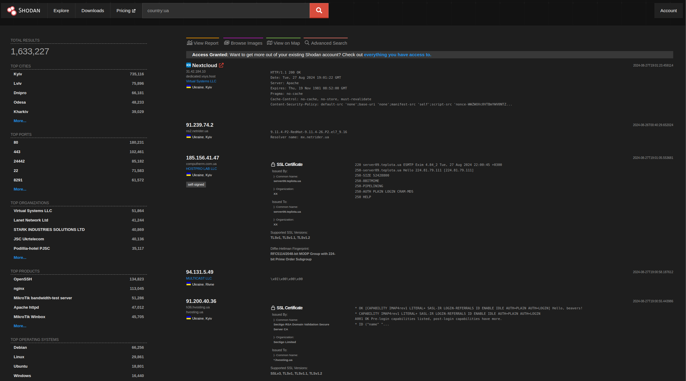
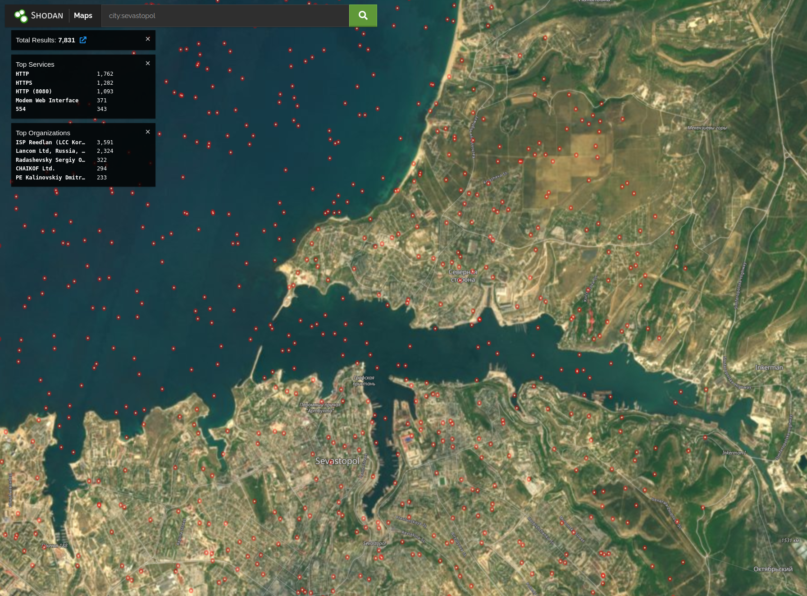

# Shodan

## URL

https://shodan.io/

## Description

Shodan is a search engine, but instead of finding websites it finds devices connected to the Internet. Device searches may use a variety of filters, including location (city, country, etc.), device name, IP address, and organization. It can be used to monitor specific assets, to search a geographic area for internet-connect devices, to discover devices tied to an organization, etc.

Here is a basic example of searching for devices identifying as being within Ukraine (country:ua filter):

<figure><figcaption>
Basic Shodan search using country:ua filter
</figcaption></figure>

Here is an example of Shodan Maps, where each dot represents a device in Sevastopol (requires membership):

<figure><figcaption>
Shodan maps using city:sevastopol filter
</figcaption></figure>

## Cost

* [ ] Free
* [x] Partially Free
* [ ] Paid

There are multiple account levels for Shodan:

* The most basic is the free account.  This currently provides only two pages of search results.
* A membership may be purchased for a one-time fee of $49, which provides 100 query credits and 100 scan credits per month, access to Maps, Images, Monitor, etc.
* [Monthly subscriptions ](https://account.shodan.io/billing)with varying prices and offerings.

## Level of difficulty

<table><thead><tr><th data-type="rating" data-max="5"></th></tr></thead><tbody><tr><td>3</td></tr></tbody></table>

## Requirements

A web browser and email address are required to sign up for an account and use the tool. If you purchase a membership or subscription, a terminal emulator is required to use the Shodan command-line interface.

## Limitations

The information that Shodan retrieves varies in it's efficacy. For instance, the use of a VPN may obscure a device's IP address, as well as change it's apparent geographical location. The service banners that Shodan uses for much of it's information may be limited/trimmed by the service owner.

## Ethical Considerations

Shodan indexes publicly available information, so there is nothing inherently unethical about browsing the results of your searches. Using the tool is akin to walking down a public street and knocking on doors as you pass by. However, using the results of your searches in order to gain (or attempt to gain) unauthorized access to devices is both unethical and illegal in most countries.&#x20;

## Guide

The Shodan [Help Center](https://help.shodan.io/) contains essentially all of the information you need to know in order to effectively use the tool. This includes:

* [Search Query Fundamentals](https://help.shodan.io/the-basics/search-query-fundamentals)
* [Navigating the Website](https://help.shodan.io/the-basics/navigating-the-website)
* [API Documentation](https://developer.shodan.io/api)
* [Shodan Credits Explained](https://help.shodan.io/the-basics/credit-types-explained)

## Tool provider

Shodan - USA

## Advertising Trackers

* [x] This tool has not been checked for advertising trackers yet.
* [ ] This tool uses tracking cookies. Use with caution.
* [ ] This tool does not appear to use tracking cookies.

| Page maintainer |
| --------------- |
| Max Louthain    |
|                 |
